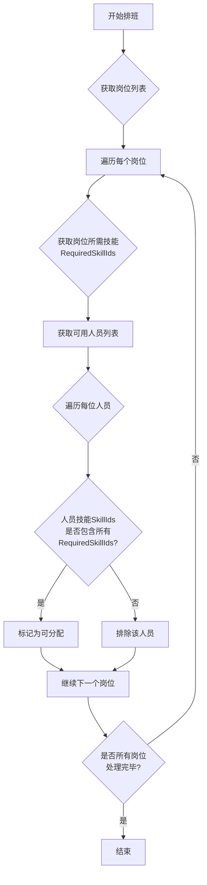
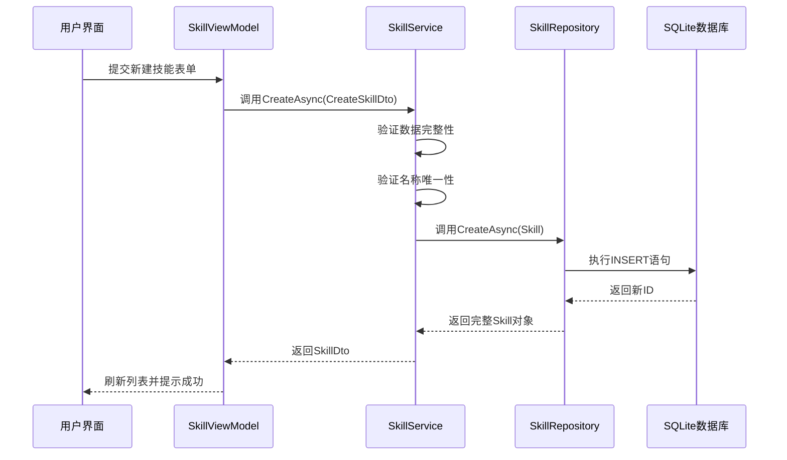
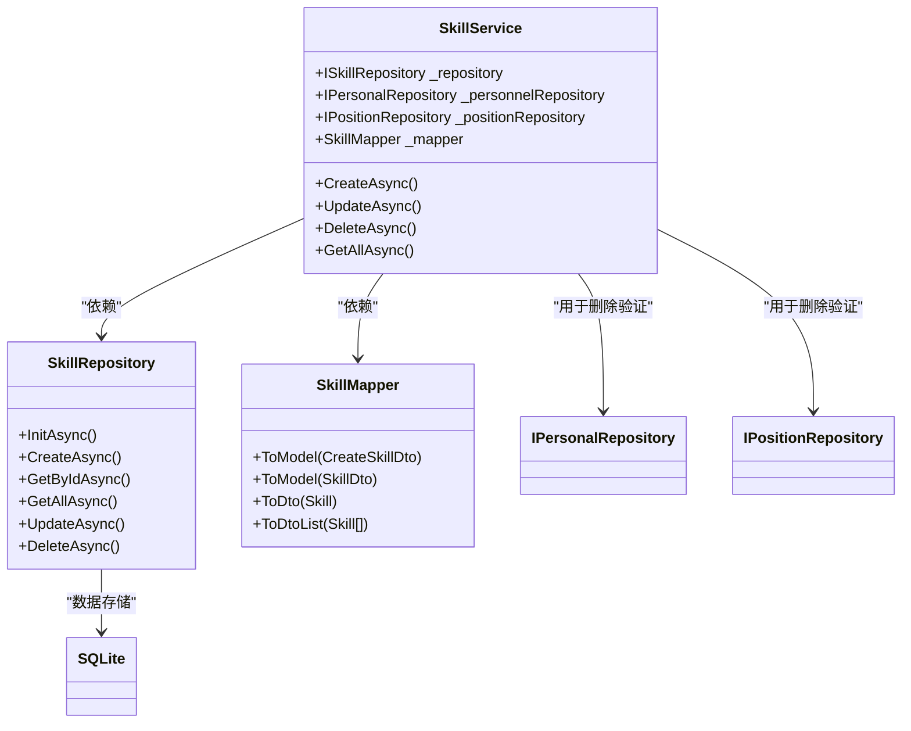

# 技能模型

<cite>
**本文档引用文件**  
- [Skill.cs](file://Models/Skill.cs)
- [SkillDto.cs](file://DTOs/SkillDto.cs)
- [SkillRepository.cs](file://Data/SkillRepository.cs)
- [SkillService.cs](file://Services/SkillService.cs)
- [SkillMapper.cs](file://DTOs/Mappers/SkillMapper.cs)
- [Personal.cs](file://Models/Personal.cs)
- [PositionLocation.cs](file://Models/PositionLocation.cs)
- [SchedulingService.cs](file://Services/SchedulingService.cs)
</cite>

## 目录
1. [引言](#引言)
2. [核心属性定义与约束](#核心属性定义与约束)
3. [技能模型在排班系统中的作用](#技能模型在排班系统中的作用)
4. [数据流转路径分析](#数据流转路径分析)
5. [状态与有效性管理](#状态与有效性管理)
6. [数据验证与业务规则](#数据验证与业务规则)
7. [依赖关系与服务调用](#依赖关系与服务调用)

## 引言
技能模型是自动排班系统中用于标识人员能力的核心数据结构。该模型通过定义技能的名称、描述和激活状态等属性，为人员能力管理与岗位匹配提供基础支持。在排班过程中，系统通过比对人员技能（Personal.SkillIds）与岗位要求（PositionLocation.RequiredSkillIds）实现精准匹配，确保人员具备执行特定岗位任务的能力。

**Section sources**
- [Skill.cs](file://Models/Skill.cs#L1-L10)

## 核心属性定义与约束
技能模型包含以下核心属性及其约束条件：

| 属性 | 类型 | 必填性 | 长度/值约束 | 默认值 | 说明 |
|------|------|--------|-------------|--------|------|
| Id | int | 是 | - | - | 数据库主键ID，自增 |
| Name | string | 是 | 1-100字符 | 无 | 技能名称，唯一性校验 |
| Description | string | 否 | 最大500字符 | 空字符串 | 技能描述信息 |
| IsActive | bool | 是 | - | true | 是否激活/可用标志 |
| CreatedAt | DateTime | 是 | - | UTC时间 | 创建时间戳 |
| UpdatedAt | DateTime | 是 | - | UTC时间 | 更新时间戳 |

**Section sources**
- [Skill.cs](file://Models/Skill.cs#L15-L30)

## 技能模型在排班系统中的作用
技能模型作为人员能力标识的基础，在排班流程中发挥关键作用。系统通过以下逻辑实现技能匹配：

1. **岗位需求定义**：每个岗位（PositionLocation）通过`RequiredSkillIds`字段定义其所需技能ID集合。
2. **人员能力配置**：每位人员（Personal）通过`SkillIds`字段维护其已掌握的技能ID列表。
3. **匹配算法执行**：排班引擎在调度时验证人员是否具备岗位所需的所有技能。



**Diagram sources**
- [PositionLocation.cs](file://Models/PositionLocation.cs#L45-L50)
- [Personal.cs](file://Models/Personal.cs#L25-L30)
- [SchedulingService.cs](file://Services/SchedulingService.cs#L400-L430)

**Section sources**
- [PositionLocation.cs](file://Models/PositionLocation.cs#L45-L50)
- [Personal.cs](file://Models/Personal.cs#L25-L30)

## 数据流转路径分析
技能数据在系统中的流转路径如下：



**Diagram sources**
- [SkillViewModel.cs](file://ViewModels/DataManagement/SkillViewModel.cs#L80-L100)
- [SkillService.cs](file://Services/SkillService.cs#L60-L90)
- [SkillRepository.cs](file://Data/SkillRepository.cs#L50-L70)

**Section sources**
- [SkillViewModel.cs](file://ViewModels/DataManagement/SkillViewModel.cs#L80-L100)
- [SkillService.cs](file://Services/SkillService.cs#L60-L90)

## 状态与有效性管理
`IsActive`标志位控制技能的有效性，直接影响人员技能分配与排班结果：

- **激活状态（true）**：技能处于有效状态，可用于人员技能配置和岗位匹配。
- **非激活状态（false）**：技能被标记为无效，不能再分配给新人员，且影响排班计算。

当技能被设置为非激活状态时：
1. 系统允许已拥有该技能的人员保留其技能记录。
2. 在新建或编辑人员时，无法再选择该技能。
3. 排班引擎在匹配时仍会考虑已分配的非激活技能，但会记录警告日志。

此设计确保了历史数据的完整性，同时防止新分配无效技能。

**Section sources**
- [Skill.cs](file://Models/Skill.cs#L35-L40)
- [SkillService.cs](file://Services/SkillService.cs#L150-L160)

## 数据验证与业务规则
系统在多个层级实施数据验证规则：

### DTO层验证
```csharp
// SkillDto.cs
[StringLength(50, MinimumLength = 1, ErrorMessage = "技能名称长度必须在1-50字符之间")]
public string Name { get; set; }

[StringLength(200, ErrorMessage = "技能描述长度不能超过200字符")]
public string? Description { get; set; }
```

### 服务层验证
```csharp
// SkillService.cs
private void ValidateCreateDto(CreateSkillDto dto)
{
    if (string.IsNullOrWhiteSpace(dto.Name))
        throw new ArgumentException("技能名称为必填项");
    
    if (dto.Name.Length > 50)
        throw new ArgumentException("技能名称不能超过50个字符");
        
    if (dto.Description != null && dto.Description.Length > 500)
        throw new ArgumentException("技能描述不能超过500个字符");
}
```

### 业务规则验证
- **名称唯一性**：通过`ValidateSkillNameUniquenessAsync`方法确保技能名称在系统中唯一。
- **删除保护**：通过`ValidateSkillNotInUseAsync`检查技能是否被人员或岗位引用，防止误删。

**Section sources**
- [SkillDto.cs](file://DTOs/SkillDto.cs#L15-L25)
- [SkillService.cs](file://Services/SkillService.cs#L178-L196)

## 依赖关系与服务调用
技能服务与其他组件存在紧密依赖关系：



**Diagram sources**
- [SkillService.cs](file://Services/SkillService.cs#L15-L30)
- [SkillRepository.cs](file://Data/SkillRepository.cs#L15-L20)
- [SkillMapper.cs](file://DTOs/Mappers/SkillMapper.cs#L10-L15)

**Section sources**
- [SkillService.cs](file://Services/SkillService.cs#L15-L30)
- [SkillRepository.cs](file://Data/SkillRepository.cs#L15-L20)