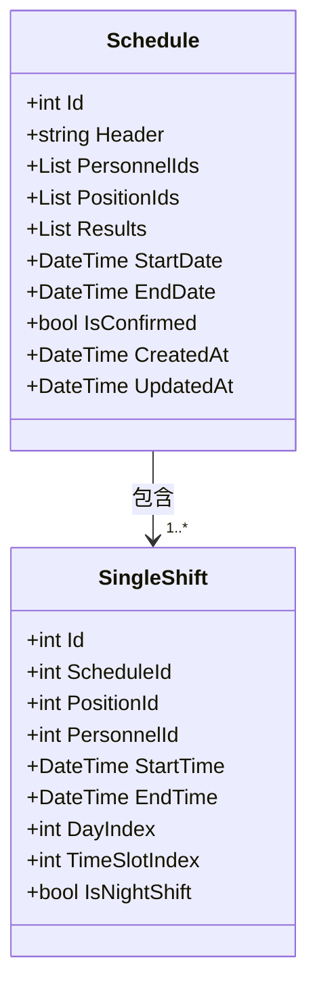
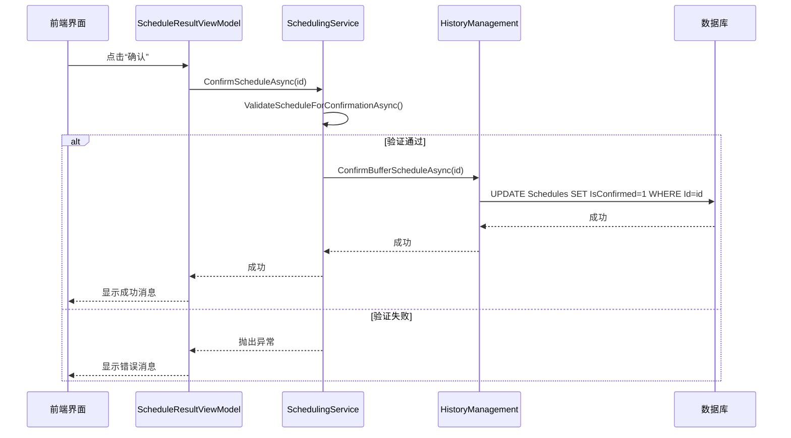

# 排班模型

<cite>
**本文档引用的文件**
- [Schedule.cs](file://Models/Schedule.cs)
- [SingleShift.cs](file://Models/SingleShift.cs)
- [ScheduleMapper.cs](file://DTOs/Mappers/ScheduleMapper.cs)
- [SchedulingRepository.cs](file://Data/SchedulingRepository.cs)
- [SchedulingService.cs](file://Services/SchedulingService.cs)
- [GreedyScheduler.cs](file://SchedulingEngine/GreedyScheduler.cs)
- [ScheduleDto.cs](file://DTOs/ScheduleDto.cs)
- [ScheduleGridControl.xaml.cs](file://Controls/ScheduleGridControl.xaml.cs)
- [ScheduleResultViewModel.cs](file://ViewModels/Scheduling/ScheduleResultViewModel.cs)
</cite>

## 目录
1. [引言](#引言)
2. [核心数据模型](#核心数据模型)
3. [排班周期与时间管理](#排班周期与时间管理)
4. [排班确认流程](#排班确认流程)
5. [排班结果的存储与查询](#排班结果的存储与查询)
6. [最佳实践指导](#最佳实践指导)

## 引言
本文档旨在全面记录`Schedule`数据模型的结构与功能，详细阐述其作为排班算法输出结果载体的核心作用。该模型不仅定义了排班的基本信息，如名称、参与人员和哨位，还通过`Results`集合精确记录了每一次排班的具体安排。文档将深入解析`Schedule`模型的各个属性及其业务意义，并说明其如何与历史记录、模板功能集成，为用户提供排班数据持久化与查询的最佳实践。

## 核心数据模型

`Schedule`模型是整个排班系统的核心数据结构，它封装了一个完整的排班计划。该模型与`SingleShift`模型共同构成了排班结果的完整视图。

### Schedule 模型属性详解

`Schedule`类定义了排班计划的元数据和核心配置。

- **Id**: 数据库主键ID，用于唯一标识一个排班表。
- **Header**: 表头，即排班的名称或描述，用于用户识别。
- **PersonnelIds**: 一个整数列表，存储了参与本次排班的所有人员的ID。
- **PositionIds**: 一个整数列表，存储了本次排班所涉及的所有哨位的ID。
- **Results**: 一个`SingleShift`对象的列表，这是排班结果的核心，包含了所有具体的班次分配。
- **StartDate**: 排班周期的开始日期（UTC）。
- **EndDate**: 排班周期的结束日期（UTC）。
- **IsConfirmed**: 一个布尔值，标记该排班是否已被确认实施。

**Section sources**
- [Schedule.cs](file://Models/Schedule.cs#L10-L66)

### SingleShift 模型详解

`SingleShift`模型代表了排班计划中的单次班次，是`Results`集合的组成单元。

- **Id**: 数据库主键ID。
- **ScheduleId**: 外键，指向其所属的`Schedule`的ID。
- **PositionId**: 哨位ID，标识该班次在哪个哨位执行。
- **PersonnelId**: 人员ID，标识执行该班次的人员。
- **StartTime**: 班次的开始时间（UTC）。
- **EndTime**: 班次的结束时间（UTC）。
- **DayIndex**: 从`Schedule`的`StartDate`开始计算的天数索引（0-based），用于快速定位班次在排班周期中的位置。
- **TimeSlotIndex**: 时段索引（0-11），将一天划分为12个两小时的时段。
- **IsNightShift**: 一个布尔标志，指示该班次是否为夜哨。

`SingleShift`模型是排班结果存储的基石，每一个`SingleShift`实例都精确地记录了一名人员在特定哨位、特定时间段的分配。

**Diagram sources**
- [Schedule.cs](file://Models/Schedule.cs#L10-L66)
- [SingleShift.cs](file://Models/SingleShift.cs#L9-L64)

**Section sources**
- [SingleShift.cs](file://Models/SingleShift.cs#L9-L64)

## 排班周期与时间管理

排班周期由`StartDate`和`EndDate`两个属性共同定义，精确地划定了排班计划的时间范围。这两个日期均以UTC时间存储，确保了时间计算的统一性和准确性。

排班引擎（如`GreedyScheduler`）在生成排班时，会遍历从`StartDate`到`EndDate`的每一天。对于每一天，它会将其划分为12个固定的时段（`TimeSlotIndex`），每个时段为2小时。`DayIndex`属性的计算方式为`(当前班次日期 - Schedule.StartDate).Days`，这使得系统可以快速地将一个`SingleShift`定位到排班周期中的具体某一天。

这种基于索引的时间管理机制极大地简化了排班算法的复杂度，使得算法可以高效地进行人员分配和冲突检测。

**Section sources**
- [Schedule.cs](file://Models/Schedule.cs#L50-L55)
- [SingleShift.cs](file://Models/SingleShift.cs#L49-L53)
- [GreedyScheduler.cs](file://SchedulingEngine/GreedyScheduler.cs#L388-L429)

## 排班确认流程

`IsConfirmed`标志在排班的业务流程中扮演着至关重要的角色，它区分了“草稿”和“已确认”的排班状态。

1.  **草稿状态**: 当排班算法首次生成一个`Schedule`时，`IsConfirmed`被设置为`false`。此时，该排班被视为一个草稿，可以被查看、编辑或删除。
2.  **确认操作**: 用户在前端界面（如`ScheduleResultPage`）通过`ScheduleResultViewModel`的`ConfirmCommand`发起确认请求。
3.  **服务层处理**: `SchedulingService`的`ConfirmScheduleAsync`方法被调用。在确认前，该服务会执行最终的业务规则验证（如检查是否有关键时段未分配）。
4.  **持久化更新**: 验证通过后，`HistoryManagement`组件会将该排班的`IsConfirmed`标志更新为`true`，并将其从“缓冲区”移动到“历史记录”中。

这个流程确保了排班计划在正式实施前经过了最终的审核，`IsConfirmed`标志是区分可修改草稿和不可变历史记录的关键。

**Diagram sources**
- [Schedule.cs](file://Models/Schedule.cs#L57-L59)
- [ScheduleResultViewModel.cs](file://ViewModels/Scheduling/ScheduleResultViewModel.cs#L145-L178)
- [SchedulingService.cs](file://Services/SchedulingService.cs#L115-L125)
- [SchedulingRepository.cs](file://Data/SchedulingRepository.cs#L515-L520)

**Section sources**
- [Schedule.cs](file://Models/Schedule.cs#L57-L59)
- [SchedulingService.cs](file://Services/SchedulingService.cs#L115-L125)

## 排班结果的存储与查询

`Schedule`模型作为排班算法的输出结果，其持久化和查询是系统的关键功能。

### 数据持久化

排班数据通过`SchedulingRepository`进行持久化。该仓库实现了`ISchedulingRepository`接口，负责与SQLite数据库交互。

- **创建**: `CreateAsync`方法将`Schedule`对象及其所有`Results`（`SingleShift`）插入数据库。`PersonnelIds`和`PositionIds`列表以JSON字符串的形式存储在`Schedules`表中，而`SingleShift`则作为独立的记录存储在`SingleShifts`表中，并通过`ScheduleId`外键关联。
- **读取**: `GetByIdAsync`方法首先从`Schedules`表中读取主记录，然后调用`GetShiftsByScheduleAsync`方法，通过`ScheduleId`从`SingleShifts`表中加载所有相关的班次，最终组装成完整的`Schedule`对象。

### 数据查询

系统提供了多种查询方式：
- **按ID查询**: `GetScheduleByIdAsync`方法会同时检查“草稿”和“历史记录”，以获取指定ID的排班详情。
- **获取草稿列表**: `GetDraftsAsync`方法从`HistoryManagement`中获取所有未确认的排班草稿。
- **获取历史记录**: `GetHistoryAsync`方法获取所有已确认的历史排班。

数据在服务层和UI层之间通过DTO（数据传输对象）进行传递。`ScheduleMapper`负责在`Schedule`模型和`ScheduleDto`之间进行双向转换，确保了数据的安全性和解耦。

**Section sources**
- [SchedulingRepository.cs](file://Data/SchedulingRepository.cs#L29-L313)
- [SchedulingService.cs](file://Services/SchedulingService.cs#L70-L113)
- [ScheduleMapper.cs](file://DTOs/Mappers/ScheduleMapper.cs#L119-L217)

## 最佳实践指导

为了高效、可靠地使用`Schedule`模型，建议遵循以下最佳实践：

1.  **利用DTO进行数据传输**: 在服务层与UI层之间，始终使用`ScheduleDto`而非`Schedule`模型。这可以防止意外的数据修改，并通过`ScheduleMapper`实现名称等冗余字段的填充。
2.  **理解确认流程**: 在设计UI时，清晰地区分“草稿”和“已确认”状态。确认操作应是一个明确的、不可逆的步骤，并伴有二次确认对话框。
3.  **合理使用索引**: 在进行排班分析或生成报表时，充分利用`DayIndex`和`TimeSlotIndex`来快速定位和分组班次，避免对`StartTime`进行复杂的日期计算。
4.  **维护数据完整性**: 在调用`SchedulingService`的`ExecuteSchedulingAsync`等方法时，确保传入的`SchedulingRequestDto`包含所有必要的约束信息（如启用的定岗规则ID），以保证排班结果的准确性。
5.  **处理并发**: `SchedulingService`和`SchedulingRepository`的设计支持并发操作。在高并发场景下，应确保数据库事务的正确使用，以避免数据不一致。

遵循这些实践，可以确保排班系统的稳定运行和数据的准确性。

**Section sources**
- [ScheduleDto.cs](file://DTOs/ScheduleDto.cs)
- [ScheduleMapper.cs](file://DTOs/Mappers/ScheduleMapper.cs)
- [SchedulingService.cs](file://Services/SchedulingService.cs)
- [SchedulingRepository.cs](file://Data/SchedulingRepository.cs)