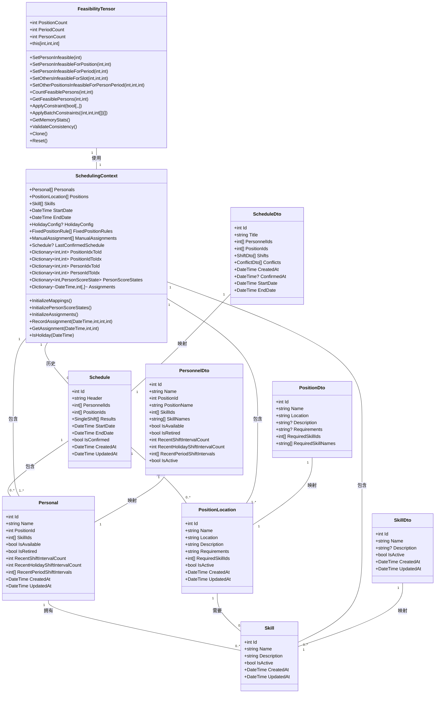

# 数据模型

<cite>
**本文档引用的文件**
- [Personal.cs](file://Models/Personal.cs)
- [PositionLocation.cs](file://Models/PositionLocation.cs)
- [Skill.cs](file://Models/Skill.cs)
- [Schedule.cs](file://Models/Schedule.cs)
- [SchedulingContext.cs](file://SchedulingEngine/Core/SchedulingContext.cs)
- [FeasibilityTensor.cs](file://SchedulingEngine/Core/FeasibilityTensor.cs)
- [PersonnelDto.cs](file://DTOs/PersonnelDto.cs)
- [PositionDto.cs](file://DTOs/PositionDto.cs)
- [SkillDto.cs](file://DTOs/SkillDto.cs)
- [ScheduleDto.cs](file://DTOs/ScheduleDto.cs)
- [PersonnelMapper.cs](file://DTOs/Mappers/PersonnelMapper.cs)
- [PositionMapper.cs](file://DTOs/Mappers/PositionMapper.cs)
- [SkillMapper.cs](file://DTOs/Mappers/SkillMapper.cs)
- [ScheduleMapper.cs](file://DTOs/Mappers/ScheduleMapper.cs)
</cite>

## 目录
1. [核心实体模型](#核心实体模型)
2. [算法专用模型](#算法专用模型)
3. [数据传输对象(DTO)](#数据传输对象dto)
4. [模型映射与转换](#模型映射与转换)
5. [模型关系图](#模型关系图)

## 核心实体模型

本节详细定义系统中的核心业务实体模型，包括人员、哨位、技能和排班表。

### 人员(Personal)

`Personal` 模型定义了系统中人员的基本信息，是排班系统的核心实体之一。

**属性定义：**
- `Id`: 数据库主键ID，整型
- `Name`: 人员名称，字符串，必填，长度1-100字符
- `PositionId`: 人员职位ID，对应 `PositionLocation.Id`，整型
- `SkillIds`: 人员拥有的技能ID集合，列表，每个ID对应 `Skill.Id`
- `IsAvailable`: 人员是否可用，布尔值
- `IsRetired`: 人员是否退役/离职，布尔值
- `RecentShiftIntervalCount`: 最近班次间隔计数，整型
- `RecentHolidayShiftIntervalCount`: 最近节假日班次间隔计数，整型
- `RecentPeriodShiftIntervals`: 最近某一时段班次间隔数数组，固定长度为12，对应12个时段
- `CreatedAt`: 创建时间，UTC时间
- `UpdatedAt`: 更新时间，UTC时间

**业务含义：**
该模型用于存储人员的基本信息和排班相关的状态数据。`RecentPeriodShiftIntervals` 数组用于记录人员在最近12个时段内的班次间隔情况，为排班算法提供历史数据支持。

**Section sources**
- [Personal.cs](file://Models/Personal.cs#L11-L78)

### 哨位(PositionLocation)

`PositionLocation` 模型定义了系统中哨位的基本信息。

**属性定义：**
- `Id`: 数据库主键ID，整型
- `Name`: 哨位名称，字符串，必填，长度1-100字符
- `Location`: 哨位地点，字符串，长度0-200字符
- `Description`: 哨位介绍，字符串，长度0-500字符
- `Requirements`: 哨位要求（文本描述），字符串，长度0-1000字符
- `RequiredSkillIds`: 哨位所需技能ID集合，列表，每个ID对应 `Skill.Id`
- `IsActive`: 是否启用，布尔值
- `CreatedAt`: 创建时间，UTC时间
- `UpdatedAt`: 更新时间，UTC时间

**业务含义：**
该模型用于存储哨位的基本信息和技能要求。`RequiredSkillIds` 集合用于在排班算法中快速匹配具备相应技能的人员。

**Section sources**
- [PositionLocation.cs](file://Models/PositionLocation.cs#L11-L68)

### 技能(Skill)

`Skill` 模型定义了系统中技能的基本信息。

**属性定义：**
- `Id`: 数据库主键ID，整型
- `Name`: 技能名称，字符串，必填，长度1-100字符
- `Description`: 技能描述，字符串，长度0-500字符
- `IsActive`: 是否激活/可用，布尔值
- `CreatedAt`: 创建时间，UTC时间
- `UpdatedAt`: 更新时间，UTC时间

**业务含义：**
该模型用于存储技能的基本信息，作为人员和哨位之间的关联桥梁。通过技能匹配，确保具备相应技能的人员被分配到需要该技能的哨位。

**Section sources**
- [Skill.cs](file://Models/Skill.cs#L10-L50)

### 排班表(Schedule)

`Schedule` 模型定义了排班结果的核心数据结构。

**属性定义：**
- `Id`: 数据库主键ID，整型
- `Header`: 表头（排班名称或描述），字符串，必填，长度1-200字符
- `PersonnelIds`: 人员ID集合，列表
- `PositionIds`: 哨位ID集合，列表
- `Results`: 排班结果（单次排班集合），`SingleShift` 对象列表
- `StartDate`: 排班开始日期，UTC时间
- `EndDate`: 排班结束日期，UTC时间
- `IsConfirmed`: 是否已确认实施，布尔值
- `CreatedAt`: 创建时间，UTC时间
- `UpdatedAt`: 更新时间，UTC时间

**业务含义：**
该模型用于存储完整的排班方案，包含参与的人员、哨位、具体的班次安排以及排班的时间范围。`Results` 集合存储了所有具体的班次分配。

**Section sources**
- [Schedule.cs](file://Models/Schedule.cs#L10-L66)

## 算法专用模型

本节介绍排班算法专用的模型，这些模型为排班引擎提供高效的数据结构支持。

### 调度上下文(SchedulingContext)

`SchedulingContext` 模型是排班算法的核心数据容器，包含了算法执行所需的所有数据和状态。

**属性定义：**
- `Personals`: 人员列表，`Personal` 对象集合
- `Positions`: 哨位列表，`PositionLocation` 对象集合
- `Skills`: 技能列表，`Skill` 对象集合
- `StartDate`: 排班开始日期
- `EndDate`: 排班结束日期
- `HolidayConfig`: 休息日配置，`HolidayConfig` 对象
- `FixedPositionRules`: 定岗规则列表，`FixedPositionRule` 对象集合
- `ManualAssignments`: 手动指定列表，`ManualAssignment` 对象集合
- `LastConfirmedSchedule`: 最近一次已确认的排班表，`Schedule` 对象
- `PositionIdxToId`: 哨位序号到ID的映射字典
- `PositionIdToIdx`: 哨位ID到序号的映射字典
- `PersonIdxToId`: 人员序号到ID的映射字典
- `PersonIdToIdx`: 人员ID到序号的映射字典
- `PersonScoreStates`: 人员评分状态字典，以人员ID为键
- `Assignments`: 分配记录字典，按日期存储二维数组，表示各时段各哨位的人员分配情况

**方法定义：**
- `InitializeMappings()`: 初始化序号与ID的双向映射关系
- `InitializePersonScoreStates()`: 初始化人员评分状态，整合历史数据
- `InitializeAssignments()`: 初始化分配记录，为每个日期的每个时段和哨位创建未分配状态
- `RecordAssignment(date, periodIdx, positionIdx, personIdx)`: 记录一次分配
- `GetAssignment(date, periodIdx, positionIdx)`: 获取指定日期、时段和哨位的分配人员
- `IsHoliday(date)`: 判断指定日期是否为休息日

**业务含义：**
该模型为排班算法提供了一个完整的上下文环境，将所有相关数据组织在一起。通过序号映射，算法可以使用整数索引进行高效计算，避免了频繁的ID查找。`Assignments` 字典记录了当前的分配状态，是算法迭代过程中的核心数据结构。

**Section sources**
- [SchedulingContext.cs](file://SchedulingEngine/Core/SchedulingContext.cs#L11-L155)

### 可行性张量(FeasibilityTensor)

`FeasibilityTensor` 模型是排班算法性能优化的核心，使用三维布尔张量来表示分配的可行性。

**属性定义：**
- `PositionCount`: 哨位数量
- `PeriodCount`: 时段数量（固定为12）
- `PersonCount`: 人员数量

**内部存储：**
- `_tensor`: 三维布尔数组 `[哨位, 时段, 人员]`，直接存储可行性
- `_binaryTensor`: 优化的二进制存储，使用 `ulong` 数组进行位操作优化
- `_constraintMatrix`: 使用 MathNet.Numerics 的矩阵，用于加速批量约束处理

**核心方法：**
- `SetPersonInfeasible(personIdx)`: 将指定人员在所有哨位和时段设为不可行
- `SetPersonInfeasibleForPosition(personIdx, positionIdx)`: 将指定人员在特定哨位的所有时段设为不可行
- `SetPersonInfeasibleForPeriod(personIdx, periodIdx)`: 将指定人员在特定时段的所有哨位设为不可行
- `SetOthersInfeasibleForSlot(positionIdx, periodIdx, assignedPersonIdx)`: 将指定哨位和时段的其他人员设为不可行（单人上哨约束）
- `SetOtherPositionsInfeasibleForPersonPeriod(personIdx, periodIdx, assignedPositionIdx)`: 将指定人员在特定时段的其他哨位设为不可行（一人一哨约束）
- `CountFeasiblePersons(positionIdx, periodIdx)`: 统计指定哨位和时段的可行人员数
- `GetFeasiblePersons(positionIdx, periodIdx)`: 获取指定哨位和时段的所有可行人员索引
- `ApplyConstraint(constraintTensor)`: 应用约束张量（与运算）
- `ApplyBatchConstraints(constraints)`: 批量应用约束，使用矩阵运算优化性能

**业务含义：**
该模型通过多种优化技术（二进制存储、位操作、矩阵运算）实现了高效的可行性计算。三维张量的每个元素 `[x,y,z]` 表示第 `x` 个哨位在第 `y` 个时段分配给第 `z` 个人员是否可行。算法通过修改张量来应用各种约束条件，最终找到可行的分配方案。

**Section sources**
- [FeasibilityTensor.cs](file://SchedulingEngine/Core/FeasibilityTensor.cs#L11-L570)

## 数据传输对象(DTO)

本节介绍系统中的数据传输对象，用于在不同层之间安全地传输数据。

### 人员DTO(PersonnelDto)

`PersonnelDto` 是人员模型的传输对象，包含冗余字段以减少前端查询。

**属性定义：**
- `Id`: 人员ID
- `Name`: 姓名
- `PositionId`: 职位ID
- `PositionName`: 职位名称（冗余字段）
- `SkillIds`: 技能ID列表
- `SkillNames`: 技能名称列表（冗余字段）
- `IsAvailable`: 是否可用
- `IsRetired`: 是否已退役
- `RecentShiftIntervalCount`: 最近班次间隔计数
- `RecentHolidayShiftIntervalCount`: 最近节假日班次间隔计数
- `RecentPeriodShiftIntervals`: 各时段班次间隔计数（12个时段）
- `IsActive`: 是否在职且可用（计算属性）

**业务含义：**
该DTO在传输人员数据时包含了关联的职位名称和技能名称，避免了前端多次请求。`IsActive` 属性是计算属性，用于XAML绑定。

**Section sources**
- [PersonnelDto.cs](file://DTOs/PersonnelDto.cs#L1-L189)

### 哨位DTO(PositionDto)

`PositionDto` 是哨位模型的传输对象。

**属性定义：**
- `Id`: 哨位ID
- `Name`: 哨位名称
- `Location`: 地点
- `Description`: 介绍
- `Requirements`: 要求说明
- `RequiredSkillIds`: 所需技能ID列表
- `RequiredSkillNames`: 所需技能名称列表（冗余字段）

**业务含义：**
该DTO在传输哨位数据时包含了所需技能的名称，便于前端显示。

**Section sources**
- [PositionDto.cs](file://DTOs/PositionDto.cs#L1-L138)

### 技能DTO(SkillDto)

`SkillDto` 是技能模型的传输对象。

**属性定义：**
- `Id`: 技能ID
- `Name`: 技能名称
- `Description`: 技能描述
- `IsActive`: 是否激活
- `CreatedAt`: 创建时间
- `UpdatedAt`: 更新时间

**业务含义：**
该DTO用于在系统各层之间传输技能数据。

**Section sources**
- [SkillDto.cs](file://DTOs/SkillDto.cs#L1-L90)

### 排班表DTO(ScheduleDto)

`ScheduleDto` 是排班表模型的传输对象。

**属性定义：**
- `Id`: 排班表ID
- `Title`: 排班表名称
- `PersonnelIds`: 参与人员ID列表
- `PositionIds`: 参与哨位ID列表
- `Shifts`: 单次排班列表
- `Conflicts`: 冲突/约束提示集合
- `CreatedAt`: 创建时间
- `ConfirmedAt`: 确认时间
- `StartDate`: 开始日期
- `EndDate`: 结束日期

**业务含义：**
该DTO用于传输完整的排班方案，包含所有相关信息和冲突提示。

**Section sources**
- [ScheduleDto.cs](file://DTOs/ScheduleDto.cs#L1-L324)

## 模型映射与转换

本节介绍模型与DTO之间的映射关系和转换逻辑。

### 映射器概述

系统使用专门的映射器类来处理模型与DTO之间的转换，确保数据的一致性和完整性。

**映射器列表：**
- `PersonnelMapper`: 处理 `Personal` 模型与 `PersonnelDto` 之间的转换
- `PositionMapper`: 处理 `PositionLocation` 模型与 `PositionDto` 之间的转换
- `SkillMapper`: 处理 `Skill` 模型与 `SkillDto` 之间的转换
- `ScheduleMapper`: 处理 `Schedule` 模型与 `ScheduleDto` 之间的转换

### 转换流程

**模型到DTO转换：**
1. 基本属性直接复制
2. 对于包含关联名称的DTO，异步加载关联实体的名称
3. 返回包含完整信息的DTO

**DTO到模型转换：**
1. 基本属性直接复制
2. 对于创建操作，设置创建时间和默认值
3. 对于更新操作，只更新指定字段，保留其他字段不变

**业务含义：**
这种分离的映射策略确保了领域模型的纯净性，同时提供了灵活的数据传输机制。异步加载关联名称避免了N+1查询问题，提高了系统性能。

**Section sources**
- [PersonnelMapper.cs](file://DTOs/Mappers/PersonnelMapper.cs#L1-L203)
- [PositionMapper.cs](file://DTOs/Mappers/PositionMapper.cs#L1-L177)
- [SkillMapper.cs](file://DTOs/Mappers/SkillMapper.cs#L1-L127)
- [ScheduleMapper.cs](file://DTOs/Mappers/ScheduleMapper.cs#L1-L422)

## 模型关系图

**Diagram sources**
- [Personal.cs](file://Models/Personal.cs#L11-L78)
- [PositionLocation.cs](file://Models/PositionLocation.cs#L11-L68)
- [Skill.cs](file://Models/Skill.cs#L10-L50)
- [Schedule.cs](file://Models/Schedule.cs#L10-L66)
- [SchedulingContext.cs](file://SchedulingEngine/Core/SchedulingContext.cs#L11-L155)
- [FeasibilityTensor.cs](file://SchedulingEngine/Core/FeasibilityTensor.cs#L11-L570)
- [PersonnelDto.cs](file://DTOs/PersonnelDto.cs#L1-L189)
- [PositionDto.cs](file://DTOs/PositionDto.cs#L1-L138)
- [SkillDto.cs](file://DTOs/SkillDto.cs#L1-L90)
- [ScheduleDto.cs](file://DTOs/ScheduleDto.cs#L1-L324)