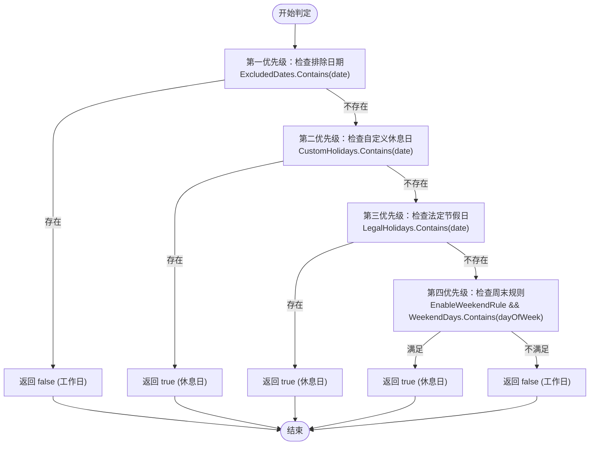
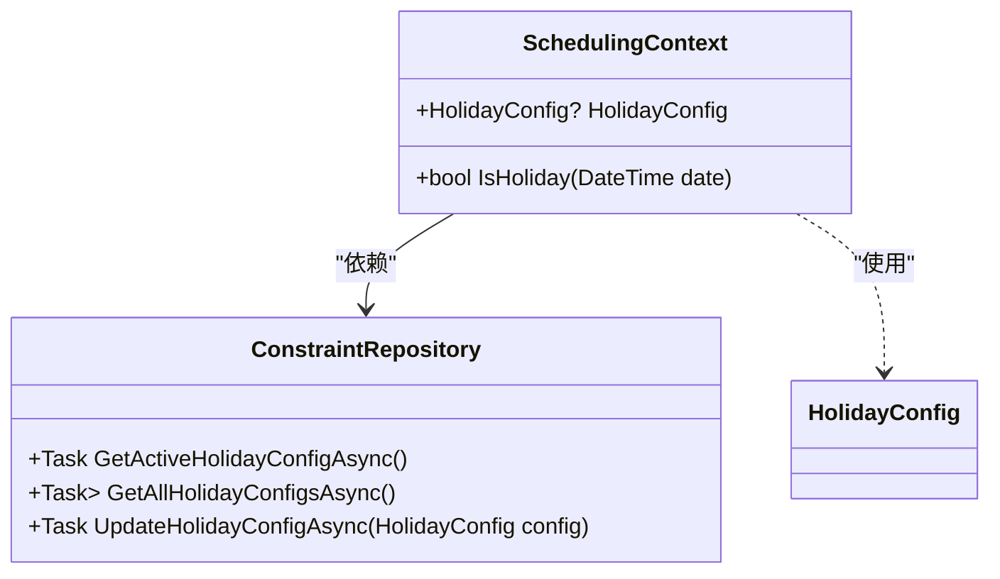
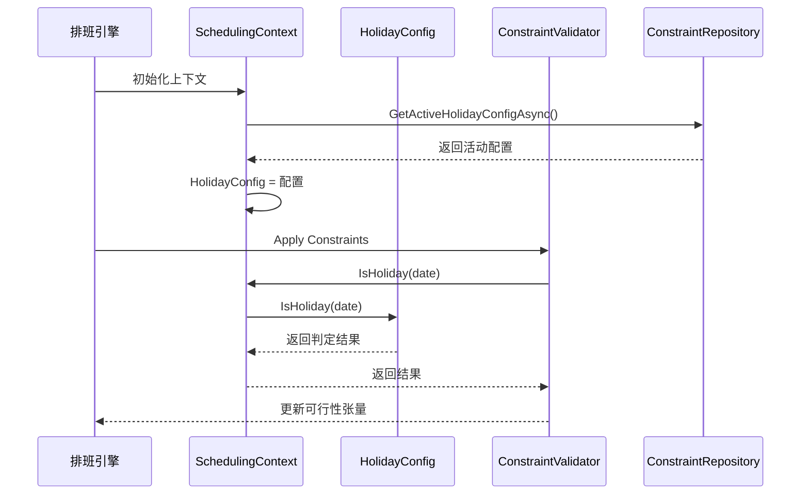

# 休息日配置

<cite>
**本文档引用的文件**
- [HolidayConfig.cs](file://Models\Constraints\HolidayConfig.cs)
- [ConstraintRepository.cs](file://Data\ConstraintRepository.cs)
- [SchedulingContext.cs](file://SchedulingEngine\Core\SchedulingContext.cs)
- [ConstraintMapper.cs](file://DTOs\Mappers\ConstraintMapper.cs)
</cite>

## 目录
1. [简介](#简介)
2. [核心属性与配置逻辑](#核心属性与配置逻辑)
3. [IsHoliday方法判定逻辑](#isholiday方法判定逻辑)
4. [IsActive标志与配置激活机制](#isactive标志与配置激活机制)
5. [在排班上下文中的应用](#在排班上下文中的应用)
6. [持久化与JSON反序列化策略](#持久化与json反序列化策略)
7. [配置示例](#配置示例)

## 简介
`HolidayConfig` 模型是自动排班系统中的核心配置组件，用于定义和管理休息日的判定规则。该模型通过多层配置实现了灵活的节假日管理机制，支持基础周末规则、法定节假日、自定义休息日以及最高优先级的排除日期（如调休工作日）。其设计确保了在复杂排班场景下，能够准确判断某一天是否为休息日，从而影响排班的可行性。

**Section sources**
- [HolidayConfig.cs](file://Models\Constraints\HolidayConfig.cs#L9-L86)

## 核心属性与配置逻辑
`HolidayConfig` 类包含以下关键属性，共同构成完整的休息日判定体系：

- **ConfigName**: 配置的名称，用于标识不同的休息日规则集（如“2024年休息日配置”）。
- **EnableWeekendRule**: 布尔值，控制是否启用周末规则。
- **WeekendDays**: `DayOfWeek` 枚举列表，定义了哪些天被视为周末（默认为周六和周日）。
- **LegalHolidays**: `DateTime` 列表，存储法定节假日的具体日期。
- **CustomHolidays**: `DateTime` 列表，用于添加非法定的自定义休息日。
- **ExcludedDates**: `DateTime` 列表，包含强制为工作日的日期，其优先级最高。
- **IsActive**: 布尔值，标识该配置是否为当前系统启用的活动配置。

这些属性允许系统管理员根据实际需求（如国家法定节假日调整、公司内部调休安排）灵活地配置休息日规则。

**Section sources**
- [HolidayConfig.cs](file://Models\Constraints\HolidayConfig.cs#L9-L40)

## IsHoliday方法判定逻辑
`IsHoliday` 方法是 `HolidayConfig` 的核心功能，它按照严格的优先级顺序判定一个日期是否为休息日。这种分层判定设计确保了规则的清晰性和可预测性。



**Diagram sources**
- [HolidayConfig.cs](file://Models\Constraints\HolidayConfig.cs#L70-L85)

**Section sources**
- [HolidayConfig.cs](file://Models\Constraints\HolidayConfig.cs#L70-L85)

### 设计原理与业务意义
1. **排除日期（ExcludedDates）优先级最高**：这是为了处理“调休”场景。例如，国庆节期间的某个周六本应是休息日，但因调休被指定为工作日。此规则确保了这类特殊情况能覆盖所有其他规则。
2. **自定义休息日（CustomHolidays）次之**：允许用户添加公司特有的假期（如年会、团建日），这些假期的优先级高于法定节假日和周末，以应对可能的冲突。
3. **法定节假日（LegalHolidays）再次之**：覆盖国家规定的公共假期。
4. **周末规则（WeekendDays）优先级最低**：作为基础的、周期性的休息日规则，只有在上述所有特定规则都不匹配时才生效。

这种“从特殊到一般”的判定顺序，完美地模拟了现实世界中节假日安排的逻辑，确保了排班系统的准确性和灵活性。

## IsActive标志与配置激活机制
`IsActive` 属性是多配置环境下的关键开关。系统中可以存在多个 `HolidayConfig` 实例，但只有 `IsActive` 为 `true` 的配置才会被排班引擎使用。



**Diagram sources**
- [SchedulingContext.cs](file://SchedulingEngine\Core\SchedulingContext.cs#L21)
- [ConstraintRepository.cs](file://Data\ConstraintRepository.cs#L297-L312)

**Section sources**
- [HolidayConfig.cs](file://Models\Constraints\HolidayConfig.cs#L42)
- [ConstraintRepository.cs](file://Data\ConstraintRepository.cs#L297-L312)

### 切换机制
1. **获取活动配置**：`ConstraintRepository.GetActiveHolidayConfigAsync()` 方法通过 SQL 查询 `WHERE IsActive = 1` 来获取当前启用的配置。
2. **切换配置**：当需要切换时，系统会先将所有现有配置的 `IsActive` 更新为 `false`，然后将目标配置的 `IsActive` 更新为 `true`，并调用 `UpdateHolidayConfigAsync` 保存。
3. **加载到上下文**：排班引擎在初始化时，会从 `ConstraintRepository` 获取活动的 `HolidayConfig` 并将其注入到 `SchedulingContext` 中。

这种机制支持了配置的版本管理和快速切换，例如在不同年份或不同项目之间使用不同的节假日安排。

## 在排班上下文中的应用
`HolidayConfig` 通过 `SchedulingContext` 类与排班引擎紧密集成，直接影响排班的可行性判断。



**Diagram sources**
- [SchedulingContext.cs](file://SchedulingEngine\Core\SchedulingContext.cs#L138-L155)
- [HolidayConfig.cs](file://Models\Constraints\HolidayConfig.cs#L70-L85)

**Section sources**
- [SchedulingContext.cs](file://SchedulingEngine\Core\SchedulingContext.cs#L21)
- [SchedulingContext.cs](file://SchedulingEngine\Core\SchedulingContext.cs#L138-L155)

`SchedulingContext` 暴露了一个 `HolidayConfig` 属性和一个 `IsHoliday(DateTime date)` 方法。排班引擎中的硬约束验证器（`ConstraintValidator`）在评估某一天是否可以安排班次时，会调用 `SchedulingContext.IsHoliday()`。该方法会委托给内部的 `HolidayConfig` 实例进行判定。如果返回 `true`，则该日被视为休息日，通常意味着不能安排常规班次（除非有特殊规则），从而确保了排班结果符合预设的休息日规则。

## 持久化与JSON反序列化策略
`HolidayConfig` 的复杂列表字段（如 `WeekendDays`, `LegalHolidays` 等）通过 JSON 序列化/反序列化策略在 SQLite 数据库中进行持久化。

### 数据库表结构
```sql
CREATE TABLE HolidayConfigs (
    Id INTEGER PRIMARY KEY AUTOINCREMENT,
    ConfigName TEXT NOT NULL,
    EnableWeekendRule INTEGER NOT NULL DEFAULT 1,
    WeekendDays TEXT NOT NULL, -- JSON array of ints
    LegalHolidays TEXT NOT NULL, -- JSON array of dates (ISO 8601 strings)
    CustomHolidays TEXT NOT NULL, -- JSON array of dates
    ExcludedDates TEXT NOT NULL, -- JSON array of dates
    IsActive INTEGER NOT NULL DEFAULT 1
);
```

### 反序列化实现
`ConstraintRepository` 中的 `MapHolidayConfig` 方法负责将数据库读取的 JSON 字符串转换回 `HolidayConfig` 对象：

```csharp
private HolidayConfig MapHolidayConfig(SqliteDataReader reader)
{
    var weekendDaysInts = JsonSerializer.Deserialize<List<int>>(reader.GetString(3)) ?? new List<int>();
    var legalHolidayStrs = JsonSerializer.Deserialize<List<string>>(reader.GetString(4)) ?? new List<string>();
    // ... 其他列表

    return new HolidayConfig
    {
        Id = reader.GetInt32(0),
        ConfigName = reader.GetString(1),
        EnableWeekendRule = reader.GetInt32(2) == 1,
        WeekendDays = weekendDaysInts.ConvertAll(i => (DayOfWeek)i),
        LegalHolidays = legalHolidayStrs.ConvertAll(s => DateTime.Parse(s)),
        // ... 其他属性
        IsActive = reader.GetInt32(7) == 1
    };
}
```

**Section sources**
- [ConstraintRepository.cs](file://Data\ConstraintRepository.cs#L377-L395)

### 策略分析
- **序列化**：在保存时，`List<DayOfWeek>` 被转换为 `int` 数组的 JSON 字符串；`List<DateTime>` 被转换为 ISO 8601 格式字符串的 JSON 数组。
- **反序列化**：从数据库读取后，先将 JSON 字符串反序列化为中间的 `List<int>` 或 `List<string>`，再通过 `ConvertAll` 方法转换为最终的 `List<DayOfWeek>` 或 `List<DateTime>`。
- **优势**：此策略避免了为每个列表创建单独的关联表，简化了数据库结构和 CRUD 操作，同时保持了数据的完整性和可读性。

## 配置示例
以下是一个典型的春节假期配置示例：

```csharp
var springFestivalConfig = new HolidayConfig
{
    ConfigName = "2024年春节假期",
    EnableWeekendRule = true,
    WeekendDays = new List<DayOfWeek> { DayOfWeek.Saturday, DayOfWeek.Sunday },
    LegalHolidays = new List<DateTime> 
    { 
        new DateTime(2024, 2, 10), // 春节
        new DateTime(2024, 2, 11),
        new DateTime(2024, 2, 12),
        new DateTime(2024, 2, 13),
        new DateTime(2024, 2, 14),
        new DateTime(2024, 2, 15),
        new DateTime(2024, 2, 16)  // 初七
    },
    CustomHolidays = new List<DateTime> 
    { 
        new DateTime(2024, 2, 9) // 除夕
    },
    ExcludedDates = new List<DateTime> 
    { 
        new DateTime(2024, 2, 4), // 调休上班
        new DateTime(2024, 2, 17) // 调休上班
    },
    IsActive = true
};
```

在此配置中：
- 2月4日和2月17日虽然是周末，但由于在 `ExcludedDates` 中，因此被判定为工作日。
- 2月9日（除夕）被添加为自定义休息日。
- 2月10日至16日为法定节假日。
- 其他周六、周日遵循周末规则。

**Section sources**
- [HolidayConfig.cs](file://Models\Constraints\HolidayConfig.cs#L9-L86)