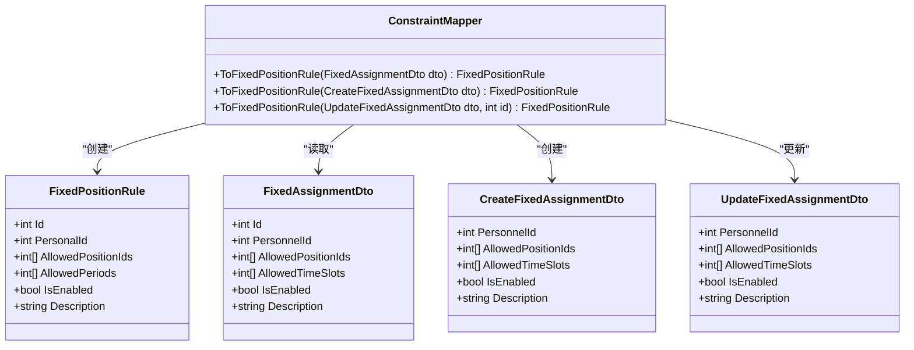

# 固定岗位规则

<cite>
**Referenced Files in This Document**  
- [FixedPositionRule.cs](file://Models/Constraints/FixedPositionRule.cs)
- [ConstraintMapper.cs](file://DTOs/Mappers/ConstraintMapper.cs)
- [ConstraintService.cs](file://Services/ConstraintService.cs)
- [ConstraintValidator.cs](file://SchedulingEngine/Core/ConstraintValidator.cs)
</cite>

## 目录
1. [简介](#简介)
2. [核心模型字段详解](#核心模型字段详解)
3. [在排班引擎中的作用](#在排班引擎中的作用)
4. [数据转换与验证逻辑](#数据转换与验证逻辑)
5. [实际使用示例](#实际使用示例)
6. [常见配置错误与解决方案](#常见配置错误与解决方案)
7. [结论](#结论)

## 简介
固定岗位规则（FixedPositionRule）是自动排班系统中的核心硬约束模型，用于精确控制特定人员的排班权限。该规则确保系统在生成排班计划时，仅将人员安排在其被授权的哨位和时段内，从而满足安全管理、技能匹配和岗位职责等业务需求。本文档深入解析该约束模型的结构、实现机制和使用方法。

**Section sources**
- [FixedPositionRule.cs](file://Models/Constraints/FixedPositionRule.cs#L9-L46)

## 核心模型字段详解

`FixedPositionRule` 模型定义了以下关键字段，用于精确描述人员的排班限制：

- **PersonalId**: 用于绑定特定人员的唯一标识符，通过该字段将规则与具体人员关联。
- **AllowedPositionIds**: 定义该人员可分配的哨位ID列表。空列表表示无哨位限制，允许分配到任意哨位。
- **AllowedPeriods**: 指定允许的时段序号列表（有效范围为0-11，对应24小时内的12个2小时时段）。空列表表示无时段限制。
- **IsEnabled**: 控制规则的启用状态。仅当此字段为 `true` 时，规则才会在排班过程中生效。
- **Description**: 提供规则的描述性信息，便于管理人员理解规则的业务目的。

该模型作为硬约束，在排班过程中具有最高优先级，任何违反此规则的排班方案都将被系统拒绝。

**Section sources**
- [FixedPositionRule.cs](file://Models/Constraints/FixedPositionRule.cs#L9-L46)

## 在排班引擎中的作用

固定岗位规则在排班引擎中作为硬约束执行，其核心作用是确保特定人员仅在授权的哨位和时段被安排。这一功能由 `ConstraintValidator` 类中的 `ValidateFixedAssignment` 方法实现。

```mermaid
sequenceDiagram
participant 排班引擎
participant 约束验证器
participant 固定岗位规则
participant 排班上下文
排班引擎->>约束验证器 : 验证分配 (personIdx, positionIdx, periodIdx, date)
约束验证器->>排班上下文 : 获取人员ID (personIdx)
约束验证器->>排班上下文 : 获取哨位ID (positionIdx)
约束验证器->>排班上下文 : 获取所有启用的定岗规则
排班上下文-->>约束验证器 : 返回规则列表
约束验证器->>约束验证器 : 遍历规则列表
loop 检查每条规则
约束验证器->>约束验证器 : 检查哨位是否允许
约束验证器->>约束验证器 : 检查时段是否允许
约束验证器->>约束验证器 : 哨位和时段均允许?
alt 是
约束验证器-->>排班引擎 : 返回 true (允许分配)
break 分配通过
end
end
约束验证器-->>排班引擎 : 返回 false (违反约束)
```

**Diagram sources**
- [ConstraintValidator.cs](file://SchedulingEngine/Core/ConstraintValidator.cs#L137-L162)
- [FixedPositionRule.cs](file://Models/Constraints/FixedPositionRule.cs#L9-L46)

**Section sources**
- [ConstraintValidator.cs](file://SchedulingEngine/Core/ConstraintValidator.cs#L137-L162)

## 数据转换与验证逻辑

系统通过 `ConstraintMapper` 类中的映射方法实现数据传输对象（DTO）与 `FixedPositionRule` 模型之间的转换。主要转换方法包括 `ToFixedPositionRule(FixedAssignmentDto dto)`、`ToFixedPositionRule(CreateFixedAssignmentDto dto)` 和 `ToFixedPositionRule(UpdateFixedAssignmentDto dto, int id)`。



**Diagram sources**
- [ConstraintMapper.cs](file://DTOs/Mappers/ConstraintMapper.cs#L59-L107)
- [FixedPositionRule.cs](file://Models/Constraints/FixedPositionRule.cs#L9-L46)

**Section sources**
- [ConstraintMapper.cs](file://DTOs/Mappers/ConstraintMapper.cs#L59-L107)

数据验证逻辑在 `ConstraintService` 中实现，确保规则的业务完整性：
- 验证 `PersonalId` 对应的人员是否存在。
- 验证 `AllowedPositionIds` 中的每个哨位ID是否有效。
- 验证 `AllowedPeriods` 中的每个时段序号是否在0-11的有效范围内。

**Section sources**
- [ConstraintService.cs](file://Services/ConstraintService.cs#L258-L282)

## 实际使用示例

一个典型的使用场景是限制某人员只能在A区哨位值夜班。假设A区哨位的ID为101和102，夜班对应的时段为9、10、11。

配置示例如下：
- **PersonalId**: 12345
- **AllowedPositionIds**: [101, 102]
- **AllowedPeriods**: [9, 10, 11]
- **IsEnabled**: true
- **Description**: "限制人员12345仅在A区哨位值夜班"

此配置确保排班引擎只会将该人员安排在A区的101或102号哨位，并且仅在夜间时段（如21:00-23:00, 23:00-01:00, 01:00-03:00）。

**Section sources**
- [FixedPositionRule.cs](file://Models/Constraints/FixedPositionRule.cs#L9-L46)

## 常见配置错误与解决方案

### 常见错误
1. **时段范围配置错误**：将 `AllowedPeriods` 设置为超出0-11范围的值（如12或-1），导致规则验证失败，排班过程无法进行。
2. **哨位ID无效**：在 `AllowedPositionIds` 中引用了不存在的哨位ID，导致数据验证失败。
3. **人员ID不存在**：`PersonalId` 字段引用了系统中不存在的人员，导致规则无法关联到具体人员。

### 解决方案
1. **时段范围错误**：检查并确保 `AllowedPeriods` 列表中的所有值都在0-11的范围内。可参考系统定义的时段映射表进行核对。
2. **哨位ID无效**：在配置前，通过系统管理界面确认哨位ID的正确性，或调用 `PositionService` 的查询接口验证ID的有效性。
3. **人员ID不存在**：在创建规则前，使用 `PersonnelService` 验证 `PersonalId` 是否存在于系统中。

**Section sources**
- [ConstraintService.cs](file://Services/ConstraintService.cs#L258-L282)

## 结论
固定岗位规则是自动排班系统中保障排班合规性的关键组件。通过精确配置 `PersonalId`、`AllowedPositionIds`、`AllowedPeriods` 等字段，系统管理员可以灵活地控制人员的排班权限。结合 `ConstraintMapper` 的数据转换和 `ConstraintValidator` 的运行时验证，该规则确保了排班结果既满足业务需求，又符合安全规范。正确理解和使用该规则，对于构建高效、可靠的自动排班系统至关重要。