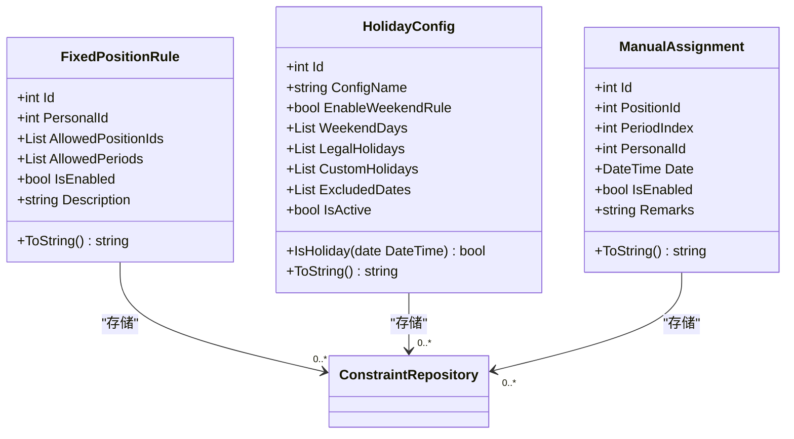
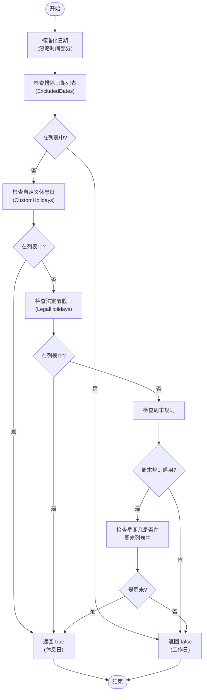
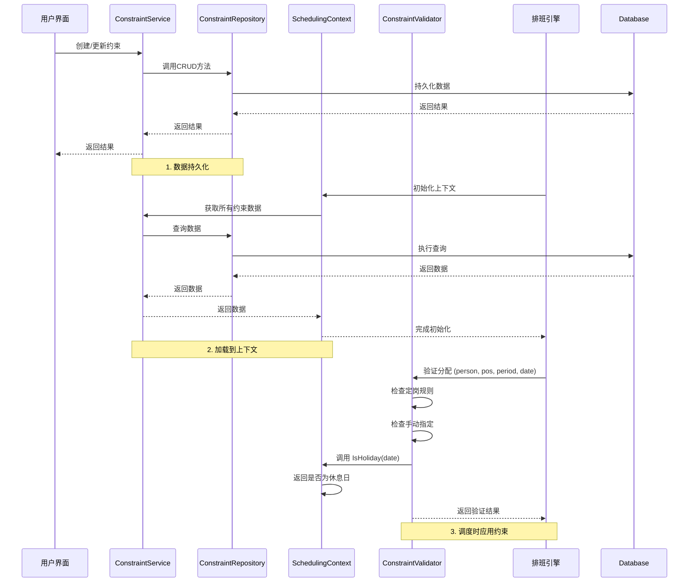

# 约束模型

<cite>
**Referenced Files in This Document**   
- [FixedPositionRule.cs](file://Models/Constraints/FixedPositionRule.cs)
- [HolidayConfig.cs](file://Models/Constraints/HolidayConfig.cs)
- [ManualAssignment.cs](file://Models/Constraints/ManualAssignment.cs)
- [ConstraintValidator.cs](file://SchedulingEngine/Core/ConstraintValidator.cs)
- [SchedulingContext.cs](file://SchedulingEngine/Core/SchedulingContext.cs)
- [ConstraintMapper.cs](file://DTOs/Mappers/ConstraintMapper.cs)
- [ConstraintRepository.cs](file://Data/ConstraintRepository.cs)
- [ConstraintService.cs](file://Services/ConstraintService.cs)
</cite>

## 目录
1. [引言](#引言)
2. [核心约束模型](#核心约束模型)
3. [定岗规则 (FixedPositionRule)](#定岗规则-fixedpositionrule)
4. [休息日配置 (HolidayConfig)](#休息日配置-holidayconfig)
5. [手动指定 (ManualAssignment)](#手动指定-manualassignment)
6. [约束的集成与应用](#约束的集成与应用)
7. [结论](#结论)

## 引言
本文档旨在深入阐述自动排班系统中的核心约束模型集合，包括定岗规则（FixedPositionRule）、休息日配置（HolidayConfig）和手动指定（ManualAssignment）三种核心约束类型。这些约束模型是确保排班方案合规性、灵活性和业务需求匹配性的基石。文档将详细解析每个模型的数据结构、业务逻辑、优先级处理机制，以及它们如何被排班引擎读取并应用于调度过程，为系统的设计、维护和扩展提供全面的技术参考。

## 核心约束模型
系统通过三个核心模型来定义和管理排班过程中的关键业务规则和限制条件。这些模型位于 `Models/Constraints/` 目录下，共同构成了排班引擎进行决策的依据。

**Diagram sources**
- [FixedPositionRule.cs](file://Models/Constraints/FixedPositionRule.cs)
- [HolidayConfig.cs](file://Models/Constraints/HolidayConfig.cs)
- [ManualAssignment.cs](file://Models/Constraints/ManualAssignment.cs)
- [ConstraintRepository.cs](file://Data/ConstraintRepository.cs)

**Section sources**
- [FixedPositionRule.cs](file://Models/Constraints/FixedPositionRule.cs)
- [HolidayConfig.cs](file://Models/Constraints/HolidayConfig.cs)
- [ManualAssignment.cs](file://Models/Constraints/ManualAssignment.cs)

## 定岗规则 (FixedPositionRule)
定岗规则用于定义特定人员在哨位和时段上的分配限制，确保人员只能在被授权的岗位上执行任务。

### 数据结构与作用
`FixedPositionRule` 类定义了以下关键属性：
- **PersonalId**: 指定该规则适用的人员ID。
- **AllowedPositionIds**: 允许该人员上哨的哨位ID列表。若列表为空，则表示对该人员的哨位选择没有限制。
- **AllowedPeriods**: 允许该人员上哨的时段序号列表（0-11，代表一天中的12个两小时时段）。若列表为空，则表示对该人员的时段选择没有限制。
- **IsEnabled**: 规则的启用状态，只有启用的规则才会被排班引擎考虑。

### 在定岗排班中的应用
在排班过程中，排班引擎会通过 `ConstraintValidator.ValidateFixedAssignment` 方法来检查分配的合规性。其逻辑如下：
1.  根据当前待分配人员的ID，从 `SchedulingContext` 中获取所有已启用的 `FixedPositionRule`。
2.  如果该人员没有任何定岗规则，则允许任意分配。
3.  如果存在定岗规则，则检查当前分配的哨位和时段是否满足**至少一条**规则的要求。即，当前哨位ID必须在 `AllowedPositionIds` 列表中（或列表为空），且当前时段序号必须在 `AllowedPeriods` 列表中（或列表为空）。

这种设计允许为同一人员设置多条规则，只要有一条规则允许，分配即可通过，提供了灵活的配置能力。

**Section sources**
- [FixedPositionRule.cs](file://Models/Constraints/FixedPositionRule.cs#L9-L46)
- [ConstraintValidator.cs](file://SchedulingEngine/Core/ConstraintValidator.cs#L200-L238)
- [SchedulingContext.cs](file://SchedulingEngine/Core/SchedulingContext.cs#L24-L25)

## 休息日配置 (HolidayConfig)
`HolidayConfig` 模型定义了如何判定一个日期是否为休息日的完整规则体系，这对于计算人员的休息日班次、评估排班公平性至关重要。

### IsHoliday判定逻辑与优先级机制
`HolidayConfig` 类的核心是 `IsHoliday(DateTime date)` 方法，它通过一个明确的优先级顺序来判定日期：
1.  **第一优先级：排除日期 (ExcludedDates)** - 检查该日期是否在 `ExcludedDates` 列表中。如果存在，则**强制判定为工作日**，并立即返回 `false`。此规则优先级最高，用于处理“调休”等特殊情况。
2.  **第二优先级：自定义休息日 (CustomHolidays)** - 检查该日期是否在 `CustomHolidays` 列表中。如果存在，则判定为休息日，返回 `true`。
3.  **第三优先级：法定节假日 (LegalHolidays)** - 检查该日期是否在 `LegalHolidays` 列表中。如果存在，则判定为休息日，返回 `true`。
4.  **第四优先级：周末规则 (WeekendRule)** - 如果启用了周末规则 (`EnableWeekendRule` 为 `true`)，并且该日期的星期几 (`DayOfWeek`) 在 `WeekendDays` 列表中，则判定为休息日，返回 `true`。
5.  **默认情况** - 如果以上所有条件均不满足，则默认判定为工作日，返回 `false`。

**Diagram sources**
- [HolidayConfig.cs](file://Models/Constraints/HolidayConfig.cs#L60-L85)

**Section sources**
- [HolidayConfig.cs](file://Models/Constraints/HolidayConfig.cs#L9-L86)

## 手动指定 (ManualAssignment)
手动指定允许用户预先强制分配特定人员到指定的哨位-时段-日期组合，确保关键岗位或特殊安排得到满足。

### 实现方式
`ManualAssignment` 模型通过以下属性定义一个强制分配：
- **PositionId**: 目标哨位的ID。
- **PeriodIndex**: 目标时段的序号（0-11）。
- **PersonalId**: 被指定的人员ID。
- **Date**: 分配的日期。

在排班引擎的调度过程中，`ConstraintValidator.ValidateManualAssignment` 方法会进行如下检查：
1.  根据当前待分配的 `Date`、`PeriodIndex` 和 `PositionId`，在 `SchedulingContext.ManualAssignments` 中查找是否存在一个已启用的手动指定。
2.  如果不存在任何匹配的手动指定，则允许自动分配，返回 `true`。
3.  如果存在匹配的手动指定，则当前分配的 `PersonalId` **必须**与该手动指定中的 `PersonalId` 完全一致，否则返回 `false`，阻止分配。

这确保了手动指定的绝对优先级，排班引擎必须严格遵守用户的预设安排。

**Section sources**
- [ManualAssignment.cs](file://Models/Constraints/ManualAssignment.cs#L8-L50)
- [ConstraintValidator.cs](file://SchedulingEngine/Core/ConstraintValidator.cs#L320-L347)

## 约束的集成与应用
约束模型并非孤立存在，而是通过一个完整的数据流和业务逻辑层被排班引擎高效地读取和应用。

### 数据流与服务层
1.  **数据持久化**: 所有约束模型（`FixedPositionRule`, `HolidayConfig`, `ManualAssignment`）都通过 `ConstraintRepository` 类进行数据库的CRUD操作。该类负责将对象序列化为JSON并存储在SQLite数据库中。
2.  **业务逻辑服务**: `ConstraintService` 类作为业务逻辑的入口，封装了对 `ConstraintRepository` 的调用，并添加了业务规则验证（如检查人员或哨位是否存在）。它还通过 `ConstraintMapper` 将数据库模型（Model）与数据传输对象（DTO）进行转换，以适应前端UI的需求。
3.  **调度上下文注入**: 排班引擎在启动时，会通过服务层获取所有相关的约束数据，并将其加载到 `SchedulingContext` 对象中。`SchedulingContext` 是排班算法的“全局状态”，它包含了 `FixedPositionRules`、`ManualAssignments` 和 `HolidayConfig` 等集合。

### 排班引擎中的应用
`ConstraintValidator` 是约束应用的核心。它在 `SchedulingContext` 的上下文中运行，其 `ValidateAllConstraints` 方法会依次检查所有硬性约束，包括本文档所述的定岗、休息日和手动指定规则。排班引擎（如 `GreedyScheduler`）在尝试为一个哨位-时段分配人员时，会调用此验证器。只有当所有约束都通过时，分配才会被记录。

**Diagram sources**
- [ConstraintRepository.cs](file://Data/ConstraintRepository.cs)
- [ConstraintService.cs](file://Services/ConstraintService.cs)
- [SchedulingContext.cs](file://SchedulingEngine/Core/SchedulingContext.cs#L21-L21)
- [ConstraintValidator.cs](file://SchedulingEngine/Core/ConstraintValidator.cs#L140-L360)

**Section sources**
- [ConstraintRepository.cs](file://Data/ConstraintRepository.cs)
- [ConstraintService.cs](file://Services/ConstraintService.cs)
- [SchedulingContext.cs](file://SchedulingEngine/Core/SchedulingContext.cs)
- [ConstraintValidator.cs](file://SchedulingEngine/Core/ConstraintValidator.cs)

## 结论
本文档详细解析了自动排班系统中的三大核心约束模型：`FixedPositionRule`、`HolidayConfig` 和 `ManualAssignment`。这些模型通过清晰的数据结构和严谨的业务逻辑，为排班过程提供了强大的规则支持。系统通过 `ConstraintRepository` 进行数据持久化，通过 `ConstraintService` 提供业务接口，并最终将所有约束信息注入到 `SchedulingContext` 中。排班引擎利用 `ConstraintValidator` 统一验证所有硬性约束，确保了生成的排班方案既符合业务规则，又具备必要的灵活性。这一设计模式实现了业务规则与调度算法的解耦，保证了系统的可维护性和可扩展性。