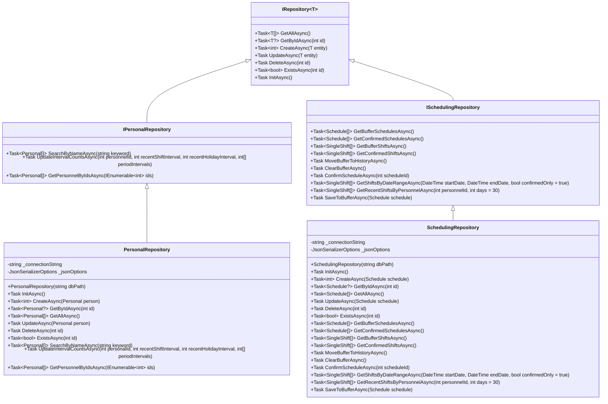

# Repository模式

<cite>
**本文档引用的文件**
- [IRepository.cs](file://Data/Interfaces/IRepository.cs)
- [IPersonalRepository.cs](file://Data/Interfaces/IPersonalRepository.cs)
- [ISchedulingRepository.cs](file://Data/Interfaces/ISchedulingRepository.cs)
- [PersonalRepository.cs](file://Data/PersonalRepository.cs)
- [SchedulingRepository.cs](file://Data/SchedulingRepository.cs)
- [DatabaseService.cs](file://Data/DatabaseService.cs)
- [ServiceCollectionExtensions.cs](file://Extensions/ServiceCollectionExtensions.cs)
- [PersonnelService.cs](file://Services/PersonnelService.cs)
- [Personal.cs](file://Models/Personal.cs)
- [Schedule.cs](file://Models/Schedule.cs)
</cite>

## 目录
1. [介绍](#介绍)
2. [核心接口定义](#核心接口定义)
3. [具体实现分析](#具体实现分析)
4. [数据实体与数据库映射](#数据实体与数据库映射)
5. [依赖注入与解耦设计](#依赖注入与解耦设计)
6. [异步编程应用](#异步编程应用)
7. [扩展与自定义指导](#扩展与自定义指导)
8. [总结](#总结)

## 介绍
本项目采用Repository模式实现数据访问层，通过接口与实现分离的设计原则，为上层业务逻辑提供统一的数据访问契约。该模式封装了对SQLite数据库的CRUD操作，实现了数据访问逻辑与业务逻辑的解耦，提高了代码的可维护性和可测试性。通过泛型接口IRepository<T>定义了通用的数据访问方法，各具体Repository类继承并实现该接口，同时根据业务需求扩展特定功能。

**Section sources**
- [IRepository.cs](file://Data/Interfaces/IRepository.cs)
- [PersonalRepository.cs](file://Data/PersonalRepository.cs)

## 核心接口定义
项目中的数据访问契约由IRepository<T>泛型接口定义，该接口位于Data/Interfaces目录下，为所有实体类型提供了统一的CRUD操作契约。接口采用泛型约束，确保T必须是引用类型，从而保证了类型安全。

IRepository<T>接口定义了以下核心方法：
- `GetAllAsync`：异步获取所有实体集合
- `GetByIdAsync`：根据ID异步获取单个实体
- `CreateAsync`：异步创建新实体，返回生成的ID
- `UpdateAsync`：异步更新现有实体
- `DeleteAsync`：根据ID异步删除实体
- `ExistsAsync`：检查指定ID的实体是否存在
- `InitAsync`：初始化数据库表结构

具体业务实体的Repository接口继承自IRepository<T>并扩展特定功能。例如，IPersonalRepository继承IRepository<Personal>并添加了按名称搜索、批量获取和更新间隔计数等特定方法；ISchedulingRepository继承IRepository<Schedule>并扩展了获取缓冲区排班、确认排班实施等排班管理专用方法。

**Section sources**
- [IRepository.cs](file://Data/Interfaces/IRepository.cs)
- [IPersonalRepository.cs](file://Data/Interfaces/IPersonalRepository.cs)
- [ISchedulingRepository.cs](file://Data/Interfaces/ISchedulingRepository.cs)

## 具体实现分析
各具体Repository类实现了对应的接口，封装了对SQLite数据库的CRUD操作。以PersonalRepository为例，该类实现了IPersonalRepository接口，负责管理人员信息的持久化。

PersonalRepository的实现特点包括：
- 构造函数接收数据库路径，初始化连接字符串
- InitAsync方法创建Personals表，定义了ID、姓名、职位、技能ID列表等字段
- CreateAsync方法使用INSERT语句添加新人员，通过SELECT last_insert_rowid()获取生成的ID
- GetByIdAsync和GetAllAsync方法使用SELECT语句查询数据，并通过MapPerson方法将数据库记录映射为Personal对象
- UpdateAsync方法使用UPDATE语句更新人员信息
- DeleteAsync方法使用DELETE语句删除指定ID的人员

SchedulingRepository的实现更为复杂，因为它需要管理排班表(Schedules)和单次排班表(SingleShifts)两个相关联的表。该类在CreateAsync和UpdateAsync方法中使用了数据库事务，确保排班主记录和其关联的排班明细记录的一致性。通过外键约束和ON DELETE CASCADE，实现了当删除排班表时自动删除其所有关联的单次排班记录。

**Diagram sources**
- [IRepository.cs](file://Data/Interfaces/IRepository.cs)
- [IPersonalRepository.cs](file://Data/Interfaces/IPersonalRepository.cs)
- [ISchedulingRepository.cs](file://Data/Interfaces/ISchedulingRepository.cs)
- [PersonalRepository.cs](file://Data/PersonalRepository.cs)
- [SchedulingRepository.cs](file://Data/SchedulingRepository.cs)

**Section sources**
- [PersonalRepository.cs](file://Data/PersonalRepository.cs)
- [SchedulingRepository.cs](file://Data/SchedulingRepository.cs)

## 数据实体与数据库映射
数据实体与数据库表的映射关系通过属性和数据库操作方法实现。以Personal实体为例，该类定义了Id、Name、PositionId、SkillIds等属性，与Personals表的字段一一对应。复杂类型如SkillIds（技能ID列表）和RecentPeriodShiftIntervals（时段班次间隔）在数据库中以JSON字符串形式存储，通过System.Text.Json序列化和反序列化实现对象与字符串的转换。

在PersonalRepository的MapPerson方法中，实现了从SqliteDataReader到Personal对象的映射：
- 基本类型字段直接通过reader的GetInt32、GetString等方法获取
- JSON字符串字段通过JsonSerializer.Deserialize反序列化为对应的集合类型
- 日期时间字段通过DateTime.Parse转换

这种映射方式既保持了数据库的简单性，又提供了丰富的对象模型。对于Scheduling实体，其Results属性（单次排班列表）在数据库中通过外键关联到SingleShifts表，实现了主从表的关系。在GetByIdAsync方法中，先查询Schedules表获取主记录，然后通过GetShiftsByScheduleAsync方法查询关联的SingleShifts记录，最后组合成完整的Schedule对象。

**Diagram sources**
- [Personal.cs](file://Models/Personal.cs)
- [Schedule.cs](file://Models/Schedule.cs)
- [PersonalRepository.cs](file://Data/PersonalRepository.cs)
- [SchedulingRepository.cs](file://Data/SchedulingRepository.cs)

**Section sources**
- [Personal.cs](file://Models/Personal.cs)
- [Schedule.cs](file://Models/Schedule.cs)
- [PersonalRepository.cs](file://Data/PersonalRepository.cs)
- [SchedulingRepository.cs](file://Data/SchedulingRepository.cs)

## 依赖注入与解耦设计
项目通过依赖注入实现Repository模式的解耦设计。在Extensions/ServiceCollectionExtensions.cs中，AddRepositories扩展方法将各个Repository实现注册为服务，使用Singleton生命周期，确保整个应用程序中共享同一个实例。

业务服务类（如PersonnelService）通过构造函数注入相应的Repository接口，而不是具体实现。这种方式实现了控制反转，使得业务服务不依赖于具体的数据访问实现，提高了代码的可测试性。例如，PersonnelService依赖于IPersonalRepository接口，可以在运行时注入PersonalRepository实例，也可以在测试时注入模拟对象。

DatabaseService类负责数据库的初始化和版本管理，它通过InitializeRepositoriesAsync方法协调所有Repository的初始化。这种设计将数据库初始化逻辑集中管理，确保所有表结构在应用程序启动时正确创建。依赖注入容器在应用程序启动时自动解析服务依赖关系，构建服务对象图，实现了松耦合的架构设计。

**Diagram sources**
- [ServiceCollectionExtensions.cs](file://Extensions/ServiceCollectionExtensions.cs)
- [PersonnelService.cs](file://Services/PersonnelService.cs)
- [DatabaseService.cs](file://Data/DatabaseService.cs)

**Section sources**
- [ServiceCollectionExtensions.cs](file://Extensions/ServiceCollectionExtensions.cs)
- [PersonnelService.cs](file://Services/PersonnelService.cs)
- [DatabaseService.cs](file://Data/DatabaseService.cs)

## 异步编程应用
项目广泛使用异步编程模型处理数据访问操作，所有Repository方法都返回Task或Task<T>，避免阻塞主线程。通过async/await关键字，实现了非阻塞的I/O操作，提高了应用程序的响应性和吞吐量。

在数据库操作中，使用了SqliteConnection的OpenAsync、ExecuteReaderAsync、ExecuteScalarAsync等异步方法。这些方法在等待数据库响应时不会阻塞线程，允许线程处理其他任务。对于需要事务支持的操作（如SchedulingRepository的CreateAsync和UpdateAsync），使用了BeginTransactionAsync和CommitAsync方法，确保了数据的一致性。

异步编程的应用不仅限于数据访问层，还贯穿于整个应用程序。业务服务层的方法也通常是异步的，将异步操作从数据访问层传递到上层调用者。这种设计模式使得整个应用程序能够高效处理并发请求，特别是在处理大量数据或高并发场景时表现出更好的性能。

**Section sources**
- [PersonalRepository.cs](file://Data/PersonalRepository.cs)
- [SchedulingRepository.cs](file://Data/SchedulingRepository.cs)

## 扩展与自定义指导
开发者可以遵循现有模式扩展数据访问功能。要创建新的Repository，首先定义继承自IRepository<T>的接口，声明特定的业务方法；然后创建实现类，继承基类Repository并实现接口方法。

对于现有Repository的扩展，可以添加新的查询方法以满足特定业务需求。例如，可以在PersonalRepository中添加按技能查询人员的方法，或在SchedulingRepository中添加按人员查询排班历史的方法。所有新方法都应遵循异步编程模式，返回Task或Task<T>。

在添加新实体时，需要在DatabaseService的CreateAllTablesAsync方法中添加相应的表创建语句，并在CreateIndexesAsync方法中添加适当的索引。同时，应在AddRepositories方法中注册新的Repository服务，确保依赖注入容器能够正确解析。

**Section sources**
- [IRepository.cs](file://Data/Interfaces/IRepository.cs)
- [DatabaseService.cs](file://Data/DatabaseService.cs)
- [ServiceCollectionExtensions.cs](file://Extensions/ServiceCollectionExtensions.cs)

## 总结
本项目通过Repository模式实现了清晰的数据访问层设计，通过接口与实现分离、依赖注入和异步编程等技术，构建了可维护、可测试和高性能的应用程序。IRepository<T>泛型接口提供了统一的数据访问契约，各具体Repository类封装了对SQLite数据库的操作细节。这种设计不仅提高了代码质量，还为未来的扩展和维护提供了良好的基础。