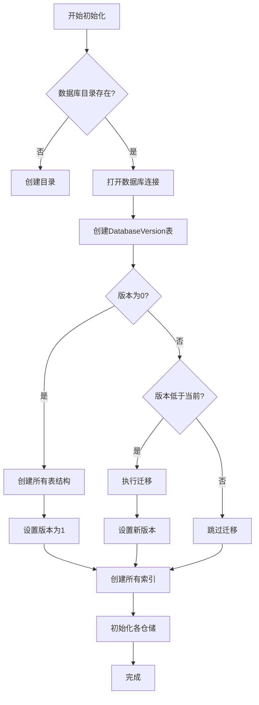

# 数据库设计

<cite>
**本文档引用的文件**
- [DatabaseService.cs](file://Data/DatabaseService.cs)
- [Personal.cs](file://Models/Personal.cs)
- [PositionLocation.cs](file://Models/PositionLocation.cs)
- [Skill.cs](file://Models/Skill.cs)
- [Schedule.cs](file://Models/Schedule.cs)
- [SingleShift.cs](file://Models/SingleShift.cs)
- [FixedPositionRule.cs](file://Models/Constraints/FixedPositionRule.cs)
- [HolidayConfig.cs](file://Models/Constraints/HolidayConfig.cs)
- [ManualAssignment.cs](file://Models/Constraints/ManualAssignment.cs)
</cite>

## 目录
1. [引言](#引言)
2. [数据库表结构](#数据库表结构)
3. [JSON字段设计与序列化策略](#json字段设计与序列化策略)
4. [索引创建策略与性能优化](#索引创建策略与性能优化)
5. [数据库初始化流程](#数据库初始化流程)
6. [主外键关系与约束说明](#主外键关系与约束说明)
7. [版本管理与迁移机制](#版本管理与迁移机制)
8. [总结](#总结)

## 引言
本系统采用SQLite作为本地嵌入式数据库，用于持久化存储排班调度系统中的核心业务数据。数据库设计遵循关系型模型，结合JSON字段灵活存储集合类型，兼顾结构化与灵活性。数据库服务（`DatabaseService`）负责表结构初始化、索引创建、版本控制和连接管理，确保系统启动时数据库处于一致且优化的状态。

## 数据库表结构

以下为系统中所有核心数据表的详细结构说明，包括字段定义、数据类型、默认值及注释。

### 人员表 (Personals)
存储人员基本信息及其状态。

| 字段名 | 类型 | 是否为空 | 默认值 | 说明 |
|--------|------|----------|--------|------|
| Id | INTEGER | 否 | AUTOINCREMENT | 主键，自增 |
| Name | TEXT | 否 | 无 | 人员姓名 |
| Position | TEXT | 否 | '' | 职位名称（文本） |
| SkillIds | TEXT | 否 | '[]' | 技能ID列表（JSON数组） |
| IsAvailable | INTEGER | 否 | 1 | 是否可用（0/1布尔值） |
| IsRetired | INTEGER | 否 | 0 | 是否已退役 |
| RecentShiftInterval | INTEGER | 否 | 0 | 最近班次间隔计数 |
| RecentHolidayShiftInterval | INTEGER | 否 | 0 | 最近节假日班次间隔计数 |
| RecentTimeSlotIntervals | TEXT | 否 | '[0,...,0]' | 12个时段的最近排班间隔（JSON数组） |
| CreatedAt | TEXT | 否 | CURRENT_TIMESTAMP | 创建时间（ISO 8601） |
| UpdatedAt | TEXT | 否 | CURRENT_TIMESTAMP | 更新时间（ISO 8601） |

**表来源**
- [DatabaseService.cs](file://Data/DatabaseService.cs#L45-L64)

### 哨位表 (Positions)
存储哨位的基本信息与要求。

| 字段名 | 类型 | 是否为空 | 默认值 | 说明 |
|--------|------|----------|--------|------|
| Id | INTEGER | 否 | AUTOINCREMENT | 主键，自增 |
| Name | TEXT | 否 | 无 | 哨位名称 |
| Location | TEXT | 否 | '' | 哨位地点 |
| Description | TEXT | 否 | '' | 哨位描述 |
| Requirements | TEXT | 否 | '' | 哨位要求（文本） |
| RequiredSkillIds | TEXT | 否 | '[]' | 所需技能ID列表（JSON数组） |
| IsActive | INTEGER | 否 | 1 | 是否激活 |
| CreatedAt | TEXT | 否 | CURRENT_TIMESTAMP | 创建时间 |
| UpdatedAt | TEXT | 否 | CURRENT_TIMESTAMP | 更新时间 |

**表来源**
- [DatabaseService.cs](file://Data/DatabaseService.cs#L66-L84)

### 技能表 (Skills)
存储技能的定义信息。

| 字段名 | 类型 | 是否为空 | 默认值 | 说明 |
|--------|------|----------|--------|------|
| Id | INTEGER | 否 | AUTOINCREMENT | 主键，自增 |
| Name | TEXT | 否 | 无 | 技能名称 |
| Description | TEXT | 否 | '' | 技能描述 |
| IsActive | INTEGER | 否 | 1 | 是否激活 |
| CreatedAt | TEXT | 否 | CURRENT_TIMESTAMP | 创建时间 |
| UpdatedAt | TEXT | 否 | CURRENT_TIMESTAMP | 更新时间 |

**表来源**
- [DatabaseService.cs](file://Data/DatabaseService.cs#L86-L102)

### 排班表 (Schedules)
表示一次完整的排班计划。

| 字段名 | 类型 | 是否为空 | 默认值 | 说明 |
|--------|------|----------|--------|------|
| Id | INTEGER | 否 | AUTOINCREMENT | 主键，自增 |
| Header | TEXT | 否 | 无 | 排班标题 |
| PersonnelIds | TEXT | 否 | '[]' | 参与人员ID列表（JSON） |
| PositionIds | TEXT | 否 | '[]' | 涉及哨位ID列表（JSON） |
| StartDate | TEXT | 否 | 无 | 开始日期（ISO 8601） |
| EndDate | TEXT | 否 | 无 | 结束日期（ISO 8601） |
| IsConfirmed | INTEGER | 否 | 0 | 是否已确认（0=草稿，1=确认） |
| CreatedAt | TEXT | 否 | CURRENT_TIMESTAMP | 创建时间 |
| UpdatedAt | TEXT | 否 | CURRENT_TIMESTAMP | 更新时间 |

**表来源**
- [DatabaseService.cs](file://Data/DatabaseService.cs#L104-L121)

### 单次排班表 (SingleShifts)
存储具体的排班结果，即某人某时在某哨位的班次。

| 字段名 | 类型 | 是否为空 | 默认值 | 说明 |
|--------|------|----------|--------|------|
| Id | INTEGER | 否 | AUTOINCREMENT | 主键，自增 |
| ScheduleId | INTEGER | 否 | 无 | 所属排班ID（外键） |
| PositionId | INTEGER | 否 | 无 | 哨位ID（外键） |
| PersonnelId | INTEGER | 否 | 无 | 人员ID（外键） |
| StartTime | TEXT | 否 | 无 | 开始时间（ISO 8601） |
| EndTime | TEXT | 否 | 无 | 结束时间（ISO 8601） |
| DayIndex | INTEGER | 否 | 0 | 从开始日期起的天数索引 |
| TimeSlotIndex | INTEGER | 否 | 0 | 时段索引（0-11） |
| IsNightShift | INTEGER | 否 | 0 | 是否为夜班 |

**外键约束：**
- `ScheduleId` → `Schedules(Id)`，级联删除
- `PositionId` → `Positions(Id)`
- `PersonnelId` → `Personals(Id)`

**表来源**
- [DatabaseService.cs](file://Data/DatabaseService.cs#L123-L142)

### 排班模板表 (SchedulingTemplates)
存储可复用的排班模板。

| 字段名 | 类型 | 是否为空 | 默认值 | 说明 |
|--------|------|----------|--------|------|
| Id | INTEGER | 否 | AUTOINCREMENT | 主键，自增 |
| Name | TEXT | 否 | 无 | 模板名称 |
| Description | TEXT | 是 | NULL | 描述 |
| PersonnelIds | TEXT | 否 | '[]' | 人员ID列表（JSON） |
| PositionIds | TEXT | 否 | '[]' | 哨位ID列表（JSON） |
| DurationDays | INTEGER | 否 | 1 | 持续天数 |
| StrategyConfig | TEXT | 否 | '{}' | 策略配置（JSON对象） |
| UsageCount | INTEGER | 否 | 0 | 使用次数 |
| IsActive | INTEGER | 否 | 1 | 是否激活 |
| CreatedAt | TEXT | 否 | CURRENT_TIMESTAMP | 创建时间 |
| UpdatedAt | TEXT | 否 | CURRENT_TIMESTAMP | 更新时间 |
| LastUsedAt | TEXT | 是 | NULL | 最后使用时间 |

**表来源**
- [DatabaseService.cs](file://Data/DatabaseService.cs#L144-L167)

### 定岗规则表 (FixedPositionRules)
定义人员可上哨的限制规则。

| 字段名 | 类型 | 是否为空 | 默认值 | 说明 |
|--------|------|----------|--------|------|
| Id | INTEGER | 否 | AUTOINCREMENT | 主键，自增 |
| PersonalId | INTEGER | 否 | 无 | 人员ID（外键） |
| AllowedPositionIds | TEXT | 否 | '[]' | 允许的哨位ID列表（JSON） |
| AllowedPeriods | TEXT | 否 | '[]' | 允许的时段列表（JSON，0-11） |
| IsEnabled | INTEGER | 否 | 1 | 规则是否启用 |
| Description | TEXT | 否 | '' | 规则描述 |

**外键约束：**
- `PersonalId` → `Personals(Id)`，级联删除

**表来源**
- [DatabaseService.cs](file://Data/DatabaseService.cs#L169-L184)

### 休息日配置表 (HolidayConfigs)
定义节假日和休息日的判定规则。

| 字段名 | 类型 | 是否为空 | 默认值 | 说明 |
|--------|------|----------|--------|------|
| Id | INTEGER | 否 | AUTOINCREMENT | 主键，自增 |
| ConfigName | TEXT | 否 | 无 | 配置名称 |
| EnableWeekendRule | INTEGER | 否 | 1 | 是否启用周末规则 |
| WeekendDays | TEXT | 否 | '[6,0]' | 周末日期列表（JSON，DayOfWeek） |
| LegalHolidays | TEXT | 否 | '[]' | 法定节假日列表（JSON） |
| CustomHolidays | TEXT | 否 | '[]' | 自定义休息日列表（JSON） |
| ExcludedDates | TEXT | 否 | '[]' | 排除日期列表（强制工作日） |
| IsActive | INTEGER | 否 | 1 | 是否为当前激活配置 |

**表来源**
- [DatabaseService.cs](file://Data/DatabaseService.cs#L186-L204)

### 手动指定表 (ManualAssignments)
存储用户预先指定的固定排班。

| 字段名 | 类型 | 是否为空 | 默认值 | 说明 |
|--------|------|----------|--------|------|
| Id | INTEGER | 否 | AUTOINCREMENT | 主键，自增 |
| PositionId | INTEGER | 否 | 无 | 哨位ID（外键） |
| PeriodIndex | INTEGER | 否 | 无 | 时段索引（0-11） |
| PersonalId | INTEGER | 否 | 无 | 人员ID（外键） |
| Date | TEXT | 否 | 无 | 日期（ISO 8601） |
| IsEnabled | INTEGER | 否 | 1 | 是否启用 |
| Remarks | TEXT | 否 | '' | 备注 |

**外键约束：**
- `PositionId` → `Positions(Id)`
- `PersonalId` → `Personals(Id)`

**检查约束：** `PeriodIndex` 必须在 0 到 11 之间。

**表来源**
- [DatabaseService.cs](file://Data/DatabaseService.cs#L206-L224)

## JSON字段设计与序列化策略

为在SQLite中存储集合类型（如`List<int>`），系统采用JSON字符串序列化策略，将复杂对象转换为文本存储。

### 设计策略
- **字段类型统一为TEXT**：所有JSON字段在数据库中定义为`TEXT`类型。
- **默认值为JSON空数组**：如`SkillIds TEXT NOT NULL DEFAULT '[]'`，确保字段始终为有效JSON。
- **C#模型中为强类型集合**：在`Personal`、`PositionLocation`等类中，对应属性为`List<int>`或`int[]`，由ORM或数据访问层负责序列化/反序列化。

### 序列化实现
在数据访问层（如`PositionLocationRepository`），通过`System.Text.Json.JsonSerializer`进行转换：
```csharp
var skillIds = JsonSerializer.Deserialize<List<int>>(reader.GetString(5)) ?? new List<int>();
```
此方法在读取时将JSON字符串反序列化为`List<int>`，在写入时将集合序列化为JSON字符串。

### 优势与考量
- **灵活性**：无需为每个集合创建关联表，简化模式。
- **性能**：避免多表连接，读取单条记录时效率高。
- **局限性**：无法对JSON数组内的元素建立索引或进行复杂查询，仅适用于整体读取的场景。

**来源**
- [DatabaseService.cs](file://Data/DatabaseService.cs#L50)
- [PositionLocation.cs](file://Models/PositionLocation.cs#L19)
- [PositionLocationRepository.cs](file://Data/PositionLocationRepository.cs#L194-L218)

## 索引创建策略与性能优化

为提升查询性能，系统在关键字段上创建了索引。

### 索引列表
```sql
-- 人员表
CREATE INDEX IF NOT EXISTS idx_personals_name ON Personals(Name);
CREATE INDEX IF NOT EXISTS idx_personals_available ON Personals(IsAvailable);
CREATE INDEX IF NOT EXISTS idx_personals_retired ON Personals(IsRetired);

-- 哨位表
CREATE INDEX IF NOT EXISTS idx_positions_name ON Positions(Name);
CREATE INDEX IF NOT EXISTS idx_positions_active ON Positions(IsActive);

-- 技能表
CREATE INDEX IF NOT EXISTS idx_skills_name ON Skills(Name);
CREATE INDEX IF NOT EXISTS idx_skills_active ON Skills(IsActive);

-- 排班表
CREATE INDEX IF NOT EXISTS idx_schedules_confirmed ON Schedules(IsConfirmed);
CREATE INDEX IF NOT EXISTS idx_schedules_date_range ON Schedules(StartDate, EndDate);
CREATE INDEX IF NOT EXISTS idx_schedules_created ON Schedules(CreatedAt);

-- 单次排班表
CREATE INDEX IF NOT EXISTS idx_shifts_schedule ON SingleShifts(ScheduleId);
CREATE INDEX IF NOT EXISTS idx_shifts_position ON SingleShifts(PositionId);
CREATE INDEX IF NOT EXISTS idx_shifts_personnel ON SingleShifts(PersonnelId);
CREATE INDEX IF NOT EXISTS idx_shifts_time ON SingleShifts(StartTime);
CREATE INDEX IF NOT EXISTS idx_shifts_day_slot ON SingleShifts(DayIndex, TimeSlotIndex);

-- 排班模板表
CREATE INDEX IF NOT EXISTS idx_templates_active ON SchedulingTemplates(IsActive);
CREATE INDEX IF NOT EXISTS idx_templates_usage ON SchedulingTemplates(UsageCount);
CREATE INDEX IF NOT EXISTS idx_templates_name ON SchedulingTemplates(Name);

-- 约束表
CREATE INDEX IF NOT EXISTS idx_fixed_rules_personal ON FixedPositionRules(PersonalId);
CREATE INDEX IF NOT EXISTS idx_fixed_rules_enabled ON FixedPositionRules(IsEnabled);
CREATE INDEX IF NOT EXISTS idx_holiday_configs_active ON HolidayConfigs(IsActive);
CREATE INDEX IF NOT EXISTS idx_manual_assignments_position ON ManualAssignments(PositionId);
CREATE INDEX IF NOT EXISTS idx_manual_assignments_personnel ON ManualAssignments(PersonnelId);
CREATE INDEX IF NOT EXISTS idx_manual_assignments_date ON ManualAssignments(Date);
CREATE INDEX IF NOT EXISTS idx_manual_assignments_enabled ON ManualAssignments(IsEnabled);
```

### 性能优化分析
- **高频查询字段**：如`Name`、`IsAvailable`、`IsActive`等，建立单列索引加速过滤。
- **范围查询**：`idx_schedules_date_range`支持按日期范围快速检索排班。
- **外键字段**：所有外键（如`ScheduleId`、`PositionId`）均建立索引，优化JOIN和级联操作。
- **复合索引**：`idx_shifts_day_slot`用于按天和时段快速定位班次。

**来源**
- [DatabaseService.cs](file://Data/DatabaseService.cs#L226-L278)

## 数据库初始化流程

`DatabaseService.InitializeAsync()`方法负责完整的数据库初始化流程。



**流程说明：**
1. 确保数据库文件所在目录存在。
2. 创建`DatabaseVersion`表用于版本追踪。
3. 若为新数据库（版本0），则创建所有表。
4. 若版本过低，则执行迁移（当前版本1无需迁移）。
5. 无论新旧，均创建所有索引以保证性能。
6. 最后初始化各仓储实例。

**来源**
- [DatabaseService.cs](file://Data/DatabaseService.cs#L28-L43)

## 主外键关系与约束说明

系统通过外键和检查约束维护数据完整性。

### 外键关系
- `SingleShifts.ScheduleId` → `Schedules.Id`（级联删除）
- `SingleShifts.PositionId` → `Positions.Id`
- `SingleShifts.PersonnelId` → `Personals.Id`
- `FixedPositionRules.PersonalId` → `Personals.Id`（级联删除）
- `ManualAssignments.PositionId` → `Positions.Id`
- `ManualAssignments.PersonalId` → `Personals.Id`

### 检查约束
- `ManualAssignments.PeriodIndex`：`CHECK (PeriodIndex >= 0 AND PeriodIndex <= 11)`，确保时段索引有效。

### 唯一性与主键
- 所有表均以`Id INTEGER PRIMARY KEY AUTOINCREMENT`作为主键。
- `DatabaseVersion`表的`Id`被约束为`CHECK (Id = 1)`，确保全局唯一配置。

**来源**
- [DatabaseService.cs](file://Data/DatabaseService.cs#L135-L138)

## 版本管理与迁移机制

系统通过`DatabaseVersion`表实现轻量级版本控制。

### 表结构
```sql
CREATE TABLE DatabaseVersion (
    Id INTEGER PRIMARY KEY CHECK (Id = 1),
    Version INTEGER NOT NULL,
    UpdatedAt TEXT NOT NULL DEFAULT CURRENT_TIMESTAMP
);
```

### 迁移策略
- `CurrentVersion`常量定义当前版本（当前为1）。
- `MigrateDatabaseAsync`方法在版本不匹配时调用，支持增量迁移。
- 当前仅支持版本1，未来版本的迁移逻辑可在`MigrateToVersionAsync`中添加。

此机制确保数据库结构随应用迭代而安全演进。

**来源**
- [DatabaseService.cs](file://Data/DatabaseService.cs#L34-L41)

## 总结
本系统的数据库设计合理平衡了关系型结构与灵活性。通过JSON字段存储集合数据，简化了模式设计；通过全面的索引策略保障了查询性能；通过版本控制机制支持未来演进。`DatabaseService`类集中管理了数据库的生命周期，确保系统启动时数据库处于正确状态，为上层业务提供了稳定可靠的数据存储基础。