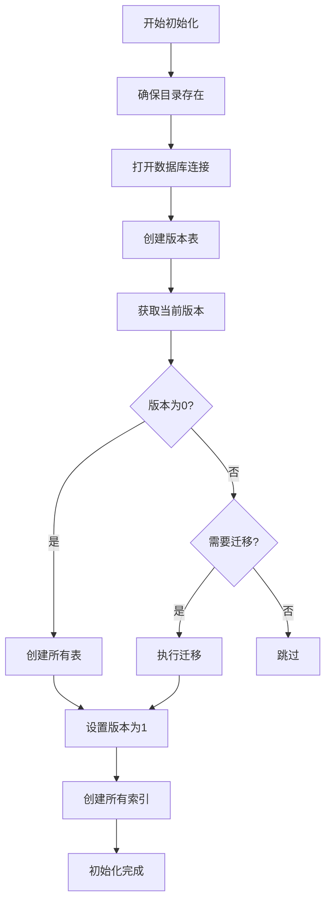
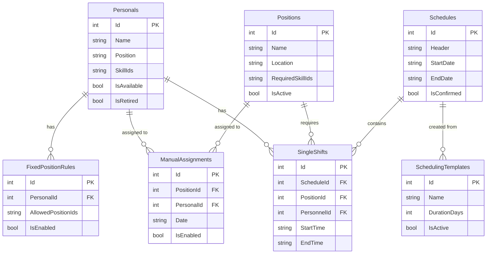

# 数据持久化策略

<cite>
**Referenced Files in This Document**  
- [DatabaseConfiguration.cs](file://Data/DatabaseConfiguration.cs)
- [DatabaseService.cs](file://Data/DatabaseService.cs)
- [IRepository.cs](file://Data/Interfaces/IRepository.cs)
- [ApplicationConstants.cs](file://Constants/ApplicationConstants.cs)
</cite>

## 目录
1. [引言](#引言)
2. [数据库配置管理](#数据库配置管理)
3. [数据库服务与初始化](#数据库服务与初始化)
4. [数据库迁移与版本控制](#数据库迁移与版本控制)
5. [表结构与索引设计](#表结构与索引设计)
6. [连接管理与性能优化](#连接管理与性能优化)
7. [事务处理与连接测试](#事务处理与连接测试)
8. [备份策略](#备份策略)
9. [结论](#结论)

## 引言
本文档深入阐述了自动排班系统中的数据持久化机制。系统采用SQLite作为嵌入式数据库，通过`DatabaseConfiguration`类和`DatabaseService`类协同工作，实现了数据库路径管理、连接配置、初始化、版本控制和迁移等核心功能。该机制确保了数据的可靠性、一致性和可维护性，为系统的稳定运行提供了坚实的基础。

## 数据库配置管理

`DatabaseConfiguration`类是系统中数据库配置的核心管理器，负责处理数据库路径的生成、验证和连接字符串的构建。该类采用静态类设计，提供了简洁的API供系统其他部分调用。

### 默认与测试数据库路径
系统区分了生产环境和测试环境的数据库路径。对于生产环境，`GetDefaultDatabasePath`方法将数据库文件存储在用户本地应用数据目录下的`AutoScheduling3`文件夹中，文件名为`GuardDutyScheduling.db`。此路径选择遵循了Windows平台的应用数据存储规范，确保了数据的安全性和隔离性。在测试环境中，`GetTestDatabasePath`方法返回`":memory:"`，指示SQLite使用内存数据库。这种设计极大地提升了单元测试的执行速度，并保证了测试的独立性和可重复性，每次测试运行后数据都会自动清除。

### 连接字符串优化
`DatabaseConfiguration`类提供了两种连接字符串生成方法。`GetConnectionString`方法生成基础连接字符串，而`GetOptimizedConnectionString`则启用了WAL（Write-Ahead Logging）模式和Normal同步模式。WAL模式允许多个读取操作与一个写入操作并发执行，显著提高了数据库的并发性能，特别适合读多写少的应用场景。同时，`ValidateDatabasePath`方法确保了数据库路径的有效性，能够自动创建缺失的目录结构，增强了系统的健壮性。

**Section sources**
- [DatabaseConfiguration.cs](file://Data/DatabaseConfiguration.cs#L25-L97)

## 数据库服务与初始化

`DatabaseService`类是数据库操作的中心枢纽，负责数据库的整个生命周期管理，从初始化到连接测试。它通过构造函数接收数据库路径，并基于此路径构建连接字符串。

### 初始化流程
`InitializeAsync`方法是数据库初始化的核心。其执行流程如下：
1.  **环境准备**：检查并创建数据库文件所在的目录。
2.  **连接建立**：打开一个到数据库的连接。
3.  **版本表创建**：调用`CreateVersionTableAsync`创建一个名为`DatabaseVersion`的表，用于跟踪数据库的版本。
4.  **版本检查**：通过`GetDatabaseVersionAsync`查询当前数据库版本。
5.  **初始化或迁移**：如果版本为0（新数据库），则调用`CreateAllTablesAsync`创建所有业务表；如果版本低于当前版本，则触发迁移流程。
6.  **索引创建**：无论新创建还是迁移，最后都会调用`CreateIndexesAsync`创建所有必要的索引以优化查询性能。

**Diagram sources**
- [DatabaseService.cs](file://Data/DatabaseService.cs#L31-L100)

**Section sources**
- [DatabaseService.cs](file://Data/DatabaseService.cs#L24-L100)

## 数据库迁移与版本控制

系统实现了轻量级的数据库版本控制机制，以应对未来数据结构的演进。

### 版本管理表
`DatabaseVersion`表是版本控制的核心，它只允许存在一条记录（`Id=1`），记录了当前的数据库版本号和最后更新时间。`GetDatabaseVersionAsync`方法通过查询此表来确定当前版本，如果表不存在或无记录，则返回0，表示一个全新的数据库。

### 迁移机制
`MigrateDatabaseAsync`方法负责处理版本升级。它采用迭代方式，从当前版本逐级迁移到目标版本。目前系统处于初始版本1，`MigrateToVersionAsync`方法对版本1的处理为空操作。未来当需要升级到版本2时，只需在此方法的`switch`语句中添加`case 2:`分支，并编写相应的SQL脚本来修改表结构或迁移数据。这种设计保证了数据库结构变更的平滑过渡，避免了因版本不兼容导致的应用崩溃。

**Section sources**
- [DatabaseService.cs](file://Data/DatabaseService.cs#L102-L168)

## 表结构与索引设计

系统根据业务需求设计了多张数据表，涵盖了人员、哨位、技能、排班、约束规则等核心实体。

### 核心表结构
- **Personals (人员表)**: 存储人员基本信息，包括姓名、岗位、技能列表（JSON格式存储）和可用状态。
- **Positions (哨位表)**: 存储哨位信息，如名称、位置、描述和所需技能。
- **Schedules (排班表)**: 存储排班计划的元数据，如排班标题、起止日期和确认状态。
- **SingleShifts (单次排班表)**: 存储具体的排班条目，通过外键关联到排班、人员和哨位。
- **Constraints (约束表)**: 包括`FixedPositionRules`（定岗规则）、`HolidayConfigs`（休息日配置）和`ManualAssignments`（手动指定），用于实现复杂的排班逻辑。

### 索引策略
系统为所有频繁查询的字段创建了索引，例如：
- 在`Personals`表的`Name`和`IsAvailable`字段上创建索引，以加速人员搜索和可用性筛选。
- 在`Schedules`表的`StartDate`和`EndDate`上创建复合索引，以优化按时间范围查询排班的性能。
- 在`SingleShifts`表的`ScheduleId`上创建索引，以快速获取某个排班计划下的所有具体排班。

这些索引显著提升了数据检索效率，是系统高性能的关键。

**Diagram sources**
- [DatabaseService.cs](file://Data/DatabaseService.cs#L170-L280)

## 连接管理与性能优化

系统通过连接字符串的配置来优化数据库性能。

### WAL模式应用
`GetOptimizedConnectionString`方法生成的连接字符串中包含了`Journal Mode=WAL`。WAL模式是SQLite的一项重要特性，它将更改写入一个独立的预写日志文件，而不是直接修改主数据库文件。这带来了两大优势：
1.  **高并发读写**：在WAL模式下，读取操作可以与写入操作并发进行，因为读取操作仍然从主数据库文件读取，而写入操作则记录在日志中。这极大地提升了多用户环境下的响应速度。
2.  **更快的写入速度**：WAL模式通常比默认的DELETE模式有更快的写入性能，因为它避免了频繁的文件锁定和解锁。

此外，`Synchronous=Normal`设置在保证数据安全的前提下，减少了磁盘同步的频率，进一步提升了写入性能。

**Section sources**
- [DatabaseConfiguration.cs](file://Data/DatabaseConfiguration.cs#L85-L97)

## 事务处理与连接测试

### 事务处理
虽然`DatabaseService`的初始化方法没有显式使用事务，但其设计保证了原子性。`CreateAllTablesAsync`方法在一个数据库连接中执行所有`CREATE TABLE`语句。如果其中任何一个语句失败，整个连接将被释放，而SQLite会自动回滚到执行前的状态。对于业务逻辑中的数据操作，系统通过`IRepository`接口的实现来管理事务，确保了数据的一致性。

### 连接测试
`TestConnectionAsync`方法提供了一种简单而有效的方式来验证数据库连接的可用性。它尝试打开一个连接并执行一个简单的`SELECT 1`查询。如果成功，则返回`true`；如果在打开连接或执行查询时发生任何异常，则捕获异常并返回`false`。此方法可用于应用启动时的健康检查或用户手动触发的连接诊断。

**Section sources**
- [DatabaseService.cs](file://Data/DatabaseService.cs#L311-L328)

## 备份策略

`DatabaseConfiguration`类提供了`GetBackupDatabasePath`方法来生成备份文件的路径。该方法接收原始数据库路径作为输入，然后在同一目录下创建一个新文件名，格式为`{原文件名}_backup_{时间戳}{扩展名}`。例如，`GuardDutyScheduling.db`的备份文件可能为`GuardDutyScheduling_backup_20231025_143022.db`。这种命名策略确保了备份文件的唯一性，并通过时间戳清晰地标识了备份时间，便于用户管理和恢复。

**Section sources**
- [DatabaseConfiguration.cs](file://Data/DatabaseConfiguration.cs#L58-L72)

## 结论
本系统的数据持久化机制设计周密，功能完备。通过`DatabaseConfiguration`和`DatabaseService`两个核心类的分工协作，实现了从路径管理、连接优化到初始化、版本控制和备份的全流程管理。采用WAL模式提升了并发性能，合理的表结构和索引设计保证了查询效率，而轻量级的迁移机制则为未来的系统演进提供了保障。这一套机制为自动排班系统的稳定、高效和可维护运行奠定了坚实的数据基础。