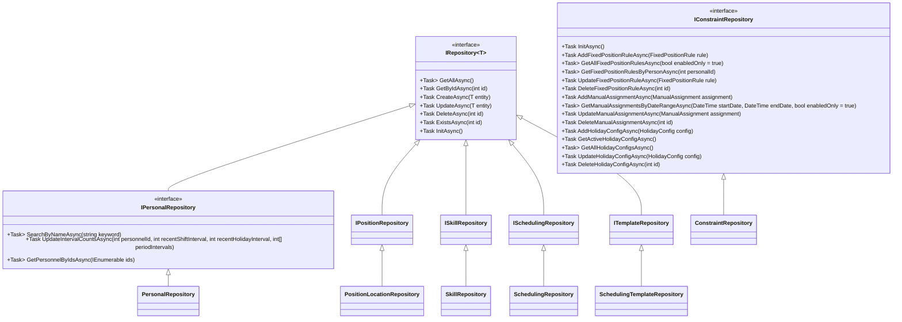
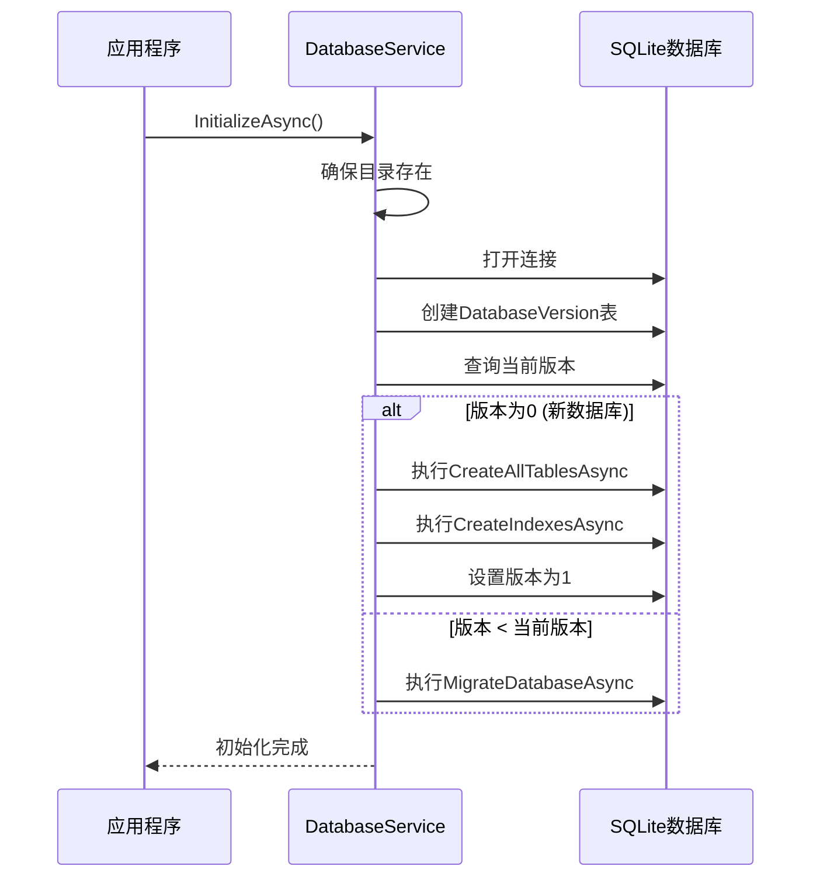

# 数据访问层

<cite>
**本文档引用的文件**
- [IRepository.cs](file://Data/Interfaces/IRepository.cs)
- [IConstraintRepository.cs](file://Data/Interfaces/IConstraintRepository.cs)
- [IPersonalRepository.cs](file://Data/Interfaces/IPersonalRepository.cs)
- [ConstraintRepository.cs](file://Data/ConstraintRepository.cs)
- [PersonalRepository.cs](file://Data/PersonalRepository.cs)
- [PositionLocationRepository.cs](file://Data/PositionLocationRepository.cs)
- [SchedulingRepository.cs](file://Data/SchedulingRepository.cs)
- [SkillRepository.cs](file://Data/SkillRepository.cs)
- [SchedulingTemplateRepository.cs](file://Data/SchedulingTemplateRepository.cs)
- [DatabaseConfiguration.cs](file://Data/DatabaseConfiguration.cs)
- [DatabaseService.cs](file://Data/DatabaseService.cs)
</cite>

## 目录
1. [简介](#简介)
2. [核心接口与Repository模式](#核心接口与repository模式)
3. [具体Repository实现](#具体repository实现)
4. [数据库配置与服务](#数据库配置与服务)
5. [数据持久化策略](#数据持久化策略)
6. [开发者指南](#开发者指南)

## 简介
本项目的数据访问层采用Repository模式，为上层业务逻辑提供统一的数据访问接口。该层封装了所有与SQLite数据库的交互细节，包括实体的增删改查、事务管理、连接池和数据库初始化。通过定义通用的`IRepository<T>`接口和具体的实现类，实现了数据访问逻辑的抽象与解耦，提高了代码的可维护性和可测试性。

**Section sources**
- [DatabaseService.cs](file://Data/DatabaseService.cs#L12-L368)
- [DatabaseConfiguration.cs](file://Data/DatabaseConfiguration.cs#L9-L97)

## 核心接口与Repository模式

数据访问层的核心是`IRepository<T>`接口，它定义了对任意实体类型T进行基本CRUD操作的通用契约。该接口通过泛型约束确保类型安全，并使用异步方法以提高I/O操作的性能。

**Diagram sources**
- [IRepository.cs](file://Data/Interfaces/IRepository.cs#L9-L45)
- [IConstraintRepository.cs](file://Data/Interfaces/IConstraintRepository.cs#L9-L29)
- [IPersonalRepository.cs](file://Data/Interfaces/IPersonalRepository.cs#L9-L25)

**Section sources**
- [IRepository.cs](file://Data/Interfaces/IRepository.cs#L9-L45)

## 具体Repository实现

### 人员Repository
`PersonalRepository`实现了`IPersonalRepository`接口，负责管理`Personal`实体的生命周期。它不仅提供了标准的CRUD操作，还包含了`SearchByNameAsync`用于模糊搜索，以及`UpdateIntervalCountsAsync`用于更新人员的排班间隔计数，这些是排班算法中的关键操作。

**Section sources**
- [PersonalRepository.cs](file://Data/PersonalRepository.cs#L14-L324)

### 约束Repository
`ConstraintRepository`是一个专门的仓储，不直接继承自`IRepository<T>`，而是通过`IConstraintRepository`接口提供对多种约束实体（`FixedPositionRule`, `ManualAssignment`, `HolidayConfig`）的访问。这种设计允许它为不同类型的约束提供特定的、细粒度的操作方法。

**Section sources**
- [ConstraintRepository.cs](file://Data/ConstraintRepository.cs#L13-L398)

### 其他Repository
`PositionLocationRepository`、`SkillRepository`、`SchedulingRepository`和`SchedulingTemplateRepository`均遵循相同的模式，实现了各自的接口，封装了对`Positions`、`Skills`、`Schedules`和`SchedulingTemplates`表的数据库操作。它们都使用JSON序列化来存储复杂的数据结构（如技能ID列表），并在读取时进行反序列化。

**Section sources**
- [PositionLocationRepository.cs](file://Data/PositionLocationRepository.cs#L13-L243)
- [SkillRepository.cs](file://Data/SkillRepository.cs#L13-L259)
- [SchedulingRepository.cs](file://Data/SchedulingRepository.cs#L13-L527)
- [SchedulingTemplateRepository.cs](file://Data/SchedulingTemplateRepository.cs#L13-L332)

## 数据库配置与服务

### DatabaseConfiguration
`DatabaseConfiguration`是一个静态类，负责管理数据库的路径和连接字符串。它提供了获取默认数据库路径、测试数据库路径（内存数据库）和备份路径的方法。它还定义了标准和优化的连接字符串，以适应不同的性能需求。

**Section sources**
- [DatabaseConfiguration.cs](file://Data/DatabaseConfiguration.cs#L9-L97)

### DatabaseService
`DatabaseService`是数据库初始化和管理的核心。它负责：
- **初始化**：创建数据库文件、表结构和索引。
- **版本控制**：通过`DatabaseVersion`表跟踪数据库版本，支持未来的数据迁移。
- **迁移**：当检测到数据库版本过旧时，执行迁移逻辑。
- **连接管理**：封装了`SqliteConnection`的创建和使用。

**Diagram sources**
- [DatabaseService.cs](file://Data/DatabaseService.cs#L12-L368)

**Section sources**
- [DatabaseService.cs](file://Data/DatabaseService.cs#L12-L368)

## 数据持久化策略

### 事务处理
在`SchedulingRepository`中，`CreateAsync`和`UpdateAsync`方法使用了显式事务（`SqliteTransaction`）。这确保了当创建一个`Schedule`及其关联的多个`SingleShift`时，所有操作要么全部成功，要么全部回滚，保证了数据的一致性。

### 连接管理
每个Repository的构造函数接收一个数据库路径，并在每次操作时创建一个新的`SqliteConnection`。这种“每次操作一个连接”的模式虽然简单，但依赖于SQLite的连接池机制来优化性能。`DatabaseService`在初始化时也遵循此模式。

### 数据迁移机制
`DatabaseService`内置了简单的迁移框架。`CurrentVersion`常量定义了当前期望的数据库版本。`InitializeAsync`方法会检查`DatabaseVersion`表中的版本号，如果低于当前版本，则调用`MigrateDatabaseAsync`执行迁移。目前只支持从版本0到版本1的迁移，但框架为未来添加更多迁移步骤（如`MigrateToVersionAsync`中的`switch`语句所示）提供了基础。

**Section sources**
- [DatabaseService.cs](file://Data/DatabaseService.cs#L12-L368)
- [SchedulingRepository.cs](file://Data/SchedulingRepository.cs#L13-L527)

## 开发者指南

### 自定义数据存储
要为新的实体类型创建自定义数据存储，应遵循以下步骤：
1.  在`Models`目录中定义新的实体类。
2.  在`Data/Interfaces`目录中创建一个新的接口，继承自`IRepository<YourEntity>`。
3.  在`Data`目录中创建一个实现类，实现该接口。
4.  在`DatabaseService.CreateAllTablesAsync`方法中添加创建新表的SQL语句。
5.  在`DatabaseService.CreateIndexesAsync`方法中为新表添加索引。

### 扩展Repository功能
要扩展现有Repository的功能，例如为`PersonalRepository`添加一个根据技能查询人员的方法：
1.  在`IPersonalRepository`接口中声明新的方法签名，例如`Task<List<Personal>> GetBySkillIdAsync(int skillId);`。
2.  在`PersonalRepository`类中实现该方法，编写相应的SQL查询。
3.  确保新方法的实现遵循与其他方法相同的模式（使用`using`语句管理连接和命令）。

**Section sources**
- [IRepository.cs](file://Data/Interfaces/IRepository.cs#L9-L45)
- [PersonalRepository.cs](file://Data/PersonalRepository.cs#L14-L324)
- [DatabaseService.cs](file://Data/DatabaseService.cs#L12-L368)