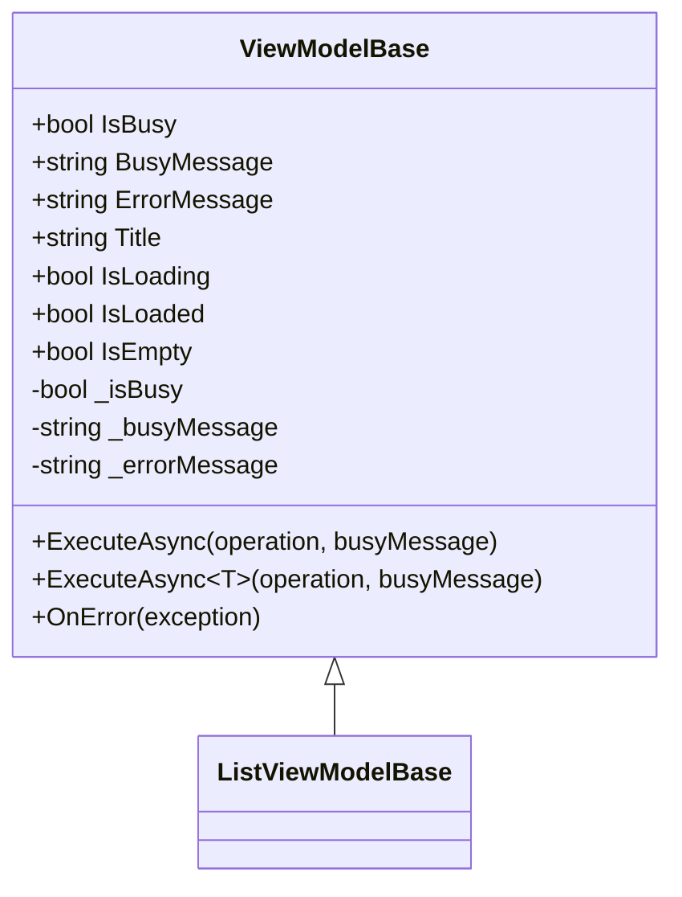
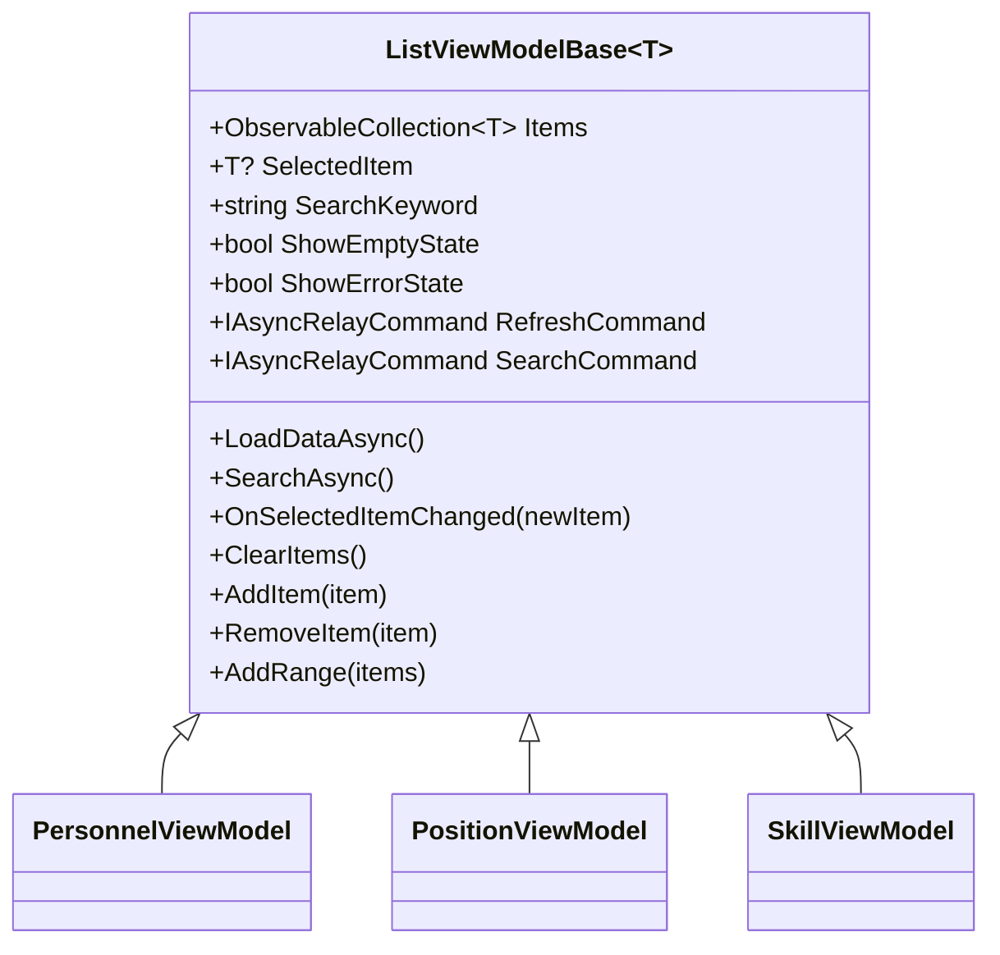
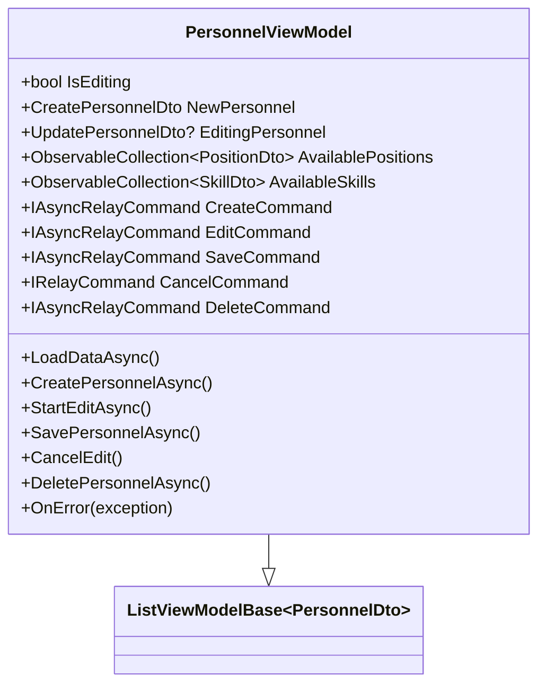
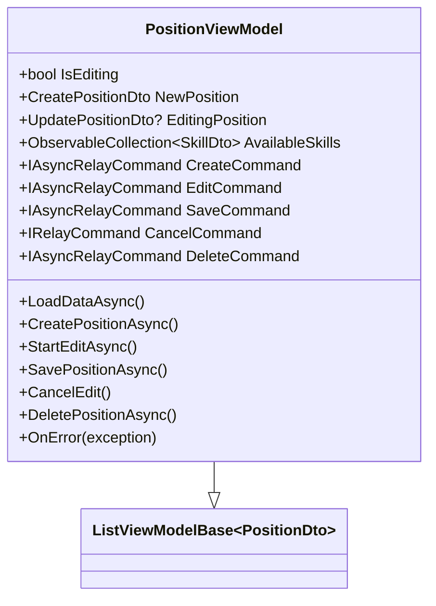
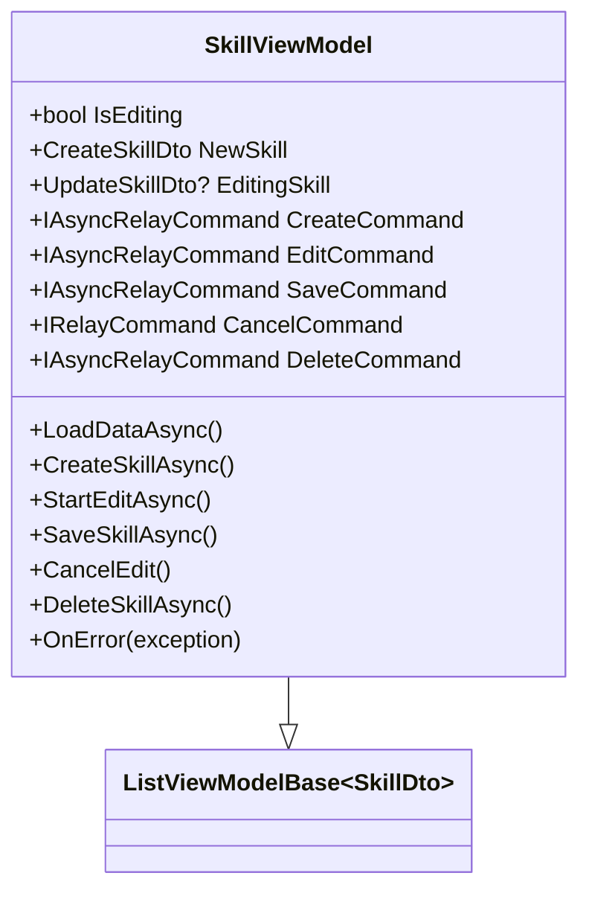
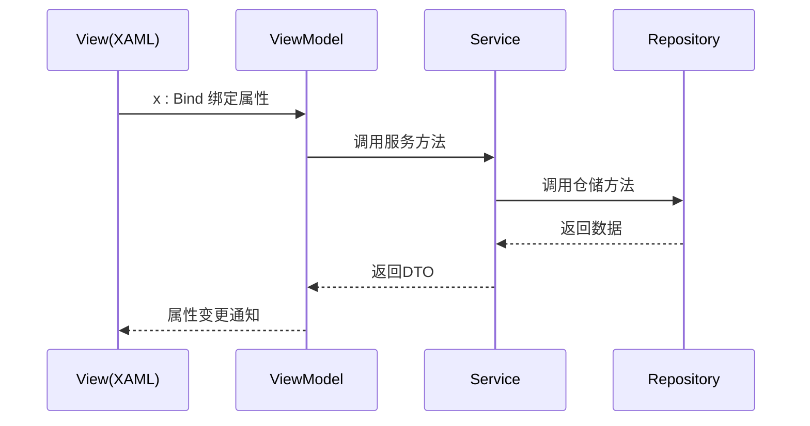

# MVVM架构实现

<cite>
**本文档引用文件**  
- [ViewModelBase.cs](file://ViewModels/Base/ViewModelBase.cs)
- [ListViewModelBase.cs](file://ViewModels/Base/ListViewModelBase.cs)
- [PersonnelViewModel.cs](file://ViewModels/DataManagement/PersonnelViewModel.cs)
- [PositionViewModel.cs](file://ViewModels/DataManagement/PositionViewModel.cs)
- [SkillViewModel.cs](file://ViewModels/DataManagement/SkillViewModel.cs)
- [PersonnelPage.xaml.cs](file://Views/DataManagement/PersonnelPage.xaml.cs)
- [PositionPage.xaml.cs](file://Views/DataManagement/PositionPage.xaml.cs)
- [SkillPage.xaml.cs](file://Views/DataManagement/SkillPage.xaml.cs)
- [ARCHITECTURE_IMPLEMENTATION_SUMMARY.md](file://ARCHITECTURE_IMPLEMENTATION_SUMMARY.md)
</cite>

## 目录
1. [简介](#简介)
2. [基类设计与功能](#基类设计与功能)
3. [具体视图模型实现](#具体视图模型实现)
4. [View层数据绑定](#view层数据绑定)
5. [MVVM架构数据流](#mvvm架构数据流)
6. [属性变更通知与命令绑定](#属性变更通知与命令绑定)

## 简介
AutoScheduling3项目采用MVVM架构模式，实现了前后端解耦的WinUI 3自动排班系统。该架构通过清晰的分层设计，将用户界面、业务逻辑和数据访问分离，提高了代码的可维护性和可测试性。系统采用CommunityToolkit.Mvvm框架提供MVVM基础设施支持，结合依赖注入实现组件解耦，所有I/O操作均采用异步编程模式确保UI响应流畅。

## 基类设计与功能

### ViewModelBase基类
`ViewModelBase`作为所有视图模型的基类，继承自`ObservableObject`，提供属性变更通知的基础功能。该基类定义了核心状态管理属性和异步操作执行机制。



**基类属性**
- `IsBusy`: 表示当前是否正在执行操作，用于控制UI加载状态
- `BusyMessage`: 繁忙状态显示的消息文本
- `ErrorMessage`: 存储最近发生的错误信息
- `Title`: 页面标题
- `IsLoading`/`IsLoaded`/`IsEmpty`: 页面状态标志

**异步执行方法**
基类提供了两个重载的`ExecuteAsync`方法，用于安全执行异步操作：
- `ExecuteAsync(Func<Task> operation)`: 执行无返回值的异步操作
- `ExecuteAsync<T>(Func<Task<T>> operation)`: 执行带返回值的异步操作

这些方法自动处理IsBusy状态切换、错误捕获和UI更新，确保在操作执行期间正确显示加载指示器，并在发生异常时设置ErrorMessage属性。

**错误处理机制**
`OnError`方法为虚拟方法，子类可重写以实现自定义错误处理逻辑，如日志记录或显示错误对话框。

**Diagram sources**
- [ViewModelBase.cs](file://ViewModels/Base/ViewModelBase.cs#L9-L119)

### ListViewModelBase基类
`ListViewModelBase<T>`继承自`ViewModelBase`，为列表管理页面提供通用功能，通过泛型参数支持不同类型的数据项。



**核心功能**
- `Items`: 使用`ObservableCollection<T>`存储数据项列表，自动通知UI更新
- `SelectedItem`: 当前选中的数据项，支持单选操作
- `SearchKeyword`: 搜索关键字，属性变更时自动触发搜索
- `ShowEmptyState`/`ShowErrorState`: 计算属性，用于控制空状态和错误状态的显示

**命令系统**
- `RefreshCommand`: 刷新命令，执行`LoadDataAsync`方法重新加载数据
- `SearchCommand`: 搜索命令，执行`SearchAsync`方法进行搜索

**生命周期方法**
- `LoadDataAsync`: 抽象方法，必须由子类实现，用于加载数据
- `SearchAsync`: 虚拟方法，默认实现为重新加载数据，可由子类重写
- `OnSelectedItemChanged`: 虚拟方法，选中项变更时调用，可由子类重写处理选中逻辑

**辅助方法**
提供`ClearItems`、`AddItem`、`RemoveItem`和`AddRange`等方法简化列表操作。

**Diagram sources**
- [ListViewModelBase.cs](file://ViewModels/Base/ListViewModelBase.cs#L12-L150)

## 具体视图模型实现

### PersonnelViewModel实现
`PersonnelViewModel`继承自`ListViewModelBase<PersonnelDto>`，实现人员管理功能，管理`PersonnelDto`类型的数据。



**依赖注入**
通过构造函数注入`IPersonnelService`、`IPositionService`、`ISkillService`和`DialogService`，实现服务解耦。

**CRUD命令实现**
- `CreateCommand`: 创建新人员，调用`PersonnelService.CreateAsync`
- `EditCommand`: 开始编辑选中人员，启用编辑模式
- `SaveCommand`: 保存编辑，调用`PersonnelService.UpdateAsync`
- `CancelCommand`: 取消编辑，退出编辑模式
- `DeleteCommand`: 删除人员，调用`PersonnelService.DeleteAsync`

**数据加载**
`LoadDataAsync`方法同时加载人员列表和关联的职位、技能数据，为创建和编辑表单提供选项数据。

**错误处理**
重写`OnError`方法，将异常信息通过`DialogService`显示给用户。

**Section sources**
- [PersonnelViewModel.cs](file://ViewModels/DataManagement/PersonnelViewModel.cs#L15-L241)

### PositionViewModel实现
`PositionViewModel`继承自`ListViewModelBase<PositionDto>`，实现哨位管理功能。



**功能特点**
- 管理`PositionDto`类型的数据
- 提供哨位的CRUD操作命令
- 加载关联的技能数据用于要求配置
- 实现完整的错误处理机制

**Section sources**
- [PositionViewModel.cs](file://ViewModels/DataManagement/PositionViewModel.cs#L15-L225)

### SkillViewModel实现
`SkillViewModel`继承自`ListViewModelBase<SkillDto>`，实现技能管理功能。



**功能特点**
- 管理`SkillDto`类型的数据
- 提供技能的CRUD操作命令
- 支持技能激活状态管理
- 实现完整的错误处理机制

**Section sources**
- [SkillViewModel.cs](file://ViewModels/DataManagement/SkillViewModel.cs#L13-L204)

## View层数据绑定

### x:Bind编译时绑定
View层通过x:Bind语法实现编译时数据绑定，相比传统的Binding语法具有更好的性能和类型安全性。



**页面初始化**
各管理页面在构造函数中通过依赖注入获取对应的ViewModel实例：

```csharp
public PersonnelPage()
{
    this.InitializeComponent();
    ViewModel = ((App)Application.Current).ServiceProvider.GetRequiredService<PersonnelViewModel>();
    _ = ViewModel.LoadDataAsync();
}
```

**Section sources**
- [PersonnelPage.xaml.cs](file://Views/DataManagement/PersonnelPage.xaml.cs#L9-L19)
- [PositionPage.xaml.cs](file://Views/DataManagement/PositionPage.xaml.cs#L12-L21)
- [SkillPage.xaml.cs](file://Views/DataManagement/SkillPage.xaml.cs#L12-L21)

### 数据绑定应用

#### 人员管理页面
- 绑定`PersonnelViewModel.Items`显示人员列表
- 绑定`SelectedItem`处理选中项
- 绑定`SearchKeyword`实现搜索功能
- 绑定`IsBusy`控制加载指示器
- 绑定`ErrorMessage`显示错误信息
- 绑定各种命令实现CRUD操作

#### 哨位管理页面
- 绑定`PositionViewModel.Items`显示哨位列表
- 绑定`AvailableSkills`提供技能选择
- 绑定`IsEditing`控制编辑模式
- 绑定各种命令实现哨位管理功能

#### 技能管理页面
- 绑定`SkillViewModel.Items`显示技能列表
- 绑定`IsEditing`控制编辑界面显示
- 绑定`NewSkill`和`EditingSkill`实现表单数据绑定
- 绑定命令实现技能管理操作

## MVVM架构数据流

### 架构层次关系
根据ARCHITECTURE_IMPLEMENTATION_SUMMARY.md中的架构图，系统各层之间的数据流和交互关系如下：

```mermaid
graph TD
A[Views (XAML)] --> |Data Binding| B[ViewModels]
B --> |DTO| C[Services]
C --> |DTO ↔ Model (Mapper)| D[Repositories]
D --> |SQL| E[SQLite Database]
subgraph "View Layer"
A
end
subgraph "ViewModel Layer"
B
end
subgraph "Service Layer"
C
end
subgraph "Data Layer"
D
E
end
```

**数据流说明**
1. **View到ViewModel**: 通过x:Bind语法进行数据绑定，用户交互触发命令执行
2. **ViewModel到Service**: ViewModel调用Service接口方法，传递DTO对象
3. **Service到Repository**: Service调用Repository方法，通过Mapper进行Model与DTO转换
4. **Repository到Database**: Repository执行SQL操作，访问SQLite数据库
5. **反向数据流**: 数据从数据库逐层返回，通过属性变更通知更新UI

**交互流程**
- 用户在View上进行操作（如点击按钮）
- View触发ViewModel的命令执行
- ViewModel调用Service方法处理业务逻辑
- Service调用Repository进行数据访问
- Repository与数据库交互获取/更新数据
- 数据通过各层返回，ViewModel更新属性
- 属性变更通知触发View更新

**Diagram sources**
- [ARCHITECTURE_IMPLEMENTATION_SUMMARY.md](file://ARCHITECTURE_IMPLEMENTATION_SUMMARY.md#L10-L37)

## 属性变更通知与命令绑定

### 属性变更通知实现
系统使用CommunityToolkit.Mvvm的`ObservableObject`基类实现属性变更通知：

```csharp
public bool IsBusy
{
    get => _isBusy;
    set => SetProperty(ref _isBusy, value);
}
```

`SetProperty`方法自动检查值是否变化，只有在值真正改变时才触发`PropertyChanged`事件，避免不必要的UI更新。

### 命令绑定实现
系统使用`IAsyncRelayCommand`实现异步命令绑定：

```csharp
CreateCommand = new AsyncRelayCommand(CreatePersonnelAsync);
EditCommand = new AsyncRelayCommand(StartEditAsync, () => SelectedItem != null);
```

**命令特点**
- `AsyncRelayCommand`: 支持异步操作，自动处理IsBusy状态
- 可启用条件: 通过lambda表达式定义命令是否可执行
- 自动线程管理: 确保UI更新在UI线程执行

### 实际应用示例
在人员管理页面中，创建按钮绑定到`CreateCommand`：

```xml
<Button Content="创建" Command="{x:Bind ViewModel.CreateCommand}" />
```

当用户点击按钮时：
1. `CreateCommand`检查`CanExecute`条件
2. 执行`CreatePersonnelAsync`方法
3. `ExecuteAsync`辅助方法设置`IsBusy=true`
4. 调用`PersonnelService.CreateAsync`创建人员
5. 操作完成后设置`IsBusy=false`
6. `Items`集合更新触发UI刷新

这种设计模式确保了UI响应性，用户可以清晰地看到操作状态，同时避免了并发操作导致的数据不一致问题。

**Section sources**
- [ViewModelBase.cs](file://ViewModels/Base/ViewModelBase.cs#L9-L119)
- [PersonnelViewModel.cs](file://ViewModels/DataManagement/PersonnelViewModel.cs#L63-L79)
- [PositionViewModel.cs](file://ViewModels/DataManagement/PositionViewModel.cs#L57-L71)
- [SkillViewModel.cs](file://ViewModels/DataManagement/SkillViewModel.cs#L49-L61)