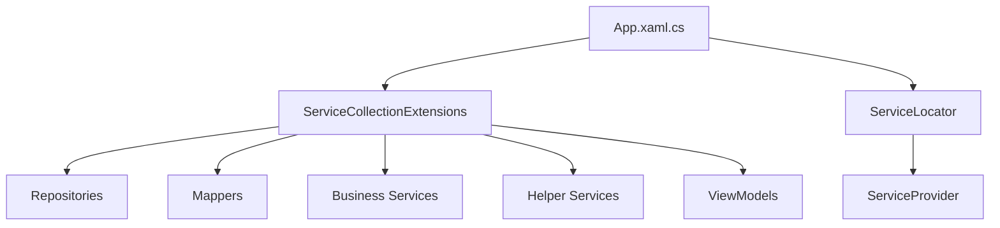
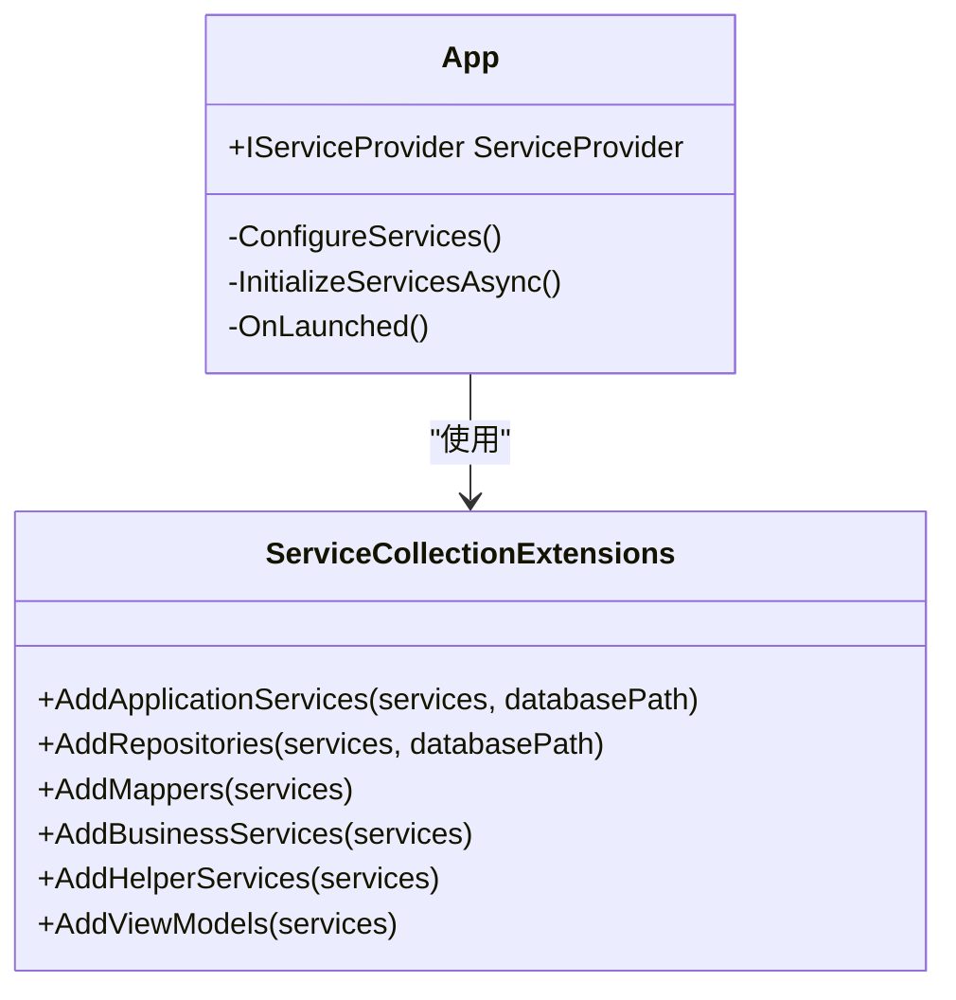
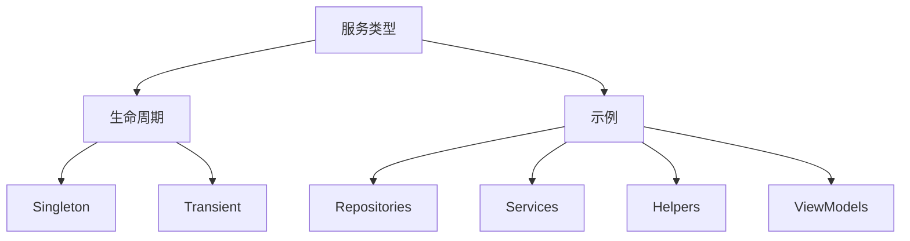
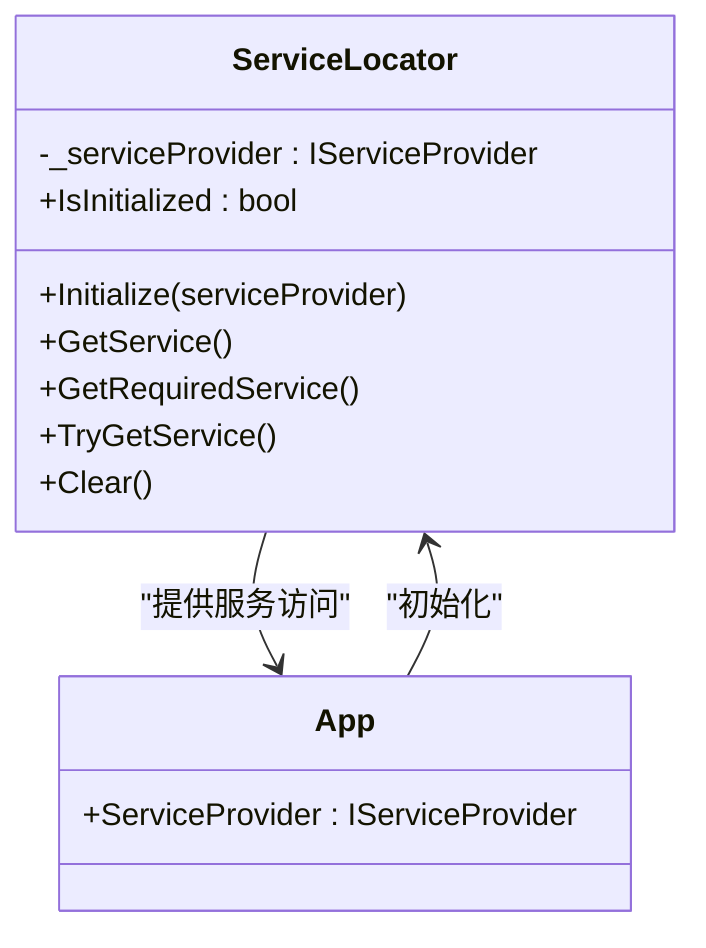
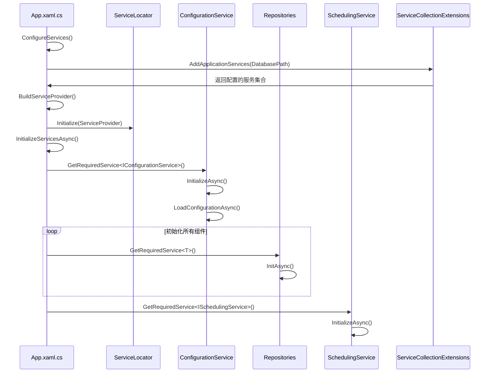
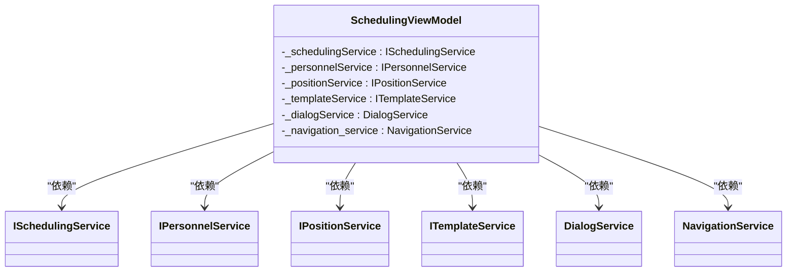

# 依赖注入配置

<cite>
**本文档引用的文件**
- [App.xaml.cs](file://App.xaml.cs)
- [ServiceCollectionExtensions.cs](file://Extensions/ServiceCollectionExtensions.cs)
- [ServiceLocator.cs](file://Helpers/ServiceLocator.cs)
- [ConfigurationService.cs](file://Services/ConfigurationService.cs)
- [PersonalRepository.cs](file://Data/PersonalRepository.cs)
- [PersonnelService.cs](file://Services/PersonnelService.cs)
- [SchedulingViewModel.cs](file://ViewModels/Scheduling/SchedulingViewModel.cs)
</cite>

## 目录
1. [项目结构](#项目结构)
2. [核心组件](#核心组件)
3. [依赖注入配置分析](#依赖注入配置分析)
4. [服务生命周期管理](#服务生命周期管理)
5. [服务定位器模式](#服务定位器模式)
6. [依赖注入初始化流程](#依赖注入初始化流程)
7. [构造函数注入示例](#构造函数注入示例)
8. [结论](#结论)

## 项目结构

AutoScheduling3项目采用分层架构设计，主要包含以下核心目录：

- **Constants**: 存储应用常量定义
- **Controls**: 自定义UI控件实现
- **Converters**: 数据绑定转换器
- **DTOs**: 数据传输对象及映射器
- **Data**: 数据访问层，包含仓储接口和实现
- **Extensions**: 扩展方法，特别是依赖注入配置
- **Helpers**: 辅助工具类，包括服务定位器
- **Models**: 业务模型定义
- **Services**: 业务服务层，实现核心业务逻辑
- **ViewModels**: MVVM模式中的视图模型
- **Views**: 用户界面



**Diagram sources**
- [App.xaml.cs](file://App.xaml.cs#L65-L76)
- [ServiceCollectionExtensions.cs](file://Extensions/ServiceCollectionExtensions.cs#L30-L137)

**Section sources**
- [App.xaml.cs](file://App.xaml.cs#L1-L150)
- [ServiceCollectionExtensions.cs](file://Extensions/ServiceCollectionExtensions.cs#L1-L137)

## 核心组件

项目的核心组件包括数据访问层的仓储模式实现、业务逻辑层的服务实现以及表示层的视图模型。这些组件通过依赖注入容器进行解耦和管理。

**Section sources**
- [PersonalRepository.cs](file://Data/PersonalRepository.cs#L1-L326)
- [PersonnelService.cs](file://Services/PersonnelService.cs#L1-L194)
- [SchedulingViewModel.cs](file://ViewModels/Scheduling/SchedulingViewModel.cs#L1-L532)

## 依赖注入配置分析

AutoScheduling3项目在`App.xaml.cs`文件中通过`ConfigureServices`方法配置依赖注入服务。该方法使用`ServiceCollectionExtensions.AddApplicationServices`扩展方法来注册所有应用程序服务。



**Diagram sources**
- [App.xaml.cs](file://App.xaml.cs#L65-L76)
- [ServiceCollectionExtensions.cs](file://Extensions/ServiceCollectionExtensions.cs#L30-L137)

**Section sources**
- [App.xaml.cs](file://App.xaml.cs#L65-L76)
- [ServiceCollectionExtensions.cs](file://Extensions/ServiceCollectionExtensions.cs#L30-L137)

## 服务生命周期管理

项目中不同服务采用不同的生命周期管理策略：

### 仓储服务 (Repositories)
所有仓储服务均注册为**Singleton**（单例），确保在整个应用程序生命周期中只有一个实例，提高数据库访问效率。

```csharp
services.AddSingleton<IPersonalRepository>(sp => new PersonalRepository(databasePath));
```

### 业务服务 (Services)
所有业务服务也注册为**Singleton**，确保服务状态在整个应用中保持一致。

```csharp
services.AddSingleton<IConfigurationService, ConfigurationService>();
```

### 帮助服务 (Helpers)
辅助服务如导航服务、对话框服务等同样注册为**Singleton**。

```csharp
services.AddSingleton<NavigationService>();
```

### 视图模型 (ViewModels)
所有视图模型注册为**Transient**（瞬态），确保每次需要时都创建新实例，避免状态污染。

```csharp
services.AddTransient<PersonnelViewModel>();
```



**Diagram sources**
- [ServiceCollectionExtensions.cs](file://Extensions/ServiceCollectionExtensions.cs#L30-L137)

**Section sources**
- [ServiceCollectionExtensions.cs](file://Extensions/ServiceCollectionExtensions.cs#L30-L137)

## 服务定位器模式

`ServiceLocator`类提供全局访问依赖注入容器的功能，允许在无法通过构造函数注入的场景下获取服务实例。



服务定位器在`App.xaml.cs`的`ConfigureServices`方法中初始化：

```csharp
// 初始化服务定位器
ServiceLocator.Initialize(ServiceProvider);
```

适用场景包括：
- 静态上下文中的服务访问
- 事件处理程序中的服务获取
- 工厂模式中的服务创建

**Diagram sources**
- [ServiceLocator.cs](file://Helpers/ServiceLocator.cs#L8-L78)
- [App.xaml.cs](file://App.xaml.cs#L74-L76)

**Section sources**
- [ServiceLocator.cs](file://Helpers/ServiceLocator.cs#L8-L78)
- [App.xaml.cs](file://App.xaml.cs#L74-L76)

## 依赖注入初始化流程

应用程序启动时的依赖注入初始化流程如下：



**Diagram sources**
- [App.xaml.cs](file://App.xaml.cs#L90-L148)
- [ConfigurationService.cs](file://Services/ConfigurationService.cs#L12-L158)

**Section sources**
- [App.xaml.cs](file://App.xaml.cs#L90-L148)
- [ConfigurationService.cs](file://Services/ConfigurationService.cs#L12-L158)

## 构造函数注入示例

`ConfigurationService`通过构造函数注入获取其依赖项，展示了依赖注入的实际应用：

```csharp
public ConfigurationService()
{
    var appDataPath = Environment.GetFolderPath(Environment.SpecialFolder.LocalApplicationData);
    var appFolder = Path.Combine(appDataPath, "AutoScheduling3");
    Directory.CreateDirectory(appFolder);
    _configFilePath = Path.Combine(appFolder, "config.json");
    _configuration = new Dictionary<string, object>();
}
```

`SchedulingViewModel`展示了多个服务通过构造函数注入的典型模式：

```csharp
public SchedulingViewModel(
    ISchedulingService schedulingService,
    IPersonnelService personnelService,
    IPositionService positionService,
    ITemplateService templateService,
    DialogService dialogService,
    NavigationService navigationService)
{
    _schedulingService = schedulingService ?? throw new ArgumentNullException(nameof(schedulingService));
    _personnelService = personnelService ?? throw new ArgumentNullException(nameof(personnelService));
    _positionService = positionService ?? throw new ArgumentNullException(nameof(positionService));
    _templateService = templateService ?? throw new ArgumentNullException(nameof(templateService));
    _dialogService = dialogService ?? throw new ArgumentNullException(nameof(dialogService));
    _navigation_service = navigationService ?? throw new ArgumentNullException(nameof(navigationService));
}
```



**Diagram sources**
- [SchedulingViewModel.cs](file://ViewModels/Scheduling/SchedulingViewModel.cs#L85-L119)
- [ConfigurationService.cs](file://Services/ConfigurationService.cs#L18-L25)

**Section sources**
- [SchedulingViewModel.cs](file://ViewModels/Scheduling/SchedulingViewModel.cs#L85-L119)
- [ConfigurationService.cs](file://Services/ConfigurationService.cs#L18-L25)

## 结论

AutoScheduling3项目通过精心设计的依赖注入配置实现了组件间的松耦合。`ServiceCollectionExtensions.AddApplicationServices`方法作为服务注册的入口点，统一管理了所有应用程序服务的注册。项目合理运用Singleton和Transient生命周期策略，确保了性能和状态管理的平衡。服务定位器模式为静态上下文提供了灵活的服务访问机制，而构造函数注入则保证了主要组件的可测试性和清晰的依赖关系。整个依赖注入系统在应用程序启动时通过有序的初始化流程确保所有服务正确配置和准备就绪。