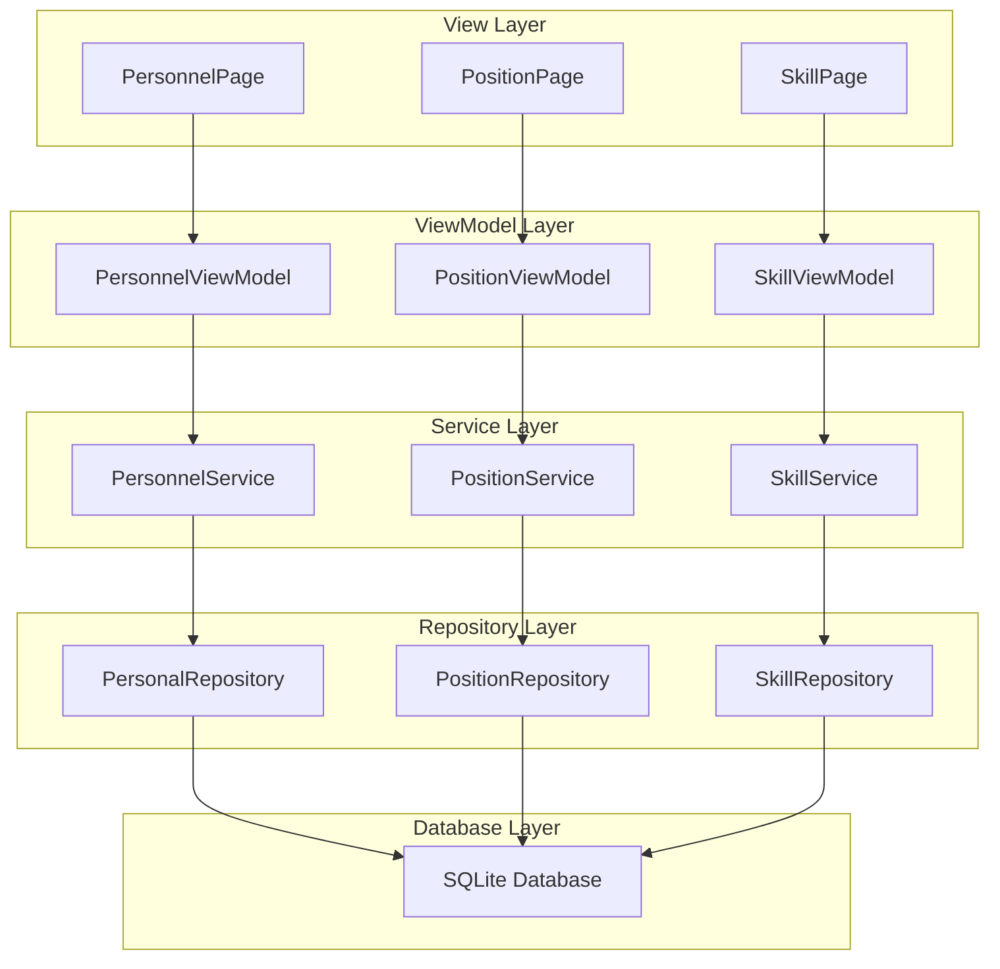
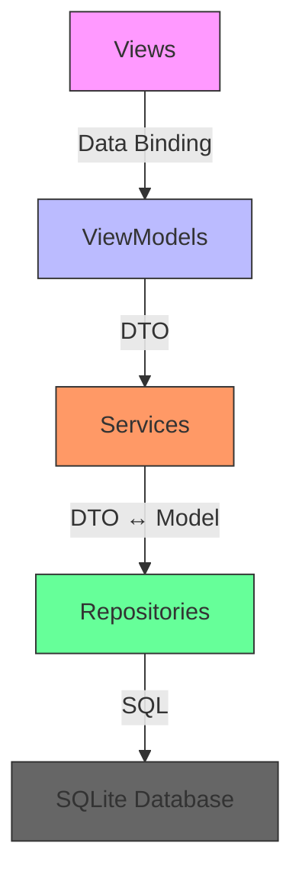
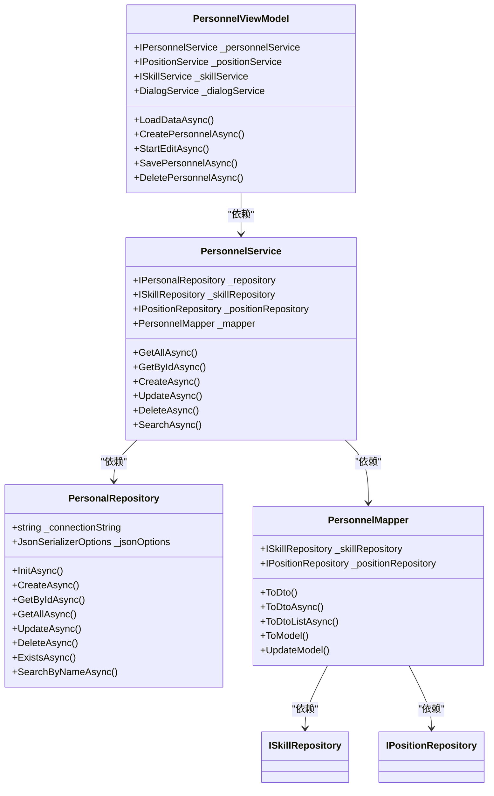
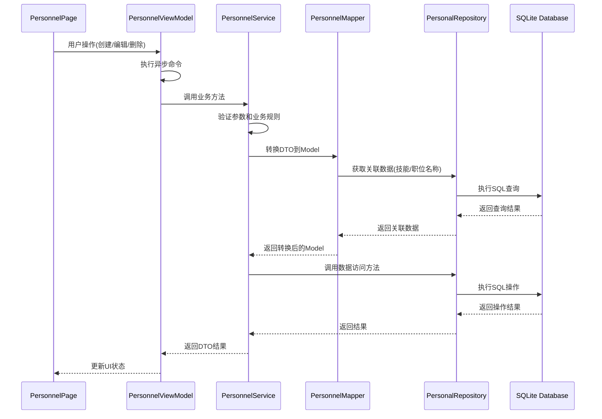
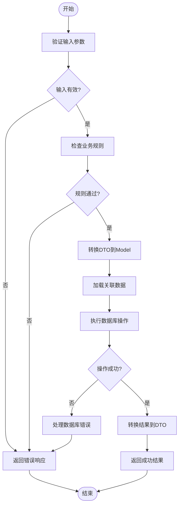
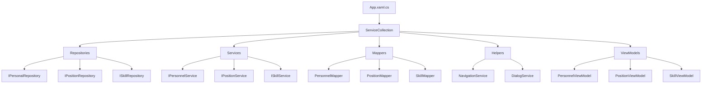

# 分层架构设计

<cite>
**本文档引用的文件**
- [ARCHITECTURE_IMPLEMENTATION_SUMMARY.md](file://ARCHITECTURE_IMPLEMENTATION_SUMMARY.md)
- [PersonalRepository.cs](file://Data/PersonalRepository.cs)
- [PersonnelService.cs](file://Services/PersonnelService.cs)
- [PersonnelMapper.cs](file://DTOs/Mappers/PersonnelMapper.cs)
- [PersonnelPage.xaml.cs](file://Views/DataManagement/PersonnelPage.xaml.cs)
- [PersonnelViewModel.cs](file://ViewModels/DataManagement/PersonnelViewModel.cs)
- [App.xaml.cs](file://App.xaml.cs)
- [MainWindow.xaml.cs](file://MainWindow.xaml.cs)
</cite>

## 目录
1. [引言](#引言)
2. [项目结构](#项目结构)
3. [核心组件](#核心组件)
4. [架构概述](#架构概述)
5. [详细组件分析](#详细组件分析)
6. [依赖分析](#依赖分析)
7. [性能考虑](#性能考虑)
8. [故障排除指南](#故障排除指南)
9. [结论](#结论)

## 引言
AutoScheduling3 是一个基于 WinUI 3 的自动排班系统，采用 MVVM 架构模式实现前后端解耦。本项目通过分层架构设计，将系统划分为视图层、视图模型层、服务层、数据访问层和数据库层，实现了清晰的职责划分和高内聚低耦合的设计目标。系统使用 .NET 8.0 和 C# 12 开发，结合 CommunityToolkit.Mvvm 框架和 Microsoft.Extensions.DependencyInjection 实现依赖注入，确保了代码的可维护性和可测试性。

## 项目结构
AutoScheduling3 项目采用功能模块化组织方式，主要包含以下目录：
- **Constants**: 应用常量定义
- **Controls**: 自定义 UI 控件
- **Converters**: 数据绑定值转换器
- **DTOs**: 数据传输对象及其映射器
- **Data**: 数据访问层，包含 Repository 实现
- **Helpers**: 辅助工具类，如导航服务、对话框服务
- **Models**: 领域模型定义
- **Services**: 业务逻辑服务层
- **ViewModels**: 视图模型层，实现 MVVM 模式
- **Views**: XAML 视图页面
- **SchedulingEngine**: 排班算法核心引擎

这种分层结构确保了各组件之间的职责清晰，便于团队协作开发和后期维护。

**图示来源**
- [PersonnelPage.xaml.cs](file://Views/DataManagement/PersonnelPage.xaml.cs)
- [PersonnelViewModel.cs](file://ViewModels/DataManagement/PersonnelViewModel.cs)
- [PersonnelService.cs](file://Services/PersonnelService.cs)
- [PersonalRepository.cs](file://Data/PersonalRepository.cs)

**本节来源**
- [ARCHITECTURE_IMPLEMENTATION_SUMMARY.md](file://ARCHITECTURE_IMPLEMENTATION_SUMMARY.md)

## 核心组件
AutoScheduling3 的核心组件包括视图层、视图模型层、服务层、数据访问层和数据库层。视图层由 XAML 页面组成，负责用户界面展示和交互；视图模型层作为桥梁，处理用户命令并更新视图状态；服务层封装业务逻辑，协调数据访问；数据访问层通过 Repository 模式与 SQLite 数据库交互；数据库层存储所有持久化数据。各层之间通过接口和 DTO 对象进行通信，确保了松耦合和高内聚的设计原则。

**本节来源**
- [ARCHITECTURE_IMPLEMENTATION_SUMMARY.md](file://ARCHITECTURE_IMPLEMENTATION_SUMMARY.md)

## 架构概述
AutoScheduling3 采用经典的分层架构设计，从上到下依次为视图层、视图模型层、服务层、数据访问层和数据库层。这种架构设计实现了关注点分离，使得每个层只负责特定的职责。视图层专注于用户界面展示，视图模型层处理用户交互逻辑，服务层封装业务规则，数据访问层管理数据持久化，数据库层负责数据存储。各层之间通过明确定义的接口进行通信，降低了组件间的耦合度，提高了系统的可维护性和可扩展性。

**图示来源**
- [ARCHITECTURE_IMPLEMENTATION_SUMMARY.md](file://ARCHITECTURE_IMPLEMENTATION_SUMMARY.md)

## 详细组件分析
### 人员管理组件分析
人员管理功能是 AutoScheduling3 的核心功能之一，涵盖了从用户界面到数据持久化的完整流程。该功能通过 PersonnelPage、PersonnelViewModel、PersonnelService、PersonalRepository 和 SQLite 数据库的协同工作实现。

#### 对象导向组件

**图示来源**
- [PersonnelViewModel.cs](file://ViewModels/DataManagement/PersonnelViewModel.cs)
- [PersonnelService.cs](file://Services/PersonnelService.cs)
- [PersonalRepository.cs](file://Data/PersonalRepository.cs)
- [PersonnelMapper.cs](file://DTOs/Mappers/PersonnelMapper.cs)

#### API/服务组件

**图示来源**
- [PersonnelPage.xaml.cs](file://Views/DataManagement/PersonnelPage.xaml.cs)
- [PersonnelViewModel.cs](file://ViewModels/DataManagement/PersonnelViewModel.cs)
- [PersonnelService.cs](file://Services/PersonnelService.cs)
- [PersonnelMapper.cs](file://DTOs/Mappers/PersonnelMapper.cs)
- [PersonalRepository.cs](file://Data/PersonalRepository.cs)

#### 复杂逻辑组件

**图示来源**
- [PersonnelService.cs](file://Services/PersonnelService.cs)
- [PersonnelMapper.cs](file://DTOs/Mappers/PersonnelMapper.cs)
- [PersonalRepository.cs](file://Data/PersonalRepository.cs)

**本节来源**
- [PersonnelPage.xaml.cs](file://Views/DataManagement/PersonnelPage.xaml.cs)
- [PersonnelViewModel.cs](file://ViewModels/DataManagement/PersonnelViewModel.cs)
- [PersonnelService.cs](file://Services/PersonnelService.cs)
- [PersonnelMapper.cs](file://DTOs/Mappers/PersonnelMapper.cs)
- [PersonalRepository.cs](file://Data/PersonalRepository.cs)

## 依赖分析
AutoScheduling3 采用依赖注入（DI）模式管理组件间的依赖关系，通过 Microsoft.Extensions.DependencyInjection 实现。在 App.xaml.cs 中配置了所有服务的生命周期，Repositories、Services、Mappers 和 Helpers 使用 Singleton 生命周期，确保全局唯一实例；ViewModels 使用 Transient 生命周期，每次导航时创建新实例。这种依赖管理方式解耦了组件间的直接依赖，提高了代码的可测试性和可维护性。

**图示来源**
- [App.xaml.cs](file://App.xaml.cs)

**本节来源**
- [App.xaml.cs](file://App.xaml.cs)

## 性能考虑
AutoScheduling3 在设计时充分考虑了性能因素。所有 I/O 操作均采用异步编程模式（async/await），避免阻塞 UI 线程，确保界面响应流畅。数据访问层对批量操作进行了优化，减少了数据库交互次数。Mapper 组件支持异步加载关联数据，在需要时才加载相关实体，避免了不必要的数据查询。此外，系统在启动时初始化所有 Repository，预先创建数据库表结构，减少了运行时的初始化开销。

## 故障排除指南
当遇到问题时，可以按照以下步骤进行排查：首先检查依赖注入配置是否正确，确保所有服务都已正确注册；其次验证数据库连接和表结构是否正常，系统在启动时会自动创建必要的表；然后检查参数验证逻辑，确保输入数据符合要求；最后查看异常处理机制，系统通过 ViewModelBase 的 ExecuteAsync 方法统一处理异常，并通过 DialogService 向用户显示友好的错误信息。

**本节来源**
- [PersonnelViewModel.cs](file://ViewModels/DataManagement/PersonnelViewModel.cs)
- [App.xaml.cs](file://App.xaml.cs)

## 结论
AutoScheduling3 通过分层架构设计成功实现了前后端解耦，建立了清晰的职责划分。系统采用 MVVM 模式，结合依赖注入和 Repository 模式，提高了代码的可维护性和可测试性。DTO 模式和 Mapper 组件确保了层间数据传递的安全性和灵活性。异步编程模型保证了界面的响应性。整体架构设计合理，为后续功能扩展奠定了坚实基础。