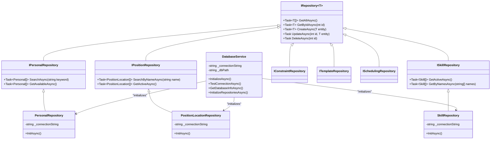

# 核心架构设计

<cite>
**本文档引用的文件**  
- [App.xaml.cs](file://App.xaml.cs)
- [MainWindow.xaml.cs](file://MainWindow.xaml.cs)
- [ServiceCollectionExtensions.cs](file://Extensions/ServiceCollectionExtensions.cs)
- [ServiceLocator.cs](file://Helpers/ServiceLocator.cs)
- [ViewModelBase.cs](file://ViewModels/Base/ViewModelBase.cs)
- [NavigationService.cs](file://Helpers/NavigationService.cs)
- [DatabaseService.cs](file://Data/DatabaseService.cs)
- [ConfigurationService.cs](file://Services/ConfigurationService.cs)
- [ARCHITECTURE_IMPLEMENTATION_SUMMARY.md](file://ARCHITECTURE_IMPLEMENTATION_SUMMARY.md)
</cite>

## 目录
1. [引言](#引言)
2. [项目结构](#项目结构)
3. [核心架构设计](#核心架构设计)
4. [MVVM模式实现](#mvvm模式实现)
5. [依赖注入与服务注册](#依赖注入与服务注册)
6. [Repository模式与数据访问](#repository模式与数据访问)
7. [分层架构设计](#分层架构设计)
8. [启动流程与组件生命周期](#启动流程与组件生命周期)
9. [服务定位器与辅助服务](#服务定位器与辅助服务)
10. [架构决策与权衡](#架构决策与权衡)
11. [异步编程策略](#异步编程策略)
12. [结论](#结论)

## 引言

AutoScheduling3 是一个基于 WinUI 3 的自动排班系统，采用现代化的软件架构设计原则，实现了前后端解耦、职责分离和可维护性。本架构文档详细描述了系统的 MVVM 模式、依赖注入机制、Repository 模式和分层架构的设计与实现。通过分析 `App.xaml.cs` 中的服务注册和 `MainWindow.xaml.cs` 中的导航机制，本文将阐明应用程序的启动流程和组件生命周期管理。同时，文档将解释 `ServiceCollectionExtensions` 如何扩展服务注册功能，以及 `ServiceLocator` 如何实现全局服务访问。最后，本文将探讨架构决策背后的权衡考虑，包括为何选择 WinUI 3 而非 WPF，以及异步编程在整个系统中的应用策略。

**Section sources**
- [App.xaml.cs](file://App.xaml.cs#L1-L150)
- [MainWindow.xaml.cs](file://MainWindow.xaml.cs#L1-L140)
- [ARCHITECTURE_IMPLEMENTATION_SUMMARY.md](file://ARCHITECTURE_IMPLEMENTATION_SUMMARY.md#L1-L376)

## 项目结构

AutoScheduling3 项目采用清晰的分层目录结构，体现了关注点分离的设计原则。项目根目录下包含多个功能模块和辅助组件，每个模块都有明确的职责。

- **Constants**: 存放应用常量定义
- **Controls**: 自定义 UI 控件实现
- **Converters**: 数据绑定值转换器
- **DTOs**: 数据传输对象及其映射器
- **Data**: 数据访问层，包含 Repository 接口和实现
- **Examples**: 示例数据和用例
- **Extensions**: 服务集合扩展方法
- **Helpers**: 辅助服务和工具类
- **History**: 历史管理相关组件
- **Models**: 领域模型定义
- **Services**: 业务逻辑服务接口和实现
- **Tests**: 单元测试和集成测试
- **ViewModels**: MVVM 模式中的视图模型
- **Views**: XAML 视图页面
- **根文件**: 包含应用入口、主窗口和架构文档

这种结构化的组织方式使得代码易于维护和扩展，开发者可以快速定位到特定功能模块。


**Diagram sources**
- [App.xaml.cs](file://App.xaml.cs#L1-L150)
- [MainWindow.xaml.cs](file://MainWindow.xaml.cs#L1-L140)

**Section sources**
- [App.xaml.cs](file://App.xaml.cs#L1-L150)
- [MainWindow.xaml.cs](file://MainWindow.xaml.cs#L1-L140)

## 核心架构设计

AutoScheduling3 采用分层架构设计，实现了清晰的职责分离和松耦合。系统整体架构遵循现代桌面应用的最佳实践，结合了 MVVM 模式、依赖注入和 Repository 模式。

架构的核心特点包括：
- **MVVM 模式**: 实现视图与业务逻辑的完全分离
- **依赖注入**: 通过 Microsoft.Extensions.DependencyInjection 实现组件解耦
- **Repository 模式**: 抽象数据访问逻辑，提供统一的数据访问接口
- **分层设计**: 明确划分 UI 层、表现层、业务层和数据层
- **异步优先**: 所有 I/O 操作均采用异步方式，确保 UI 响应性

系统采用 WinUI 3 作为 UI 框架，结合 CommunityToolkit.Mvvm 实现 MVVM 模式，利用 .NET 8.0 的现代特性构建高性能、可维护的应用程序。这种架构设计不仅提高了代码的可测试性，还为未来的功能扩展奠定了坚实基础。


**Diagram sources**
- [App.xaml.cs](file://App.xaml.cs#L1-L150)
- [ARCHITECTURE_IMPLEMENTATION_SUMMARY.md](file://ARCHITECTURE_IMPLEMENTATION_SUMMARY.md#L1-L376)

**Section sources**
- [App.xaml.cs](file://App.xaml.cs#L1-L150)
- [ARCHITECTURE_IMPLEMENTATION_SUMMARY.md](file://ARCHITECTURE_IMPLEMENTATION_SUMMARY.md#L1-L376)

## MVVM模式实现

AutoScheduling3 采用 MVVM（Model-View-ViewModel）模式实现视图与业务逻辑的完全分离。该模式通过数据绑定和命令机制，实现了 UI 与后端逻辑的解耦，提高了代码的可维护性和可测试性。

### ViewModel 基类设计

系统提供了两个核心的 ViewModel 基类：

- **ViewModelBase**: 提供通用的功能，如 `IsBusy`、`ErrorMessage`、`ExecuteAsync` 等
- **ListViewModelBase<T>**: 在 ViewModelBase 基础上扩展了列表管理功能，包括搜索、刷新和选中项管理

这些基类利用 CommunityToolkit.Mvvm 的 `ObservableObject` 实现属性变更通知，确保 UI 能够自动响应数据变化。

### 数据绑定与命令

系统采用 x:Bind 编译时绑定，提供类型安全和性能优势。ViewModel 中的命令主要使用 `IAsyncRelayCommand`，支持异步操作，避免阻塞 UI 线程。

### ViewModel 生命周期

ViewModel 采用 Transient 生命周期，每次导航到页面时都会创建新的实例。这种设计确保了每个页面实例都有独立的状态，避免了状态污染。


**Diagram sources**
- [ViewModelBase.cs](file://ViewModels/Base/ViewModelBase.cs#L1-L121)
- [ListViewModelBase.cs](file://ViewModels/Base/ListViewModelBase.cs#L1-L151)

**Section sources**
- [ViewModelBase.cs](file://ViewModels/Base/ViewModelBase.cs#L1-L121)
- [ListViewModelBase.cs](file://ViewModels/Base/ListViewModelBase.cs#L1-L151)

## 依赖注入与服务注册

AutoScheduling3 采用 Microsoft.Extensions.DependencyInjection 作为依赖注入容器，实现了组件间的松耦合和可测试性。系统通过扩展方法组织服务注册，提供了清晰的服务注册接口。

### ServiceCollectionExtensions 设计

`ServiceCollectionExtensions` 类提供了多个扩展方法，用于分类注册不同类型的服务：

- **AddRepositories**: 注册所有数据访问仓储，生命周期为 Singleton
- **AddMappers**: 注册所有 DTO 映射器，生命周期为 Singleton
- **AddBusinessServices**: 注册所有业务逻辑服务，生命周期为 Singleton
- **AddHelperServices**: 注册所有辅助服务，如导航、对话框等
- **AddViewModels**: 注册所有 ViewModel，生命周期为 Transient
- **AddApplicationServices**: 组合上述所有注册方法，简化应用服务注册

### 服务生命周期管理

系统合理使用不同的服务生命周期：

- **Singleton**: 仓储、服务、辅助工具等全局共享组件
- **Transient**: ViewModel 等需要独立实例的组件
- **Scoped**: 未使用，因为桌面应用通常不需要请求范围

这种生命周期管理策略既保证了性能，又避免了状态污染。


**Diagram sources**
- [ServiceCollectionExtensions.cs](file://Extensions/ServiceCollectionExtensions.cs#L1-L128)
- [App.xaml.cs](file://App.xaml.cs#L1-L150)

**Section sources**
- [ServiceCollectionExtensions.cs](file://Extensions/ServiceCollectionExtensions.cs#L1-L128)
- [App.xaml.cs](file://App.xaml.cs#L1-L150)

## Repository模式与数据访问

AutoScheduling3 采用 Repository 模式抽象数据访问逻辑，提供了统一的数据访问接口，实现了数据访问层的封装和解耦。

### Repository 接口设计

系统定义了多个 Repository 接口，遵循单一职责原则：

- **IRepository<T>**: 通用仓储接口
- **IPersonalRepository**: 人员数据访问
- **IPositionRepository**: 哨位数据访问
- **ISkillRepository**: 技能数据访问
- **IConstraintRepository**: 约束规则访问
- **ITemplateRepository**: 模板数据访问
- **ISchedulingRepository**: 排班数据访问

### Repository 实现

所有 Repository 实现均基于 SQLite 数据库，采用异步编程模型，确保 UI 线程不被阻塞。主要特点包括：

- **异步操作**: 所有数据库操作均为异步方法
- **事务支持**: 关键操作使用数据库事务
- **索引优化**: 为常用查询字段创建索引
- **批量操作**: 支持批量数据读写
- **错误处理**: 完善的异常处理和日志记录

### 数据库初始化

`DatabaseService` 负责数据库的初始化、版本管理和迁移。系统采用版本控制机制，确保数据库结构的演进能够平滑进行。



**Diagram sources**
- [Data/Interfaces/IRepository.cs](file://Data/Interfaces/IRepository.cs#L1-L10)
- [Data/PersonalRepository.cs](file://Data/PersonalRepository.cs#L1-L100)
- [Data/DatabaseService.cs](file://Data/DatabaseService.cs#L1-L380)

**Section sources**
- [Data/Interfaces/IRepository.cs](file://Data/Interfaces/IRepository.cs#L1-L10)
- [Data/PersonalRepository.cs](file://Data/PersonalRepository.cs#L1-L100)
- [Data/DatabaseService.cs](file://Data/DatabaseService.cs#L1-L380)

## 分层架构设计

AutoScheduling3 采用清晰的分层架构设计，实现了关注点分离和职责明确。系统分为四个主要层次，每层都有明确的职责和边界。

### 层次结构

1. **UI 层 (Views)**: 负责用户界面展示和用户交互
2. **表现层 (ViewModels)**: 负责 UI 状态管理和数据转换
3. **业务层 (Services)**: 负责业务逻辑处理和规则验证
4. **数据层 (Repositories)**: 负责数据持久化和访问

### 层间通信

各层之间通过定义良好的接口进行通信：

- **Views ↔ ViewModels**: 通过数据绑定和命令进行交互
- **ViewModels ↔ Services**: 通过服务接口调用业务方法
- **Services ↔ Repositories**: 通过仓储接口进行数据访问
- **Services ↔ DTOs**: 通过数据传输对象进行数据交换

### 数据传输对象 (DTO)

系统使用 DTO 模式在层间传递数据，避免了领域模型的直接暴露。DTO 具有以下特点：

- **精简**: 只包含当前场景需要的数据
- **扁平化**: 避免深层嵌套，便于 UI 绑定
- **验证**: 包含数据验证逻辑
- **转换**: 通过 Mapper 实现与领域模型的双向转换

```mermaid
graph TD
A[Views] --> |Data Binding| B[ViewModels]
B --> |DTO| C[Services]
C --> |DTO ↔ Model| D[Repositories]
D --> |SQL| E[Database]
F[DTOs] < --> C
G[Mappers] < --> C
G < --> D
class A,B,C,D,E,F,G cssClass
style A fill:#f9f,stroke:#333
style B fill:#bbf,stroke:#333
style C fill:#f96,stroke:#333
style D fill:#6f9,stroke:#333
style E fill:#9f9,stroke:#333
style F fill:#99f,stroke:#333
style G fill:#9c9,stroke:#333
classDef cssClass font-family:'Microsoft YaHei',sans-serif;
```

**Diagram sources**
- [App.xaml.cs](file://App.xaml.cs#L1-L150)
- [ARCHITECTURE_IMPLEMENTATION_SUMMARY.md](file://ARCHITECTURE_IMPLEMENTATION_SUMMARY.md#L1-L376)

**Section sources**
- [App.xaml.cs](file://App.xaml.cs#L1-L150)
- [ARCHITECTURE_IMPLEMENTATION_SUMMARY.md](file://ARCHITECTURE_IMPLEMENTATION_SUMMARY.md#L1-L376)

## 启动流程与组件生命周期

AutoScheduling3 的启动流程设计严谨，确保了应用程序的稳定性和可靠性。系统通过一系列有序的初始化步骤，构建完整的运行环境。

### 应用程序启动流程

1. **App 构造函数**: 初始化应用并配置依赖注入
2. **OnLaunched 事件**: 处理应用启动逻辑
3. **服务初始化**: 异步初始化所有关键服务
4. **主窗口创建**: 创建并激活主窗口实例

### 详细启动序列


### 组件生命周期管理

系统采用不同的生命周期策略管理组件实例：

- **Singleton**: 服务、仓储、辅助工具等全局共享组件
- **Transient**: ViewModel 等需要独立实例的组件
- **Instance**: 主窗口等单实例组件

这种生命周期管理策略既保证了性能，又避免了状态污染，确保了应用的稳定运行。

**Diagram sources**
- [App.xaml.cs](file://App.xaml.cs#L1-L150)
- [MainWindow.xaml.cs](file://MainWindow.xaml.cs#L1-L140)

**Section sources**
- [App.xaml.cs](file://App.xaml.cs#L1-L150)
- [MainWindow.xaml.cs](file://MainWindow.xaml.cs#L1-L140)

## 服务定位器与辅助服务

AutoScheduling3 采用服务定位器模式提供全局服务访问能力，同时实现了多个辅助服务来增强应用功能。

### ServiceLocator 实现

`ServiceLocator` 是一个静态类，封装了对依赖注入容器的访问，提供了全局服务获取能力：

- **Initialize**: 初始化服务提供者
- **GetService<T>**: 获取指定类型的服务实例
- **GetRequiredService<T>**: 获取必需的服务实例
- **TryGetService<T>**: 尝试获取服务实例（可能返回 null）
- **IsInitialized**: 检查服务定位器是否已初始化

这种设计允许在无法通过构造函数注入的场景（如静态方法、事件处理程序）中访问服务。

### 辅助服务

系统实现了多个辅助服务来支持核心功能：

- **NavigationService**: 管理页面导航，支持前进、后退和历史记录
- **DialogService**: 统一对话框管理，提供消息、确认、错误等对话框
- **AnimationHelper**: 动画辅助类，提供按钮点击等动画效果
- **ResponsiveHelper**: 响应式布局辅助，根据窗口大小调整 UI
- **AccessibilityHelper**: 无障碍访问辅助

这些辅助服务通过依赖注入注入到需要的组件中，提高了代码的可重用性和可维护性。


**Diagram sources**
- [ServiceLocator.cs](file://Helpers/ServiceLocator.cs#L1-L78)
- [NavigationService.cs](file://Helpers/NavigationService.cs#L1-L117)
- [DialogService.cs](file://Helpers/DialogService.cs#L1-L158)

**Section sources**
- [ServiceLocator.cs](file://Helpers/ServiceLocator.cs#L1-L78)
- [NavigationService.cs](file://Helpers/NavigationService.cs#L1-L117)
- [DialogService.cs](file://Helpers/DialogService.cs#L1-L158)

## 架构决策与权衡

AutoScheduling3 的架构设计经过深思熟虑，体现了多个关键的技术决策和权衡考虑。

### WinUI 3 vs WPF

选择 WinUI 3 而非 WPF 的主要考虑因素：

- **现代 UI**: WinUI 3 提供 Fluent Design 风格，与 Windows 11 原生体验一致
- **性能**: WinUI 3 基于 DirectX，UI 渲染性能更优
- **维护性**: WinUI 3 是微软推荐的现代 Windows 应用开发框架
- **功能**: 支持 Mica 材质、圆角窗口等现代 UI 特性
- **未来**: WinUI 3 代表 Windows 应用开发的未来方向

尽管 WPF 具有更成熟的生态系统和更丰富的第三方控件，但 WinUI 3 的现代化特性和长期支持前景使其成为更合适的选择。

### 分层架构的权衡

采用分层架构的主要优势：

- **可维护性**: 职责分离，代码易于理解和维护
- **可测试性**: 各层可以独立测试
- **可扩展性**: 易于添加新功能或替换现有实现
- **团队协作**: 不同团队可以并行开发不同层次

潜在的权衡：

- **复杂性**: 增加了代码的抽象层次
- **性能**: 层间调用可能引入额外开销
- **学习曲线**: 新开发者需要理解架构模式

### 依赖注入的考量

使用 Microsoft.Extensions.DependencyInjection 的优势：

- **标准化**: .NET 生态系统的标准 DI 容器
- **性能**: 轻量级，性能优秀
- **功能**: 支持泛型、条件注册等高级功能
- **社区**: 广泛使用，文档丰富

选择此容器而非第三方 DI 容器（如 Autofac、Unity）的主要原因是减少外部依赖，保持技术栈的简洁性。


**Diagram sources**
- [App.xaml.cs](file://App.xaml.cs#L1-L150)
- [ARCHITECTURE_IMPLEMENTATION_SUMMARY.md](file://ARCHITECTURE_IMPLEMENTATION_SUMMARY.md#L1-L376)

**Section sources**
- [App.xaml.cs](file://App.xaml.cs#L1-L150)
- [ARCHITECTURE_IMPLEMENTATION_SUMMARY.md](file://ARCHITECTURE_IMPLEMENTATION_SUMMARY.md#L1-L376)

## 异步编程策略

AutoScheduling3 采用"异步优先"的设计策略，确保 UI 线程的响应性和用户体验的流畅性。

### 异步编程原则

系统遵循以下异步编程原则：

- **I/O 操作异步化**: 所有文件读写、数据库操作均采用异步方式
- **避免阻塞**: 不在 UI 线程执行耗时操作
- **async/await 模式**: 使用现代异步编程模型，避免回调地狱
- **异常处理**: 完善的异步异常处理机制
- **取消支持**: 关键异步操作支持取消令牌

### 异步方法设计

系统中的异步方法设计遵循以下模式：

- **返回 Task 或 Task<T>**: 明确标识异步方法
- **Async 后缀**: 方法名以 Async 结尾，提高可读性
- **ConfigureAwait(false)**: 在库代码中使用，避免上下文捕获
- **错误传播**: 异常直接抛出，由调用方处理

### ViewModel 中的异步支持

`ViewModelBase` 提供了 `ExecuteAsync` 辅助方法，简化了异步操作的执行：

```csharp
protected async Task ExecuteAsync(Func<Task> operation, string? busyMessage = null)
{
    if (IsBusy) return;
    
    IsBusy = true;
    BusyMessage = busyMessage ?? "正在加载...";
    ErrorMessage = string.Empty;
    
    try
    {
        await operation();
    }
    catch (Exception ex)
    {
        ErrorMessage = ex.Message;
        OnError(ex);
    }
    finally
    {
        IsBusy = false;
        BusyMessage = string.Empty;
    }
}
```

这种方法自动处理了繁忙状态、错误显示和资源清理，大大简化了 ViewModel 中的异步逻辑。


**Diagram sources**
- [ViewModelBase.cs](file://ViewModels/Base/ViewModelBase.cs#L1-L121)
- [DatabaseService.cs](file://Data/DatabaseService.cs#L1-L380)
- [ConfigurationService.cs](file://Services/ConfigurationService.cs#L1-L158)

**Section sources**
- [ViewModelBase.cs](file://ViewModels/Base/ViewModelBase.cs#L1-L121)
- [DatabaseService.cs](file://Data/DatabaseService.cs#L1-L380)
- [ConfigurationService.cs](file://Services/ConfigurationService.cs#L1-L158)

## 结论

AutoScheduling3 的架构设计成功实现了现代化桌面应用的最佳实践。通过采用 MVVM 模式、依赖注入、Repository 模式和分层架构，系统实现了关注点分离、松耦合和高可维护性。

核心架构优势包括：

- **清晰的分层**: UI、表现、业务和数据层职责明确
- **组件解耦**: 依赖注入实现组件间的松耦合
- **可测试性**: 各层可以独立进行单元测试和集成测试
- **可扩展性**: 易于添加新功能或替换现有实现
- **响应性**: 异步优先策略确保 UI 流畅

选择 WinUI 3 作为 UI 框架，不仅提供了现代化的用户界面体验，还确保了与 Windows 11 的深度集成。服务定位器模式在必要时提供了全局服务访问能力，而辅助服务则增强了应用的核心功能。

整体架构设计为 AutoScheduling3 的长期发展奠定了坚实基础，使其能够灵活应对未来的需求变化和技术演进。

[无具体文件分析，无需添加 Section sources]