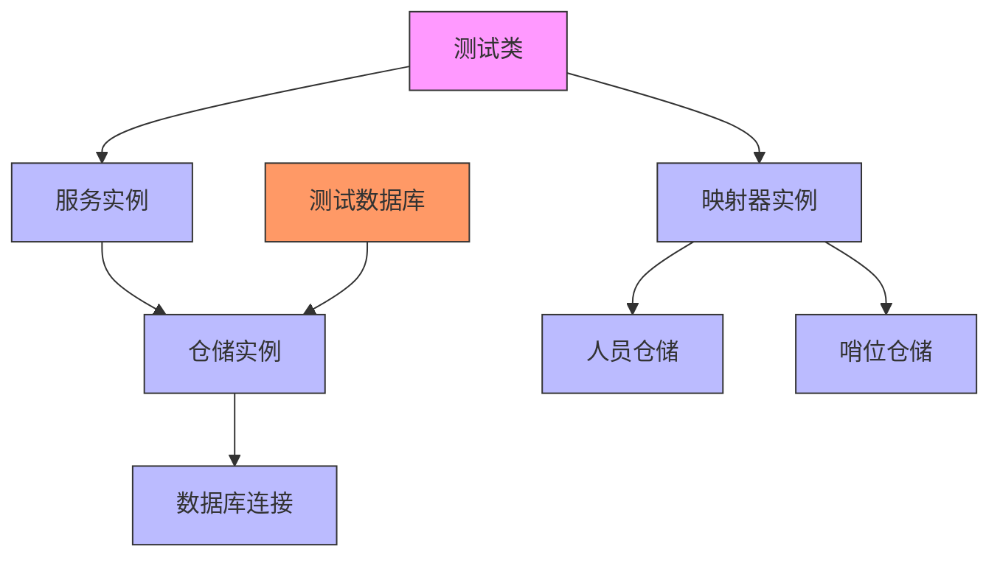
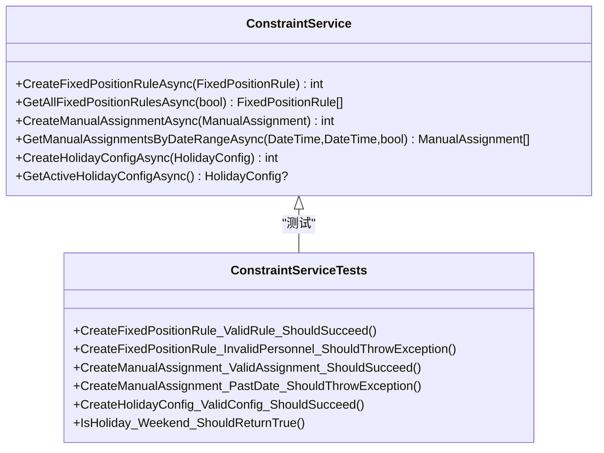
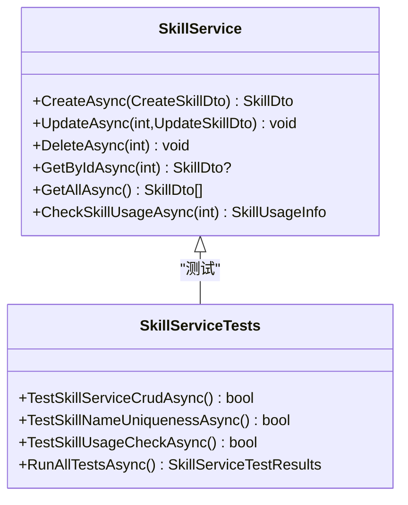
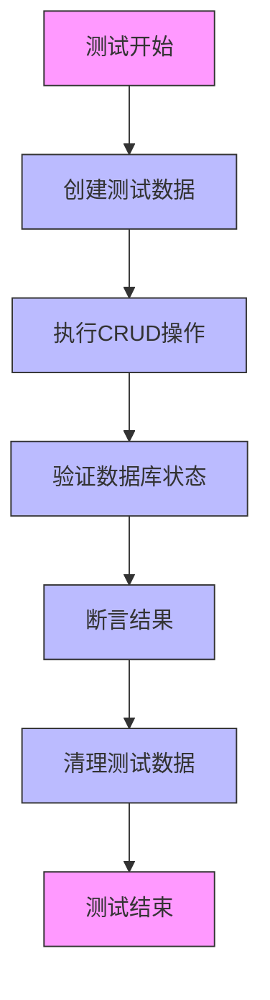
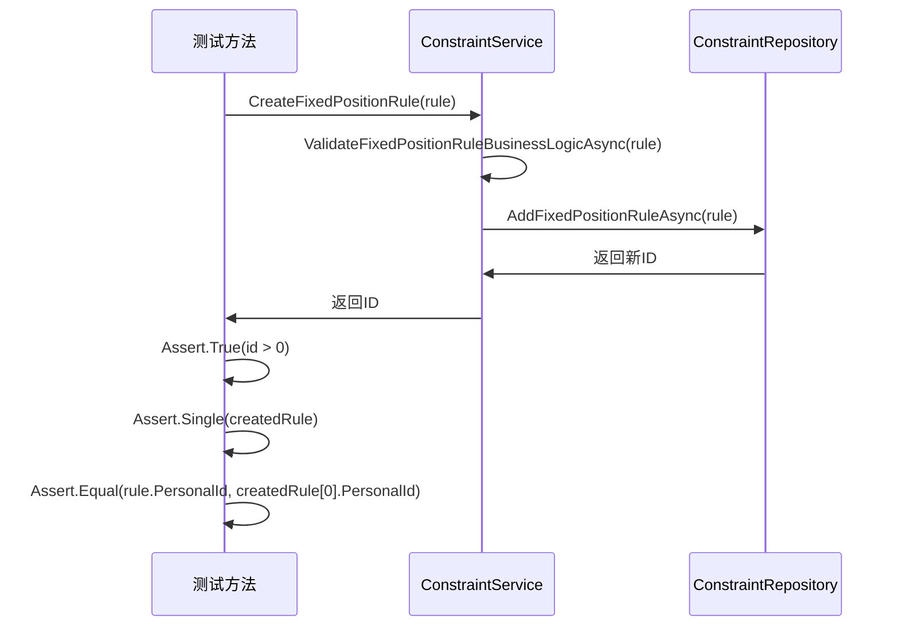
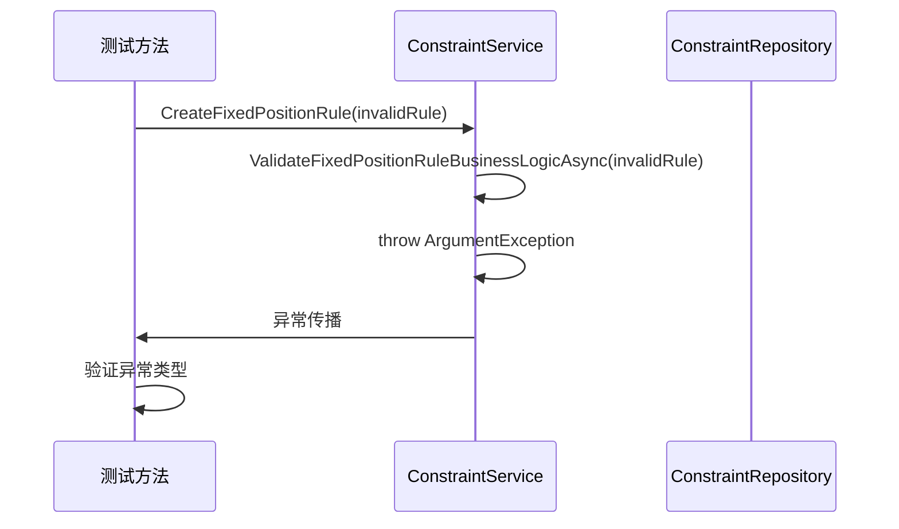

# 单元测试

<cite>
**本文档中引用的文件**   
- [ConstraintServiceTests.cs](file://Tests/ConstraintServiceTests.cs)
- [SkillServiceTests.cs](file://Tests/SkillServiceTests.cs)
- [ConstraintService.cs](file://Services/ConstraintService.cs)
- [SkillService.cs](file://Services/SkillService.cs)
- [ConstraintRepository.cs](file://Data/ConstraintRepository.cs)
- [SkillRepository.cs](file://Data/SkillRepository.cs)
- [ConstraintMapper.cs](file://DTOs/Mappers/ConstraintMapper.cs)
- [SkillMapper.cs](file://DTOs/Mappers/SkillMapper.cs)
</cite>

## 目录
1. [简介](#简介)
2. [测试架构与依赖注入](#测试架构与依赖注入)
3. [业务服务测试分析](#业务服务测试分析)
4. [数据访问层测试](#数据访问层测试)
5. [测试用例设计模式](#测试用例设计模式)
6. [断言与异常验证](#断言与异常验证)
7. [测试覆盖率与边界条件](#测试覆盖率与边界条件)
8. [最佳实践与命名规范](#最佳实践与命名规范)
9. [结论](#结论)

## 简介
本文档深入分析自动排班系统中的单元测试实现，重点解析`ConstraintServiceTests`和`SkillServiceTests`文件中针对业务服务和数据访问层的测试用例设计。文档说明了如何使用断言验证服务逻辑的正确性，如何通过模拟依赖实现隔离测试，以及测试用例与核心功能（如人员管理、技能校验）的映射关系。同时提供编写单元测试的最佳实践，包括测试命名规范、边界条件覆盖和异常路径测试。

## 测试架构与依赖注入

**图示来源**
- [ConstraintServiceTests.cs](file://Tests/ConstraintServiceTests.cs#L20-L519)
- [SkillServiceTests.cs](file://Tests/SkillServiceTests.cs#L13-L193)

**测试初始化与依赖管理**
在`ConstraintServiceTests`和`SkillServiceTests`中，测试类通过构造函数初始化测试环境，创建临时数据库并注入所有依赖项。这种设计确保了测试的独立性和可重复性，每个测试都在干净的数据库状态下运行。

**Section sources**
- [ConstraintServiceTests.cs](file://Tests/ConstraintServiceTests.cs#L20-L519)
- [SkillServiceTests.cs](file://Tests/SkillServiceTests.cs#L13-L193)

## 业务服务测试分析

### 约束服务测试
`ConstraintServiceTests`类全面测试了约束管理服务的各个功能模块，包括定岗规则、手动指定和休息日配置的CRUD操作。测试用例通过创建有效的业务对象并验证返回结果来确保服务逻辑的正确性。

**图示来源**
- [ConstraintService.cs](file://Services/ConstraintService.cs#L15-L364)
- [ConstraintServiceTests.cs](file://Tests/ConstraintServiceTests.cs#L20-L519)

### 技能服务测试
`SkillServiceTests`类专注于技能管理服务的测试，验证了技能的创建、读取、更新、删除（CRUD）操作，以及业务规则验证。测试特别关注技能名称的唯一性约束和技能使用情况检查。

**图示来源**
- [SkillService.cs](file://Services/SkillService.cs#L14-L253)
- [SkillServiceTests.cs](file://Tests/SkillServiceTests.cs#L13-L193)

**Section sources**
- [ConstraintServiceTests.cs](file://Tests/ConstraintServiceTests.cs#L20-L519)
- [SkillServiceTests.cs](file://Tests/SkillServiceTests.cs#L13-L193)
- [ConstraintService.cs](file://Services/ConstraintService.cs#L15-L364)
- [SkillService.cs](file://Services/SkillService.cs#L14-L253)

## 数据访问层测试

### 仓储层测试策略
虽然项目中没有专门的仓储测试文件，但`ConstraintServiceTests`和`SkillServiceTests`通过集成测试间接验证了数据访问层的功能。测试通过创建、读取、更新和删除操作来验证仓储的CRUD功能。

**图示来源**
- [ConstraintRepository.cs](file://Data/ConstraintRepository.cs#L15-L400)
- [SkillRepository.cs](file://Data/SkillRepository.cs#L15-L259)

### 数据完整性验证
测试用例验证了数据的完整性和一致性，包括外键约束、数据类型验证和业务规则强制执行。例如，在创建定岗规则时，系统会验证关联的人员和哨位是否存在。

**Section sources**
- [ConstraintRepository.cs](file://Data/ConstraintRepository.cs#L15-L400)
- [SkillRepository.cs](file://Data/SkillRepository.cs#L15-L259)

## 测试用例设计模式

### 组织结构与分组
测试用例按照功能模块进行组织，使用`#region`指令将相关的测试方法分组。这种结构提高了测试代码的可读性和可维护性。

```mermaid
flowchart TD
A[ConstraintServiceTests] --> B[定岗规则测试]
A --> C[手动指定测试]
A --> D[休息日配置测试]
A --> E[DTO方法测试]
A --> F[业务规则验证测试]
B --> B1[CreateFixedPositionRule_ValidRule_ShouldSucceed]
B --> B2[CreateFixedPositionRule_InvalidPersonnel_ShouldThrowException]
B --> B3[GetFixedPositionRulesByPerson_ValidPersonnel_ShouldReturnRules]
C --> C1[CreateManualAssignment_ValidAssignment_ShouldSucceed]
C --> C2[CreateManualAssignment_PastDate_ShouldThrowException]
C --> C3[CreateManualAssignment_InvalidTimeSlot_ShouldThrowException]
D --> D1[CreateHolidayConfig_ValidConfig_ShouldSucceed]
D --> D2[IsHoliday_Weekend_ShouldReturnTrue]
D --> D3[IsHoliday_LegalHoliday_ShouldReturnTrue]
D --> D4[IsHoliday_ExcludedDate_ShouldReturnFalse]
style A fill:#f9f,stroke:#333
style B fill:#bbf,stroke:#333
style C fill:#bbf,stroke:#333
style D fill:#bbf,stroke:#333
style E fill:#bbf,stroke:#333
style F fill:#bbf,stroke:#333
```

**图示来源**
- [ConstraintServiceTests.cs](file://Tests/ConstraintServiceTests.cs#L20-L519)

### 测试方法命名规范
测试方法采用清晰的命名约定，通常遵循"MethodName_Scenario_ExpectedResult"的模式。这种命名方式使测试意图一目了然，便于理解测试的目的和预期结果。

**Section sources**
- [ConstraintServiceTests.cs](file://Tests/ConstraintServiceTests.cs#L20-L519)
- [SkillServiceTests.cs](file://Tests/SkillServiceTests.cs#L13-L193)

## 断言与异常验证

### 成功路径测试
对于正常操作，测试使用`Assert.True`、`Assert.Single`、`Assert.Equal`等断言来验证操作结果。例如，创建定岗规则后，验证返回的ID大于0，并且数据库中存在相应的记录。

**图示来源**
- [ConstraintServiceTests.cs](file://Tests/ConstraintServiceTests.cs#L65-L80)
- [ConstraintService.cs](file://Services/ConstraintService.cs#L45-L50)
- [ConstraintRepository.cs](file://Data/ConstraintRepository.cs#L75-L95)

### 异常路径测试
对于无效输入或违反业务规则的情况，测试使用`Assert.ThrowsAsync`来验证系统是否正确抛出预期的异常。这确保了系统的健壮性和错误处理能力。

**图示来源**
- [ConstraintServiceTests.cs](file://Tests/ConstraintServiceTests.cs#L85-L95)
- [ConstraintService.cs](file://Services/ConstraintService.cs#L225-L240)

**Section sources**
- [ConstraintServiceTests.cs](file://Tests/ConstraintServiceTests.cs#L65-L95)
- [ConstraintService.cs](file://Services/ConstraintService.cs#L45-L50)
- [ConstraintRepository.cs](file://Data/ConstraintRepository.cs#L75-L95)

## 测试覆盖率与边界条件

### 业务规则验证
测试用例覆盖了各种业务规则的验证，包括：
- 人员和哨位的存在性验证
- 时段序号的有效性（0-11）
- 日期不能是过去的日期
- 人员技能与哨位要求的匹配
- 休息日配置的完整性验证

### 边界条件测试
测试特别关注边界条件，如：
- 创建不存在人员的定岗规则
- 为过去日期创建手动指定
- 使用无效的时段序号
- 创建同名技能
- 删除被使用的技能

这些测试确保系统在各种边界情况下都能正确处理。

**Section sources**
- [ConstraintServiceTests.cs](file://Tests/ConstraintServiceTests.cs#L20-L519)
- [SkillServiceTests.cs](file://Tests/SkillServiceTests.cs#L13-L193)

## 最佳实践与命名规范

### 测试结构最佳实践
项目中的单元测试遵循了以下最佳实践：
1. **测试隔离**：每个测试在独立的数据库实例中运行，避免测试间的相互影响
2. **测试数据准备**：在测试开始前创建必要的测试数据
3. **资源清理**：在测试结束后清理创建的资源，确保测试环境的清洁
4. **清晰的测试命名**：使用描述性的方法名，明确表达测试场景和预期结果

### 命名规范
测试方法命名遵循一致的模式，通常包括：
- 被测试的方法名
- 测试场景描述
- 预期结果

例如：`CreateFixedPositionRule_ValidRule_ShouldSucceed`清楚地表明这是对`CreateFixedPositionRule`方法的测试，场景是有效规则，预期结果是成功。

**Section sources**
- [ConstraintServiceTests.cs](file://Tests/ConstraintServiceTests.cs#L20-L519)
- [SkillServiceTests.cs](file://Tests/SkillServiceTests.cs#L13-L193)

## 结论
本项目的单元测试实现展示了高质量的测试实践，通过全面的测试用例覆盖了业务服务和数据访问层的关键功能。测试设计注重可读性、可维护性和完整性，使用清晰的命名规范和组织结构。测试不仅验证了正常操作路径，还充分覆盖了异常路径和边界条件，确保了系统的健壮性和可靠性。通过依赖注入和测试隔离，测试代码保持了高内聚低耦合的特点，为系统的持续演进提供了坚实的基础。