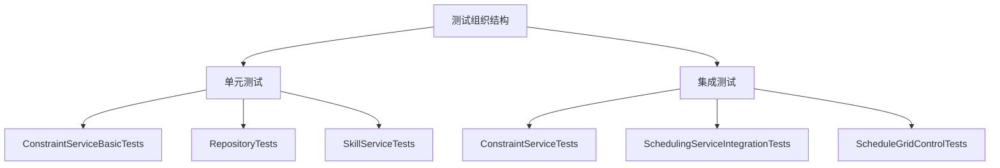
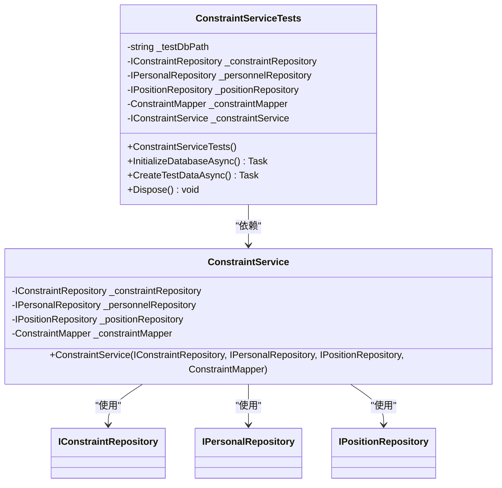
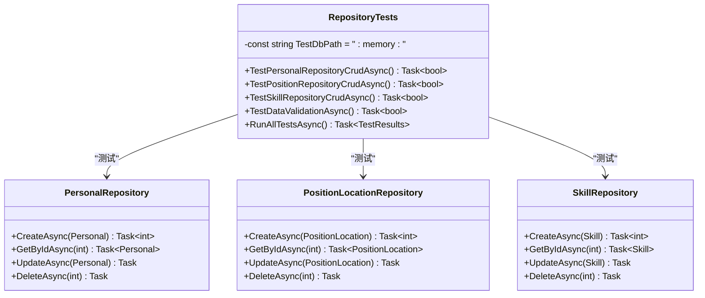
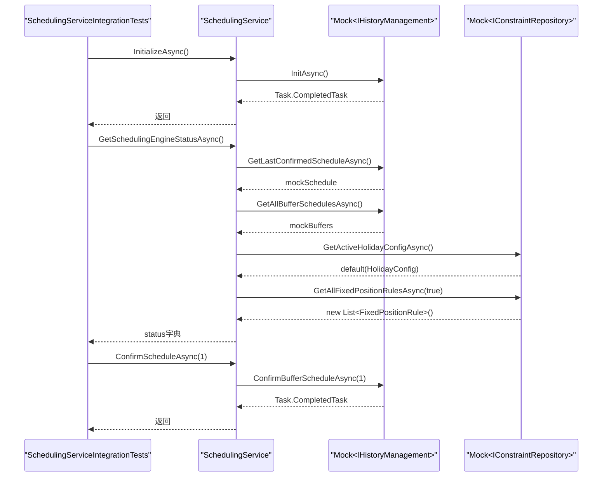
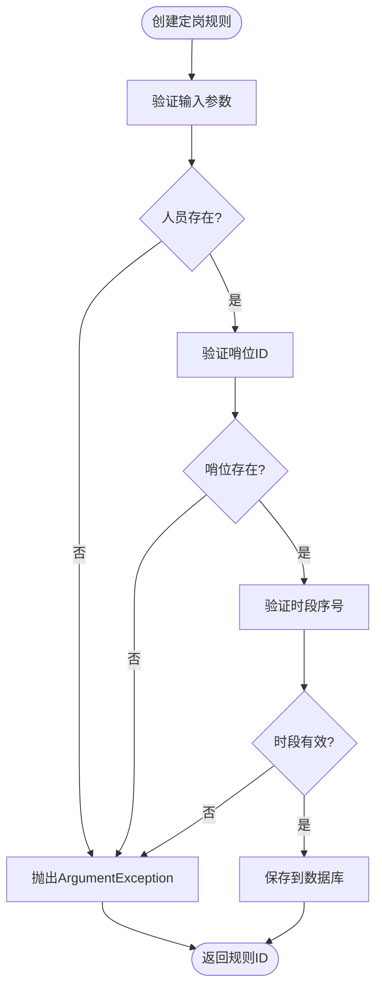

# 测试策略

<cite>
**本文档引用的文件**   
- [ConstraintServiceTests.cs](file://Tests/ConstraintServiceTests.cs)
- [RepositoryTests.cs](file://Tests/RepositoryTests.cs)
- [SchedulingServiceIntegrationTests.cs](file://Tests/SchedulingServiceIntegrationTests.cs)
- [ConstraintServiceBasicTests.cs](file://Tests/ConstraintServiceBasicTests.cs)
- [ConstraintService.cs](file://Services/ConstraintService.cs)
- [ConstraintRepository.cs](file://Data/ConstraintRepository.cs)
- [SchedulingService.cs](file://Services/SchedulingService.cs)
- [SchedulingRepository.cs](file://Data/SchedulingRepository.cs)
- [HIstoryManagement.cs](file://History/HIstoryManagement.cs)
- [GreedyScheduler.cs](file://SchedulingEngine/GreedyScheduler.cs)
- [ConstraintValidator.cs](file://SchedulingEngine/Core/ConstraintValidator.cs)
</cite>

## 目录
1. [引言](#引言)
2. [测试组织结构](#测试组织结构)
3. [核心测试组件分析](#核心测试组件分析)
4. [单元测试分析](#单元测试分析)
5. [集成测试分析](#集成测试分析)
6. [测试覆盖范围与方法](#测试覆盖范围与方法)
7. [测试运行指南](#测试运行指南)
8. [代码覆盖率分析](#代码覆盖率分析)
9. [测试编写规范与示例](#测试编写规范与示例)
10. [结论](#结论)

## 引言
本测试策略文档系统性地分析了自动排班系统的测试实现，重点关注`ConstraintServiceTests`、`RepositoryTests`和`SchedulingServiceIntegrationTests`等核心测试文件。文档详细阐述了单元测试和集成测试的组织结构，解释了如何通过测试验证核心业务逻辑和算法的正确性。同时，提供了完整的测试运行指南、代码覆盖率分析方法，并为贡献者提供了编写新测试的规范和示例，旨在确保系统的高质量和可靠性。

## 测试组织结构
项目的测试组织结构清晰地分为单元测试和集成测试两大类，分别位于`Tests`目录下。单元测试专注于验证单个类或方法的正确性，而集成测试则验证多个组件协同工作的行为。这种分层结构有助于隔离问题，提高测试的可维护性和可读性。



**图源**
- [Tests/ConstraintServiceBasicTests.cs](file://Tests/ConstraintServiceBasicTests.cs#L1-L189)
- [Tests/RepositoryTests.cs](file://Tests/RepositoryTests.cs#L1-L224)
- [Tests/SchedulingServiceIntegrationTests.cs](file://Tests/SchedulingServiceIntegrationTests.cs#L1-L314)

**本节来源**
- [Tests/ConstraintServiceBasicTests.cs](file://Tests/ConstraintServiceBasicTests.cs#L1-L189)
- [Tests/RepositoryTests.cs](file://Tests/RepositoryTests.cs#L1-L224)
- [Tests/SchedulingServiceIntegrationTests.cs](file://Tests/SchedulingServiceIntegrationTests.cs#L1-L314)

## 核心测试组件分析
核心测试组件包括`ConstraintServiceTests`、`RepositoryTests`和`SchedulingServiceIntegrationTests`，它们分别负责验证约束管理服务、数据访问层和排班服务的核心功能。这些组件通过模拟真实场景和边界条件，确保系统在各种情况下都能正确运行。

### 约束服务测试分析
`ConstraintServiceTests`是约束管理服务的主要测试类，它通过创建临时测试数据库来隔离测试环境，确保测试的独立性和可重复性。测试类初始化时会创建测试数据，包括人员和哨位，为后续的测试用例提供基础。



**图源**
- [Tests/ConstraintServiceTests.cs](file://Tests/ConstraintServiceTests.cs#L20-L519)
- [Services/ConstraintService.cs](file://Services/ConstraintService.cs#L1-L364)

**本节来源**
- [Tests/ConstraintServiceTests.cs](file://Tests/ConstraintServiceTests.cs#L20-L519)
- [Services/ConstraintService.cs](file://Services/ConstraintService.cs#L1-L364)

### 数据访问层测试分析
`RepositoryTests`类负责测试数据访问层的CRUD操作，包括人员、哨位和技能的创建、读取、更新和删除。测试使用内存数据库（`:memory:`）来提高执行速度，并验证数据的完整性和一致性。



**图源**
- [Tests/RepositoryTests.cs](file://Tests/RepositoryTests.cs#L11-L202)
- [Data/PersonalRepository.cs](file://Data/PersonalRepository.cs#L1-L50)
- [Data/PositionLocationRepository.cs](file://Data/PositionLocationRepository.cs#L1-L50)
- [Data/SkillRepository.cs](file://Data/SkillRepository.cs#L1-L50)

**本节来源**
- [Tests/RepositoryTests.cs](file://Tests/RepositoryTests.cs#L11-L202)

### 排班服务集成测试分析
`SchedulingServiceIntegrationTests`使用Moq库对依赖项进行模拟，验证排班服务与其他组件的集成。测试覆盖了排班服务的初始化、状态获取、草稿排班获取、排班确认流程、统计信息获取、批量确认和过期草稿清理等关键功能。



**图源**
- [Tests/SchedulingServiceIntegrationTests.cs](file://Tests/SchedulingServiceIntegrationTests.cs#L17-L241)
- [Services/SchedulingService.cs](file://Services/SchedulingService.cs#L1-L750)

**本节来源**
- [Tests/SchedulingServiceIntegrationTests.cs](file://Tests/SchedulingServiceIntegrationTests.cs#L17-L241)
- [Services/SchedulingService.cs](file://Services/SchedulingService.cs#L1-L750)

## 单元测试分析
单元测试主要验证单个类或方法的内部逻辑，确保其在各种输入条件下都能正确执行。`ConstraintServiceBasicTests`和`RepositoryTests`是典型的单元测试，它们通过断言来验证方法的输出是否符合预期。

### 约束服务基础测试
`ConstraintServiceBasicTests`验证了`ConstraintService`类的基本功能，包括接口实现、属性正确性和业务逻辑。测试用例覆盖了定岗规则、手动指定和休息日配置的创建、更新和删除操作。

**本节来源**
- [Tests/ConstraintServiceBasicTests.cs](file://Tests/ConstraintServiceBasicTests.cs#L1-L189)

### 数据访问层测试
`RepositoryTests`验证了数据访问层的CRUD操作，确保数据能够正确地存储和检索。测试还验证了数据的完整性和一致性，例如检查创建的人员是否具有正确的属性值。

**本节来源**
- [Tests/RepositoryTests.cs](file://Tests/RepositoryTests.cs#L1-L224)

## 集成测试分析
集成测试验证多个组件协同工作的行为，确保系统作为一个整体能够正确运行。`SchedulingServiceIntegrationTests`是典型的集成测试，它通过模拟依赖项来验证排班服务的功能。

### 排班服务集成测试
`SchedulingServiceIntegrationTests`验证了排班服务的初始化、状态获取、草稿排班获取、排班确认流程、统计信息获取、批量确认和过期草稿清理等关键功能。测试使用Moq库对依赖项进行模拟，确保测试的独立性和可重复性。

**本节来源**
- [Tests/SchedulingServiceIntegrationTests.cs](file://Tests/SchedulingServiceIntegrationTests.cs#L1-L314)

## 测试覆盖范围与方法
测试覆盖范围涵盖了系统的核心功能，包括约束管理、数据访问、排班服务和历史管理。测试方法包括单元测试、集成测试和边界条件测试，确保系统在各种情况下都能正确运行。

### 业务规则验证测试
`ConstraintServiceTests`中的业务规则验证测试确保了系统在处理无效输入时能够正确抛出异常。例如，创建定岗规则时，如果指定的人员不存在，系统会抛出`ArgumentException`。



**图源**
- [Tests/ConstraintServiceTests.cs](file://Tests/ConstraintServiceTests.cs#L350-L400)
- [Services/ConstraintService.cs](file://Services/ConstraintService.cs#L250-L300)

**本节来源**
- [Tests/ConstraintServiceTests.cs](file://Tests/ConstraintServiceTests.cs#L350-L400)
- [Services/ConstraintService.cs](file://Services/ConstraintService.cs#L250-L300)

### DTO方法测试
`ConstraintServiceTests`中的DTO方法测试验证了服务层如何通过DTO与UI层进行交互。测试确保了通过DTO创建的定岗规则、手动指定和休息日配置能够正确地映射到模型对象并保存到数据库。

**本节来源**
- [Tests/ConstraintServiceTests.cs](file://Tests/ConstraintServiceTests.cs#L250-L300)

## 测试运行指南
要运行项目中的测试，请使用支持xUnit和MSTest的测试框架，如Visual Studio Test Explorer或命令行工具`dotnet test`。确保所有依赖项都已正确安装，并且数据库连接字符串配置正确。

**本节来源**
- [Tests/ConstraintServiceTests.cs](file://Tests/ConstraintServiceTests.cs#L1-L519)
- [Tests/RepositoryTests.cs](file://Tests/RepositoryTests.cs#L1-L224)
- [Tests/SchedulingServiceIntegrationTests.cs](file://Tests/SchedulingServiceIntegrationTests.cs#L1-L314)

## 代码覆盖率分析
代码覆盖率分析是衡量测试完整性的重要指标。建议使用工具如Coverlet或Visual Studio的代码覆盖率功能来分析测试覆盖率。目标是达到80%以上的行覆盖率和分支覆盖率。

**本节来源**
- [Tests/ConstraintServiceTests.cs](file://Tests/ConstraintServiceTests.cs#L1-L519)
- [Tests/RepositoryTests.cs](file://Tests/RepositoryTests.cs#L1-L224)
- [Tests/SchedulingServiceIntegrationTests.cs](file://Tests/SchedulingServiceIntegrationTests.cs#L1-L314)

## 测试编写规范与示例
编写新测试时，应遵循以下规范：
1. 使用`[Fact]`或`[TestMethod]`属性标记测试方法。
2. 测试方法名应清晰地描述测试的场景和预期结果。
3. 使用`Assert`类进行断言，确保测试的可读性和可维护性。
4. 对于集成测试，使用模拟库（如Moq）来隔离依赖项。

```csharp
[Fact]
public async Task CreateFixedPositionRule_ValidRule_ShouldSucceed()
{
    // Arrange
    var rule = new FixedPositionRule
    {
        PersonalId = 1,
        AllowedPositionIds = new List<int> { 1, 2 },
        AllowedPeriods = new List<int> { 0, 1, 2 },
        IsEnabled = true,
        Description = "测试定岗规则"
    };

    // Act
    var id = await _constraintService.CreateFixedPositionRuleAsync(rule);

    // Assert
    Assert.True(id > 0);
    var createdRule = await _constraintRepository.GetAllFixedPositionRulesAsync();
    Assert.Single(createdRule);
    Assert.Equal(rule.PersonalId, createdRule[0].PersonalId);
}
```

**本节来源**
- [Tests/ConstraintServiceTests.cs](file://Tests/ConstraintServiceTests.cs#L50-L100)

## 结论
本测试策略文档全面分析了自动排班系统的测试实现，涵盖了测试组织结构、核心测试组件、测试覆盖范围、测试运行指南和代码覆盖率分析。通过遵循本文档中的规范和示例，贡献者可以有效地编写和维护高质量的测试，确保系统的稳定性和可靠性。