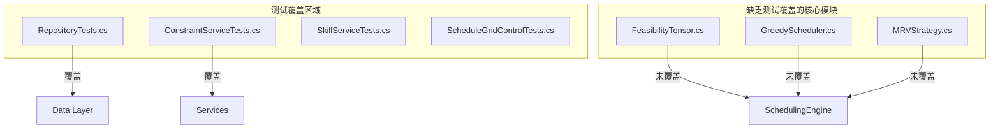
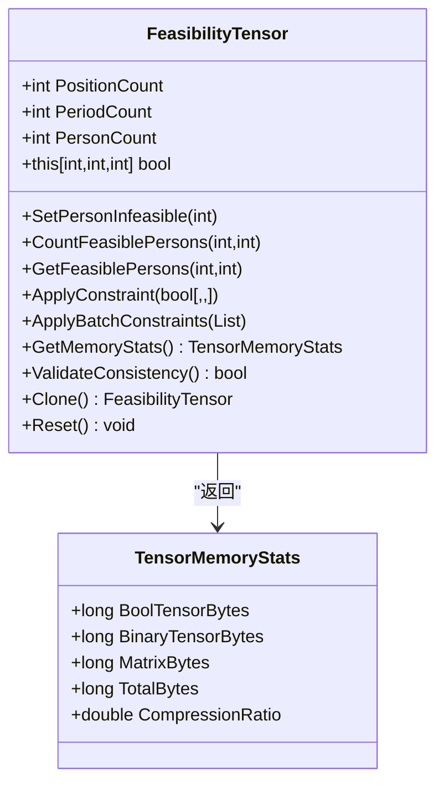
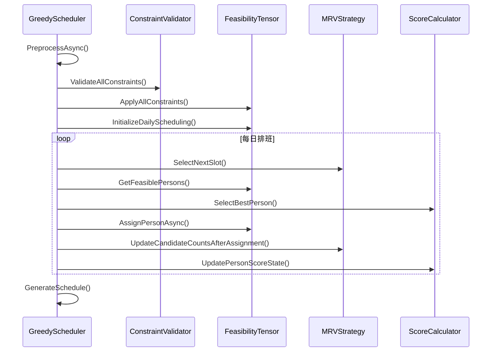
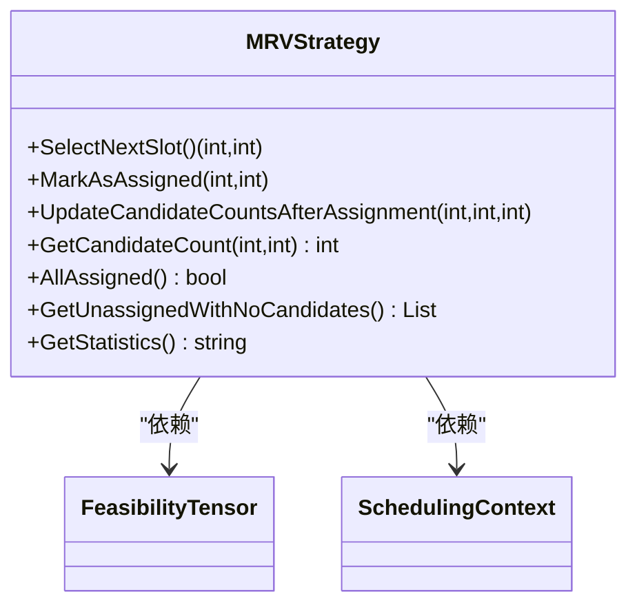

# 测试覆盖率分析

<cite>
**Referenced Files in This Document**   
- [FeasibilityTensor.cs](file://SchedulingEngine/Core/FeasibilityTensor.cs)
- [GreedyScheduler.cs](file://SchedulingEngine/GreedyScheduler.cs)
- [MRVStrategy.cs](file://SchedulingEngine/Strategies/MRVStrategy.cs)
- [README.md](file://README.md)
- [ARCHITECTURE_IMPLEMENTATION_SUMMARY.md](file://ARCHITECTURE_IMPLEMENTATION_SUMMARY.md)
</cite>

## 目录
1. [引言](#引言)
2. [项目结构与测试现状](#项目结构与测试现状)
3. [核心模块测试覆盖分析](#核心模块测试覆盖分析)
4. [测试覆盖率工具与报告生成](#测试覆盖率工具与报告生成)
5. [优先补充测试的模块清单](#优先补充测试的模块清单)
6. [高价值测试用例设计建议](#高价值测试用例设计建议)
7. [结论](#结论)

## 引言

本报告旨在系统性地评估当前自动排班系统（AutoScheduling3）的代码覆盖率，重点分析核心调度引擎模块的测试覆盖情况。通过对项目实现的深入分析，识别出缺乏充分测试覆盖的关键模块，如`SchedulingEngine`、`FeasibilityTensor`等。报告将说明如何使用工具生成和解读覆盖率报告，制定提升策略，并提供优先补充测试的模块清单及高价值测试用例的设计建议，以确保系统的稳定性和可靠性。

## 项目结构与测试现状

根据项目结构分析，当前测试套件主要集中在数据访问层和基础服务层，而核心的调度算法模块缺乏充分的测试覆盖。



**Diagram sources**
- [FeasibilityTensor.cs](file://SchedulingEngine/Core/FeasibilityTensor.cs)
- [GreedyScheduler.cs](file://SchedulingEngine/GreedyScheduler.cs)
- [MRVStrategy.cs](file://SchedulingEngine/Strategies/MRVStrategy.cs)

**Section sources**
- [README.md](file://README.md)
- [ARCHITECTURE_IMPLEMENTATION_SUMMARY.md](file://ARCHITECTURE_IMPLEMENTATION_SUMMARY.md)

## 核心模块测试覆盖分析

### SchedulingEngine 模块分析

`SchedulingEngine`模块是整个系统的核心，负责执行排班算法。该模块包含`GreedyScheduler`、`FeasibilityTensor`和`MRVStrategy`等关键组件。通过对代码的分析，发现这些核心组件目前没有对应的单元测试。

#### FeasibilityTensor 组件分析

`FeasibilityTensor`类实现了三维可行性张量，用于快速判断分配方案的可行性。该类包含多种优化策略，如二进制存储和矩阵运算，但这些关键功能均缺乏测试覆盖。



**Diagram sources**
- [FeasibilityTensor.cs](file://SchedulingEngine/Core/FeasibilityTensor.cs)

**Section sources**
- [FeasibilityTensor.cs](file://SchedulingEngine/Core/FeasibilityTensor.cs)

#### GreedyScheduler 组件分析

`GreedyScheduler`类实现了基于MRV启发式策略的贪心排班算法。该类负责协调`FeasibilityTensor`和`MRVStrategy`，执行完整的排班流程，但目前没有测试覆盖。



**Diagram sources**
- [GreedyScheduler.cs](file://SchedulingEngine/GreedyScheduler.cs)

**Section sources**
- [GreedyScheduler.cs](file://SchedulingEngine/GreedyScheduler.cs)

#### MRVStrategy 组件分析

`MRVStrategy`类实现了最小剩余值（Minimum Remaining Values）启发式策略，用于选择候选人员最少的分配位置。该策略对算法的效率和成功率至关重要，但目前缺乏测试验证。



**Diagram sources**
- [MRVStrategy.cs](file://SchedulingEngine/Strategies/MRVStrategy.cs)

**Section sources**
- [MRVStrategy.cs](file://SchedulingEngine/Strategies/MRVStrategy.cs)

## 测试覆盖率工具与报告生成

### .NET 测试覆盖率工具

对于C#项目，推荐使用以下工具生成测试覆盖率报告：

1. **Coverlet**: 一个跨平台的代码覆盖率框架，可与xUnit、NUnit等测试框架集成。
2. **ReportGenerator**: 将Coverlet生成的覆盖率报告转换为易于阅读的HTML格式。
3. **Visual Studio 内置工具**: Visual Studio Enterprise版本提供代码覆盖率分析功能。

### 覆盖率报告生成步骤

1. **安装工具包**：
   ```bash
   dotnet add package coverlet.collector
   dotnet add package coverlet.msbuild
   ```

2. **运行测试并生成覆盖率报告**：
   ```bash
   dotnet test --collect:"XPlat Code Coverage" --settings coverlet.runsettings
   ```

3. **生成HTML报告**：
   ```bash
   reportgenerator "-reports:coverage.cobertura.xml" "-targetdir:coveragereport" "-reporttypes:Html"
   ```

### 关键指标解读

- **行覆盖率（Line Coverage）**：执行的代码行数占总代码行数的比例。目标应达到80%以上。
- **分支覆盖率（Branch Coverage）**：执行的分支（如if/else）占总分支数的比例。目标应达到70%以上。
- **方法覆盖率（Method Coverage）**：执行的方法数占总方法数的比例。

高覆盖率并不意味着高质量的测试，但低覆盖率一定意味着存在未测试的代码路径。

## 优先补充测试的模块清单

基于对项目结构和核心功能的分析，以下是需要优先补充测试的模块清单：

| 模块 | 优先级 | 原因 |
|------|--------|------|
| `FeasibilityTensor` | 高 | 核心数据结构，影响所有排班决策 |
| `GreedyScheduler` | 高 | 主调度算法，系统核心逻辑 |
| `MRVStrategy` | 中 | 关键启发式策略，影响算法效率 |
| `ConstraintValidator` | 中 | 硬约束验证，确保排班合法性 |
| `ScoreCalculator` | 中 | 软约束评分，影响排班质量 |

## 高价值测试用例设计建议

### FeasibilityTensor 测试用例

1. **构造函数验证**：验证张量初始化后所有位置是否均为可行状态。
2. **约束应用测试**：验证`ApplyConstraint`和`ApplyBatchConstraints`方法正确应用约束。
3. **优化功能测试**：验证二进制存储和矩阵运算的正确性和一致性。
4. **边界条件测试**：测试极端情况下的行为，如空约束、全约束等。

### GreedyScheduler 测试用例

1. **完整排班流程测试**：验证`ExecuteAsync`方法能正确生成排班表。
2. **手动指定测试**：验证`ApplyManualAssignmentsForDate`能正确处理手动分配。
3. **约束验证测试**：验证`ApplyAllConstraints`能正确应用所有硬约束。
4. **异常处理测试**：验证在各种异常情况下（如取消、无解）的健壮性。

### MRVStrategy 测试用例

1. **选择策略测试**：验证`SelectNextSlot`能正确选择候选人员最少的位置。
2. **状态更新测试**：验证`UpdateCandidateCountsAfterAssignment`能正确更新候选计数。
3. **无解检测测试**：验证`GetUnassignedWithNoCandidates`能正确识别无解位置。

## 结论

当前测试套件对核心调度引擎模块的覆盖严重不足，特别是`FeasibilityTensor`、`GreedyScheduler`和`MRVStrategy`等关键组件。建议立即使用Coverlet等工具生成覆盖率报告，明确测试缺口，并优先为上述模块补充高价值的单元测试。通过系统性的测试覆盖提升，可以显著提高系统的可靠性和可维护性，为后续功能扩展奠定坚实基础。