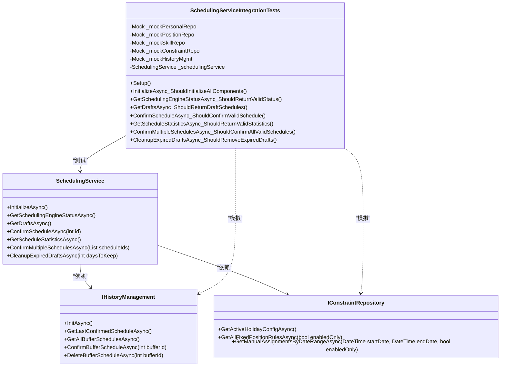
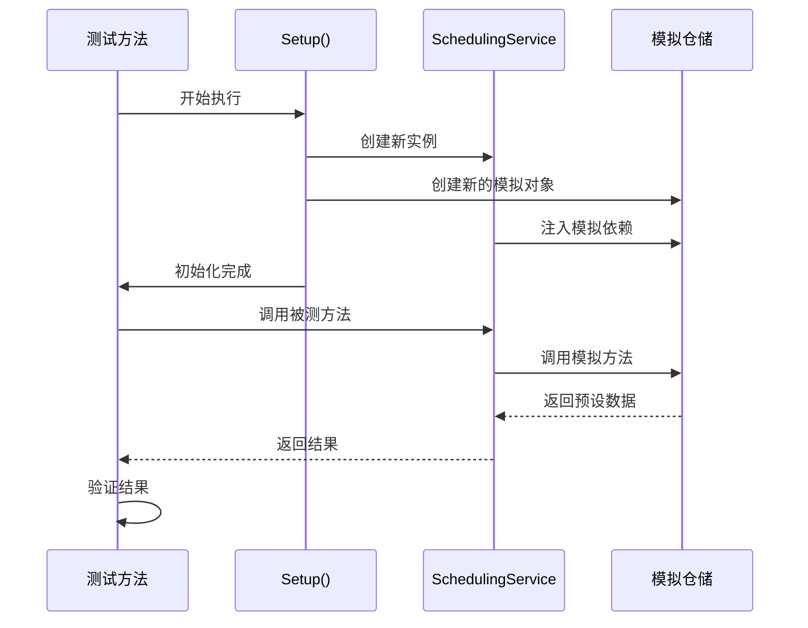
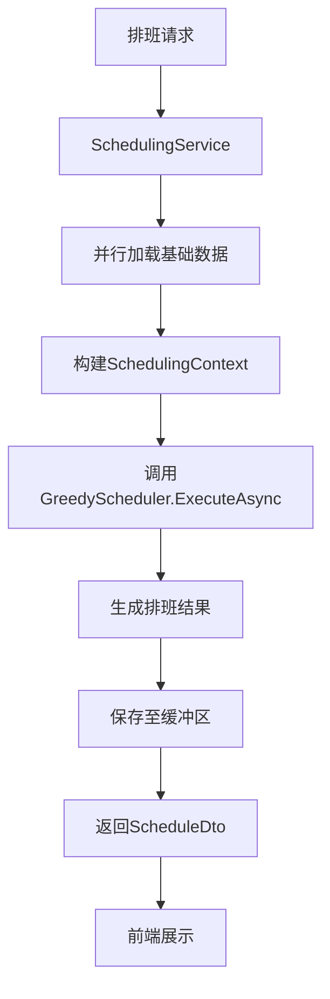

# 集成测试

<cite>
**本文档中引用的文件**  
- [SchedulingServiceIntegrationTests.cs](file://Tests/SchedulingServiceIntegrationTests.cs)
- [SchedulingService.cs](file://Services/SchedulingService.cs)
- [SchedulingRepository.cs](file://Data/SchedulingRepository.cs)
- [DatabaseService.cs](file://Data/DatabaseService.cs)
- [GreedyScheduler.cs](file://SchedulingEngine/GreedyScheduler.cs)
- [Schedule.cs](file://Models/Schedule.cs)
- [ScheduleDto.cs](file://DTOs/ScheduleDto.cs)
</cite>

## 目录
1. [引言](#引言)
2. [集成测试设计与实现](#集成测试设计与实现)
3. [测试数据准备机制](#测试数据准备机制)
4. [事务回滚与状态隔离](#事务回滚与状态隔离)
5. [真实调用场景模拟](#真实调用场景模拟)
6. [排班算法稳定性验证](#排班算法稳定性验证)
7. [新增集成测试指南](#新增集成测试指南)
8. [常见陷阱与规避方法](#常见陷阱与规避方法)

## 引言
本项目中的集成测试旨在验证排班服务（SchedulingService）在实际运行环境中与数据库、约束管理、人员数据等核心组件之间的端到端交互。通过 `SchedulingServiceIntegrationTests` 类，系统性地测试了排班服务的初始化、状态查询、草稿管理、确认流程、统计功能及过期清理等关键业务场景。这些测试确保了排班算法在复杂依赖环境下的稳定性与数据一致性，为系统的可靠运行提供了坚实保障。

## 集成测试设计与实现
`SchedulingServiceIntegrationTests` 类采用单元测试框架（Microsoft.VisualStudio.TestTools.UnitTesting）和模拟库（Moq）对 `SchedulingService` 进行集成测试。该测试类通过模拟其所有依赖项（如 `IPersonalRepository`、`IConstraintRepository` 等），构建一个可控的测试环境，从而专注于验证 `SchedulingService` 本身的业务逻辑和与其他组件的交互。

测试的核心在于验证 `SchedulingService` 如何协调其依赖组件来完成复杂的业务流程。例如，在 `ConfirmScheduleAsync_ShouldConfirmValidSchedule` 测试中，它不仅验证了服务能否成功调用 `IHistoryManagement` 的确认方法，还验证了在确认前对排班数据的业务规则检查。



**图示来源**
- [SchedulingServiceIntegrationTests.cs](file://Tests/SchedulingServiceIntegrationTests.cs#L17-L313)
- [SchedulingService.cs](file://Services/SchedulingService.cs#L19-L749)

**节来源**
- [SchedulingServiceIntegrationTests.cs](file://Tests/SchedulingServiceIntegrationTests.cs#L17-L313)
- [SchedulingService.cs](file://Services/SchedulingService.cs#L19-L749)

## 测试数据准备机制
集成测试中的数据准备主要通过 Moq 框架的 `Setup` 方法完成。测试用例在 `Arrange` 阶段预先配置好模拟对象的行为，使其在被调用时返回预设的测试数据。

例如，在 `GetDraftsAsync_ShouldReturnDraftSchedules` 测试中，通过以下代码准备了模拟的草稿排班数据：
```csharp
var mockSchedule = new Schedule { /* 初始化测试数据 */ };
var mockBuffers = new List<(Schedule, DateTime, int)> { (mockSchedule, DateTime.UtcNow, 1) };
_mockHistoryMgmt.Setup(h => h.GetAllBufferSchedulesAsync()).ReturnsAsync(mockBuffers);
```
这种方式确保了测试的可重复性和独立性，避免了对真实数据库的依赖。测试数据被精心构造以覆盖各种边界情况和业务规则，如空列表、过期数据、无效ID等。

**节来源**
- [SchedulingServiceIntegrationTests.cs](file://Tests/SchedulingServiceIntegrationTests.cs#L17-L313)

## 事务回滚与状态隔离
本项目的集成测试本身不直接操作真实数据库，因此不涉及传统意义上的数据库事务回滚。其状态隔离是通过 **依赖注入和模拟对象** 实现的。

每个测试方法在执行前都会通过 `[TestInitialize]` 标记的 `Setup` 方法重新创建 `SchedulingService` 实例及其所有依赖的模拟对象。这确保了每个测试都在一个全新的、干净的状态下运行，前一个测试的执行结果不会影响后续测试。



**图示来源**
- [SchedulingServiceIntegrationTests.cs](file://Tests/SchedulingServiceIntegrationTests.cs#L45-L58)

**节来源**
- [SchedulingServiceIntegrationTests.cs](file://Tests/SchedulingServiceIntegrationTests.cs#L45-L58)

## 真实调用场景模拟
测试通过模拟真实的服务调用链来验证端到端交互。`SchedulingService` 作为业务逻辑的协调者，会依次调用多个仓储和管理服务。

以 `ConfirmScheduleAsync` 方法为例，其真实调用场景如下：
1.  服务首先从 `IHistoryManagement` 获取所有草稿排班。
2.  根据传入的ID查找对应的草稿。
3.  调用 `ValidateScheduleForConfirmationAsync` 进行业务规则验证，此过程会查询 `IConstraintRepository` 和 `IPersonalRepository`。
4.  最终调用 `IHistoryManagement.ConfirmBufferScheduleAsync` 完成确认。

集成测试通过验证 `Mock` 对象的 `Verify` 方法，确保这些调用按预期发生。例如，`_mockHistoryMgmt.Verify(h => h.ConfirmBufferScheduleAsync(1), Times.Once);` 断言了确认方法被精确调用一次。

**节来源**
- [SchedulingServiceIntegrationTests.cs](file://Tests/SchedulingServiceIntegrationTests.cs#L17-L313)
- [SchedulingService.cs](file://Services/SchedulingService.cs#L19-L749)

## 排班算法稳定性验证
集成测试通过验证 `SchedulingService` 的输入输出来间接确保排班算法的稳定性。虽然 `GreedyScheduler` 的核心算法在单元测试中进行验证，但集成测试关注的是算法在真实服务环境中的集成表现。

`SchedulingService` 在 `ExecuteSchedulingAsync` 中调用 `GreedyScheduler`，集成测试通过验证 `SchedulingService` 的其他接口（如获取草稿、统计信息）来确认排班结果被正确地持久化和检索。例如，`GetScheduleStatisticsAsync_ShouldReturnValidStatistics` 测试验证了服务能正确地从历史和草稿中聚合统计数据，这依赖于排班结果被正确地存储在 `Schedules` 和 `SingleShifts` 表中。



**图示来源**
- [SchedulingService.cs](file://Services/SchedulingService.cs#L78-L178)
- [GreedyScheduler.cs](file://SchedulingEngine/GreedyScheduler.cs#L38-L118)

**节来源**
- [SchedulingService.cs](file://Services/SchedulingService.cs#L78-L178)

## 新增集成测试指南
要为 `SchedulingService` 添加新的集成测试，请遵循以下步骤：

1.  **确定测试场景**：明确要测试的业务功能，例如新增一个“导出排班”功能的测试。
2.  **创建测试方法**：在 `SchedulingServiceIntegrationTests` 类中添加一个用 `[TestMethod]` 标记的新方法。
3.  **准备测试数据**：在 `Arrange` 阶段使用 Moq 的 `Setup` 方法配置所有依赖项的预期行为。
4.  **执行操作**：在 `Act` 阶段调用 `SchedulingService` 的目标方法。
5.  **验证结果**：在 `Assert` 阶段使用断言（如 `Assert.IsNotNull`, `Assert.AreEqual`）验证返回结果，并使用 `Verify` 方法验证模拟对象的交互次数和参数。

**节来源**
- [SchedulingServiceIntegrationTests.cs](file://Tests/SchedulingServiceIntegrationTests.cs#L17-L313)

## 常见陷阱与规避方法
在编写此类集成测试时，需注意以下常见陷阱：

| 陷阱 | 描述 | 规避方法 |
| :--- | :--- | :--- |
| **过度模拟** | 模拟了过多的内部实现细节，导致测试脆弱。 | 专注于模拟接口行为，而非具体实现。测试应验证“做什么”，而非“如何做”。 |
| **测试数据不完整** | 忽略了某些依赖项的返回值，导致 `NullReferenceException`。 | 仔细分析被测方法的代码路径，确保所有可能被调用的依赖方法都已正确 `Setup`。 |
| **验证不足** | 只验证了返回值，未验证服务与依赖项的交互。 | 使用 `Verify` 方法检查关键的依赖调用，确保业务流程正确执行。 |
| **测试耦合** | 测试之间共享状态，导致执行顺序影响结果。 | 确保 `Setup` 方法在每个测试前重置所有模拟对象和被测实例，保持测试独立。 |

**节来源**
- [SchedulingServiceIntegrationTests.cs](file://Tests/SchedulingServiceIntegrationTests.cs#L17-L313)