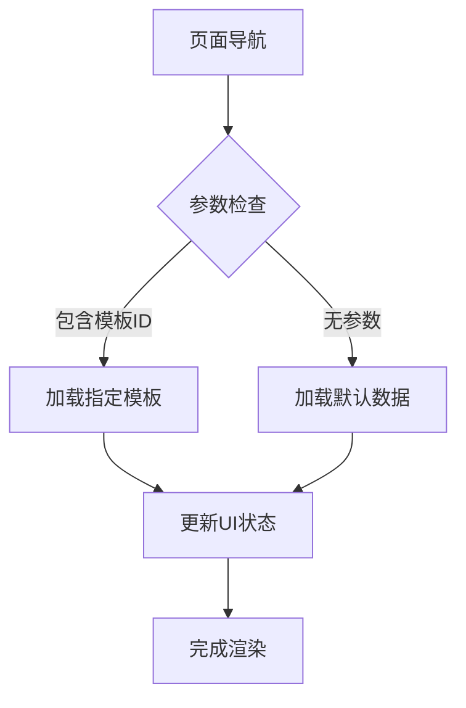
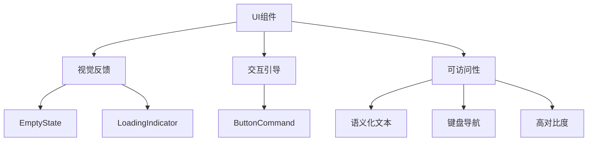

# 用户界面组件

<cite>
**本文档引用的文件**  
- [EmptyState.xaml.cs](file://Controls/EmptyState.xaml.cs)
- [LoadingIndicator.xaml.cs](file://Controls/LoadingIndicator.xaml.cs)
- [BoolToVisibilityConverter.cs](file://Converters/BoolToVisibilityConverter.cs)
- [DateTimeFormatConverter.cs](file://Converters/DateTimeFormatConverter.cs)
- [CreateSchedulingPage.xaml.cs](file://Views/Scheduling/CreateSchedulingPage.xaml.cs)
- [PersonnelPage.xaml.cs](file://Views/DataManagement/PersonnelPage.xaml.cs)
- [HistoryPage.xaml.cs](file://Views/History/HistoryPage.xaml.cs)
</cite>

## 目录
1. [简介](#简介)
2. [页面布局与导航结构](#页面布局与导航结构)
3. 通用控件详解
   - [空状态控件 (EmptyState)](#空状态控件-emptystate)
   - [加载指示器 (LoadingIndicator)](#加载指示器-loadingindicator)
4. 值转换器实现与应用
   - [布尔值到可见性转换器 (BoolToVisibilityConverter)](#布尔值到可见性转换器-booltovisibilityconverter)
   - [日期时间格式转换器 (DateTimeFormatConverter)](#日期时间格式转换器-datetimeformatconverter)
5. [UI组件可视化指南与可访问性](#ui组件可视化指南与可访问性)
6. [结论](#结论)

## 简介
本项目采用现代WPF/WinUI架构设计用户界面，通过模块化页面与可复用控件实现高效、一致的用户体验。核心UI组件分布在`Views`和`Controls`目录中，结合MVVM模式实现数据驱动的界面更新。值转换器（Converters）用于桥接数据模型与UI展示逻辑，提升绑定灵活性。

## 页面布局与导航结构

项目中的页面遵循一致的初始化与数据加载模式，通过依赖注入获取视图模型，并在导航时触发数据加载。

**Diagram sources**  
- [CreateSchedulingPage.xaml.cs](file://Views/Scheduling/CreateSchedulingPage.xaml.cs#L15-L40)

**空状态控件 (EmptyState)**

`EmptyState`控件用于在数据为空时提供友好的视觉提示，支持自定义图标、标题、副标题及操作按钮。

- **IsVisible**: 控制控件的显示与隐藏，绑定后自动切换`Visibility`属性
- **IconGlyph**: 显示的图标Unicode字符，默认为"\uE825"
- **Title**: 主标题文本，默认为"暂无数据"
- **Subtitle**: 副标题文本，默认为"您还没有添加任何内容。"
- **ButtonText**: 操作按钮显示文本
- **ButtonCommand**: 按钮点击命令，用于触发添加或刷新操作

该控件通过`OnIsVisibleChanged`回调实现属性变更的响应式更新。

**Section sources**  
- [EmptyState.xaml.cs](file://Controls/EmptyState.xaml.cs#L7-L67)

## 加载指示器 (LoadingIndicator)

`LoadingIndicator`控件用于在数据加载过程中提供视觉反馈，避免界面卡顿感。

- **IsLoading**: 控制加载状态的布尔值，`true`时显示，`false`时隐藏
- **Text**: 加载时显示的提示文本，默认为"正在加载中..."

与`EmptyState`类似，通过依赖属性变更回调`OnIsLoadingChanged`控制`Visibility`。

**Section sources**  
- [LoadingIndicator.xaml.cs](file://Controls/LoadingIndicator.xaml.cs#L5-L35)

## 布尔值到可见性转换器 (BoolToVisibilityConverter)

该转换器将布尔值转换为`Visibility`枚举，支持逻辑反转。

- **Inverted 属性**: 可在XAML中直接设置，反转转换逻辑
- **"Inverse" 参数**: 在绑定表达式中传入参数实现临时反转
- **Convert 方法**: 根据`Inverted`和参数决定输出`Visible`或`Collapsed`
- **ConvertBack 方法**: 支持双向绑定，将`Visibility`转回布尔值

典型应用场景：根据`IsLoading`属性控制`LoadingIndicator`的显示。

**Section sources**  
- [BoolToVisibilityConverter.cs](file://Converters/BoolToVisibilityConverter.cs#L10-L40)

## 日期时间格式转换器 (DateTimeFormatConverter)

该转换器用于格式化`DateTime`或`DateTimeOffset`类型的显示。

- **默认格式**: "yyyy-MM-dd HH:mm"
- **参数支持**: 可通过绑定参数传入自定义格式字符串
- **Convert 方法**: 支持`DateTime`和`DateTimeOffset`类型，返回格式化字符串
- **ConvertBack 方法**: 将字符串解析为`DateTime`，失败时返回`DateTime.MinValue`

适用于时间戳显示、日程时间展示等场景。

**Section sources**  
- [DateTimeFormatConverter.cs](file://Converters/DateTimeFormatConverter.cs#L8-L49)

## UI组件可视化指南与可访问性

### 可视化原则
- **一致性**: 所有页面使用统一的空状态和加载控件
- **反馈及时**: 数据加载与空状态有明确视觉反馈
- **操作引导**: `EmptyState`提供按钮引导用户进行下一步操作

### 可访问性考虑
- **语义化文本**: `Title`和`Subtitle`提供清晰的状态描述
- **命令绑定**: 按钮使用`ICommand`确保键盘可访问
- **高对比度**: 图标与文本具备足够对比度
- **屏幕阅读器支持**: 通过`AutomationProperties`可进一步增强（需在XAML中配置）

**Diagram sources**  
- [EmptyState.xaml.cs](file://Controls/EmptyState.xaml.cs#L7-L67)
- [LoadingIndicator.xaml.cs](file://Controls/LoadingIndicator.xaml.cs#L5-L35)

## 结论

本项目的用户界面组件设计遵循高内聚、低耦合原则，通过自定义控件和值转换器实现了UI逻辑的复用与解耦。`EmptyState`和`LoadingIndicator`提供了统一的用户体验，而`BoolToVisibilityConverter`和`DateTimeFormatConverter`增强了数据绑定的灵活性。建议在后续开发中继续遵循此模式，确保界面一致性与可维护性。