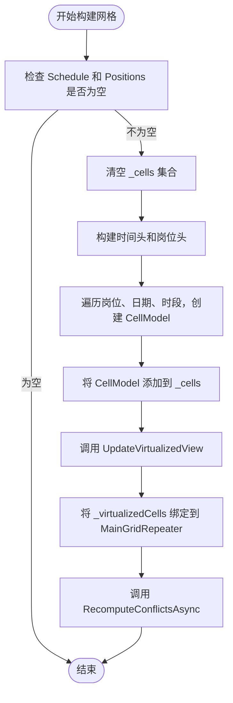
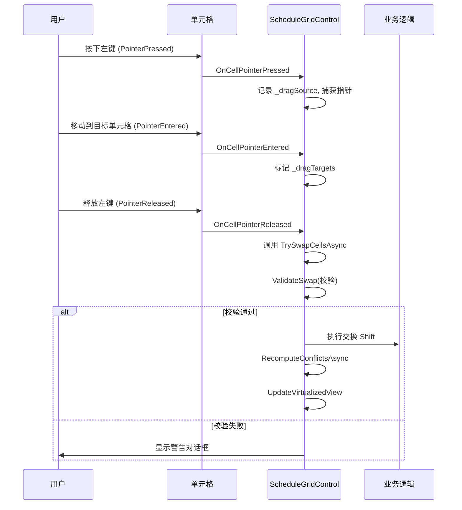

# 自定义控件

<cite>
**本文档引用的文件**  
- [EmptyState.xaml.cs](file://Controls/EmptyState.xaml.cs)
- [ErrorState.xaml.cs](file://Controls/ErrorState.xaml.cs)
- [LoadingIndicator.xaml.cs](file://Controls/LoadingIndicator.xaml.cs)
- [PersonnelCard.xaml.cs](file://Controls/PersonnelCard.xaml.cs)
- [PositionCard.xaml.cs](file://Controls/PositionCard.xaml.cs)
- [ScheduleGridControl.xaml.cs](file://Controls/ScheduleGridControl.xaml.cs)
- [ScheduleDto.cs](file://DTOs/ScheduleDto.cs)
- [CellModel.cs](file://Controls/CellModel.cs)
</cite>

## 目录
1. [简介](#简介)
2. [空状态与错误状态控件](#空状态与错误状态控件)
3. [加载指示器](#加载指示器)
4. [人员与岗位卡片](#人员与岗位卡片)
5. [排班网格控件](#排班网格控件)
6. [集成示例](#集成示例)

## 简介
本文档深入解析了自动排班系统中的核心自定义UI控件，涵盖其视觉呈现、交互行为、数据绑定机制及在实际页面中的集成方式。重点分析了EmptyState、ErrorState、LoadingIndicator、PersonnelCard、PositionCard以及核心的ScheduleGridControl控件的实现细节。

## 空状态与错误状态控件

### EmptyState 空状态控件
`EmptyState`控件用于在数据为空时提供清晰的视觉反馈和操作引导。

**视觉呈现与交互行为**：
- **可见性控制**：通过`IsVisible`依赖属性控制控件的显示与隐藏，当值为`true`时，控件显示，否则隐藏。
- **图标与文本**：支持自定义图标（`IconGlyph`）、主标题（`Title`）和副标题（`Subtitle`），默认文本为“暂无数据”和“您还没有添加任何内容。”。
- **操作按钮**：可配置按钮文本（`ButtonText`）和点击命令（`ButtonCommand`），为用户提供直接的操作入口，如“添加数据”。

**使用方式**：
该控件通常作为数据列表或网格的占位符，当数据源为空时，将其`IsVisible`属性绑定为`true`，并可设置`ButtonCommand`以响应用户的添加操作。

**Section sources**
- [EmptyState.xaml.cs](file://Controls/EmptyState.xaml.cs#L7-L67)

### ErrorState 错误状态控件
`ErrorState`控件用于在数据加载失败或发生异常时向用户传达错误信息。

**视觉呈现与交互行为**：
- **可见性控制**：通过`IsVisible`依赖属性控制显示与隐藏。
- **错误信息**：包含主标题（`Title`，默认“加载失败”）、详细信息（`Message`，默认“发生了一个错误，请重试。”）。
- **操作按钮**：提供“重试”按钮（`RetryButtonText`）和对应的命令（`RetryCommand`），以及可选的“详情”按钮（`DetailsButtonText`和`DetailsCommand`）用于展示更详细的错误日志。

**使用方式**：
在数据加载逻辑中，捕获异常后，将`ErrorState`的`IsVisible`设为`true`，并可设置`RetryCommand`以重新执行加载操作。

**Section sources**
- [ErrorState.xaml.cs](file://Controls/ErrorState.xaml.cs#L6-L81)

## 加载指示器

### LoadingIndicator 加载指示器
`LoadingIndicator`控件为异步操作提供视觉反馈，告知用户系统正在处理中。

**动画机制**：
- **可见性控制**：通过`IsLoading`依赖属性控制其激活状态。当`IsLoading`为`true`时，控件显示并启动内置的旋转动画；为`false`时，控件隐藏。
- **文本提示**：可通过`Text`属性自定义加载时的提示文本，默认为“正在加载中...”。

**异步操作集成模式**：
该控件的`IsLoading`属性通常与ViewModel中的异步操作状态进行双向绑定。例如，在发起网络请求前，将`IsLoading`设为`true`，请求完成后（无论成功或失败）再设为`false`。

**Section sources**
- [LoadingIndicator.xaml.cs](file://Controls/LoadingIndicator.xaml.cs#L5-L35)

## 人员与岗位卡片

### PersonnelCard 人员卡片
`PersonnelCard`控件用于展示人员信息，如姓名、岗位、技能和状态。

**数据模板设计与复用策略**：
- **数据绑定**：通过`Personnel`依赖属性绑定`PersonnelDto`数据模型，实现信息的动态展示。
- **状态指示**：利用`BoolToBrushConverter`和`BoolToTextConverter`等转换器，将`IsActive`和`IsAvailable`布尔值转换为对应的背景色和文本（如“在职/离职”、“可用/忙碌”）。
- **技能标签**：使用`ItemsRepeater`动态生成技能标签，每个标签的背景色由`AccentFillColorDefaultBrush`统一定义，确保视觉一致性。

**交互行为**：
- **悬停与选中**：通过`PointerEntered`和`PointerExited`事件监听鼠标悬停，并结合`Composition API`实现平滑的阴影抬升动画（`UpdateHoverAnimation`）。`IsSelected`属性的变化也会触发相同的动画，以突出选中状态。
- **操作面板**：`ShowActions`属性控制底部“编辑”和“删除”按钮的显示与隐藏。

**Section sources**
- [PersonnelCard.xaml.cs](file://Controls/PersonnelCard.xaml.cs#L10-L86)
- [PersonnelCard.xaml](file://Controls/PersonnelCard.xaml#L1-L55)

### PositionCard 岗位卡片
`PositionCard`控件用于展示岗位信息，如名称、位置、技能要求和描述。

**数据模板设计与复用策略**：
- **数据绑定**：通过`Position`依赖属性绑定`PositionDto`数据模型。
- **技能要求**：与`PersonnelCard`类似，使用`ItemsRepeater`动态生成技能要求标签，复用相同的视觉样式。
- **布局复用**：其XAML布局与`PersonnelCard`高度相似，体现了UI组件的复用设计原则，降低了维护成本。

**交互行为**：
- **悬停与选中**：实现机制与`PersonnelCard`完全相同，共享`UpdateHoverAnimation`的动画逻辑，确保了交互体验的一致性。

**Section sources**
- [PositionCard.xaml.cs](file://Controls/PositionCard.xaml.cs#L9-L83)
- [PositionCard.xaml](file://Controls/PositionCard.xaml#L1-L51)

## 排班网格控件

### ScheduleGridControl 核心排班视图
`ScheduleGridControl`是系统的核心视图，用于展示和编辑排班数据。

#### 网格布局算法
- **数据结构**：内部维护一个`_cells`集合，每个`CellModel`代表一个班次单元格，包含`Date`、`Position`和`PeriodIndex`三个维度。
- **构建逻辑**：`BuildGrid`方法遍历所有岗位（`Positions`）和日期（`Schedule`的起止日期范围），为每个岗位-日期-时段组合创建一个`CellModel`，并根据`Schedule.Shifts`数据填充`Shift`信息。
- **虚拟化**：为支持大数据集，实现了基于`ItemsRepeater`的虚拟化。`_virtualizedCells`集合仅包含当前可视区域内的单元格，通过`UpdateVirtualizedView`方法根据滚动偏移量和视口大小动态更新。

**Diagram sources**
- [ScheduleGridControl.xaml.cs](file://Controls/ScheduleGridControl.xaml.cs#L21-L357)

#### 时间轴渲染逻辑
- **时间头**：`_timeHeaders`集合存储了12个时段的文本（如"00:00-02:00"），通过`ItemsRepeater`（`TimeHeaderRepeater`）水平渲染。
- **岗位头**：`_positionHeaders`集合存储了所有岗位的名称，通过`ItemsRepeater`（`PositionHeaderRepeater`）垂直渲染。
- **单元格**：`CellDataTemplate`定义了单元格的外观，包括人员姓名、ID和冲突指示器（小圆点）。

**Section sources**
- [ScheduleGridControl.xaml](file://Controls/ScheduleGridControl.xaml#L1-L153)

#### 拖拽交互实现
- **拖拽状态**：`_dragSource`记录拖拽源单元格，`_dragTargets`记录当前悬停的目标单元格。
- **事件处理**：
  - `OnCellPointerPressed`：检测到左键按下时，记录`_dragSource`并捕获指针。
  - `OnCellPointerEntered`：当指针进入其他单元格且存在`_dragSource`时，标记该单元格为`_dragTargets`。
  - `OnCellPointerReleased`：释放时，调用`TrySwapCellsAsync`尝试交换源和目标单元格的人员分配。
- **交换验证**：`ValidateSwap`方法在交换前进行校验，包括技能匹配、定岗规则和夜间班次唯一性等，确保排班的合理性。

**Diagram sources**
- [ScheduleGridControl.xaml.cs](file://Controls/ScheduleGridControl.xaml.cs#L21-L357)

## 集成示例
以下是在`SchedulingViewModel`中集成`ScheduleGridControl`的典型方式：

1.  **数据绑定**：将ViewModel中的`ScheduleDto`和`Positions`集合绑定到控件的对应属性。
2.  **事件订阅**：订阅`ShiftChanged`和`ConflictsRecomputed`事件，以响应排班变更。
3.  **状态管理**：在加载数据时，通过`LoadingIndicator`显示加载状态；数据为空时，`EmptyState`自动显示。

**Section sources**
- [ScheduleGridControl.xaml.cs](file://Controls/ScheduleGridControl.xaml.cs#L21-L704)
- [ScheduleDto.cs](file://DTOs/ScheduleDto.cs#L10-L81)
- [CellModel.cs](file://Controls/CellModel.cs#L8-L122)