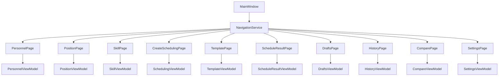
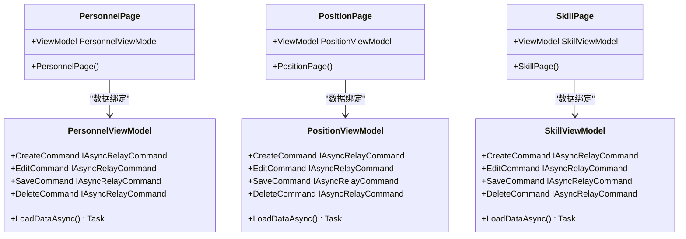
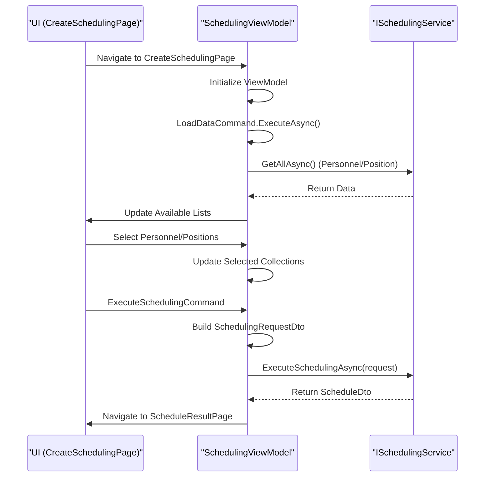
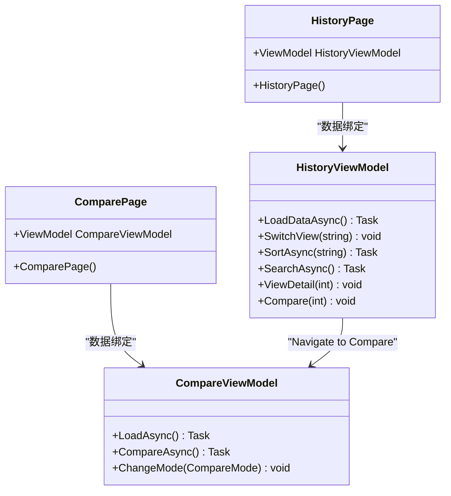
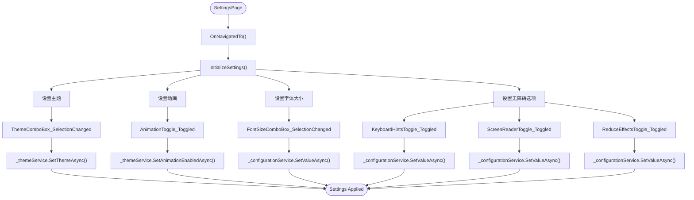
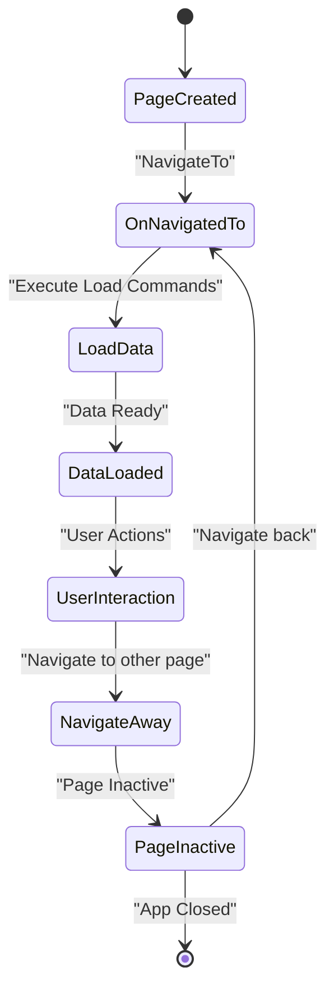
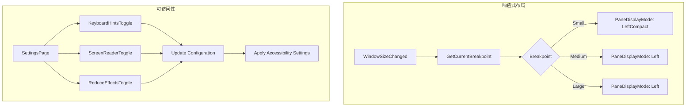
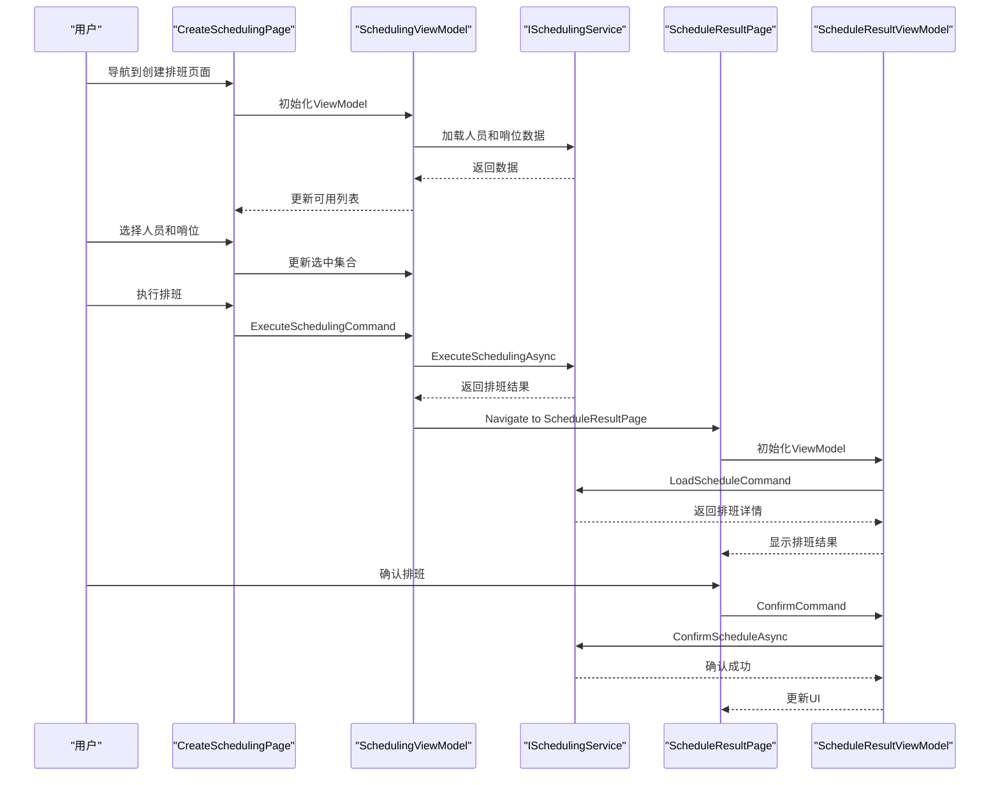

# 页面结构

<cite>
**本文档引用的文件**   
- [NavigationService.cs](file://Helpers/NavigationService.cs)
- [App.xaml.cs](file://App.xaml.cs)
- [MainWindow.xaml.cs](file://MainWindow.xaml.cs)
- [PersonnelPage.xaml.cs](file://Views/DataManagement/PersonnelPage.xaml.cs)
- [PositionPage.xaml.cs](file://Views/DataManagement/PositionPage.xaml.cs)
- [SkillPage.xaml.cs](file://Views/DataManagement/SkillPage.xaml.cs)
- [HistoryPage.xaml.cs](file://Views/History/HistoryPage.xaml.cs)
- [ComparePage.xaml.cs](file://Views/History/ComparePage.xaml.cs)
- [CreateSchedulingPage.xaml.cs](file://Views/Scheduling/CreateSchedulingPage.xaml.cs)
- [DraftsPage.xaml.cs](file://Views/Scheduling/DraftsPage.xaml.cs)
- [ScheduleResultPage.xaml.cs](file://Views/Scheduling/ScheduleResultPage.xaml.cs)
- [TemplatePage.xaml.cs](file://Views/Scheduling/TemplatePage.xaml.cs)
- [SettingsPage.xaml.cs](file://Views/Settings/SettingsPage.xaml.cs)
- [PersonnelViewModel.cs](file://ViewModels/DataManagement/PersonnelViewModel.cs)
- [PositionViewModel.cs](file://ViewModels/DataManagement/PositionViewModel.cs)
- [SkillViewModel.cs](file://ViewModels/DataManagement/SkillViewModel.cs)
- [HistoryViewModel.cs](file://ViewModels/History/HistoryViewModel.cs)
- [CompareViewModel.cs](file://ViewModels/History/CompareViewModel.cs)
- [SchedulingViewModel.cs](file://ViewModels/Scheduling/SchedulingViewModel.cs)
- [DraftsViewModel.cs](file://ViewModels/Scheduling/DraftsViewModel.cs)
- [ScheduleResultViewModel.cs](file://ViewModels/Scheduling/ScheduleResultViewModel.cs)
- [TemplateViewModel.cs](file://ViewModels/Scheduling/TemplateViewModel.cs)
</cite>

## 目录
1. [简介](#简介)
2. [页面结构与导航逻辑](#页面结构与导航逻辑)
3. [核心功能模块分析](#核心功能模块分析)
4. [页面生命周期管理](#页面生命周期管理)
5. [响应式布局与可访问性](#响应式布局与可访问性)
6. [典型交互场景](#典型交互场景)
7. [结论](#结论)

## 简介

本系统采用MVVM架构模式，实现了数据管理、排班、历史记录和设置四大功能模块的清晰分离。通过`NavigationService`实现统一的页面导航，所有页面均继承自`Page`类，并通过`ViewModel`进行数据绑定和业务逻辑处理。系统主窗口`MainWindow`集成了导航菜单，为用户提供直观的导航体验。

## 页面结构与导航逻辑

系统采用基于`NavigationService`的集中式导航管理，所有页面通过唯一的键进行注册和导航。

**图源**
- [MainWindow.xaml.cs](file://MainWindow.xaml.cs#L10-L50)
- [NavigationService.cs](file://Helpers/NavigationService.cs#L1-L20)

**页面结构与导航逻辑**
- [MainWindow.xaml.cs](file://MainWindow.xaml.cs#L1-L100)
- [NavigationService.cs](file://Helpers/NavigationService.cs#L1-L117)

## 核心功能模块分析

### 数据管理模块

数据管理模块包含人员、哨位和技能三个子页面，均采用统一的列表视图模式。

**图源**
- [PersonnelPage.xaml.cs](file://Views/DataManagement/PersonnelPage.xaml.cs#L7-L17)
- [PersonnelViewModel.cs](file://ViewModels/DataManagement/PersonnelViewModel.cs#L15-L241)

**数据管理模块分析**
- [PersonnelPage.xaml.cs](file://Views/DataManagement/PersonnelPage.xaml.cs#L1-L20)
- [PersonnelViewModel.cs](file://ViewModels/DataManagement/PersonnelViewModel.cs#L1-L242)

### 排班模块

排班模块是系统的核心，包含创建排班、模板管理、草稿管理和排班结果四个页面。

**图源**
- [CreateSchedulingPage.xaml.cs](file://Views/Scheduling/CreateSchedulingPage.xaml.cs#L10-L92)
- [SchedulingViewModel.cs](file://ViewModels/Scheduling/SchedulingViewModel.cs#L15-L530)

**排班模块分析**
- [CreateSchedulingPage.xaml.cs](file://Views/Scheduling/CreateSchedulingPage.xaml.cs#L1-L95)
- [SchedulingViewModel.cs](file://ViewModels/Scheduling/SchedulingViewModel.cs#L1-L533)

### 历史记录模块

历史记录模块提供排班历史的查看、对比和管理功能。

**图源**
- [HistoryPage.xaml.cs](file://Views/History/HistoryPage.xaml.cs#L6-L16)
- [HistoryViewModel.cs](file://ViewModels/History/HistoryViewModel.cs#L15-L208)

**历史记录模块分析**
- [HistoryPage.xaml.cs](file://Views/History/HistoryPage.xaml.cs#L1-L18)
- [HistoryViewModel.cs](file://ViewModels/History/HistoryViewModel.cs#L1-L219)

### 设置模块

设置模块提供应用程序的个性化配置功能。

**图源**
- [SettingsPage.xaml.cs](file://Views/Settings/SettingsPage.xaml.cs#L13-L295)
- [ConfigurationService.cs](file://Services/ConfigurationService.cs#L1-L100)

**设置模块分析**
- [SettingsPage.xaml.cs](file://Views/Settings/SettingsPage.xaml.cs#L1-L296)

## 页面生命周期管理

系统通过重写`OnNavigatedTo`方法实现页面生命周期管理，确保每次导航到页面时都能正确初始化状态。

**图源**
- [CreateSchedulingPage.xaml.cs](file://Views/Scheduling/CreateSchedulingPage.xaml.cs#L50-L55)
- [DraftsPage.xaml.cs](file://Views/Scheduling/DraftsPage.xaml.cs#L20-L24)

**页面生命周期管理**
- [CreateSchedulingPage.xaml.cs](file://Views/Scheduling/CreateSchedulingPage.xaml.cs#L1-L95)
- [DraftsPage.xaml.cs](file://Views/Scheduling/DraftsPage.xaml.cs#L1-L27)

## 响应式布局与可访问性

系统通过`ResponsiveHelper`和`AccessibilityHelper`实现响应式布局和可访问性支持。

**图源**
- [MainWindow.xaml.cs](file://MainWindow.xaml.cs#L120-L125)
- [SettingsPage.xaml.cs](file://Views/Settings/SettingsPage.xaml.cs#L200-L295)

**响应式布局与可访问性**
- [MainWindow.xaml.cs](file://MainWindow.xaml.cs#L1-L141)
- [SettingsPage.xaml.cs](file://Views/Settings/SettingsPage.xaml.cs#L1-L296)

## 典型交互场景

### 排班创建与确认流程

用户从创建排班页面开始，经过一系列步骤完成排班创建，并在结果页面确认。

**图源**
- [CreateSchedulingPage.xaml.cs](file://Views/Scheduling/CreateSchedulingPage.xaml.cs#L50-L92)
- [ScheduleResultPage.xaml.cs](file://Views/Scheduling/ScheduleResultPage.xaml.cs#L20-L34)

**典型交互场景**
- [CreateSchedulingPage.xaml.cs](file://Views/Scheduling/CreateSchedulingPage.xaml.cs#L1-L95)
- [ScheduleResultPage.xaml.cs](file://Views/Scheduling/ScheduleResultPage.xaml.cs#L1-L37)

## 结论

本系统通过清晰的MVVM架构实现了四大功能模块的页面结构设计。`NavigationService`提供了统一的导航机制，`ViewModel`与`View`通过数据绑定紧密协作。页面生命周期管理确保了状态的正确维护，响应式布局和可访问性支持提升了用户体验。各功能模块职责明确，交互流程清晰，为系统的可维护性和扩展性奠定了良好基础。