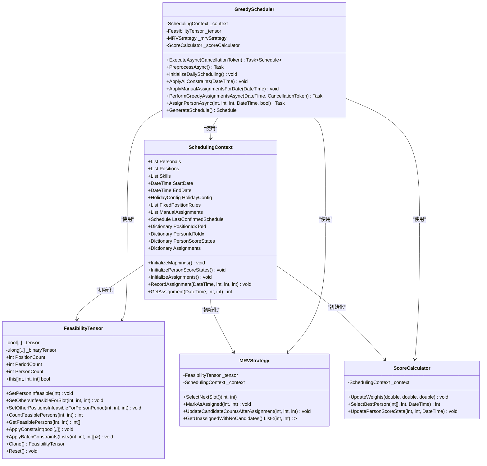

# 目录结构详解

<cite>
**本文档引用的文件**  
- [ApplicationConstants.cs](file://Constants/ApplicationConstants.cs)
- [App.xaml.cs](file://App.xaml.cs)
- [MainWindow.xaml.cs](file://MainWindow.xaml.cs)
- [DatabaseService.cs](file://Data\DatabaseService.cs)
- [SchedulingService.cs](file://Services\SchedulingService.cs)
- [GreedyScheduler.cs](file://SchedulingEngine\GreedyScheduler.cs)
- [SchedulingContext.cs](file://SchedulingEngine\Core\SchedulingContext.cs)
- [FeasibilityTensor.cs](file://SchedulingEngine\Core\FeasibilityTensor.cs)
- [ARCHITECTURE_IMPLEMENTATION_SUMMARY.md](file://ARCHITECTURE_IMPLEMENTATION_SUMMARY.md)
- [README.md](file://README.md)
</cite>

## 目录结构

1. [引言](#引言)
2. [UI相关目录](#ui相关目录)
3. [分层架构目录](#分层架构目录)
4. [核心算法模块](#核心算法模块)
5. [测试目录](#测试目录)
6. [辅助与配置目录](#辅助与配置目录)
7. [总结](#总结)

## 引言

AutoScheduling3项目是一个基于WinUI 3和MVVM模式的自动排班系统，其目录结构设计遵循了清晰的分层架构原则，旨在实现前后端解耦、职责分离和高可维护性。本文档将深入解析项目的目录结构，逐层说明每个文件夹的职责和内容，帮助开发者快速理解代码组织逻辑，定位功能代码，并掌握各层之间的依赖关系和数据流动方向。

**Section sources**
- [ARCHITECTURE_IMPLEMENTATION_SUMMARY.md](file://ARCHITECTURE_IMPLEMENTATION_SUMMARY.md#L1-L377)

## UI相关目录

### Constants
`Constants`目录存放应用程序的常量定义，避免在代码中出现“魔法数字”和硬编码字符串，提高代码的可维护性和一致性。该目录下的`ApplicationConstants.cs`文件通过嵌套的静态类组织了不同领域的常量。

- **Database**: 定义数据库相关的常量，如默认文件名、连接和命令超时时间。
- **Scheduling**: 定义排班业务的核心常量，如一天的时段数量（12个，每2小时一个）、夜哨的起止时段等。
- **UI**: 定义用户界面相关的常量，如默认页面大小、搜索延迟和动画持续时间。
- **ConfigKeys**: 定义配置项的键名，用于在配置服务中存储和读取用户偏好。
- **Paths**: 定义应用使用的文件夹路径，如日志、备份和导出文件夹。
- **ErrorMessages**: 集中管理错误消息，便于统一修改和国际化。

**Section sources**
- [ApplicationConstants.cs](file://Constants/ApplicationConstants.cs#L1-L163)

### Controls
`Controls`目录存放自定义的用户界面控件。这些控件封装了特定的UI功能和样式，可以在多个页面中复用，以保持UI的一致性。

- **EmptyState.xaml.cs**: 空状态控件，当数据列表为空时显示提示信息。
- **ErrorState.xaml.cs**: 错误状态控件，用于展示操作失败或数据加载错误的提示。
- **LoadingIndicator.xaml.cs**: 加载指示器控件，提供视觉反馈，告知用户系统正在处理中。
- **PersonnelCard.xaml.cs**: 人员信息卡片控件，以卡片形式展示人员的姓名、职位等信息。
- **PositionCard.xaml.cs**: 哨位信息卡片控件，用于展示哨位的名称、位置和要求。
- **ScheduleGridControl.xaml.cs**: 排班网格控件，是核心UI组件，用于以网格形式可视化展示排班结果。

**Section sources**
- [ARCHITECTURE_IMPLEMENTATION_SUMMARY.md](file://ARCHITECTURE_IMPLEMENTATION_SUMMARY.md#L1-L377)

### Converters
`Converters`目录存放值转换器（Value Converters），这是WPF/WinUI中用于在数据绑定时转换数据类型的类。它们实现了`IValueConverter`接口，允许在XAML中将一种数据类型转换为另一种，以适应UI显示需求。

- **BoolToBrushConverter.cs**: 将布尔值转换为画笔（Brush），例如，将`true`映射为绿色，`false`映射为红色。
- **BoolToTextConverter.cs**: 将布尔值转换为文本，如`true`转为“是”，`false`转为“否”。
- **BoolToVisibilityConverter.cs**: 将布尔值转换为可见性（Visibility），这是最常用的转换器之一，用于控制UI元素的显示和隐藏。
- **ConflictTypeToColorConverter.cs**: 将冲突类型（如“未分配”、“时段冲突”）转换为对应的颜色，用于在排班网格中高亮显示问题。
- **DateTimeFormatConverter.cs**: 将`DateTime`对象格式化为指定的字符串格式。
- **DiffTypeToColorConverter.cs**: 将差异类型转换为颜色，用于对比视图。
- **EnumEqualsToVisibilityConverter.cs**: 将枚举值与指定值比较，根据结果返回可见性。
- **IntToVisibilityConverter.cs**: 将整数转换为可见性，通常用于判断数量是否为零。
- **NullToVisibilityConverter.cs**: 将对象是否为`null`转换为可见性。
- **PeriodIndexToTimeConverter.cs**: 将时段索引（0-11）转换为具体的时间范围，如“00:00-02:00”。

**Section sources**
- [ARCHITECTURE_IMPLEMENTATION_SUMMARY.md](file://ARCHITECTURE_IMPLEMENTATION_SUMMARY.md#L1-L377)

## 分层架构目录

### DTOs
`DTOs`（Data Transfer Objects）目录存放数据传输对象，用于在不同层之间传递数据。DTO是轻量级的POCO（Plain Old CLR Object）类，只包含数据属性，不包含业务逻辑。它们解决了领域模型（Model）与UI模型之间的不匹配问题，并提供了序列化和反序列化的便利。

- **Mappers**: 该子目录包含将领域模型（Models）与DTO相互转换的映射器。例如，`PersonnelMapper.cs`负责将`Personal`模型转换为`PersonnelDto`，反之亦然。映射器通常会处理关联数据的加载，如将人员ID转换为人员姓名。
- **具体DTO文件**: 如`PersonnelDto.cs`、`PositionDto.cs`、`ScheduleDto.cs`等，定义了用于数据传输的结构。这些DTO可能包含冗余字段（如`PersonnelName`），以便UI层无需额外查询即可显示。

**Section sources**
- [ARCHITECTURE_IMPLEMENTATION_SUMMARY.md](file://ARCHITECTURE_IMPLEMENTATION_SUMMARY.md#L1-L377)

### Models
`Models`目录存放领域模型，代表了应用程序的核心业务实体和数据结构。这些类直接映射到数据库表，是数据持久化的基础。

- **Constraints**: 该子目录包含排班约束相关的模型，如`HolidayConfig.cs`（休息日配置）、`FixedPositionRule.cs`（定岗规则）和`ManualAssignment.cs`（手动指定）。
- **其他模型**: `Personal.cs`（人员）、`PositionLocation.cs`（哨位）、`Schedule.cs`（排班表）、`SingleShift.cs`（单次班次）、`Skill.cs`（技能）和`PersonScoreState.cs`（人员评分状态）。

**Section sources**
- [README.md](file://README.md#L1-L285)

### Data
`Data`目录是数据访问层，负责与SQLite数据库进行交互，执行CRUD（创建、读取、更新、删除）操作。它遵循Repository模式，通过接口定义契约，实现类提供具体的数据访问逻辑。

- **Interfaces**: 定义了所有Repository的接口，如`IPersonalRepository.cs`、`IPositionRepository.cs`等。这使得上层服务可以依赖于抽象，便于单元测试和替换实现。
- **具体Repository实现**: 如`PersonalRepository.cs`、`PositionLocationRepository.cs`等，实现了对应的接口。`DatabaseService.cs`和`DatabaseConfiguration.cs`是该层的基础设施，负责数据库的初始化、连接管理和迁移。

**Section sources**
- [README.md](file://README.md#L1-L285)
- [DatabaseService.cs](file://Data\DatabaseService.cs#L1-L381)

### Services
`Services`目录是业务逻辑层，封装了应用程序的核心业务规则和流程。服务类通过依赖注入获取Repository实例，组合多个数据访问操作，并处理业务验证和错误。

- **Interfaces**: 定义了服务接口，如`IPersonnelService.cs`、`ISchedulingService.cs`等。
- **具体服务实现**: 如`PersonnelService.cs`、`SchedulingService.cs`等。`SchedulingService.cs`是核心服务，它协调排班引擎和数据访问层，对外提供统一的排班功能入口。

**Section sources**
- [README.md](file://README.md#L1-L285)
- [SchedulingService.cs](file://Services\SchedulingService.cs#L1-L751)

### ViewModels
`ViewModels`目录是MVVM模式中的视图模型层，作为View（视图）和Model（模型）之间的桥梁。ViewModel暴露数据和命令，供XAML页面通过数据绑定使用。

- **Base**: 包含基类`ViewModelBase.cs`和`ListViewModelBase.cs`，提供如`IsBusy`、`ErrorMessage`、异步命令执行等通用功能。
- **DataManagement**: 包含管理数据的ViewModel，如`PersonnelViewModel.cs`，它封装了人员管理的CRUD命令和数据加载逻辑。
- **History**: 包含历史管理相关的ViewModel，如`HistoryViewModel.cs`。
- **Scheduling**: 包含排班流程相关的ViewModel，如`SchedulingViewModel.cs`，它负责驱动排班向导的UI逻辑。

**Section sources**
- [ARCHITECTURE_IMPLEMENTATION_SUMMARY.md](file://ARCHITECTURE_IMPLEMENTATION_SUMMARY.md#L1-L377)

### Views
`Views`目录存放用户界面，由XAML文件和其对应的代码隐藏文件（`.xaml.cs`）组成。XAML定义了UI的布局和结构，而代码隐藏文件则处理与UI相关的事件。

- **DataManagement**: 包含数据管理页面，如`PersonnelPage.xaml.cs`（人员管理页面）。
- **History**: 包含历史管理页面，如`HistoryPage.xaml.cs`。
- **Scheduling**: 包含排班流程页面，如`CreateSchedulingPage.xaml.cs`（创建排班页面）。
- **Settings**: 包含设置页面，如`SettingsPage.xaml.cs`。

**Section sources**
- [ARCHITECTURE_IMPLEMENTATION_SUMMARY.md](file://ARCHITECTURE_IMPLEMENTATION_SUMMARY.md#L1-L377)

## 核心算法模块

### SchedulingEngine
`SchedulingEngine`目录是整个项目的核心，包含了自动排班算法的实现。它是一个独立的模块，不依赖于UI层，确保了算法的可测试性和可重用性。

**Diagram sources**
- [SchedulingContext.cs](file://SchedulingEngine\Core\SchedulingContext.cs#L1-L158)
- [FeasibilityTensor.cs](file://SchedulingEngine\Core\FeasibilityTensor.cs#L1-L571)
- [GreedyScheduler.cs](file://SchedulingEngine\GreedyScheduler.cs#L1-L490)

- **Core**: 核心组件目录。
  - `SchedulingContext.cs`: 调度上下文，封装了排班算法所需的所有数据、配置和状态，是算法的“大脑”。
  - `FeasibilityTensor.cs`: 可行性张量，一个三维布尔数组`[哨位][时段][人员]`，用于高效地存储和查询每个分配方案的可行性。它使用位运算进行优化，性能极高。
  - `IHardConstraint.cs`: 硬约束接口，定义了所有硬约束的验证方法。
  - `ScoreCalculator.cs`: 软约束评分计算器，负责计算每个候选人员的综合得分，以实现优化目标。
- **Strategies**: 策略模式目录。
  - `MRVStrategy.cs`: 最少剩余值（MRV）启发式策略，优先选择候选人员最少的（哨位, 时段）组合进行分配，以降低后续陷入无解的风险。
- **GreedyScheduler.cs**: 贪心调度器，是算法的主控制器。它整合了上下文、张量、MRV策略和评分计算器，按照“预处理 -> 每日循环 -> MRV选择 -> 评分选择 -> 执行分配 -> 更新状态”的流程，生成最终的排班方案。

**Section sources**
- [README.md](file://README.md#L1-L285)
- [SchedulingEngine\GreedyScheduler.cs](file://SchedulingEngine\GreedyScheduler.cs#L1-L490)
- [SchedulingEngine\Core\SchedulingContext.cs](file://SchedulingEngine\Core\SchedulingContext.cs#L1-L158)
- [SchedulingEngine\Core\FeasibilityTensor.cs](file://SchedulingEngine\Core\FeasibilityTensor.cs#L1-L571)

## 测试目录

### Tests
`Tests`目录存放项目的单元测试和集成测试，确保代码质量和功能正确性。测试覆盖了从核心算法到业务服务的各个层面。

- **ConstraintServiceBasicTests.cs**: 测试约束服务的基本功能。
- **ConstraintServiceTests.cs**: 更全面的约束服务测试。
- **RepositoryTests.cs**: 测试数据访问层的Repository实现，通常使用内存数据库进行隔离测试。
- **ScheduleGridControlTests.cs**: 测试自定义UI控件`ScheduleGridControl`的功能。
- **SchedulingServiceIntegrationTests.cs**: 集成测试，验证`SchedulingService`能否正确协调`GreedyScheduler`和Repository，完成端到端的排班流程。
- **SkillServiceTests.cs**: 测试技能服务的业务逻辑。

**Section sources**
- [IMPLEMENTATION_SUMMARY.md](file://IMPLEMENTATION_SUMMARY.md#L1-L338)

## 辅助与配置目录

### Extensions
`Extensions`目录存放扩展方法，用于扩展现有类的功能。例如，`ServiceCollectionExtensions.cs`可能包含为`IServiceCollection`添加的扩展方法，用于批量注册服务。

### Helpers
`Helpers`目录存放各种辅助工具类，提供跨领域的通用功能。

- **AccessibilityHelper.cs**: 可访问性辅助类。
- **AnimationHelper.cs**: 动画辅助类，用于管理UI动画。
- **DialogService.cs**: 对话框服务，封装了显示消息、确认、错误等对话框的逻辑。
- **NavigationService.cs**: 导航服务，管理页面间的导航，支持前进、后退和参数传递。
- **ResponsiveHelper.cs**: 响应式辅助类，用于实现不同屏幕尺寸下的布局适配。
- **ServiceLocator.cs**: 服务定位器，提供了一种全局访问依赖注入容器的方式。

**Section sources**
- [App.xaml.cs](file://App.xaml.cs#L1-L151)
- [MainWindow.xaml.cs](file://MainWindow.xaml.cs#L1-L141)
- [ServiceLocator.cs](file://Helpers\ServiceLocator.cs#L1-L79)

### History
`History`目录负责管理排班历史记录，实现了“缓冲区”机制，允许用户预览排班结果后确认。

- **HIstoryManagement.cs**: 历史管理类，负责将排班结果存入缓冲区、确认实施和查询历史记录。
- **IHistoryManagement.cs**: 历史管理接口。

### Properties
`Properties`目录存放项目属性，如`launchSettings.json`，用于配置应用程序的启动参数。

### Examples
`Examples`目录存放使用示例，如`SchedulingExample.cs`，展示了如何调用`SchedulingService`来执行排班，是学习API用法的绝佳起点。

### 根目录文件
根目录下的`README.md`、`ARCHITECTURE_IMPLEMENTATION_SUMMARY.md`等文件是项目的重要文档，提供了快速入门、架构设计和实施总结。

**Section sources**
- [PROJECT_COMPLETION_REPORT.md](file://PROJECT_COMPLETION_REPORT.md#L1-L474)
- [README.md](file://README.md#L1-L285)

## 总结

AutoScheduling3项目的目录结构设计精良，清晰地体现了现代桌面应用的分层架构思想。从UI层的`Controls`和`Converters`，到业务逻辑层的`Services`，再到数据层的`Data`和核心算法层的`SchedulingEngine`，每一层都有明确的职责和边界。`ViewModels`和`Views`的分离确保了UI与逻辑的解耦。`Tests`目录保证了代码的健壮性。通过理解这个目录结构，开发者可以快速定位到任何功能的代码，理解数据如何从数据库流向UI，以及核心的排班算法是如何被封装和调用的，为后续的开发和维护建立了坚实的空间认知基础。

**Section sources**
- [ARCHITECTURE_IMPLEMENTATION_SUMMARY.md](file://ARCHITECTURE_IMPLEMENTATION_SUMMARY.md#L1-L377)
- [PROJECT_COMPLETION_REPORT.md](file://PROJECT_COMPLETION_REPORT.md#L1-L474)