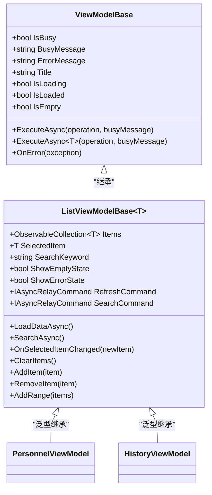
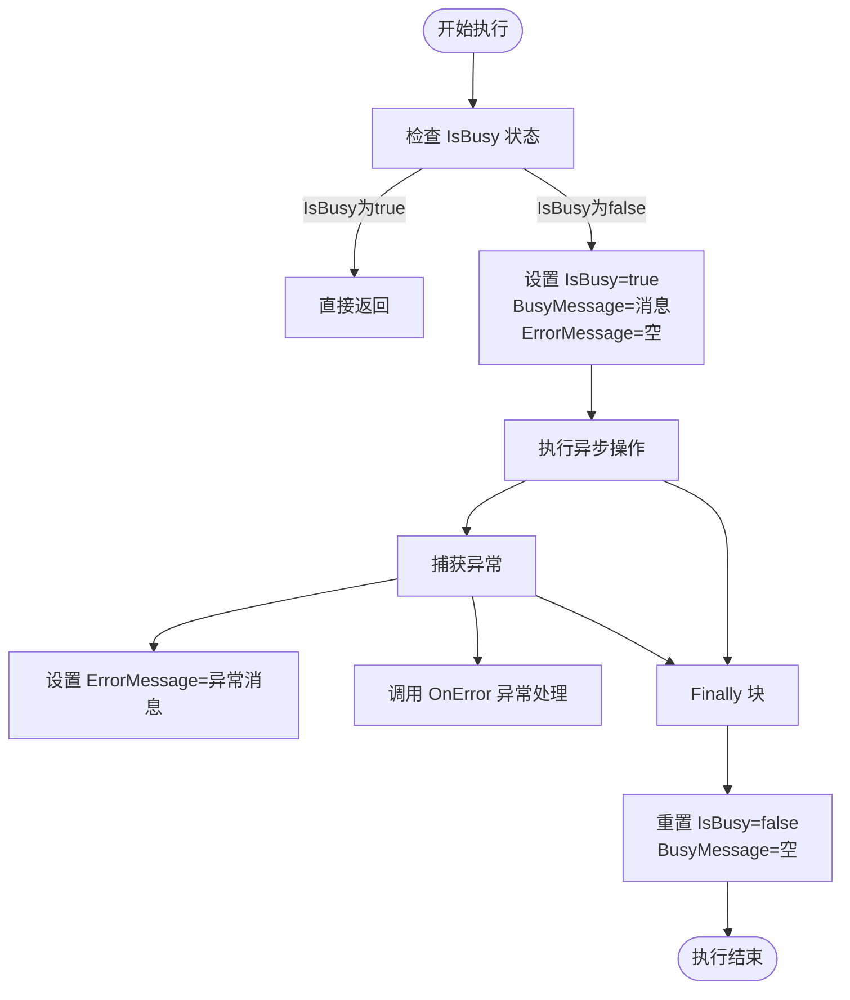
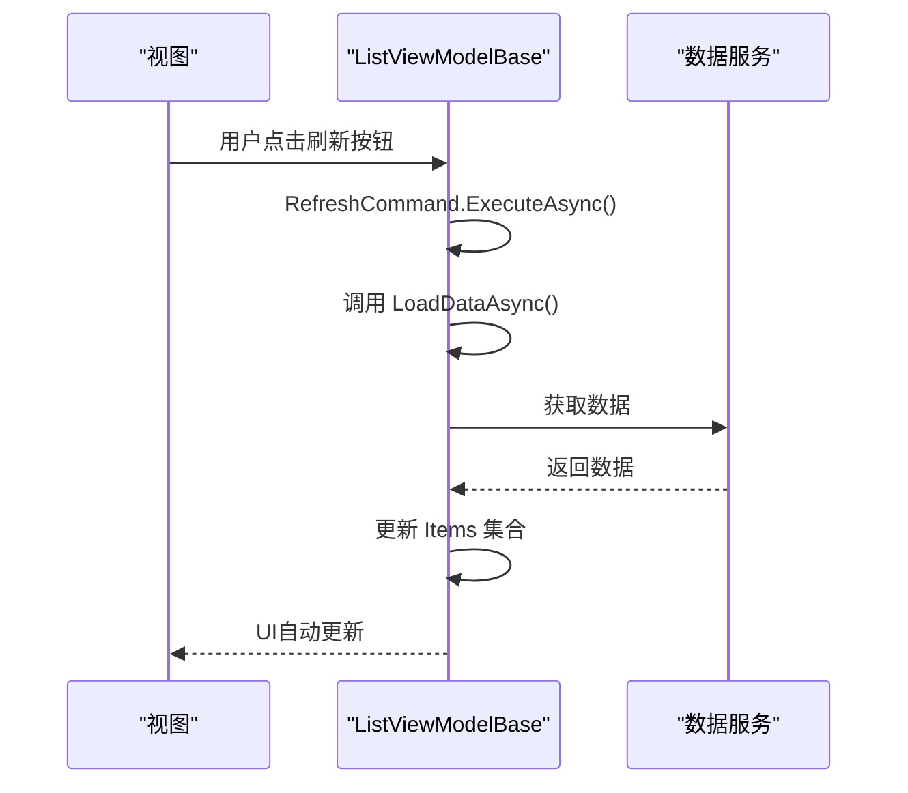
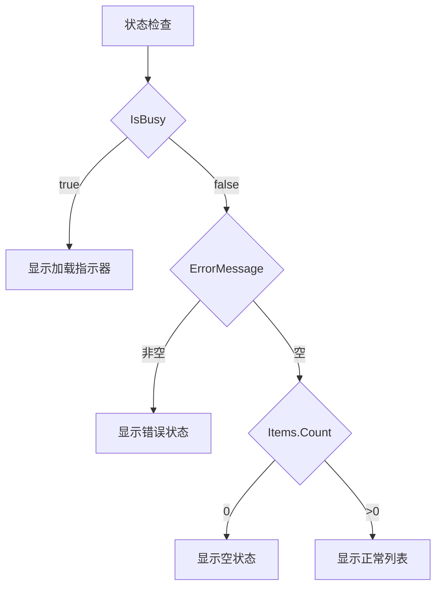
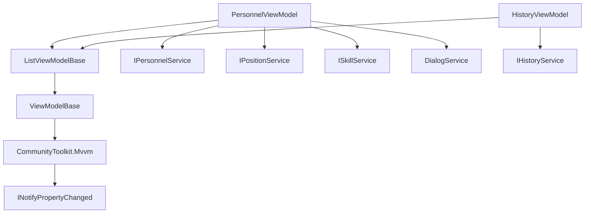

# ViewModel基础类

<cite>
**Referenced Files in This Document**   
- [ViewModelBase.cs](file://ViewModels/Base/ViewModelBase.cs)
- [ListViewModelBase.cs](file://ViewModels/Base/ListViewModelBase.cs)
- [PersonnelViewModel.cs](file://ViewModels/DataManagement/PersonnelViewModel.cs)
- [HistoryViewModel.cs](file://ViewModels/History/HistoryViewModel.cs)
</cite>

## Table of Contents
1. [简介](#简介)
2. [核心基类设计](#核心基类设计)
3. [ViewModelBase详解](#viewmodelbase详解)
4. [ListViewModelBase详解](#listviewmodelbase详解)
5. [子类实现示例](#子类实现示例)
6. [状态管理机制](#状态管理机制)
7. [命令与事件处理](#命令与事件处理)
8. [依赖关系与架构](#依赖关系与架构)

## 简介
本文档深入解析`ViewModelBase`和`ListViewModelBase`两个基类的设计与实现。详细说明`ViewModelBase`如何通过CommunityToolkit.Mvvm实现属性变更通知，封装`IsBusy`、`ErrorMessage`等通用UI状态，并提供`ExecuteAsync`异步执行模板方法处理异常和忙状态管理。阐述`ListViewModelBase`如何继承`ViewModelBase`并扩展列表管理功能，包括`Items`集合、`SelectedItem`选择机制、`SearchKeyword`搜索绑定、`RefreshCommand`刷新命令等。解释`ShowEmptyState`和`ShowErrorState`等状态属性的计算逻辑及其在UI中的应用。结合代码示例说明子类如何继承并重写`LoadDataAsync`、`OnSelectedItemChanged`等抽象/虚拟方法以实现具体业务逻辑。

## 核心基类设计
系统采用分层的ViewModel基类设计模式，通过`ViewModelBase`提供基础功能，`ListViewModelBase`在其基础上扩展列表管理能力。这种设计遵循单一职责原则，实现了功能的层次化和代码复用。基类通过抽象方法和虚拟方法为子类提供扩展点，同时封装了通用的UI状态管理和异步操作模式。



**Diagram sources**
- [ViewModelBase.cs](file://ViewModels/Base/ViewModelBase.cs#L9-L119)
- [ListViewModelBase.cs](file://ViewModels/Base/ListViewModelBase.cs#L12-L150)

**Section sources**
- [ViewModelBase.cs](file://ViewModels/Base/ViewModelBase.cs#L9-L119)
- [ListViewModelBase.cs](file://ViewModels/Base/ListViewModelBase.cs#L12-L150)

## ViewModelBase详解
`ViewModelBase`作为所有ViewModel的基类，继承自`CommunityToolkit.Mvvm`的`ObservableObject`，实现了INotifyPropertyChanged接口，自动处理属性变更通知。该基类封装了通用的UI状态属性和异步操作模板方法。

### 通用UI状态封装
基类定义了多个通用的UI状态属性，用于统一管理界面的交互状态：
- `IsBusy`: 表示当前是否正在执行耗时操作
- `BusyMessage`: 显示在加载状态时的消息文本
- `ErrorMessage`: 存储最近发生的错误信息
- `Title`: 页面或组件的标题
- `IsLoading`, `IsLoaded`, `IsEmpty`: 用于表示数据加载状态

这些属性通过`SetProperty`方法进行更新，确保属性变更时能正确通知UI进行刷新。

### 异步执行模板方法
`ViewModelBase`提供了两个重载的`ExecuteAsync`方法，作为异步操作的模板方法，实现了统一的忙状态管理和异常处理模式：



**Diagram sources**
- [ViewModelBase.cs](file://ViewModels/Base/ViewModelBase.cs#L55-L119)

**Section sources**
- [ViewModelBase.cs](file://ViewModels/Base/ViewModelBase.cs#L9-L119)

## ListViewModelBase详解
`ListViewModelBase`继承自`ViewModelBase`，并作为泛型类为列表管理功能提供通用实现。它扩展了基础功能，添加了专门用于列表操作的属性、命令和方法。

### 列表核心功能
基类提供了完整的列表管理功能：
- `Items`: `ObservableCollection<T>`类型的集合，自动通知UI更新
- `SelectedItem`: 当前选中的项，设置时会触发`OnSelectedItemChanged`事件
- `SearchKeyword`: 搜索关键字，属性变更时自动触发搜索
- `ClearItems()`: 清空列表并重置选中项
- `AddItem(item)`: 添加单个项目
- `RemoveItem(item)`: 移除指定项目
- `AddRange(items)`: 批量添加项目

### 内置命令系统
基类在构造函数中初始化了两个重要的异步命令：
- `RefreshCommand`: 绑定到`LoadDataAsync`方法，用于刷新数据
- `SearchCommand`: 绑定到`SearchAsync`方法，用于执行搜索



**Diagram sources**
- [ListViewModelBase.cs](file://ViewModels/Base/ListViewModelBase.cs#L72-L77)

**Section sources**
- [ListViewModelBase.cs](file://ViewModels/Base/ListViewModelBase.cs#L12-L150)

## 子类实现示例
多个具体ViewModel类继承`ListViewModelBase`，展示了如何通过重写抽象方法和虚拟方法来实现具体业务逻辑。

### PersonnelViewModel实现
`PersonnelViewModel`管理人员数据，继承`ListViewModelBase<PersonnelDto>`，实现了人员列表的加载、创建、编辑和删除功能。

```csharp
public partial class PersonnelViewModel : ListViewModelBase<PersonnelDto>
{
    // 依赖注入的服务
    private readonly IPersonnelService _personnelService;
    private readonly IPositionService _positionService;
    private readonly ISkillService _skillService;
    private readonly DialogService _dialogService;
    
    // 重写 LoadDataAsync 方法
    public override async Task LoadDataAsync()
    {
        await ExecuteAsync(async () =>
        {
            // 加载人员列表
            var personnel = string.IsNullOrWhiteSpace(SearchKeyword)
                ? await _personnelService.GetAllAsync()
                : await _personnelService.SearchAsync(SearchKeyword);
            
            ClearItems();
            AddRange(personnel);
            
            // 加载可选项
            var positions = await _positionService.GetAllAsync();
            AvailablePositions.Clear();
            foreach (var pos in positions)
            {
                AvailablePositions.Add(pos);
            }
            
            var skills = await _skillService.GetAllAsync();
            AvailableSkills.Clear();
            foreach (var skill in skills)
            {
                AvailableSkills.Add(skill);
            }
        }, "正在加载人员数据...");
    }
}
```

**Section sources**
- [PersonnelViewModel.cs](file://ViewModels/DataManagement/PersonnelViewModel.cs#L15-L241)

### HistoryViewModel实现
`HistoryViewModel`管理历史记录，继承`ListViewModelBase<HistoryScheduleDto>`，实现了分页、排序和筛选功能。

```csharp
public partial class HistoryViewModel : ListViewModelBase<HistoryScheduleDto>
{
    // 分页属性
    [ObservableProperty]
    private int _currentPage = 1;
    
    [ObservableProperty]
    private int _pageSize = 20;
    
    [ObservableProperty]
    private int _totalPages = 1;
    
    // 重写 LoadDataAsync 方法
    public override async Task LoadDataAsync()
    {
        IsLoading = true;
        var options = new HistoryQueryOptions
        {
            StartDate = StartDate?.Date,
            EndDate = EndDate?.Date,
            Keyword = Keyword,
            SortBy = SelectedSortBy,
            IsAscending = IsSortAscending
        };
        
        var result = await _historyService.GetHistorySchedulesAsync(options);
        var list = result.ToList();
        TotalPages = Math.Max(1, (int)Math.Ceiling(list.Count / (double)PageSize));
        if (CurrentPage > TotalPages) CurrentPage = TotalPages;
        var pageItems = list.Skip((CurrentPage - 1) * PageSize).Take(PageSize).ToList();
        
        Items.Clear();
        foreach (var item in pageItems)
        {
            Items.Add(item);
        }
        
        GroupData(list);
        
        IsLoading = false;
        IsLoaded = true;
        IsEmpty = Items.Count == 0;
    }
}
```

**Section sources**
- [HistoryViewModel.cs](file://ViewModels/History/HistoryViewModel.cs#L15-L208)

## 状态管理机制
基类通过计算属性和事件监听实现了智能的状态管理，自动反映当前UI状态。

### 状态属性计算
`ListViewModelBase`定义了两个关键的计算属性：
- `ShowEmptyState`: 当不忙、无错误且列表为空时返回true
- `ShowErrorState`: 当不忙且有错误消息时返回true



这些属性的值会自动更新，因为基类重写了`OnPropertyChanged`方法，当相关属性变更时会通知这些计算属性：

```csharp
protected override void OnPropertyChanged(PropertyChangedEventArgs e)
{
    base.OnPropertyChanged(e);
    if (e.PropertyName == nameof(IsBusy) || e.PropertyName == nameof(ErrorMessage))
    {
        OnPropertyChanged(nameof(ShowEmptyState));
        OnPropertyChanged(nameof(ShowErrorState));
    }
}
```

此外，当`Items`集合发生变更时，也会触发`ShowEmptyState`的更新：

```csharp
private void OnItemsCollectionChanged(object? sender, NotifyCollectionChangedEventArgs e)
{
    OnPropertyChanged(nameof(ShowEmptyState));
}
```

**Section sources**
- [ListViewModelBase.cs](file://ViewModels/Base/ListViewModelBase.cs#L57-L105)

## 命令与事件处理
基类通过命令模式和事件处理机制实现了清晰的职责分离和松耦合设计。

### 命令模式应用
基类使用`IAsyncRelayCommand`创建异步命令，这些命令可以绑定到UI元素（如按钮），并在执行时自动处理忙状态和异常。

```csharp
// 在构造函数中初始化命令
protected ListViewModelBase()
{
    RefreshCommand = new AsyncRelayCommand(LoadDataAsync);
    SearchCommand = new AsyncRelayCommand(SearchAsync);
    Items.CollectionChanged += OnItemsCollectionChanged;
}
```

### 事件处理扩展点
基类提供了多个虚拟方法作为扩展点，子类可以重写这些方法来添加自定义逻辑：
- `OnSelectedItemChanged(T? newItem)`: 当选中项变更时调用
- `OnError(Exception exception)`: 当发生异常时调用
- `SearchAsync()`: 执行搜索操作，可被子类重写以实现自定义搜索逻辑

例如，`PersonnelViewModel`重写了`OnError`方法来显示错误对话框：

```csharp
protected override void OnError(Exception exception)
{
    base.OnError(exception);
    _ = _dialogService.ShowErrorAsync("操作失败", exception);
}
```

**Section sources**
- [ListViewModelBase.cs](file://ViewModels/Base/ListViewModelBase.cs#L110-L113)
- [PersonnelViewModel.cs](file://ViewModels/DataManagement/PersonnelViewModel.cs#L238-L241)

## 依赖关系与架构
系统通过依赖注入和分层架构实现了良好的解耦和可测试性。

### 依赖关系图


**Diagram sources**
- [ViewModelBase.cs](file://ViewModels/Base/ViewModelBase.cs#L9-L119)
- [ListViewModelBase.cs](file://ViewModels/Base/ListViewModelBase.cs#L12-L150)

**Section sources**
- [ViewModelBase.cs](file://ViewModels/Base/ViewModelBase.cs#L9-L119)
- [ListViewModelBase.cs](file://ViewModels/Base/ListViewModelBase.cs#L12-L150)
- [PersonnelViewModel.cs](file://ViewModels/DataManagement/PersonnelViewModel.cs#L15-L241)
- [HistoryViewModel.cs](file://ViewModels/History/HistoryViewModel.cs#L15-L208)