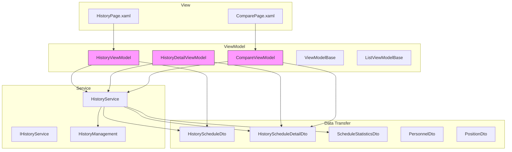
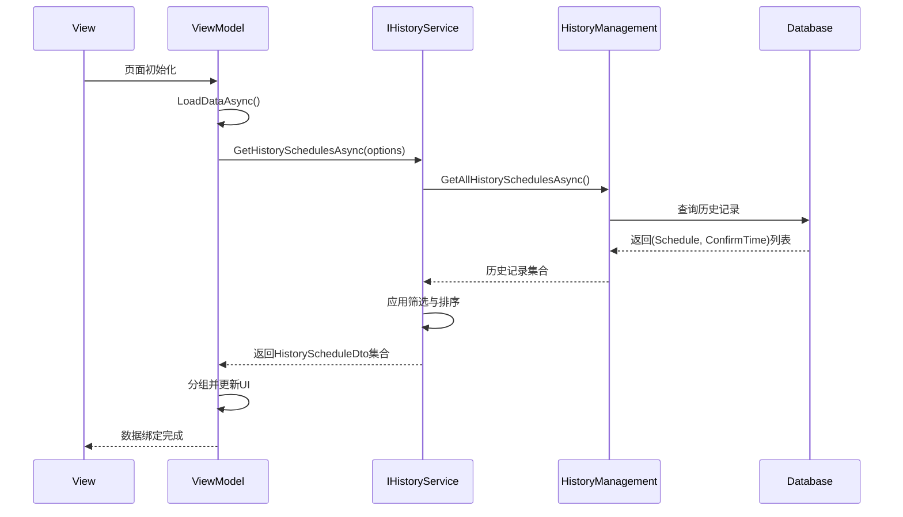
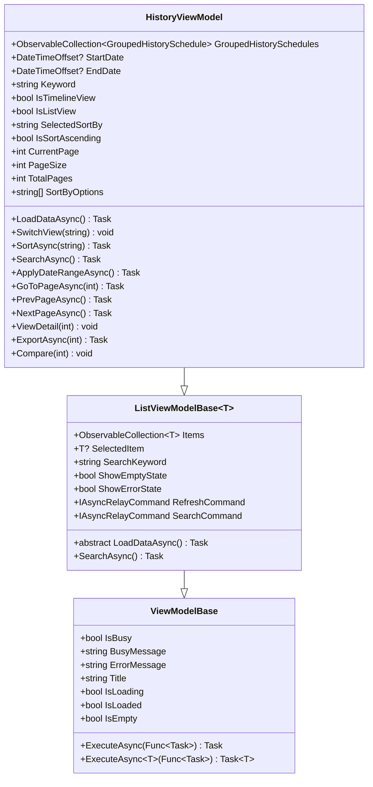
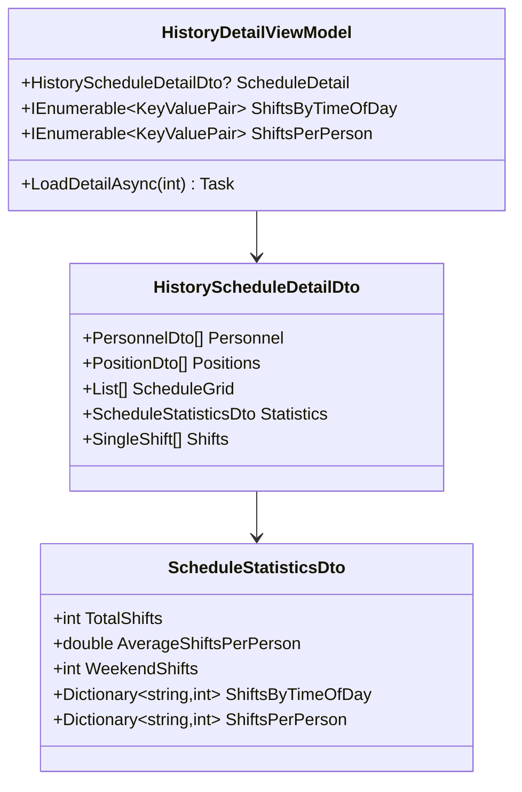
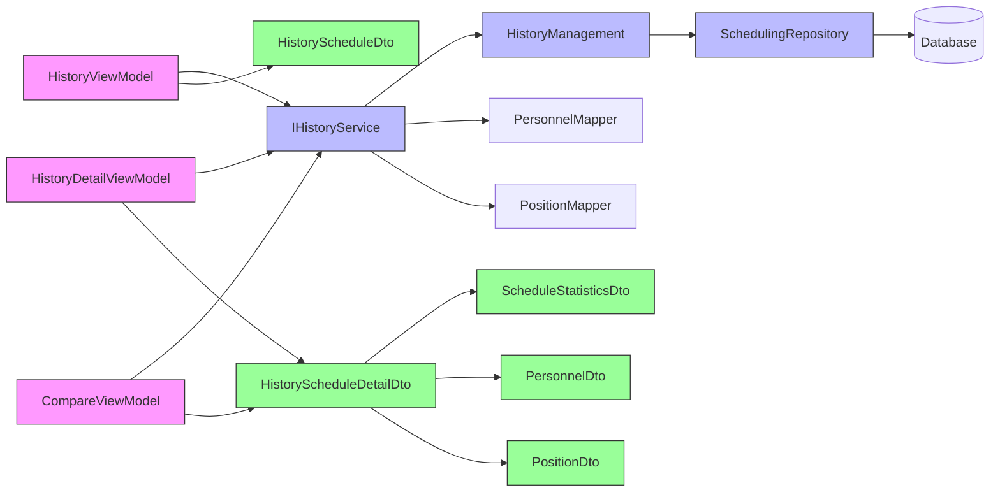

# 历史管理模块

<cite>
**本文档中引用的文件**  
- [HistoryViewModel.cs](file://ViewModels/History/HistoryViewModel.cs)
- [HistoryDetailViewModel.cs](file://ViewModels/History/HistoryDetailViewModel.cs)
- [CompareViewModel.cs](file://ViewModels/History/CompareViewModel.cs)
- [HistoryService.cs](file://Services/HistoryService.cs)
- [ViewModelBase.cs](file://ViewModels/Base/ViewModelBase.cs)
- [ListViewModelBase.cs](file://ViewModels/Base/ListViewModelBase.cs)
- [HistoryScheduleDto.cs](file://DTOs/HistoryScheduleDto.cs)
- [HistoryScheduleDetailDto.cs](file://DTOs/HistoryScheduleDetailDto.cs)
- [ScheduleStatisticsDto.cs](file://DTOs/ScheduleStatisticsDto.cs)
- [IHistoryService.cs](file://Services/Interfaces/IHistoryService.cs)
- [HIstoryManagement.cs](file://History/HIstoryManagement.cs)
- [Schedule.cs](file://Models/Schedule.cs)
- [SingleShift.cs](file://Models/SingleShift.cs)
- [PersonnelDto.cs](file://DTOs/PersonnelDto.cs)
- [PositionDto.cs](file://DTOs/PositionDto.cs)
- [HistoryPage.xaml.cs](file://Views/History/HistoryPage.xaml.cs)
- [ComparePage.xaml.cs](file://Views/History/ComparePage.xaml.cs)
</cite>

## 目录
1. [简介](#简介)
2. [项目结构](#项目结构)
3. [核心组件](#核心组件)
4. [架构概览](#架构概览)
5. [详细组件分析](#详细组件分析)
6. [依赖分析](#依赖分析)
7. [性能考虑](#性能考虑)
8. [故障排除指南](#故障排除指南)
9. [结论](#结论)

## 简介
本文件深入讲解历史管理模块的 ViewModel 设计，涵盖 `HistoryViewModel`、`HistoryDetailViewModel` 和 `CompareViewModel` 的实现机制。说明这些视图模型如何通过 `IHistoryService` 获取历史数据，并利用基类提供的异步执行机制保障界面响应性。结合实际用例描述从历史列表到详情查看再到对比分析的完整用户工作流实现。

## 项目结构
历史管理模块主要由 ViewModel、Service、DTO 和 View 四部分构成，遵循 MVVM 架构模式。ViewModel 层负责状态管理与业务逻辑，Service 层封装数据访问，DTO 层定义数据传输结构，View 层实现用户界面。



**图示来源**  
- [HistoryViewModel.cs](file://ViewModels/History/HistoryViewModel.cs)
- [HistoryDetailViewModel.cs](file://ViewModels/History/HistoryDetailViewModel.cs)
- [CompareViewModel.cs](file://ViewModels/History/CompareViewModel.cs)
- [HistoryService.cs](file://Services/HistoryService.cs)
- [HIstoryManagement.cs](file://History/HIstoryManagement.cs)

**本节来源**  
- [ViewModels/History](file://ViewModels/History)
- [Services/HistoryService.cs](file://Services/HistoryService.cs)
- [History/HIstoryManagement.cs](file://History/HIstoryManagement.cs)

## 核心组件
历史管理模块的核心组件包括三个 ViewModel：`HistoryViewModel` 负责加载和展示历史排班记录列表，支持按时间、状态等条件筛选；`HistoryDetailViewModel` 根据选中的历史记录加载详细排班数据，并与 UI 绑定展示具体人员分配情况；`CompareViewModel` 实现多版本排班对比功能，包括差异计算、高亮显示和统计分析。所有 ViewModel 均继承自 `ViewModelBase` 或 `ListViewModelBase`，利用基类提供的异步执行机制保障界面响应性。

**本节来源**  
- [HistoryViewModel.cs](file://ViewModels/History/HistoryViewModel.cs#L1-L220)
- [HistoryDetailViewModel.cs](file://ViewModels/History/HistoryDetailViewModel.cs#L1-L51)
- [CompareViewModel.cs](file://ViewModels/History/CompareViewModel.cs#L1-L168)
- [ViewModelBase.cs](file://ViewModels/Base/ViewModelBase.cs#L1-L122)
- [ListViewModelBase.cs](file://ViewModels/Base/ListViewModelBase.cs#L1-L152)

## 架构概览
系统采用分层架构，ViewModel 层通过依赖注入获取 `IHistoryService` 实例，调用其方法获取历史数据。`HistoryService` 内部协调 `HistoryManagement` 和多个 Repository 完成数据读取与转换。DTO 层作为数据传输桥梁，确保类型安全与序列化兼容性。



**图示来源**  
- [HistoryViewModel.cs](file://ViewModels/History/HistoryViewModel.cs#L50-L100)
- [HistoryService.cs](file://Services/HistoryService.cs#L20-L60)
- [HIstoryManagement.cs](file://History/HIstoryManagement.cs#L100-L150)

## 详细组件分析

### HistoryViewModel 分析
`HistoryViewModel` 继承自 `ListViewModelBase<HistoryScheduleDto>`，负责管理历史排班记录的展示。它支持按起止日期、关键字进行筛选，并提供时间或名称排序功能。数据以分页形式加载，每页默认20条记录。用户可通过时间线或列表视图切换展示方式。选中某条记录后可跳转至详情页或发起对比操作。



**图示来源**  
- [HistoryViewModel.cs](file://ViewModels/History/HistoryViewModel.cs#L1-L220)
- [ListViewModelBase.cs](file://ViewModels/Base/ListViewModelBase.cs#L1-L152)
- [ViewModelBase.cs](file://ViewModels/Base/ViewModelBase.cs#L1-L122)

**本节来源**  
- [HistoryViewModel.cs](file://ViewModels/History/HistoryViewModel.cs#L1-L220)
- [HistoryPage.xaml.cs](file://Views/History/HistoryPage.xaml.cs#L1-L19)

### HistoryDetailViewModel 分析
`HistoryDetailViewModel` 负责加载并展示单个历史排班的详细信息。通过 `LoadDetailAsync(scheduleId)` 方法触发数据加载流程，调用 `IHistoryService.GetHistoryScheduleDetailAsync()` 获取完整排班详情，包括人员列表、哨位列表、班次数据和统计信息。统计信息进一步拆分为“按时段分布”和“按人员分布”两个维度，便于图表展示。



**图示来源**  
- [HistoryDetailViewModel.cs](file://ViewModels/History/HistoryDetailViewModel.cs#L1-L51)
- [HistoryScheduleDetailDto.cs](file://DTOs/HistoryScheduleDetailDto.cs#L1-L48)
- [ScheduleStatisticsDto.cs](file://DTOs/ScheduleStatisticsDto.cs#L1-L90)

**本节来源**  
- [HistoryDetailViewModel.cs](file://ViewModels/History/HistoryDetailViewModel.cs#L1-L51)

### CompareViewModel 分析
`CompareViewModel` 实现多版本排班对比功能。用户可从历史列表中选择两个不同版本的排班表进行对比。系统通过 `GetSchedulesForComparisonAsync()` 获取两份排班的详细数据，并在内存中逐项比较班次安排，识别出“新增班次”、“删除班次”和“人员变更”三类差异。对比结果以三种模式展示：并排视图、差异高亮视图和统计分析视图。

```mermaid
classDiagram
class CompareViewModel {
+ObservableCollection~HistoryScheduleDto~ Schedules
+HistoryScheduleDto? SelectedSchedule1
+HistoryScheduleDto? SelectedSchedule2
+HistoryScheduleDetailDto? ScheduleDetail1
+HistoryScheduleDetailDto? ScheduleDetail2
+ObservableCollection~ShiftDiff~ Differences
+CompareMode Mode
+bool HasCompared
+IReadOnlyList~CompareMode~ Modes
+LoadAsync() Task
+CompareAsync() Task
+ChangeMode(CompareMode) void
}
class ShiftDiff {
+int DayIndex
+int PositionId
+int? PersonLeft
+int? PersonRight
+string DiffType
}
enum CompareMode {
SideBySide
DiffHighlight
Statistics
}
CompareViewModel --> ShiftDiff
CompareViewModel --> CompareMode
```

**图示来源**  
- [CompareViewModel.cs](file://ViewModels/History/CompareViewModel.cs#L1-L168)
- [HistoryService.cs](file://Services/HistoryService.cs#L100-L120)

**本节来源**  
- [CompareViewModel.cs](file://ViewModels/History/CompareViewModel.cs#L1-L168)
- [ComparePage.xaml.cs](file://Views/History/ComparePage.xaml.cs#L1-L19)

## 依赖分析
历史管理模块各组件之间存在明确的依赖关系。ViewModel 层依赖 Service 层接口，通过依赖注入获取实例；Service 层依赖 Repository 和 Mapper 组件完成数据访问与转换；DTO 层被所有上层组件引用，作为数据契约。不存在循环依赖，符合单一职责原则。



**图示来源**  
- [IHistoryService.cs](file://Services/Interfaces/IHistoryService.cs#L1-L24)
- [HistoryService.cs](file://Services/HistoryService.cs#L1-L124)
- [HIstoryManagement.cs](file://History/HIstoryManagement.cs#L1-L362)
- [DTOs](file://DTOs)

**本节来源**  
- [Services/Interfaces/IHistoryService.cs](file://Services/Interfaces/IHistoryService.cs#L1-L24)
- [Services/HistoryService.cs](file://Services/HistoryService.cs#L1-L124)
- [History/HIstoryManagement.cs](file://History/HIstoryManagement.cs#L1-L362)

## 性能考虑
为保障界面响应性，所有数据加载操作均采用异步方式执行。`ViewModelBase` 提供 `ExecuteAsync` 辅助方法，自动管理 `IsBusy` 状态和错误处理。分页机制有效控制单次加载数据量，避免内存溢出。`HistoryService` 在内存中完成排序与筛选，减少数据库压力。对比功能仅在用户主动点击“对比”按钮时才加载完整详情数据，避免不必要的资源消耗。

**本节来源**  
- [ViewModelBase.cs](file://ViewModels/Base/ViewModelBase.cs#L50-L100)
- [HistoryViewModel.cs](file://ViewModels/History/HistoryViewModel.cs#L50-L100)
- [CompareViewModel.cs](file://ViewModels/History/CompareViewModel.cs#L100-L150)

## 故障排除指南
常见问题包括历史记录加载失败、详情页空白、对比功能无响应等。排查时应首先检查 `ErrorMessage` 属性是否被设置，其次验证数据库连接状态。若 `GetHistorySchedulesAsync` 返回空列表，需确认 `HistoryManagement.GetAllHistorySchedulesAsync()` 是否能正确读取数据库。对比功能失败通常源于 `ScheduleId` 无效或数据库中缺少对应记录。

**本节来源**  
- [ViewModelBase.cs](file://ViewModels/Base/ViewModelBase.cs#L80-L100)
- [HistoryService.cs](file://Services/HistoryService.cs#L20-L120)
- [HIstoryManagement.cs](file://History/HIstoryManagement.cs#L200-L300)

## 结论
历史管理模块通过清晰的分层设计和职责划分，实现了高效、稳定的历史排班管理功能。`HistoryViewModel`、`HistoryDetailViewModel` 和 `CompareViewModel` 各司其职，共同支撑从列表浏览到深度分析的完整用户工作流。基于 `IHistoryService` 的服务抽象确保了数据访问的一致性与可测试性，而 `ViewModelBase` 提供的异步执行框架有效保障了用户体验。整体设计符合现代 MVVM 架构的最佳实践。