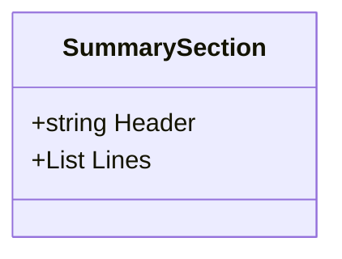
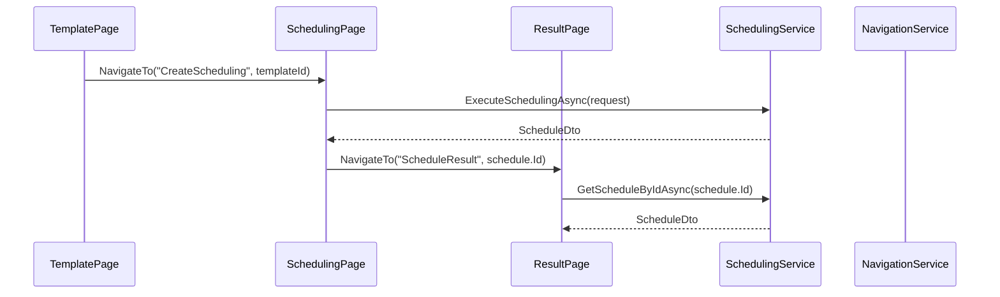

# 排班管理模块

<cite>
**Referenced Files in This Document**   
- [SchedulingViewModel.cs](file://ViewModels/Scheduling/SchedulingViewModel.cs)
- [TemplateViewModel.cs](file://ViewModels/Scheduling/TemplateViewModel.cs)
- [DraftsViewModel.cs](file://ViewModels/Scheduling/DraftsViewModel.cs)
- [ScheduleResultViewModel.cs](file://ViewModels/Scheduling/ScheduleResultViewModel.cs)
- [SummarySection.cs](file://ViewModels/Scheduling/SummarySection.cs)
- [ISchedulingService.cs](file://Services/Interfaces/ISchedulingService.cs)
- [ITemplateService.cs](file://Services/Interfaces/ITemplateService.cs)
- [NavigationService.cs](file://Helpers/NavigationService.cs)
- [DialogService.cs](file://Helpers/DialogService.cs)
</cite>

## 目录
1. [排班管理模块](#排班管理模块)
2. [SchedulingViewModel：排班创建流程协调](#schedulingviewmodel排班创建流程协调)
3. [TemplateViewModel：排班模板管理](#templateviewmodel排班模板管理)
4. [DraftsViewModel：排班草稿管理](#draftsviewmodel排班草稿管理)
5. [ScheduleResultViewModel：排班结果展示](#scheduleresultviewmodel排班结果展示)
6. [SummarySection：排班摘要组件](#summarysection排班摘要组件)
7. [ViewModel间导航与数据传递](#viewmodel间导航与数据传递)

## SchedulingViewModel：排班创建流程协调

`SchedulingViewModel` 是排班创建向导的核心协调者，负责管理从参数配置到调度执行的完整流程。它通过一个五步向导（`CurrentStep`）引导用户完成排班创建。

**排班创建流程**：
1.  **基础信息配置**：用户输入排班名称、选择开始和结束日期。
2.  **人员选择**：从可用人员列表中选择参与排班的人员。
3.  **岗位选择**：从可用岗位列表中选择参与排班的岗位。
4.  **约束设置**：加载并配置休息日配置、定岗规则和手动指定等约束条件。
5.  **结果预览**：汇总所有配置信息，供用户最终确认。

该 ViewModel 通过 `LoadDataCommand` 和 `LoadConstraintsCommand` 异步命令分别加载人员、岗位和约束数据。在用户点击“下一步”时，`NextStepCommand` 会调用 `CanGoNext()` 方法进行严格的步骤验证，确保每一步的输入都符合业务规则（如排班名称不为空、日期范围合理、至少选择一名人员和一个岗位等）。

**Section sources**
- [SchedulingViewModel.cs](file://ViewModels/Scheduling/SchedulingViewModel.cs#L15-L530)

## TemplateViewModel：排班模板管理

`TemplateViewModel` 负责管理排班模板的全生命周期操作，包括增删改查和应用。它通过 `ITemplateService` 与后端服务交互，实现对模板数据的持久化管理。

**核心功能实现**：
-   **增删改查**：提供 `CreateTemplateCommand`、`SaveTemplateCommand`、`DeleteTemplateCommand` 和 `DuplicateTemplateCommand` 等命令，支持创建新模板、保存修改、删除和复制现有模板。
-   **分页与筛选**：支持按模板类型（常规、节假日、特殊）和关键字进行筛选，并实现了分页功能，通过 `CurrentPage`、`PageSize` 和 `TotalPages` 等属性管理分页状态。
-   **模板应用**：当用户在模板列表中选择一个模板并点击“使用”时，`UseTemplateCommand` 会触发 `NavigationService` 导航到排班创建页面，并将所选模板的ID作为参数传递，从而在 `SchedulingViewModel` 中加载该模板的配置。

此外，`TemplateViewModel` 还提供了 `ValidateTemplateCommand` 命令，用于验证模板配置的有效性，并通过 `DialogService` 向用户展示验证结果。

**Section sources**
- [TemplateViewModel.cs](file://ViewModels/Scheduling/TemplateViewModel.cs#L19-L495)

## DraftsViewModel：排班草稿管理

`DraftsViewModel` 专门用于管理未完成的排班草稿。它提供了一个列表视图，展示所有待处理的草稿排班。

**核心功能**：
-   **草稿加载**：通过 `LoadDraftsCommand` 命令调用 `ISchedulingService.GetDraftsAsync()` 方法，从服务端获取所有草稿排班的摘要列表。
-   **草稿操作**：为每个草稿提供三个操作：
    -   **查看** (`ViewDraftCommand`)：导航到 `ScheduleResultPage`，以只读模式查看草稿的详细排班结果。
    -   **确认** (`ConfirmDraftCommand`)：调用 `ISchedulingService.ConfirmScheduleAsync()` 将草稿排班确认为正式的历史记录。
    -   **删除** (`DeleteDraftCommand`)：调用 `ISchedulingService.DeleteDraftAsync()` 删除不再需要的草稿。

该 ViewModel 通过 `IsLoading` 属性管理UI的加载状态，并在执行确认和删除操作前，使用 `DialogService.ShowConfirmAsync()` 弹出确认对话框，防止用户误操作。

**Section sources**
- [DraftsViewModel.cs](file://ViewModels/Scheduling/DraftsViewModel.cs#L11-L114)

## ScheduleResultViewModel：排班结果展示

`ScheduleResultViewModel` 负责接收和展示排班结果。它接收一个排班ID作为导航参数，然后加载对应的排班详情。

**核心功能**：
-   **结果加载**：`LoadScheduleCommand` 根据传入的ID调用 `ISchedulingService.GetScheduleByIdAsync()` 获取排班详情，并将其绑定到 `Schedule` 属性。
-   **冲突检测**：加载排班详情后，会自动将其中的冲突信息（`Schedule.Conflicts`）填充到 `Conflicts` 集合中，以便在UI上展示。
-   **操作支持**：提供“确认”、“返回”、“导出”和“重新排班”等命令。
    -   **确认** (`ConfirmCommand`)：将草稿状态的排班转为已确认的历史记录。
    -   **导出** (`ExportExcelCommand`)：调用 `ISchedulingService.ExportScheduleAsync()` 将排班表导出为CSV文件。
    -   **重新排班** (`RescheduleCommand`)：基于当前排班的配置（如人员、岗位、日期）创建一个新的排班请求，并导航回创建页面，方便用户进行调整。

**Section sources**
- [ScheduleResultViewModel.cs](file://ViewModels/Scheduling/ScheduleResultViewModel.cs#L22-L213)

## SummarySection：排班摘要组件

`SummarySection` 是一个简单的数据模型类，用作排班摘要信息的容器，实现了UI组件的复用机制。

**数据聚合逻辑**：
-   **结构设计**：该类包含两个属性：`Header`（字符串，用于显示摘要块的标题）和 `Lines`（字符串列表，用于存储该摘要块下的详细信息行）。
-   **复用机制**：在 `SchedulingViewModel` 的第五步（结果预览），通过 `BuildSummarySections()` 方法动态创建多个 `SummarySection` 实例。每个实例代表一个信息块，例如“基础信息”、“参与人员”、“参与岗位”和“约束配置”。这些实例被添加到 `SummarySections` 集合中，UI通过数据绑定（如 `ItemsControl`）即可自动渲染出结构化的摘要列表，实现了组件的高度复用。

**Diagram sources**
- [SummarySection.cs](file://ViewModels/Scheduling/SummarySection.cs#L2-L6)

## ViewModel间导航与数据传递

各 ViewModel 之间的导航跳转与数据传递主要通过 `NavigationService` 和 `DialogService` 协同完成。

**导航跳转**：
-   **创建排班**：从模板管理页面 (`TemplatePage`) 点击“使用”，通过 `NavigationService.NavigateTo("CreateScheduling", templateId)` 跳转到排班创建页面，并传递模板ID。
-   **生成结果**：在 `SchedulingViewModel` 中成功执行排班后，通过 `NavigationService.NavigateTo("ScheduleResult", schedule.Id)` 跳转到结果页面，并传递新生成的排班ID。
-   **查看草稿**：在 `DraftsViewModel` 中点击“查看”，通过 `NavigationService.NavigateTo("ScheduleResult", scheduleId)` 跳转到结果页面。

**数据传递**：
-   **导航参数**：`NavigationService.NavigateTo()` 方法的第二个参数 `parameter` 用于传递简单数据（如ID、字符串）或复杂对象（如 `SchedulingRequestDto`）。
-   **服务共享**：所有 ViewModel 都依赖于相同的 `ISchedulingService`、`ITemplateService`、`DialogService` 和 `NavigationService` 实例。这种依赖注入模式确保了数据和服务的全局一致性。例如，`DialogService` 用于在所有页面上统一显示消息、警告和确认对话框。

**Diagram sources**
- [SchedulingViewModel.cs](file://ViewModels/Scheduling/SchedulingViewModel.cs#L15-L530)
- [ScheduleResultViewModel.cs](file://ViewModels/Scheduling/ScheduleResultViewModel.cs#L22-L213)
- [NavigationService.cs](file://Helpers/NavigationService.cs#L9-L116)
- [ISchedulingService.cs](file://Services/Interfaces/ISchedulingService.cs#L12-L87)

**Section sources**
- [SchedulingViewModel.cs](file://ViewModels/Scheduling/SchedulingViewModel.cs#L15-L530)
- [ScheduleResultViewModel.cs](file://ViewModels/Scheduling/ScheduleResultViewModel.cs#L22-L213)
- [NavigationService.cs](file://Helpers/NavigationService.cs#L9-L116)
- [ISchedulingService.cs](file://Services/Interfaces/ISchedulingService.cs#L12-L87)