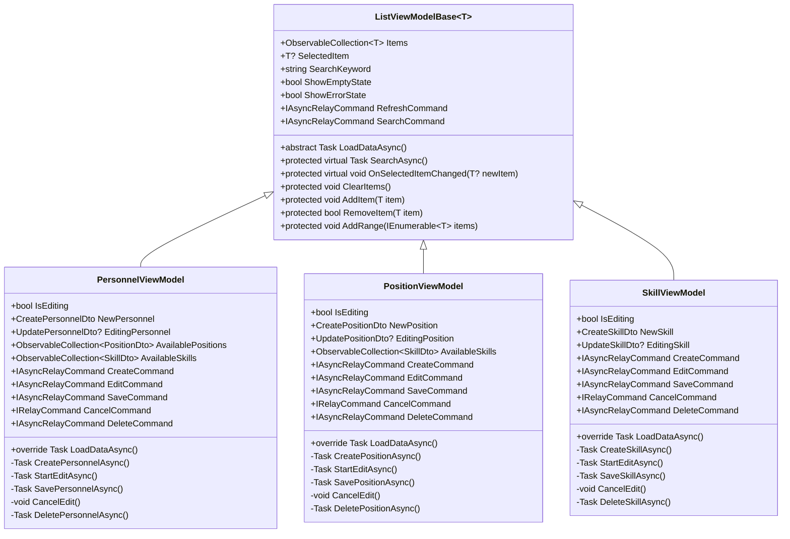
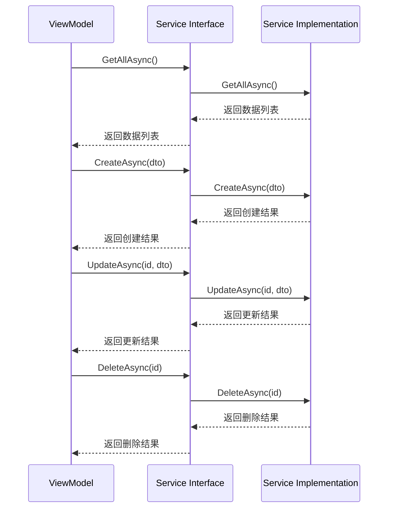

# 数据管理模块

<cite>
**本文档中引用的文件**   
- [PersonnelViewModel.cs](file://ViewModels/DataManagement/PersonnelViewModel.cs)
- [PositionViewModel.cs](file://ViewModels/DataManagement/PositionViewModel.cs)
- [SkillViewModel.cs](file://ViewModels/DataManagement/SkillViewModel.cs)
- [ListViewModelBase.cs](file://ViewModels/Base/ListViewModelBase.cs)
- [IPersonnelService.cs](file://Services/Interfaces/IPersonnelService.cs)
- [IPositionService.cs](file://Services/Interfaces/IPositionService.cs)
- [ISkillService.cs](file://Services/Interfaces/ISkillService.cs)
- [PersonnelDto.cs](file://DTOs/PersonnelDto.cs)
- [PositionDto.cs](file://DTOs/PositionDto.cs)
- [SkillDto.cs](file://DTOs/SkillDto.cs)
</cite>

## 目录
1. [简介](#简介)
2. [核心实现机制](#核心实现机制)
3. [继承与基类功能复用](#继承与基类功能复用)
4. [依赖注入与服务获取](#依赖注入与服务获取)
5. [数据加载与搜索过滤](#数据加载与搜索过滤)
6. [增删改查命令绑定](#增删改查命令绑定)
7. [线程安全与错误处理](#线程安全与错误处理)
8. [交互逻辑实现](#交互逻辑实现)
9. [总结](#总结)

## 简介
本模块详细描述了人员、哨位和技能三类实体的列表展示与管理功能。通过 `PersonnelViewModel`、`PositionViewModel` 和 `SkillViewModel` 三个视图模型，实现了统一的数据管理接口，并基于基类 `ListViewModelBase<T>` 提供了通用的列表操作能力。

**Section sources**
- [PersonnelViewModel.cs](file://ViewModels/DataManagement/PersonnelViewModel.cs#L1-L20)
- [PositionViewModel.cs](file://ViewModels/DataManagement/PositionViewModel.cs#L1-L20)
- [SkillViewModel.cs](file://ViewModels/DataManagement/SkillViewModel.cs#L1-L20)

## 核心实现机制
`PersonnelViewModel`、`PositionViewModel` 和 `SkillViewModel` 均继承自泛型基类 `ListViewModelBase<T>`，分别管理 `PersonnelDto`、`PositionDto` 和 `SkillDto` 类型的数据集合。每个 ViewModel 都封装了对应实体的增删改查（CRUD）操作逻辑，并通过命令绑定实现 UI 交互。

这些 ViewModel 统一采用 MVVM 模式设计，利用属性变更通知机制同步界面状态，确保数据一致性。同时，它们共享相同的交互模式：支持搜索过滤、选中项变更响应、数据刷新等操作。

**Diagram sources**
- [ListViewModelBase.cs](file://ViewModels/Base/ListViewModelBase.cs#L12-L150)
- [PersonnelViewModel.cs](file://ViewModels/DataManagement/PersonnelViewModel.cs#L15-L241)
- [PositionViewModel.cs](file://ViewModels/DataManagement/PositionViewModel.cs#L15-L225)
- [SkillViewModel.cs](file://ViewModels/DataManagement/SkillViewModel.cs#L13-L204)

## 继承与基类功能复用
所有数据管理 ViewModel 均继承自 `ListViewModelBase<T>`，该基类提供了以下核心功能：

- **Items**: `ObservableCollection<T>` 类型的集合，用于存储实体列表，支持自动 UI 更新。
- **SelectedItem**: 当前选中的实体对象，变更时触发 `OnSelectedItemChanged` 回调。
- **SearchKeyword**: 搜索关键字，设置后自动触发搜索逻辑。
- **ShowEmptyState / ShowErrorState**: 状态属性，用于控制空状态和错误状态的显示。
- **RefreshCommand / SearchCommand**: 内置刷新和搜索命令，绑定到界面按钮。

通过继承机制，子类无需重复实现列表管理的基础逻辑，只需专注于业务特定的功能扩展。

**Section sources**
- [ListViewModelBase.cs](file://ViewModels/Base/ListViewModelBase.cs#L12-L150)

## 依赖注入与服务获取
各 ViewModel 在构造函数中通过依赖注入获取所需服务实例：

- `PersonnelViewModel` 注入 `IPersonnelService`、`IPositionService`、`ISkillService` 和 `DialogService`
- `PositionViewModel` 注入 `IPositionService`、`ISkillService` 和 `DialogService`
- `SkillViewModel` 注入 `ISkillService` 和 `DialogService`

这些服务通过构造函数参数传入，并在初始化时进行空值检查，确保依赖有效性。服务接口定义了与数据层交互的标准方法，如 `GetAllAsync()`、`CreateAsync()`、`UpdateAsync()` 等。

**Diagram sources**
- [PersonnelViewModel.cs](file://ViewModels/DataManagement/PersonnelViewModel.cs#L63-L79)
- [PositionViewModel.cs](file://ViewModels/DataManagement/PositionViewModel.cs#L57-L71)
- [SkillViewModel.cs](file://ViewModels/DataManagement/SkillViewModel.cs#L49-L61)
- [IPersonnelService.cs](file://Services/Interfaces/IPersonnelService.cs#L1-L52)
- [IPositionService.cs](file://Services/Interfaces/IPositionService.cs#L1-L47)
- [ISkillService.cs](file://Services/Interfaces/ISkillService.cs#L1-L52)

## 数据加载与搜索过滤
`LoadDataAsync` 方法是数据加载的核心入口，被 `RefreshCommand` 调用。其实现逻辑如下：

1. 根据 `SearchKeyword` 是否为空决定调用 `GetAllAsync()` 或 `SearchAsync(keyword)`
2. 使用 `ClearItems()` 清空现有数据，再通过 `AddRange()` 批量添加新数据
3. 对于 `PersonnelViewModel` 和 `PositionViewModel`，还会额外加载关联的可选项（如职位、技能）

当用户输入搜索关键字时，`SearchKeyword` 属性的 setter 会自动触发 `SearchAsync()` 方法，进而调用 `LoadDataAsync()` 实现搜索功能。

**Section sources**
- [PersonnelViewModel.cs](file://ViewModels/DataManagement/PersonnelViewModel.cs#L108-L138)
- [PositionViewModel.cs](file://ViewModels/DataManagement/PositionViewModel.cs#L96-L122)
- [SkillViewModel.cs](file://ViewModels/DataManagement/SkillViewModel.cs#L85-L97)

## 增删改查命令绑定
各 ViewModel 定义了标准的 CRUD 命令：

- **CreateCommand**: 调用服务创建新实体，成功后添加到 `Items` 集合并重置表单
- **EditCommand**: 启用编辑模式，将当前 `SelectedItem` 映射为编辑 DTO
- **SaveCommand**: 调用服务更新实体，完成后重新加载数据并退出编辑模式
- **CancelCommand**: 取消编辑，恢复原始状态
- **DeleteCommand**: 弹出确认对话框，确认后调用服务删除实体并从列表移除

命令的可执行性由 lambda 表达式控制，例如 `EditCommand` 仅在有选中项时可用，`SaveCommand` 仅在编辑模式下可用。

**Section sources**
- [PersonnelViewModel.cs](file://ViewModels/DataManagement/PersonnelViewModel.cs#L78-L106)
- [PositionViewModel.cs](file://ViewModels/DataManagement/PositionViewModel.cs#L70-L94)
- [SkillViewModel.cs](file://ViewModels/DataManagement/SkillViewModel.cs#L60-L83)

## 线程安全与错误处理
所有异步操作均通过基类 `ViewModelBase` 提供的 `ExecuteAsync` 方法执行，确保线程安全和统一的错误处理流程：

- 操作开始前设置 `IsBusy = true`，显示加载状态
- 捕获异常并设置 `ErrorMessage`，触发错误状态显示
- 最终 `finally` 块中恢复 `IsBusy = false`

此外，`OnError` 方法被重写以集成对话框服务，在发生错误时弹出提示，提升用户体验。

**Section sources**
- [ViewModelBase.cs](file://ViewModels/Base/ViewModelBase.cs#L73-L97)
- [PersonnelViewModel.cs](file://ViewModels/DataManagement/PersonnelViewModel.cs#L235-L241)
- [PositionViewModel.cs](file://ViewModels/DataManagement/PositionViewModel.cs#L217-L225)
- [SkillViewModel.cs](file://ViewModels/DataManagement/SkillViewModel.cs#L197-L204)

## 交互逻辑实现
### 搜索过滤
用户在搜索框输入内容时，`SearchKeyword` 属性变更自动触发搜索，无需手动点击按钮。搜索逻辑由服务层实现，支持模糊匹配。

### 选中项变更响应
`SelectedItem` 属性变更时，自动触发 `OnSelectedItemChanged` 回调。虽然当前未重写此方法，但为未来扩展提供了钩子。

### 数据刷新
`RefreshCommand` 绑定到刷新按钮，调用 `LoadDataAsync` 重新加载全部数据，保持界面与数据源同步。

### 编辑模式管理
通过 `IsEditing` 标志位控制表单的显示状态，结合 `NewPersonnel` 和 `EditingPersonnel` 等属性实现新建与编辑的分离。

**Section sources**
- [ListViewModelBase.cs](file://ViewModels/Base/ListViewModelBase.cs#L55-L65)
- [PersonnelViewModel.cs](file://ViewModels/DataManagement/PersonnelViewModel.cs#L45-L61)

## 总结
`PersonnelViewModel`、`PositionViewModel` 和 `SkillViewModel` 通过继承 `ListViewModelBase<T>` 实现了高度一致的数据管理接口。它们利用依赖注入获取服务实例，在 `LoadDataAsync` 中调用服务层方法加载数据，并通过命令绑定实现完整的 CRUD 操作。所有异步操作均通过 `ExecuteAsync` 保障线程安全和错误处理，形成了稳定可靠的前端数据管理架构。