# 视图模型层

<cite>
**本文档中引用的文件**  
- [ViewModelBase.cs](file://ViewModels/Base/ViewModelBase.cs)
- [ListViewModelBase.cs](file://ViewModels/Base/ListViewModelBase.cs)
- [PersonnelViewModel.cs](file://ViewModels/DataManagement/PersonnelViewModel.cs)
- [PositionViewModel.cs](file://ViewModels/DataManagement/PositionViewModel.cs)
- [SkillViewModel.cs](file://ViewModels/DataManagement/SkillViewModel.cs)
- [HistoryViewModel.cs](file://ViewModels/History/HistoryViewModel.cs)
- [CompareViewModel.cs](file://ViewModels/History/CompareViewModel.cs)
- [HistoryDetailViewModel.cs](file://ViewModels/History/HistoryDetailViewModel.cs)
- [SchedulingViewModel.cs](file://ViewModels/Scheduling/SchedulingViewModel.cs)
- [TemplateViewModel.cs](file://ViewModels/Scheduling/TemplateViewModel.cs)
- [DraftsViewModel.cs](file://ViewModels/Scheduling/DraftsViewModel.cs)
- [ScheduleResultViewModel.cs](file://ViewModels/Scheduling/ScheduleResultViewModel.cs)
</cite>

## 目录
1. [简介](#简介)
2. [核心基类分析](#核心基类分析)
3. [数据管理命名空间下的视图模型](#数据管理命名空间下的视图模型)
4. [历史记录命名空间下的视图模型](#历史记录命名空间下的视图模型)
5. [排班命名空间下的视图模型](#排班命名空间下的视图模型)
6. [依赖注入与服务获取机制](#依赖注入与服务获取机制)
7. [命令绑定与异步操作实现](#命令绑定与异步操作实现)
8. [属性变更通知机制](#属性变更通知机制)
9. [状态管理与UI逻辑封装](#状态管理与ui逻辑封装)
10. [业务逻辑到UI的转换](#业务逻辑到ui的转换)

## 简介
本文件深入解析AutoScheduling3项目中MVVM架构的ViewModel层设计。重点阐述ViewModelBase和ListViewModelBase基类提供的通用功能，详细说明DataManagement、Scheduling和History命名空间下各ViewModel如何封装UI逻辑、管理状态并响应用户操作。文档将解释命令绑定、属性通知和异步操作的实现机制，阐明ViewModel如何通过依赖注入获取服务实例，并将业务逻辑结果转换为UI可消费的形式。

## 核心基类分析

### ViewModelBase 基类功能
ViewModelBase作为所有视图模型的基类，继承自ObservableObject，提供基础的属性变更通知功能。该基类定义了多个通用属性和辅助方法，为子类提供一致的状态管理机制。

**核心功能包括：**
- **状态属性**：IsBusy（是否繁忙）、BusyMessage（繁忙消息）、ErrorMessage（错误消息）用于管理UI状态和显示反馈
- **生命周期属性**：Title（标题）、IsLoading（加载中）、IsLoaded（已加载）、IsEmpty（为空）用于控制页面状态
- **异步执行辅助方法**：ExecuteAsync重载方法，提供统一的异步操作执行框架，自动处理繁忙状态、错误捕获和异常处理
- **错误处理机制**：OnError虚方法，允许子类重写以实现自定义的错误处理逻辑

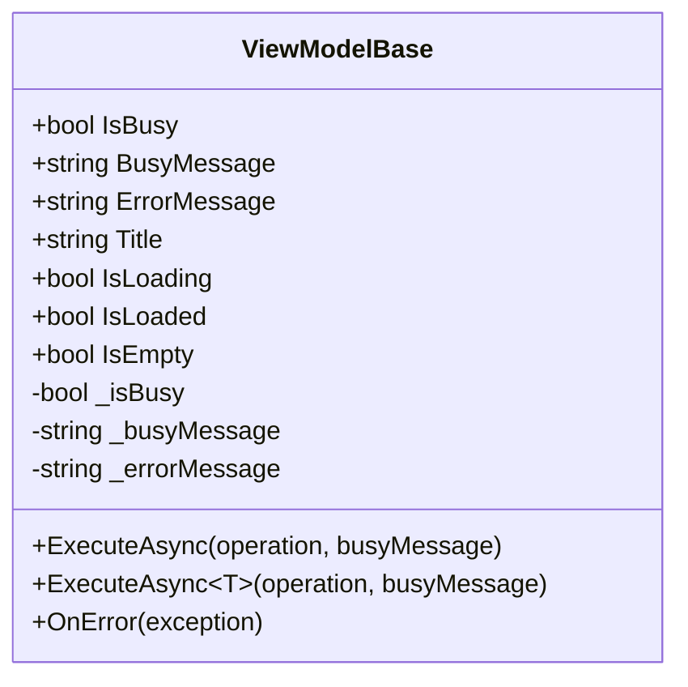

**Diagram sources**
- [ViewModelBase.cs](file://ViewModels/Base/ViewModelBase.cs#L9-L119)

**Section sources**
- [ViewModelBase.cs](file://ViewModels/Base/ViewModelBase.cs#L9-L119)

### ListViewModelBase 泛型基类功能
ListViewModelBase继承自ViewModelBase，是一个泛型基类，专门用于管理列表数据的视图模型。它为数据列表的CRUD操作、搜索、刷新和选择提供了标准化的实现。

**核心功能包括：**
- **数据列表管理**：Items属性（ObservableCollection<T>）存储数据项，支持自动UI更新
- **选择管理**：SelectedItem属性管理当前选中的项，支持变更通知
- **搜索功能**：SearchKeyword属性和SearchAsync方法实现搜索功能
- **状态指示**：ShowEmptyState和ShowErrorState属性用于控制空状态和错误状态的显示
- **命令系统**：RefreshCommand和SearchCommand提供刷新和搜索的命令绑定
- **集合变更处理**：OnItemsCollectionChanged方法监听集合变更，更新空状态
- **CRUD辅助方法**：ClearItems、AddItem、RemoveItem、AddRange等方法简化列表操作

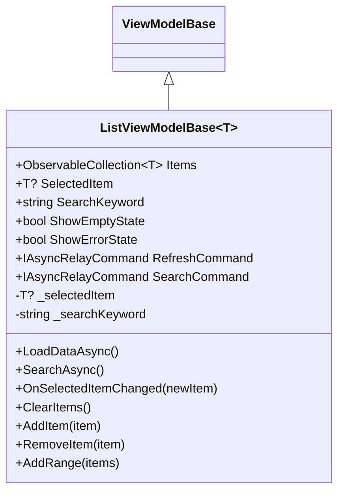

**Diagram sources**
- [ListViewModelBase.cs](file://ViewModels/Base/ListViewModelBase.cs#L12-L150)

**Section sources**
- [ListViewModelBase.cs](file://ViewModels/Base/ListViewModelBase.cs#L12-L150)

## 数据管理命名空间下的视图模型

### PersonnelViewModel 人员管理视图模型
PersonnelViewModel继承自ListViewModelBase<PersonnelDto>，负责人员数据的管理。它封装了人员的增删改查操作，提供完整的CRUD功能。

**核心功能：**
- **依赖注入**：通过构造函数注入IPersonnelService、IPositionService、ISkillService和DialogService
- **表单状态管理**：IsEditing属性控制编辑模式，NewPersonnel和EditingPersonnel属性管理新建和编辑表单数据
- **关联数据加载**：AvailablePositions和AvailableSkills属性存储可选的职位和技能列表
- **命令系统**：CreateCommand、EditCommand、SaveCommand、CancelCommand、DeleteCommand提供完整的操作命令
- **数据加载**：重写LoadDataAsync方法，加载人员列表和关联的职位、技能数据
- **错误处理**：重写OnError方法，集成对话框服务显示错误信息

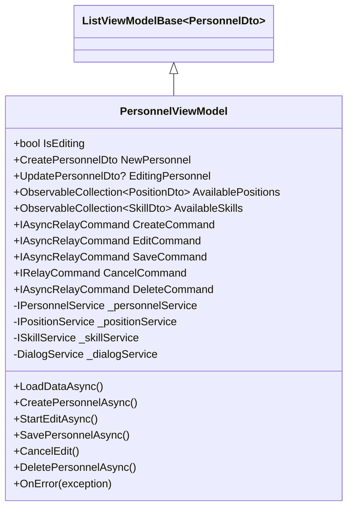

**Diagram sources**
- [PersonnelViewModel.cs](file://ViewModels/DataManagement/PersonnelViewModel.cs#L15-L241)

**Section sources**
- [PersonnelViewModel.cs](file://ViewModels/DataManagement/PersonnelViewModel.cs#L15-L241)

### PositionViewModel 哨位管理视图模型
PositionViewModel继承自ListViewModelBase<PositionDto>，负责哨位数据的管理。其设计模式与PersonnelViewModel类似，但专注于哨位实体。

**核心功能：**
- **依赖注入**：通过构造函数注入IPositionService、ISkillService和DialogService
- **表单状态管理**：IsEditing属性控制编辑模式，NewPosition和EditingPosition属性管理新建和编辑表单数据
- **关联数据加载**：AvailableSkills属性存储可选的技能列表
- **命令系统**：CreateCommand、EditCommand、SaveCommand、CancelCommand、DeleteCommand提供完整的操作命令
- **数据加载**：重写LoadDataAsync方法，加载哨位列表和关联的技能数据
- **错误处理**：重写OnError方法，集成对话框服务显示错误信息

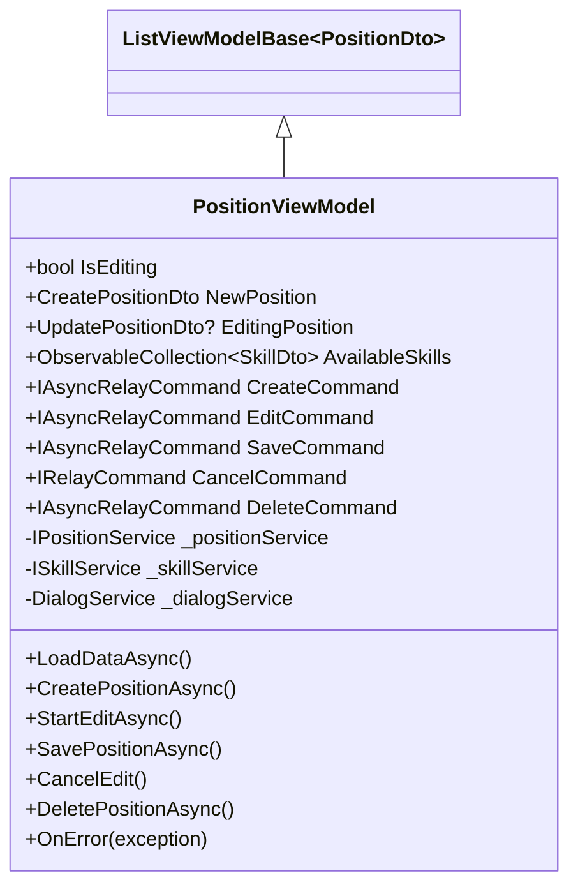

**Diagram sources**
- [PositionViewModel.cs](file://ViewModels/DataManagement/PositionViewModel.cs#L15-L225)

**Section sources**
- [PositionViewModel.cs](file://ViewModels/DataManagement/PositionViewModel.cs#L15-L225)

### SkillViewModel 技能管理视图模型
SkillViewModel继承自ListViewModelBase<SkillDto>，负责技能数据的管理。它是三个数据管理视图模型中最简单的一个。

**核心功能：**
- **依赖注入**：通过构造函数注入ISkillService和DialogService
- **表单状态管理**：IsEditing属性控制编辑模式，NewSkill和EditingSkill属性管理新建和编辑表单数据
- **命令系统**：CreateCommand、EditCommand、SaveCommand、CancelCommand、DeleteCommand提供完整的操作命令
- **数据加载**：重写LoadDataAsync方法，加载技能列表
- **错误处理**：重写OnError方法，集成对话框服务显示错误信息

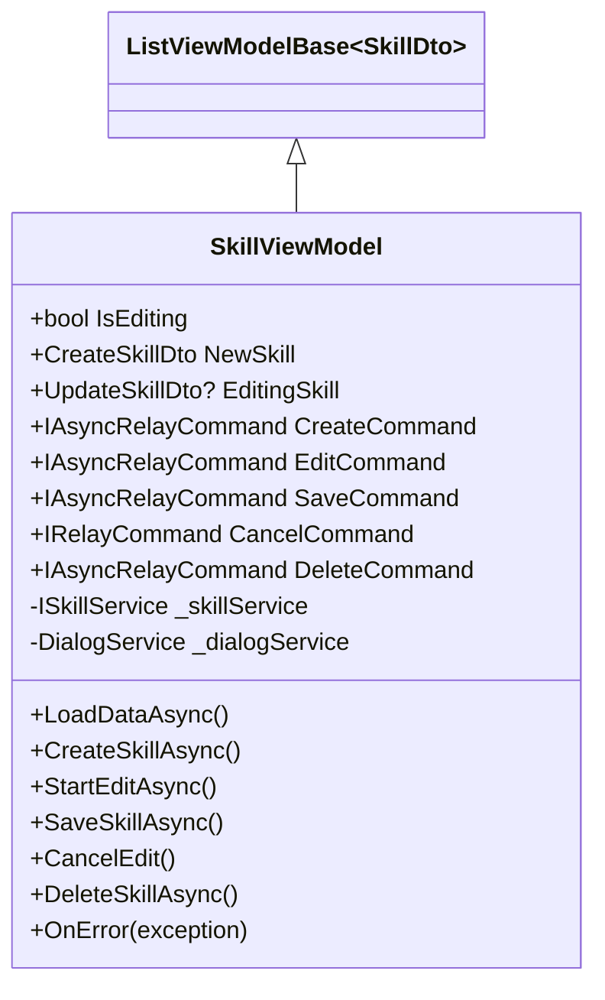

**Diagram sources**
- [SkillViewModel.cs](file://ViewModels/DataManagement/SkillViewModel.cs#L13-L204)

**Section sources**
- [SkillViewModel.cs](file://ViewModels/DataManagement/SkillViewModel.cs#L13-L204)

## 历史记录命名空间下的视图模型

### HistoryViewModel 历史记录视图模型
HistoryViewModel继承自ListViewModelBase<HistoryScheduleDto>，负责历史排班记录的管理。它提供了分页、排序、搜索和日期范围过滤功能。

**核心功能：**
- **分页管理**：CurrentPage、PageSize、TotalPages属性管理分页状态
- **排序功能**：SelectedSortBy、IsSortAscending属性管理排序方式
- **过滤功能**：StartDate、EndDate、Keyword属性支持日期范围和关键字搜索
- **视图模式**：IsTimelineView、IsListView属性控制显示模式
- **分组数据**：GroupedHistorySchedules属性存储按年月分组的历史记录
- **命令系统**：SwitchView、SortAsync、SearchAsync、ApplyDateRangeAsync、GoToPageAsync、PrevPageAsync、NextPageAsync、ViewDetail、ExportAsync、Compare等命令提供完整的交互功能
- **数据加载**：重写LoadDataAsync方法，根据过滤条件加载历史记录并进行分组

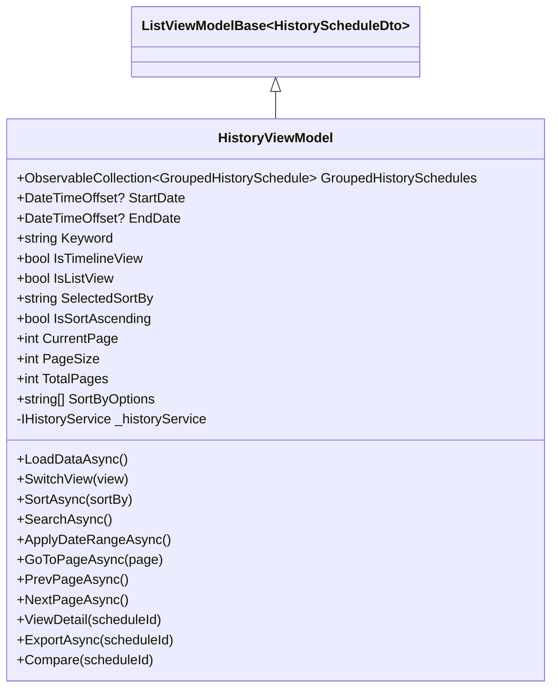

**Diagram sources**
- [HistoryViewModel.cs](file://ViewModels/History/HistoryViewModel.cs#L15-L197)

**Section sources**
- [HistoryViewModel.cs](file://ViewModels/History/HistoryViewModel.cs#L15-L197)

### CompareViewModel 排班对比视图模型
CompareViewModel继承自ViewModelBase，负责排班记录的对比功能。它允许用户选择两个历史排班进行对比，显示差异。

**核心功能：**
- **数据源管理**：Schedules属性存储所有历史排班，SelectedSchedule1和SelectedSchedule2属性管理选中的两个排班
- **对比结果**：ScheduleDetail1、ScheduleDetail2属性存储两个排班的详细信息，Differences属性存储差异列表
- **对比模式**：Mode属性控制对比显示模式（并排、高亮差异、统计）
- **命令系统**：CompareAsync、ChangeMode命令提供对比和模式切换功能
- **数据加载**：LoadAsync方法加载历史排班列表
- **对比逻辑**：CompareAsync方法实现排班对比算法，识别新增、删除和人员变更的班次

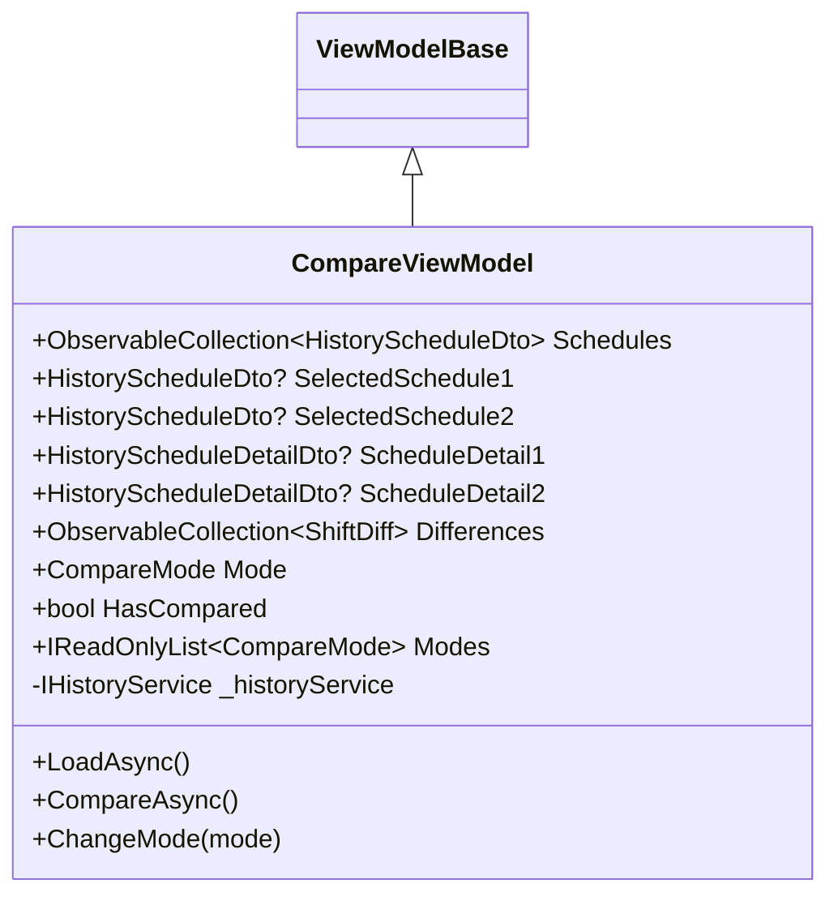

**Diagram sources**
- [CompareViewModel.cs](file://ViewModels/History/CompareViewModel.cs#L27-L165)

**Section sources**
- [CompareViewModel.cs](file://ViewModels/History/CompareViewModel.cs#L27-L165)

### HistoryDetailViewModel 历史详情视图模型
HistoryDetailViewModel继承自ViewModelBase，负责显示单个历史排班的详细信息。

**核心功能：**
- **详情数据**：ScheduleDetail属性存储排班详细信息
- **统计图表数据**：ShiftsByTimeOfDay、ShiftsPerPerson属性存储用于图表显示的统计信息
- **数据加载**：LoadDetailAsync方法根据排班ID加载详细信息和统计数据
- **状态管理**：IsLoading、IsLoaded属性管理加载状态

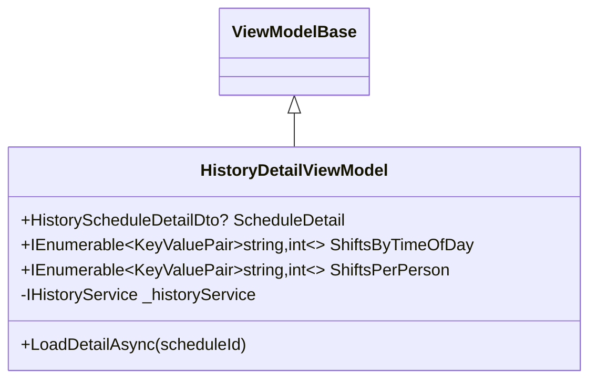

**Diagram sources**
- [HistoryDetailViewModel.cs](file://ViewModels/History/HistoryDetailViewModel.cs#L10-L48)

**Section sources**
- [HistoryDetailViewModel.cs](file://ViewModels/History/HistoryDetailViewModel.cs#L10-L48)

## 排班命名空间下的视图模型

### SchedulingViewModel 排班创建视图模型
SchedulingViewModel负责排班创建向导的逻辑，是一个复杂的多步骤工作流管理器。

**核心功能：**
- **多步骤导航**：CurrentStep属性管理当前步骤，NextStepCommand、PreviousStepCommand提供步骤导航
- **排班配置**：ScheduleTitle、StartDate、EndDate属性管理排班基本信息
- **资源选择**：AvailablePersonnels、AvailablePositions、SelectedPersonnels、SelectedPositions属性管理可用和选中的人员及哨位
- **约束管理**：HolidayConfigs、FixedPositionRules、ManualAssignments属性管理各种约束条件
- **模板功能**：LoadedTemplateId、TemplateApplied属性支持模板加载和应用
- **命令系统**：LoadDataCommand、NextStepCommand、PreviousStepCommand、ExecuteSchedulingCommand、CancelCommand、LoadTemplateCommand、LoadConstraintsCommand、SaveAsTemplateCommand等命令提供完整的操作功能
- **验证机制**：ValidateStep1、ValidateStep2、ValidateStep3方法验证各步骤的数据有效性
- **请求构建**：BuildSchedulingRequest方法将UI状态转换为排班请求DTO

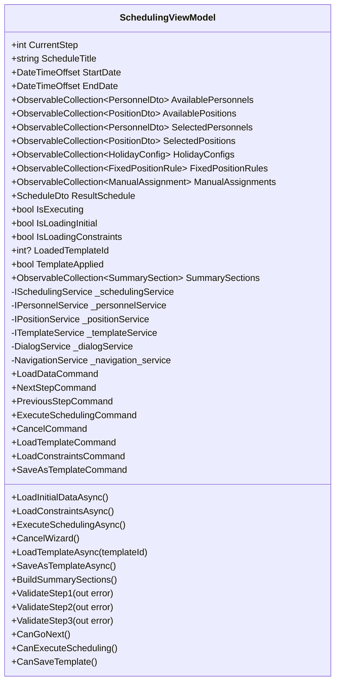

**Diagram sources**
- [SchedulingViewModel.cs](file://ViewModels/Scheduling/SchedulingViewModel.cs#L15-L530)

**Section sources**
- [SchedulingViewModel.cs](file://ViewModels/Scheduling/SchedulingViewModel.cs#L15-L530)

### TemplateViewModel 模板管理视图模型
TemplateViewModel负责排班模板的管理，提供模板的增删改查、复制、验证和使用功能。

**核心功能：**
- **模板管理**：Templates属性存储模板列表，SelectedTemplate属性管理当前选中的模板
- **资源选择**：AvailablePersonnel、AvailablePositions、SelectedPersonnel、SelectedPositions属性管理可用和选中的人员及哨位
- **约束管理**：HolidayConfigs、FixedPositionRules属性管理约束条件
- **分页搜索**：SearchKeyword、TypeFilter、PageSize、CurrentPage、TotalPages属性支持搜索和分页
- **命令系统**：LoadTemplatesCommand、CreateTemplateCommand、SaveTemplateCommand、DeleteTemplateCommand、DuplicateTemplateCommand、UseTemplateCommand、ValidateTemplateCommand等命令提供完整的模板管理功能
- **状态管理**：IsLoading、IsLoadingDetails、IsDetailPaneOpen、IsValidating属性管理各种UI状态
- **验证结果**：ValidationResult属性存储模板验证结果

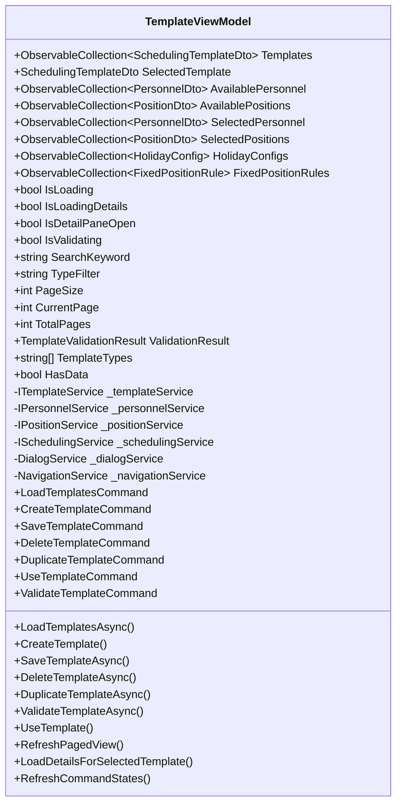

**Diagram sources**
- [TemplateViewModel.cs](file://ViewModels/Scheduling/TemplateViewModel.cs#L19-L495)

**Section sources**
- [TemplateViewModel.cs](file://ViewModels/Scheduling/TemplateViewModel.cs#L19-L495)

### DraftsViewModel 草稿管理视图模型
DraftsViewModel负责排班草稿的管理，提供草稿的加载、查看、确认和删除功能。

**核心功能：**
- **草稿列表**：Drafts属性存储草稿列表
- **状态管理**：IsLoading属性管理加载状态
- **命令系统**：LoadDraftsCommand、ViewDraftCommand、ConfirmDraftCommand、DeleteDraftCommand提供草稿管理功能
- **数据加载**：LoadDraftsAsync方法加载草稿列表
- **导航功能**：ViewDraftAsync、ConfirmDraftAsync、DeleteDraftAsync方法处理草稿操作和页面导航

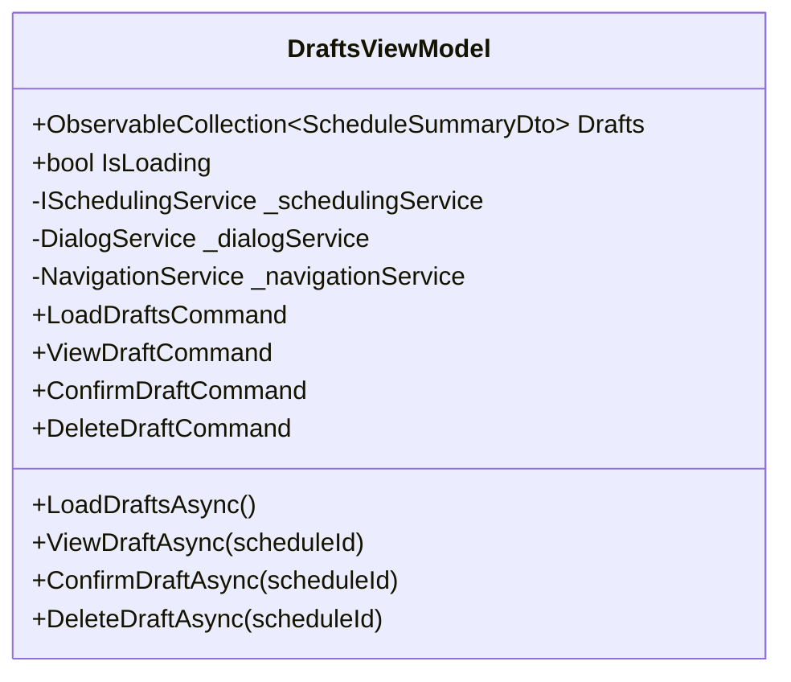

**Diagram sources**
- [DraftsViewModel.cs](file://ViewModels/Scheduling/DraftsViewModel.cs#L11-L114)

**Section sources**
- [DraftsViewModel.cs](file://ViewModels/Scheduling/DraftsViewModel.cs#L11-L114)

### ScheduleResultViewModel 排班结果视图模型
ScheduleResultViewModel负责排班结果的显示和操作，提供查看、确认、导出和重新排班功能。

**核心功能：**
- **结果展示**：Schedule属性存储排班结果，Conflicts属性存储冲突信息
- **视图模式**：CurrentViewMode属性控制显示模式（网格、列表、按人员）
- **状态管理**：IsLoading、IsConfirming、IsConflictPaneOpen属性管理各种UI状态
- **命令系统**：LoadScheduleCommand、ConfirmCommand、BackCommand、ExportExcelCommand、RescheduleCommand、ChangeViewModeCommand提供完整的操作功能
- **数据加载**：LoadScheduleAsync方法根据排班ID加载排班结果
- **确认功能**：ConfirmAsync方法处理排班确认逻辑
- **导出功能**：ExportExcelAsync方法实现排班结果导出
- **重新排班**：Reschedule方法基于当前排班创建新的排班请求

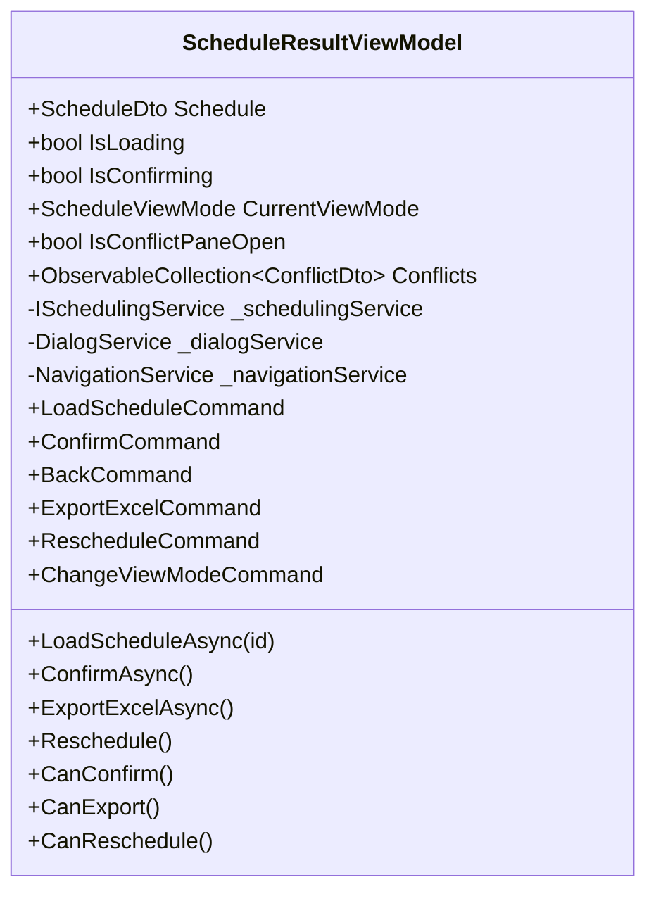

**Diagram sources**
- [ScheduleResultViewModel.cs](file://ViewModels/Scheduling/ScheduleResultViewModel.cs#L22-L213)

**Section sources**
- [ScheduleResultViewModel.cs](file://ViewModels/Scheduling/ScheduleResultViewModel.cs#L22-L213)

## 依赖注入与服务获取机制
ViewModel层通过构造函数依赖注入获取所需的服务实例，实现了松耦合的设计。所有ViewModel的构造函数都接收其依赖的服务作为参数，并在初始化时进行空值检查。

**依赖注入模式：**
- **服务接口注入**：每个ViewModel通过构造函数注入其所需的服务接口（如IPersonnelService、IHistoryService等）
- **辅助服务注入**：DialogService和NavigationService作为通用辅助服务被多个ViewModel注入
- **空值检查**：构造函数中使用null检查和ArgumentNullException确保依赖项不为空
- **服务定位**：部分ViewModel通过ServiceLocator模式获取服务实例（如HistoryViewModel中的NavigationService）

这种依赖注入机制使得ViewModel与具体服务实现解耦，便于单元测试和维护。

**Section sources**
- [PersonnelViewModel.cs](file://ViewModels/DataManagement/PersonnelViewModel.cs#L63-L79)
- [PositionViewModel.cs](file://ViewModels/DataManagement/PositionViewModel.cs#L57-L71)
- [SkillViewModel.cs](file://ViewModels/DataManagement/SkillViewModel.cs#L49-L61)
- [CompareViewModel.cs](file://ViewModels/History/CompareViewModel.cs#L89-L93)
- [HistoryDetailViewModel.cs](file://ViewModels/History/HistoryDetailViewModel.cs#L23-L27)
- [HistoryViewModel.cs](file://ViewModels/History/HistoryViewModel.cs#L54-L59)
- [DraftsViewModel.cs](file://ViewModels/Scheduling/DraftsViewModel.cs#L28-L38)
- [ScheduleResultViewModel.cs](file://ViewModels/Scheduling/ScheduleResultViewModel.cs#L78-L110)
- [SchedulingViewModel.cs](file://ViewModels/Scheduling/SchedulingViewModel.cs#L85-L119)
- [TemplateViewModel.cs](file://ViewModels/Scheduling/TemplateViewModel.cs#L179-L205)

## 命令绑定与异步操作实现
ViewModel层使用CommunityToolkit.Mvvm的命令系统实现UI交互，主要使用IAsyncRelayCommand和IRelayCommand。

**命令系统特点：**
- **异步命令**：IAsyncRelayCommand用于异步操作，自动处理任务执行和异常
- **同步命令**：IRelayCommand用于同步操作
- **条件命令**：命令的CanExecute逻辑控制UI元素的启用状态
- **参数化命令**：IAsyncRelayCommand<T>支持带参数的命令
- **命令状态更新**：通过NotifyCanExecuteChanged方法手动更新命令状态

**异步操作实现：**
- **ExecuteAsync辅助方法**：ViewModelBase提供的ExecuteAsync方法封装了异步操作的通用模式，自动处理繁忙状态、错误捕获和UI更新
- **错误处理**：异步操作中的异常被捕获并设置到ErrorMessage属性，触发UI更新
- **状态管理**：IsBusy属性在异步操作期间为true，阻止重复执行

**Section sources**
- [ViewModelBase.cs](file://ViewModels/Base/ViewModelBase.cs#L50-L119)
- [PersonnelViewModel.cs](file://ViewModels/DataManagement/PersonnelViewModel.cs#L15-L241)
- [PositionViewModel.cs](file://ViewModels/DataManagement/PositionViewModel.cs#L15-L225)
- [SkillViewModel.cs](file://ViewModels/DataManagement/SkillViewModel.cs#L13-L204)

## 属性变更通知机制
ViewModel层基于CommunityToolkit.Mvvm的ObservableObject实现属性变更通知，确保UI与数据同步。

**属性通知实现方式：**
- **[ObservableProperty]特性**：用于自动生成属性和变更通知代码
- **SetProperty方法**：手动实现属性时使用SetProperty方法确保变更通知
- **OnPropertyChanged重写**：在ListViewModelBase中重写OnPropertyChanged方法，当IsBusy或ErrorMessage变更时更新ShowEmptyState和ShowErrorState
- **集合变更通知**：ObservableCollection<T>自动通知UI集合变更

**状态联动：**
- **计算属性**：ShowEmptyState和ShowErrorState是基于其他属性计算的只读属性，通过OnPropertyChanged触发更新
- **命令状态联动**：通过PropertyChanged事件监听相关属性变化，调用NotifyCanExecuteChanged更新命令状态

**Section sources**
- [ViewModelBase.cs](file://ViewModels/Base/ViewModelBase.cs#L9-L119)
- [ListViewModelBase.cs](file://ViewModels/Base/ListViewModelBase.cs#L12-L150)

## 状态管理与UI逻辑封装
ViewModel层通过精心设计的状态属性和方法封装了复杂的UI逻辑，为View提供清晰的数据绑定接口。

**状态管理策略：**
- **统一状态模型**：IsBusy、IsLoading、ErrorMessage等属性提供一致的状态表示
- **视图状态分离**：不同ViewModel根据其功能定义特定的状态属性（如IsEditing、IsTimelineView等）
- **生命周期管理**：IsLoading、IsLoaded、IsEmpty属性管理页面生命周期状态
- **错误状态管理**：ErrorMessage属性集中管理错误信息，ShowErrorState属性控制错误UI的显示

**UI逻辑封装：**
- **命令模式**：将UI操作封装为命令，实现关注点分离
- **验证逻辑**：在ViewModel中实现数据验证，提供清晰的错误反馈
- **导航逻辑**：封装页面导航逻辑，避免View中的代码重复
- **业务规则**：将业务规则（如排班周期限制）封装在ViewModel中

**Section sources**
- [ViewModelBase.cs](file://ViewModels/Base/ViewModelBase.cs#L9-L119)
- [ListViewModelBase.cs](file://ViewModels/Base/ListViewModelBase.cs#L12-L150)
- [SchedulingViewModel.cs](file://ViewModels/Scheduling/SchedulingViewModel.cs#L15-L530)

## 业务逻辑到UI的转换
ViewModel层作为Model和View之间的桥梁，负责将业务逻辑结果转换为UI可消费的形式。

**转换机制：**
- **DTO转换**：服务返回的DTO直接或经过简单转换后暴露给View
- **集合转换**：将服务返回的集合转换为ObservableCollection<T>，支持UI绑定
- **状态转换**：将业务状态（如排班是否确认）转换为UI状态（如按钮是否可点击）
- **错误转换**：将异常转换为用户友好的错误消息
- **数据聚合**：将多个服务调用的结果聚合为一个统一的数据结构
- **格式化转换**：将原始数据格式化为适合UI显示的形式

这种转换机制确保了View的简洁性，同时保持了业务逻辑的完整性。

**Section sources**
- [PersonnelViewModel.cs](file://ViewModels/DataManagement/PersonnelViewModel.cs#L15-L241)
- [PositionViewModel.cs](file://ViewModels/DataManagement/PositionViewModel.cs#L15-L225)
- [SkillViewModel.cs](file://ViewModels/DataManagement/SkillViewModel.cs#L13-L204)
- [HistoryViewModel.cs](file://ViewModels/History/HistoryViewModel.cs#L15-L197)