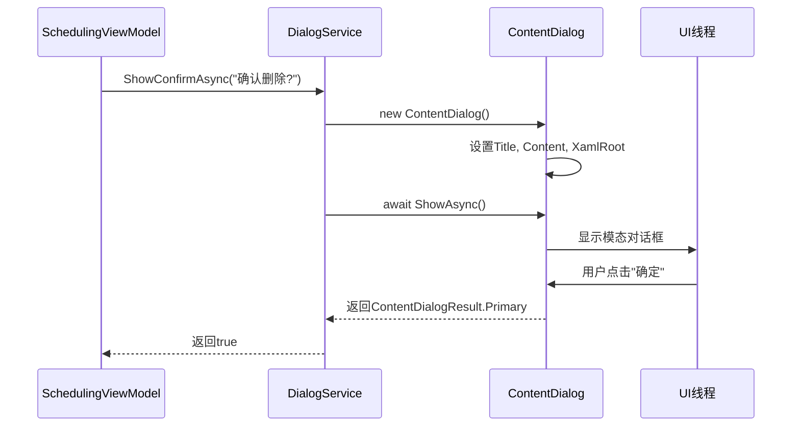
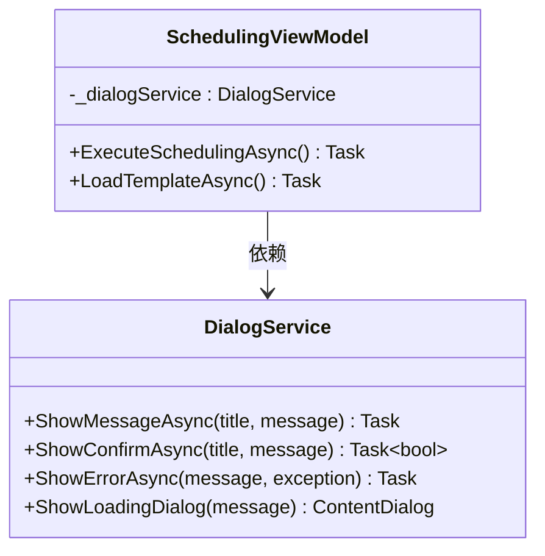

# 对话框服务

<cite>
**Referenced Files in This Document**  
- [DialogService.cs](file://Helpers/DialogService.cs)
- [SchedulingViewModel.cs](file://ViewModels/Scheduling/SchedulingViewModel.cs)
- [App.xaml.cs](file://App.xaml.cs)
- [ViewModelBase.cs](file://ViewModels/Base/ViewModelBase.cs)
- [NavigationService.cs](file://Helpers/NavigationService.cs)
</cite>

## 目录
1. [简介](#简介)
2. [核心设计与抽象层](#核心设计与抽象层)
3. [异步实现机制与上下文管理](#异步实现机制与上下文管理)
4. [在ViewModel中的标准调用模式](#在viewmodel中的标准调用模式)
5. [实际用例分析：SchedulingViewModel](#实际用例分析schedulingviewmodel)
6. [模态对话框的线程处理与超时机制](#模态对话框的线程处理与超时机制)
7. [自定义内容支持](#自定义内容支持)
8. [结论](#结论)

## 简介
`DialogService` 是 AutoScheduling3 应用程序中的一个关键辅助服务，旨在为 WinUI 3 应用提供一个统一、可测试且与 UI 解耦的对话框管理机制。它封装了原生的 `ContentDialog` 控件，通过提供一系列异步方法（如 `ShowMessageAsync`, `ShowConfirmAsync` 等），使得在 ViewModel 或其他业务逻辑层中可以方便地触发用户交互，而无需直接引用任何 UI 元素。这种设计遵循了 MVVM（Model-View-ViewModel）模式的最佳实践，极大地提升了代码的可维护性和可测试性。

**Section sources**
- [DialogService.cs](file://Helpers/DialogService.cs#L9-L157)

## 核心设计与抽象层

`DialogService` 的核心设计目的是在应用程序的业务逻辑层（如 ViewModel）和 UI 层之间建立一个清晰的抽象层。其主要职责是作为 `ContentDialog` 的工厂和控制器，隐藏其复杂的创建和显示细节。

该服务通过依赖注入（DI）的方式被注入到各个 ViewModel 中（如 `SchedulingViewModel`），从而实现了松耦合。ViewModel 只需调用 `DialogService` 的方法，而无需关心对话框是如何在 UI 线程上创建和显示的。这不仅简化了 ViewModel 的代码，还使其在单元测试中可以被轻松地模拟（Mock），从而可以独立于 UI 进行测试。

**Section sources**
- [DialogService.cs](file://Helpers/DialogService.cs#L9-L157)
- [SchedulingViewModel.cs](file://ViewModels/Scheduling/SchedulingViewModel.cs#L25-L31)

## 异步实现机制与上下文管理

`DialogService` 的所有核心方法都设计为异步（`async Task`），这是处理模态对话框的关键。`ContentDialog.ShowAsync()` 本身就是一个异步方法，它会挂起当前的执行流，直到用户与对话框交互（点击按钮）后才返回结果。

`DialogService` 通过 `await` 关键字直接调用 `ContentDialog.ShowAsync()`，并根据返回的 `ContentDialogResult` 来决定方法的最终返回值。例如，`ShowConfirmAsync` 方法会等待用户的选择，如果用户点击了“确定”按钮，则返回 `true`。

上下文管理是通过 `App.MainWindow?.Content?.XamlRoot` 属性实现的。`XamlRoot` 是 WinUI 3 中用于将 `ContentDialog` 与特定的 XAML 树关联的关键属性。如果未设置 `XamlRoot`，对话框将无法正确显示。`DialogService` 在创建每个 `ContentDialog` 实例时，都会从 `App` 类的静态属性 `MainWindow` 中获取当前主窗口的 `XamlRoot`，从而确保对话框能够正确地附加到应用的主 UI 树上。



**Diagram sources**
- [DialogService.cs](file://Helpers/DialogService.cs#L67-L78)
- [App.xaml.cs](file://App.xaml.cs#L45-L46)

## 在ViewModel中的标准调用模式

在 ViewModel 中使用 `DialogService` 的标准模式是通过构造函数注入，并在需要时直接调用其方法。`SchedulingViewModel` 是一个典型的例子。

1.  **依赖注入**：`SchedulingViewModel` 的构造函数接受一个 `DialogService` 实例作为参数，并将其存储在私有字段 `_dialogService` 中。
2.  **直接调用**：在业务逻辑中，可以直接使用 `_dialogService` 调用各种对话框方法。例如，在 `ExecuteSchedulingAsync` 方法中，当排班成功时，调用 `await _dialogService.ShowSuccessAsync("排班生成成功")`。
3.  **错误处理**：在 `try-catch` 块中，捕获到异常后，可以调用 `await _dialogService.ShowErrorAsync("执行排班失败", ex)` 来向用户展示错误信息，而无需在 ViewModel 中处理 UI 逻辑。

这种模式完全避免了 ViewModel 直接引用任何 UI 元素（如 `Page` 或 `Frame`），保持了 ViewModel 的纯粹性。



**Diagram sources**
- [SchedulingViewModel.cs](file://ViewModels/Scheduling/SchedulingViewModel.cs#L25-L31)
- [DialogService.cs](file://Helpers/DialogService.cs#L9-L157)

## 实际用例分析：SchedulingViewModel

`SchedulingViewModel` 全面展示了 `DialogService` 的集成方式。

- **错误提示**：在 `LoadInitialDataAsync`、`LoadConstraintsAsync`、`ExecuteSchedulingAsync` 和 `LoadTemplateAsync` 等多个异步操作中，`catch` 块都使用了 `ShowErrorAsync` 方法来报告加载或执行失败的详细信息，包括异常消息。
- **确认操作**：在 `SaveAsTemplateAsync` 方法中，虽然没有直接调用 `ShowConfirmAsync`，但它使用了 `ContentDialog` 的底层机制来创建一个自定义的输入对话框。这表明 `DialogService` 提供的 `ShowInputDialogAsync` 方法可以满足类似的确认和输入需求。
- **成功反馈**：当排班成功 (`ExecuteSchedulingAsync`)、模板加载成功 (`LoadTemplateAsync`) 或模板保存成功 (`SaveAsTemplateAsync`) 时，都会调用 `ShowSuccessAsync` 或 `ShowMessageAsync` 来给予用户正向反馈。
- **警告提示**：在 `ExecuteSchedulingAsync` 的验证逻辑中，如果用户输入不完整，会调用 `ShowWarningAsync` 来提示用户。

这些用例证明了 `DialogService` 是一个中心化的、可靠的用户交互入口。

**Section sources**
- [SchedulingViewModel.cs](file://ViewModels/Scheduling/SchedulingViewModel.cs#L150-L158)
- [SchedulingViewModel.cs](file://ViewModels/Scheduling/SchedulingViewModel.cs#L200-L208)
- [SchedulingViewModel.cs](file://ViewModels/Scheduling/SchedulingViewModel.cs#L275-L285)
- [SchedulingViewModel.cs](file://ViewModels/Scheduling/SchedulingViewModel.cs#L340-L350)

## 模态对话框的线程处理与超时机制

`DialogService` 利用 `ContentDialog.ShowAsync()` 的异步特性，完美地处理了模态对话框的线程问题。当一个异步方法（如 `ShowConfirmAsync`）被调用时，它会在当前的 `SynchronizationContext`（通常是 UI 线程）上执行。`await` 关键字会“挂起”该方法的后续代码，但不会阻塞 UI 线程，从而保证了应用的响应性。

关于超时机制，当前的 `DialogService` 实现中并未直接提供。`ContentDialog` 本身也没有内置的超时功能。如果需要实现超时，可以在调用 `ShowAsync()` 时使用 `Task.WhenAny` 或 `CancellationToken` 来包装任务，但这超出了 `DialogService` 当前的职责范围。目前，对话框会一直显示，直到用户进行交互。

**Section sources**
- [DialogService.cs](file://Helpers/DialogService.cs#L67-L78)

## 自定义内容支持

`DialogService` 不仅支持简单的消息和确认对话框，还通过 `ShowLoadingDialog` 和 `ShowInputDialogAsync` 方法提供了对自定义内容的支持。

- **加载对话框**：`ShowLoadingDialog` 方法创建了一个包含 `ProgressRing` 和 `TextBlock` 的 `StackPanel` 作为对话框内容，用于显示加载状态。它返回一个 `ContentDialog` 实例，允许调用者在操作完成后手动调用 `Hide()` 方法来关闭对话框，这在 `SchedulingViewModel` 的 `ExecuteSchedulingAsync` 方法中得到了应用。
- **输入对话框**：`ShowInputDialogAsync` 方法创建了一个包含 `TextBox` 的复杂内容，允许用户输入文本。它展示了如何在 `DialogService` 内部构建更复杂的 UI 元素并将其集成到对话框中。

这些方法证明了 `DialogService` 的设计是可扩展的，能够满足多样化的用户交互需求。

```mermaid
flowchart TD
A[调用 ShowLoadingDialog] --> B[创建 ContentDialog]
B --> C[设置 Title]
C --> D[创建 StackPanel]
D --> E[添加 ProgressRing]
D --> F[添加 TextBlock]
B --> G[设置 XamlRoot]
B --> H[异步显示对话框]
H --> I[返回 ContentDialog 实例]
I --> J[ViewModel 保存引用]
J --> K[操作完成后调用 Hide()]
```

**Diagram sources**
- [DialogService.cs](file://Helpers/DialogService.cs#L97-L121)
- [SchedulingViewModel.cs](file://ViewModels/Scheduling/SchedulingViewModel.cs#L260-L265)

## 结论

`DialogService` 是一个设计精良的抽象层，它成功地将 WinUI 3 的 `ContentDialog` 功能封装起来，为 MVVM 架构下的 ViewModel 提供了安全、便捷的对话框调用方式。其异步实现机制确保了 UI 的流畅性，通过 `XamlRoot` 进行的上下文管理保证了对话框的正确显示。在 `SchedulingViewModel` 等实际用例中的广泛应用，证明了其在错误提示、用户确认和状态反馈方面的有效性。尽管目前缺少内置的超时机制，但其对自定义内容（如加载指示器和输入框）的支持，展现了其强大的灵活性和扩展性，是整个应用程序用户交互体系的核心组件。