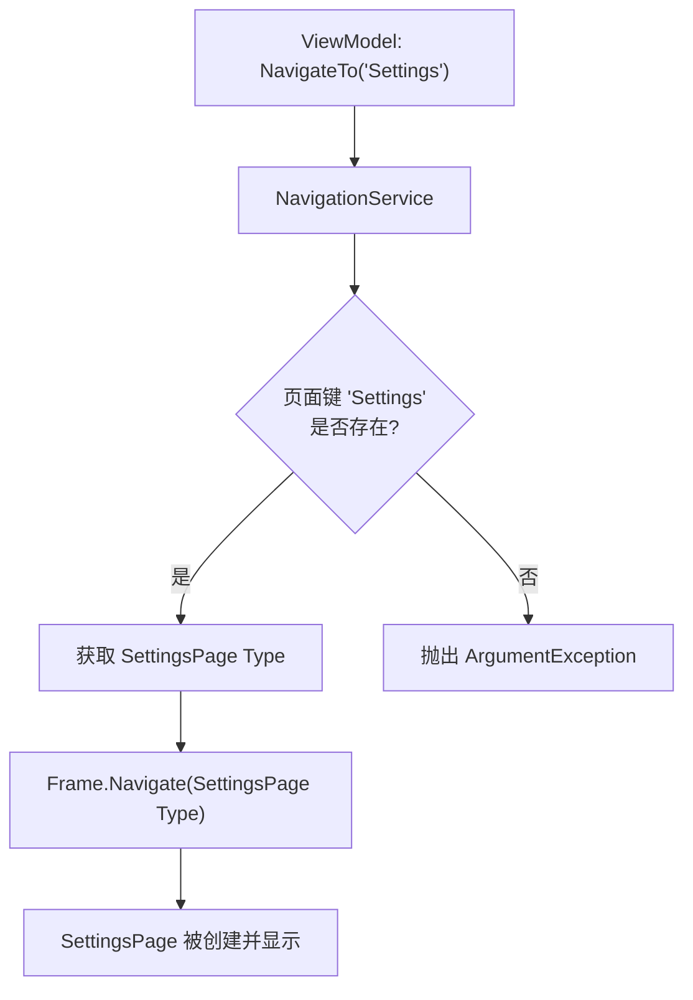
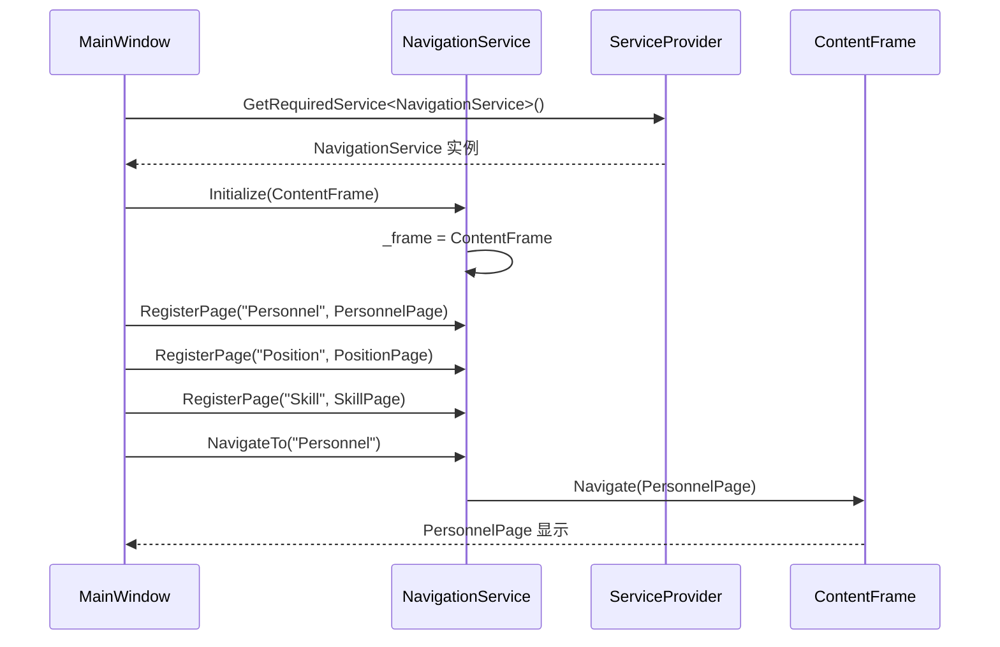

# 导航服务

<cite>
**Referenced Files in This Document**   
- [NavigationService.cs](file://Helpers/NavigationService.cs)
- [MainWindow.xaml.cs](file://MainWindow.xaml.cs)
- [ViewModelBase.cs](file://ViewModels/Base/ViewModelBase.cs)
</cite>

## 目录
1. [简介](#简介)
2. [核心功能与实现机制](#核心功能与实现机制)
3. [初始化与注册](#初始化与注册)
4. [与ViewModelBase的集成](#与viewmodelbase的集成)
5. [异常处理与日志记录](#异常处理与日志记录)
6. [线程安全性分析](#线程安全性分析)
7. [内存泄漏防范](#内存泄漏防范)
8. [扩展点设计](#扩展点设计)

## 简介

`NavigationService` 是 AutoScheduling3 应用程序中的核心导航组件，专为 WinUI 3 MVVM 架构设计。该服务封装了 `Frame` 控件的导航功能，提供了一个类型安全、易于使用的 API 来管理应用程序内的页面跳转。它通过注册页面键与页面类型的映射关系，实现了松耦合的导航机制，使得 ViewModel 层可以独立于具体的 UI 实现进行页面导航操作，从而增强了代码的可测试性和可维护性。

**Section sources**
- [NavigationService.cs](file://Helpers/NavigationService.cs#L9-L116)

## 核心功能与实现机制

`NavigationService` 提供了以下核心方法来实现页面间的导航与参数传递：

- **`NavigateTo(string pageKey, object? parameter = null)`**: 这是主要的导航方法。它接收一个在初始化时注册的页面键（如 "Personnel"、"Settings"）和一个可选的参数对象。服务内部通过字典查找对应的 `Type`，然后调用底层 `Frame` 的 `Navigate` 方法完成跳转。此方法是实现 MVVM 解耦的关键，ViewModel 只需知道页面的逻辑名称即可发起导航。
- **`GoBack()` 和 `GoForward()`**: 分别用于实现后退和前进功能。这些方法会检查 `Frame` 的导航堆栈状态（`CanGoBack`/`CanGoForward`），在确保安全的前提下执行相应的导航操作。
- **`ClearHistory()`**: 用于清空导航历史记录，通过清除 `Frame` 的 `BackStack` 和 `ForwardStack` 来实现。

参数传递通过 `Navigate` 方法的第二个参数实现，允许在页面间传递任意对象。目标页面的 `OnNavigatedTo` 事件可以接收并处理此参数。



**Diagram sources**
- [NavigationService.cs](file://Helpers/NavigationService.cs#L70-L85)
- [NavigationService.cs](file://Helpers/NavigationService.cs#L90-L100)

**Section sources**
- [NavigationService.cs](file://Helpers/NavigationService.cs#L70-L116)

## 初始化与注册

`NavigationService` 的使用遵循严格的生命周期。首先，必须在应用程序启动时进行初始化，通常在主窗口（`MainWindow`）的构造函数中完成。

在 `MainWindow.xaml.cs` 中，`InitializeNavigation` 方法负责此过程：
1.  从依赖注入容器（`ServiceProvider`）中获取 `NavigationService` 的单例实例。
2.  调用 `Initialize(Frame frame)` 方法，将主窗口中的 `ContentFrame` 作为参数传入，从而将服务与具体的 UI 容器绑定。
3.  通过 `RegisterPage` 方法，将一系列页面键（如 "Personnel", "Position"）与对应的页面类型（如 `typeof(PersonnelPage)`）注册到内部字典中。这一步建立了导航的映射关系。
4.  最后，通过 `NavigateTo("Personnel")` 执行默认导航，将应用程序的初始页面设置为人员管理页面。



**Diagram sources**
- [MainWindow.xaml.cs](file://MainWindow.xaml.cs#L41-L78)
- [NavigationService.cs](file://Helpers/NavigationService.cs#L20-L35)

**Section sources**
- [MainWindow.xaml.cs](file://MainWindow.xaml.cs#L41-L78)

## 与ViewModelBase的集成

`NavigationService` 与 `ViewModelBase` 的集成是通过依赖注入（DI）实现的。`ViewModelBase` 本身不直接持有 `NavigationService`，而是由具体的 ViewModel 在构造函数中通过 DI 容器获取其实例。

`ViewModelBase` 提供了 `ExecuteAsync` 辅助方法，可用于包装导航操作，以确保在执行导航时正确地管理 `IsBusy` 状态。例如，一个 ViewModel 可以这样安全地执行导航：

```csharp
// 在具体的 ViewModel 中
private readonly NavigationService _navigationService;

public MyViewModel(NavigationService navigationService)
{
    _navigationService = navigationService;
}

private async Task NavigateToSettings()
{
    await ExecuteAsync(() =>
    {
        _navigationService.NavigateTo("Settings");
        return Task.CompletedTask;
    }, "正在跳转...");
}
```

这种方式将导航操作视为一种“异步任务”，利用 `ViewModelBase` 的状态管理机制来控制 UI 的繁忙状态。

**Section sources**
- [ViewModelBase.cs](file://ViewModels/Base/ViewModelBase.cs#L45-L78)
- [NavigationService.cs](file://Helpers/NavigationService.cs)

## 异常处理与日志记录

`NavigationService` 内置了健壮的异常处理机制，以防止因导航错误导致应用崩溃：
- **未初始化检查**: 所有导航操作（`NavigateTo`, `GoBack` 等）都会首先检查 `_frame` 是否为 `null`。如果服务未被正确初始化，将抛出 `InvalidOperationException`，提示开发者必须先调用 `Initialize` 方法。
- **无效页面键检查**: `NavigateTo` 方法在内部字典中查找页面键时，如果未找到，会抛出带有明确信息的 `ArgumentException`，指出哪个键未被注册。
- **类型安全检查**: `RegisterPage` 方法在注册时会验证传入的 `Type` 是否继承自 `Page`，防止注册无效类型。

虽然当前代码中没有显式的日志记录（如 `ILogger`），但其异常信息设计得非常清晰，便于调试。在 `App.xaml.cs` 中，全局的 `UnhandledException` 事件处理器会捕获任何未处理的异常并输出到调试窗口，这为 `NavigationService` 可能抛出的异常提供了兜底的日志记录。

**Section sources**
- [NavigationService.cs](file://Helpers/NavigationService.cs#L20-L35)
- [NavigationService.cs](file://Helpers/NavigationService.cs#L70-L85)
- [App.xaml.cs](file://App.xaml.cs#L55-L60)

## 线程安全性分析

`NavigationService` 的线程安全性主要依赖于 WinUI 3 框架本身。WinUI 3 是一个单线程的 UI 框架，所有的 UI 操作（包括导航）都必须在 UI 线程上执行。

`NavigationService` 的所有公共方法都没有使用锁（`lock`）或其他同步原语，这意味着它本身不是线程安全的。如果从非 UI 线程（例如后台任务线程）直接调用 `NavigateTo`，将会导致运行时异常。

然而，在 MVVM 模式下，导航请求通常由 ViewModel 发起，而 ViewModel 的命令执行逻辑通常在 UI 线程上触发。此外，`ViewModelBase` 的 `ExecuteAsync` 方法在 `finally` 块中重置 `IsBusy` 状态，这依赖于 `Dispatcher` 的调度，确保了状态变更在 UI 线程上完成。因此，只要遵循 MVVM 的标准实践，`NavigationService` 的使用是安全的。

**Section sources**
- [NavigationService.cs](file://Helpers/NavigationService.cs)
- [ViewModelBase.cs](file://ViewModels/Base/ViewModelBase.cs#L45-L78)

## 内存泄漏防范

`NavigationService` 通过以下方式有效避免了内存泄漏：
- **弱引用设计**: 服务本身不持有对 `Frame` 或页面实例的强引用。它只持有 `Frame` 的引用（在 `_frame` 字段中），而 `Frame` 会管理其导航堆栈中的页面。当页面从堆栈中移除时，只要没有其他强引用，它们就可以被垃圾回收。
- **事件订阅管理**: 在 `MainWindow.xaml.cs` 中，`_themeService.ThemeChanged` 事件的订阅是在 `InitializeTheme` 方法中完成的。虽然代码中没有显式取消订阅，但由于 `_themeService` 的生命周期与 `MainWindow` 绑定，当窗口关闭时，这些引用会一并被释放，通常不会造成问题。对于在 `NavigationService` 中可能存在的事件订阅，应确保在服务销毁时进行清理。

最佳实践是确保所有跨组件的事件订阅都有明确的取消订阅逻辑，尤其是在服务的生命周期长于事件发布者时。

**Section sources**
- [NavigationService.cs](file://Helpers/NavigationService.cs#L15-L16)
- [MainWindow.xaml.cs](file://MainWindow.xaml.cs#L65-L69)

## 扩展点设计

`NavigationService` 当前的设计提供了良好的扩展性：
- **注册机制**: `RegisterPage` 方法允许在运行时动态注册新的页面，为插件化或模块化架构提供了可能。
- **方法重载**: 提供了 `NavigateTo`（通过键）和 `Navigate`（直接通过 `Type`）两种方法，满足了不同的使用场景。
- **状态查询**: 提供了 `CanGoBack` 和 `CanGoForward` 属性，允许外部组件（如 UI 控件）根据导航状态来启用或禁用按钮。

一个潜在的扩展点是添加导航事件（如 `Navigating`、`Navigated`），以便其他组件可以监听导航动作并执行相应逻辑（如日志记录、权限检查）。另一个扩展是引入导航拦截器或守卫（Guard），在导航发生前进行条件判断。

**Section sources**
- [NavigationService.cs](file://Helpers/NavigationService.cs#L37-L116)