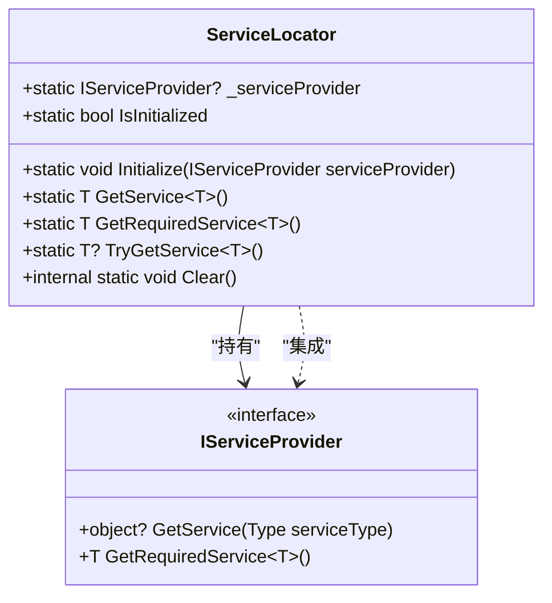

# 服务定位器

<cite>
**Referenced Files in This Document**   
- [ServiceLocator.cs](file://Helpers/ServiceLocator.cs)
- [App.xaml.cs](file://App.xaml.cs)
- [SettingsPage.xaml.cs](file://Views/Settings/SettingsPage.xaml.cs)
- [BoolToBrushConverter.cs](file://Converters/BoolToBrushConverter.cs)
</cite>

## 目录
1. [引言](#引言)
2. [核心设计与实现](#核心设计与实现)
3. [服务注册与解析机制](#服务注册与解析机制)
4. [与IServiceProvider的集成](#与iserviceprovider的集成)
5. [非构造函数上下文中的应用](#非构造函数上下文中的应用)
6. [使用示例](#使用示例)
7. [使用原则与反模式](#使用原则与反模式)
8. [与构造函数注入的对比](#与构造函数注入的对比)
9. [结论](#结论)

## 引言
服务定位器模式在依赖注入体系中扮演着补充角色，为那些无法通过构造函数注入获取服务的场景提供了解决方案。在AutoScheduling3项目中，`ServiceLocator`类作为全局服务解析容器，实现了对依赖注入容器的静态访问。这种设计特别适用于静态方法、值转换器等无法使用构造函数注入的上下文，确保了服务获取的灵活性和便利性。

## 核心设计与实现

`ServiceLocator`类被设计为一个静态类，通过私有静态字段`_serviceProvider`持有`IServiceProvider`实例，实现了全局单一访问点。其核心设计遵循了初始化-使用-清理的生命周期模式，确保了服务容器的安全访问。

该实现采用了延迟初始化模式，在应用程序启动时通过`Initialize`方法注入`IServiceProvider`实例。这种设计将服务定位器的初始化与应用程序的启动流程解耦，允许在依赖注入容器完全配置后才进行绑定。

**Section sources**
- [ServiceLocator.cs](file://Helpers/ServiceLocator.cs#L8-L78)

## 服务注册与解析机制

服务定位器本身不负责服务的注册，而是作为已注册服务的解析器。服务注册由`IServiceCollection`在应用程序启动时完成，而服务解析则通过`ServiceLocator`提供的静态方法实现。

`ServiceLocator`提供了三种服务解析方法：`GetService<T>()`、`GetRequiredService<T>()`和`TryGetService<T>()`。这些方法封装了对底层`IServiceProvider`的调用，同时添加了必要的空值检查和异常处理。

`GetService<T>()`方法在服务未注册时抛出`InvalidOperationException`异常，确保了调用者能够及时发现配置错误。`GetRequiredService<T>()`直接委托给`IServiceProvider`的同名方法，而`TryGetService<T>()`则在服务定位器未初始化时返回`null`，提供了更宽松的错误处理策略。

**Section sources**
- [ServiceLocator.cs](file://Helpers/ServiceLocator.cs#L35-L78)

## 与IServiceProvider的集成

`ServiceLocator`与`IServiceProvider`的集成是通过`Initialize`方法实现的。在`App.xaml.cs`中，当依赖注入容器构建完成后，`ServiceProvider`实例被传递给`ServiceLocator.Initialize()`方法，建立了全局服务访问通道。

这种集成方式保持了与Microsoft.Extensions.DependencyInjection框架的兼容性，使得`ServiceLocator`能够无缝访问所有通过`IServiceCollection`注册的服务。`IServiceProvider`作为依赖注入容器的运行时接口，提供了服务解析的核心功能，而`ServiceLocator`则为其提供了静态访问的便利性。

`IsInitialized`属性提供了对服务定位器状态的检查，确保在尝试获取服务之前容器已经正确初始化。这种防御性设计避免了在应用程序启动早期阶段可能出现的空引用异常。



**Diagram sources**
- [ServiceLocator.cs](file://Helpers/ServiceLocator.cs#L8-L78)
- [App.xaml.cs](file://App.xaml.cs#L26)

**Section sources**
- [ServiceLocator.cs](file://Helpers/ServiceLocator.cs#L8-L78)
- [App.xaml.cs](file://App.xaml.cs#L75)

## 非构造函数上下文中的应用

服务定位器的主要应用场景是非构造函数上下文，其中最典型的是XAML值转换器。在WPF/UWP应用程序中，值转换器通常由XAML解析器实例化，无法通过构造函数注入获取依赖服务。

尽管在当前代码库中未发现`ServiceLocator`在转换器中的直接使用，但其设计完全支持此类场景。例如，一个需要访问`IThemeService`来根据当前主题返回不同画笔的转换器，可以通过`ServiceLocator.GetService<IThemeService>()`来获取所需服务。

另一个重要应用场景是静态方法和工具类。当静态方法需要访问应用程序服务时，构造函数注入不再适用，此时服务定位器提供了必要的服务获取能力。此外，在事件处理程序、异常处理全局钩子等基础设施代码中，服务定位器也发挥着重要作用。

**Section sources**
- [BoolToBrushConverter.cs](file://Converters/BoolToBrushConverter.cs#L7-L42)

## 使用示例

在`SettingsPage.xaml.cs`中，`ServiceLocator`被用于在页面导航到时获取`IThemeService`和`IConfigurationService`实例。这种使用模式展示了服务定位器在页面生命周期中的典型应用。

```csharp
protected override void OnNavigatedTo(NavigationEventArgs e)
{
    base.OnNavigatedTo(e);
    
    // 获取服务实例
    _themeService = ServiceLocator.GetService<IThemeService>();
    _configurationService = ServiceLocator.GetService<IConfigurationService>();
    
    InitializeSettings();
}
```

此示例中，服务在`OnNavigatedTo`方法中获取，避免了在构造函数中进行可能耗时的服务初始化操作。这种延迟获取模式提高了页面加载性能，同时确保了服务在需要时才被解析。

**Section sources**
- [SettingsPage.xaml.cs](file://Views/Settings/SettingsPage.xaml.cs#L28-L32)

## 使用原则与反模式

尽管服务定位器提供了便利，但必须遵循严格的使用原则以避免滥用。首要原则是优先使用构造函数注入，仅在确实无法使用构造函数注入时才考虑服务定位器。

滥用服务定位器会导致"服务定位器污染"，使得类的依赖关系变得隐式和难以追踪。这会降低代码的可测试性和可维护性，因为依赖关系不再通过构造函数显式声明。

另一个重要原则是避免在业务逻辑核心中使用服务定位器。它应该主要局限于基础设施代码、UI层和跨切面关注点。在领域模型或核心业务服务中使用服务定位器通常是设计缺陷的标志。

`TryGetService<T>()`方法的使用也需要谨慎，因为它可能掩盖配置错误。除非确实需要可选依赖，否则应使用`GetService<T>()`或`GetRequiredService<T>()`来确保依赖的显式性和完整性。

## 与构造函数注入的对比

构造函数注入是依赖注入的首选方式，它提供了依赖关系的显式声明，使得类的依赖一目了然。这种显式性极大地提高了代码的可读性、可测试性和可维护性。

相比之下，服务定位器提供了更大的灵活性，但以牺牲显式性为代价。使用服务定位器的类不再通过构造函数声明其依赖，这使得依赖关系变得隐式和分散。

从生命周期管理角度看，构造函数注入允许依赖注入容器自动管理对象生命周期，而服务定位器使用者需要自行确保服务的正确使用和释放。

在测试方面，构造函数注入使得单元测试更加简单，因为依赖可以通过模拟对象直接注入。而使用服务定位器的类需要在测试中配置全局服务容器，增加了测试的复杂性。

因此，最佳实践是将构造函数注入作为默认选择，仅在特定场景下使用服务定位器作为补充。

## 结论

`ServiceLocator`在AutoScheduling3项目中作为一个重要的基础设施组件，为非构造函数上下文提供了服务获取能力。其设计简洁而有效，通过与`IServiceProvider`的集成，实现了对依赖注入容器的全局访问。

然而，这种便利性必须谨慎使用。开发者应始终坚持构造函数注入优先的原则，仅在确实需要时才使用服务定位器。通过遵循这一原则，可以在保持代码清晰性和可测试性的同时，获得必要的灵活性。

服务定位器不是依赖注入的替代品，而是其补充。正确理解和使用这一模式，对于构建既灵活又可维护的应用程序架构至关重要。