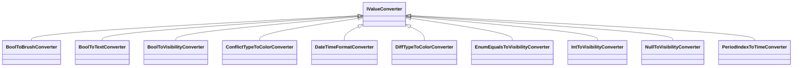

# 辅助组件

<cite>
**本文档中引用的文件**  
- [NavigationService.cs](file://Helpers/NavigationService.cs)
- [DialogService.cs](file://Helpers/DialogService.cs)
- [ServiceLocator.cs](file://Helpers/ServiceLocator.cs)
- [BoolToBrushConverter.cs](file://Converters/BoolToBrushConverter.cs)
- [BoolToTextConverter.cs](file://Converters/BoolToTextConverter.cs)
- [BoolToVisibilityConverter.cs](file://Converters/BoolToVisibilityConverter.cs)
- [ConflictTypeToColorConverter.cs](file://Converters/ConflictTypeToColorConverter.cs)
- [DateTimeFormatConverter.cs](file://Converters/DateTimeFormatConverter.cs)
- [DiffTypeToColorConverter.cs](file://Converters/DiffTypeToColorConverter.cs)
- [EnumEqualsToVisibilityConverter.cs](file://Converters/EnumEqualsToVisibilityConverter.cs)
- [IntToVisibilityConverter.cs](file://Converters/IntToVisibilityConverter.cs)
- [NullToVisibilityConverter.cs](file://Converters/NullToVisibilityConverter.cs)
- [PeriodIndexToTimeConverter.cs](file://Converters/PeriodIndexToTimeConverter.cs)
</cite>

## 目录
1. [引言](#引言)
2. [导航服务](#导航服务)
3. [对话框服务](#对话框服务)
4. [服务定位器](#服务定位器)
5. [值转换器集合](#值转换器集合)
6. [跨组件通信与全局状态管理](#跨组件通信与全局状态管理)
7. [使用方法与最佳实践](#使用方法与最佳实践)
8. [总结](#总结)

## 引言
本项目通过一系列辅助工具和服务，显著提升了开发效率和代码质量。这些组件包括用于页面导航的`NavigationService`、管理对话框显示的`DialogService`、支持全局服务访问的`ServiceLocator`，以及位于`Converters`目录下的多种值转换器。它们共同构建了一个松耦合、高内聚的应用架构，便于维护和扩展。

## 导航服务
`NavigationService`负责管理应用程序中的页面导航逻辑，封装了对`Frame`控件的操作，提供类型安全的导航接口。

该服务支持通过字符串键注册和导航到页面，也可直接使用类型进行导航。同时提供了后退、前进、清空历史等完整导航控制功能，确保用户界面行为的一致性和可预测性。

**图示来源**  
- [NavigationService.cs](file://Helpers/NavigationService.cs#L1-L117)

**本节来源**  
- [NavigationService.cs](file://Helpers/NavigationService.cs#L1-L117)

## 对话框服务
`DialogService`提供了一组异步方法，用于统一显示各种类型的对话框，包括消息提示、错误报告、确认操作、警告、成功通知、加载状态和输入请求。

所有对话框均基于`ContentDialog`实现，并自动绑定到主窗口的`XamlRoot`，避免跨线程异常。服务采用异步模式，防止阻塞UI线程，提升用户体验。

**图示来源**  
- [DialogService.cs](file://Helpers/DialogService.cs#L1-L158)

**本节来源**  
- [DialogService.cs](file://Helpers/DialogService.cs#L1-L158)

## 服务定位器
`ServiceLocator`是一个静态类，用于在应用程序的任何位置访问依赖注入容器中的服务实例，解决了在非依赖注入上下文中获取服务的需求。

它通过`Initialize`方法接收`IServiceProvider`实例，并提供`GetService<T>`、`GetRequiredService<T>`和`TryGetService<T>`三种方式获取服务，分别对应可空返回、强制抛出异常和安全尝试获取的场景。

**图示来源**  
- [ServiceLocator.cs](file://Helpers/ServiceLocator.cs#L1-L78)

**本节来源**  
- [ServiceLocator.cs](file://Helpers/ServiceLocator.cs#L1-L78)

## 值转换器集合
`Converters`目录包含多个实现`IValueConverter`接口的值转换器，用于在XAML绑定中转换数据类型和表现形式。

| 转换器名称 | 功能描述 |
|-----------|--------|
| `BoolToBrushConverter` | 将布尔值转换为画刷颜色，支持自定义颜色映射 |
| `BoolToTextConverter` | 将布尔值转换为文本，支持自定义真/假文本 |
| `BoolToVisibilityConverter` | 将布尔值转换为可见性，支持通过参数或属性反转逻辑 |
| `ConflictTypeToColorConverter` | 根据冲突类型字符串返回对应颜色 |
| `DateTimeFormatConverter` | 格式化日期时间，支持自定义格式字符串 |
| `DiffTypeToColorConverter` | 根据变更类型返回对应背景色 |
| `EnumEqualsToVisibilityConverter` | 当枚举值等于指定参数时显示元素 |
| `IntToVisibilityConverter` | 当整数值等于指定参数时显示元素 |
| `NullToVisibilityConverter` | 根据对象是否为null或集合是否为空控制可见性 |
| `PeriodIndexToTimeConverter` | 将时段索引转换为时间范围文本 |

**图示来源**  
- [BoolToBrushConverter.cs](file://Converters/BoolToBrushConverter.cs#L1-L44)
- [BoolToTextConverter.cs](file://Converters/BoolToTextConverter.cs#L1-L27)
- [BoolToVisibilityConverter.cs](file://Converters/BoolToVisibilityConverter.cs#L1-L41)
- [ConflictTypeToColorConverter.cs](file://Converters/ConflictTypeToColorConverter.cs#L1-L34)
- [DateTimeFormatConverter.cs](file://Converters/DateTimeFormatConverter.cs#L1-L50)
- [DiffTypeToColorConverter.cs](file://Converters/DiffTypeToColorConverter.cs#L1-L23)
- [EnumEqualsToVisibilityConverter.cs](file://Converters/EnumEqualsToVisibilityConverter.cs#L1-L28)
- [IntToVisibilityConverter.cs](file://Converters/IntToVisibilityConverter.cs#L1-L27)
- [NullToVisibilityConverter.cs](file://Converters/NullToVisibilityConverter.cs#L1-L40)
- [PeriodIndexToTimeConverter.cs](file://Converters/PeriodIndexToTimeConverter.cs#L1-L27)

**本节来源**  
- [Converters/](file://Converters/)

## 跨组件通信与全局状态管理
本系统通过`ServiceLocator`实现跨组件通信和全局状态访问。所有注册到依赖注入容器的服务均可通过`ServiceLocator.GetService<T>()`在任意位置获取，打破了传统MVVM中ViewModel之间通信的局限。

例如，`DialogService`可在ViewModel中直接调用，无需通过命令或事件聚合器传递消息。同样，导航操作也可在业务逻辑层触发，实现“操作完成自动跳转”等高级功能。

这种模式虽简化了通信机制，但也需谨慎使用，避免过度依赖全局状态。建议仅将`ServiceLocator`用于基础设施服务（如日志、对话框、导航），而业务状态仍应通过依赖注入传递。

## 使用方法与最佳实践
### 导航服务使用
1. 在应用启动时调用`Initialize(frame)`初始化服务
2. 注册所有页面：`RegisterPage("Home", typeof(HomePage))`
3. 使用键导航：`NavigateTo("Home", parameter)`
4. 使用类型导航：`Navigate(typeof(HomePage), parameter)`

### 对话框服务使用
- 使用`async/await`调用显示方法
- 错误对话框应包含异常详情
- 确认对话框需明确主次按钮语义
- 加载对话框应配合`using`语句自动关闭

### 服务定位器使用
- 必须在应用启动时调用`Initialize(provider)`
- 优先使用构造函数注入，仅在必要时使用`ServiceLocator`
- 避免在循环中频繁调用`GetService`

### 值转换器使用
- 在XAML资源中声明转换器实例
- 支持通过`ConverterParameter`传递参数
- 多参数可通过`string[]`或分隔符传递
- 注意`ConvertBack`方法的实现需求

## 总结
上述辅助组件构成了本系统的核心支撑体系。`NavigationService`和`DialogService`统一了用户交互模式，`ServiceLocator`实现了灵活的服务访问，而丰富的值转换器集合则极大增强了UI数据绑定的能力。这些设计不仅提升了开发效率，也保证了代码的一致性和可维护性，是现代WPF/WinUI应用架构的重要组成部分。