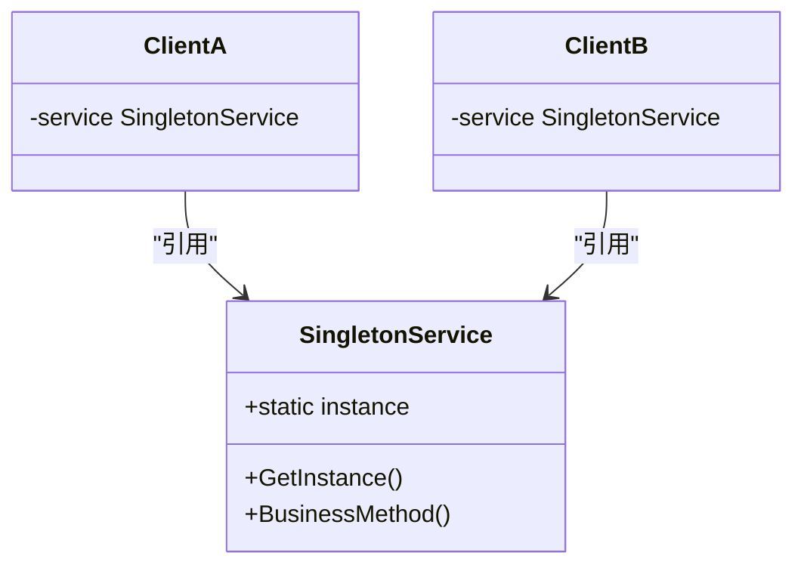
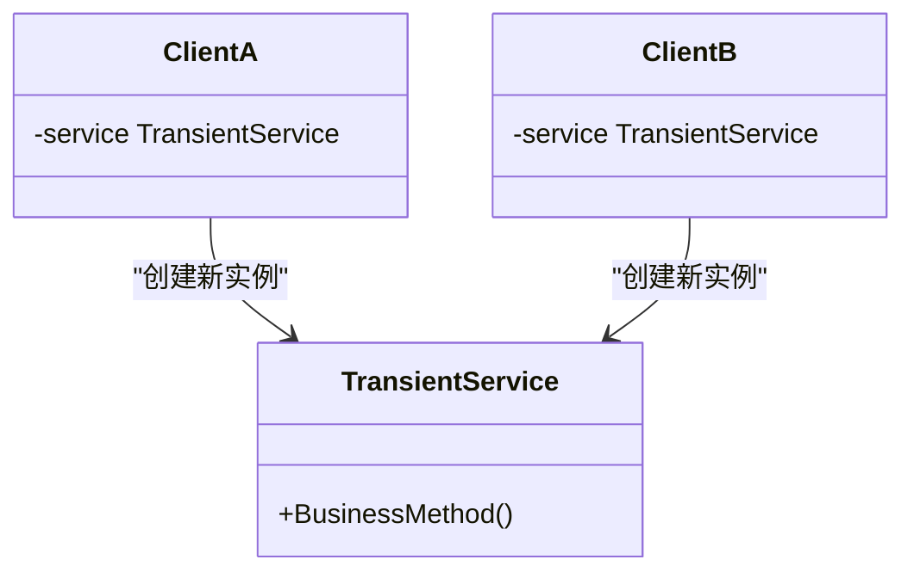
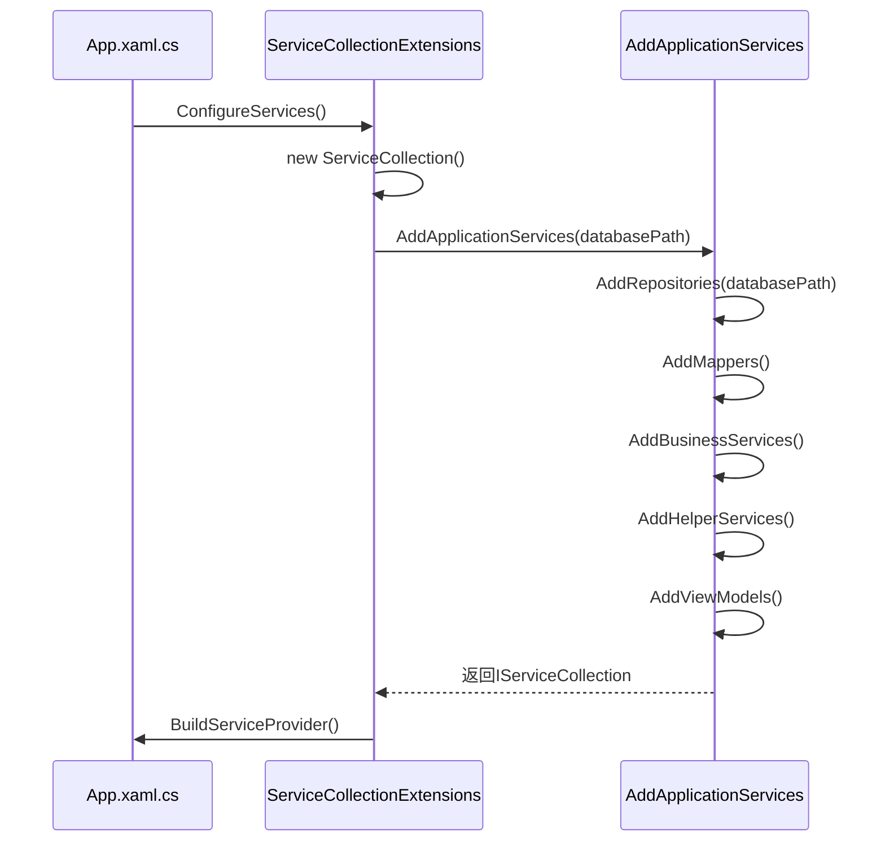
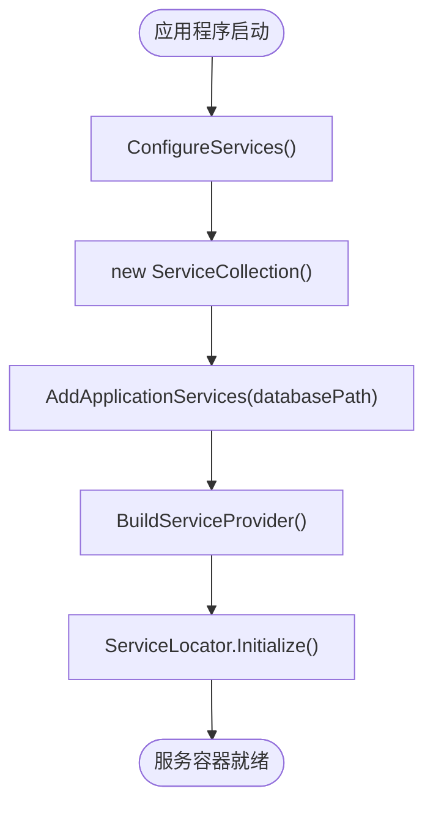
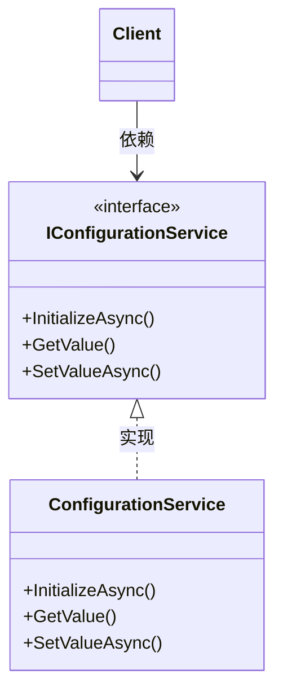
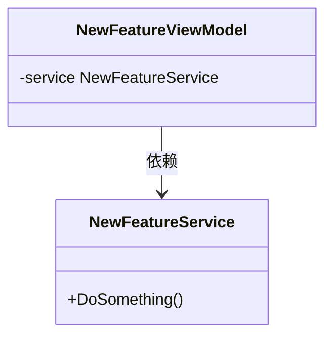

# 依赖注入配置

<cite>
**Referenced Files in This Document**   
- [ServiceCollectionExtensions.cs](file://Extensions/ServiceCollectionExtensions.cs)
- [App.xaml.cs](file://App.xaml.cs)
- [ConfigurationService.cs](file://Services/ConfigurationService.cs)
- [SchedulingService.cs](file://Services/SchedulingService.cs)
- [DatabaseService.cs](file://Data/DatabaseService.cs)
</cite>

## 目录
1. [简介](#简介)
2. [服务注册分类策略](#服务注册分类策略)
3. [生命周期管理](#生命周期管理)
4. [AddApplicationServices方法分析](#addapplicationservices方法分析)
5. [服务容器构建流程](#服务容器构建流程)
6. [最佳实践](#最佳实践)
7. [结论](#结论)

## 简介
本文档详细说明了AutoScheduling3项目中的依赖注入系统配置机制。重点分析了`ServiceCollectionExtensions`类中的`AddApplicationServices`方法如何通过扩展方法批量注册应用程序所需的所有服务。文档解释了服务注册的分类策略（仓储、业务服务、辅助服务、ViewModel等）和生命周期管理（Singleton与Transient）。同时提供了服务注册的最佳实践，包括接口与实现的映射关系、服务注入顺序的重要性以及如何扩展服务注册以支持新功能模块。结合`App.xaml.cs`中的`ConfigureServices`方法，展示了服务容器的构建流程。

## 服务注册分类策略

在AutoScheduling3项目中，服务注册采用了清晰的分类策略，通过多个扩展方法分别注册不同类别的服务，提高了代码的可维护性和可读性。

### 仓储服务注册
仓储服务负责数据访问和持久化操作，所有仓储服务均注册为单例（Singleton）生命周期。这些服务直接与数据库交互，封装了对SQLite数据库的CRUD操作。

**Section sources**
- [ServiceCollectionExtensions.cs](file://Extensions/ServiceCollectionExtensions.cs#L25-L45)

### 映射器服务注册
映射器服务负责在数据传输对象（DTO）和领域模型之间进行转换。这些服务也注册为单例，因为它们是无状态的工具类，不包含可变状态。

**Section sources**
- [ServiceCollectionExtensions.cs](file://Extensions/ServiceCollectionExtensions.cs#L47-L57)

### 业务服务注册
业务服务包含了应用程序的核心业务逻辑，如排班算法、人员管理、技能管理等。这些服务实现了相应的接口，并注册为单例，确保在整个应用程序生命周期中保持一致的状态。

**Section sources**
- [ServiceCollectionExtensions.cs](file://Extensions/ServiceCollectionExtensions.cs#L59-L77)

### 辅助服务注册
辅助服务提供跨领域的通用功能，如导航、对话框显示、主题管理等。这些服务同样注册为单例，因为它们通常需要在整个应用程序中保持一致的状态。

**Section sources**
- [ServiceCollectionExtensions.cs](file://Extensions/ServiceCollectionExtensions.cs#L79-L92)

### ViewModel服务注册
ViewModel服务负责连接视图和模型，实现MVVM模式。与上述服务不同，ViewModel注册为瞬态（Transient）生命周期，确保每次请求都能获得一个新的实例，避免状态污染。

**Section sources**
- [ServiceCollectionExtensions.cs](file://Extensions/ServiceCollectionExtensions.cs#L94-L113)

## 生命周期管理

AutoScheduling3项目中的服务生命周期管理遵循了最佳实践，根据服务的特性和使用场景选择合适的生命周期。

### Singleton生命周期
Singleton生命周期确保在整个应用程序生命周期中，每个服务类型只有一个实例。这种模式适用于：
- 无状态的服务（如映射器）
- 需要共享状态的服务（如配置服务）
- 资源密集型服务（如数据库连接）

**Diagram sources**
- [ServiceCollectionExtensions.cs](file://Extensions/ServiceCollectionExtensions.cs#L25-L113)

### Transient生命周期
Transient生命周期确保每次请求服务时都会创建一个新的实例。这种模式适用于：
- 有状态的服务（如ViewModel）
- 需要隔离状态的服务
- 短生命周期的服务

**Diagram sources**
- [ServiceCollectionExtensions.cs](file://Extensions/ServiceCollectionExtensions.cs#L94-L113)

## AddApplicationServices方法分析

`AddApplicationServices`方法是服务注册的核心入口点，它通过链式调用其他扩展方法来批量注册所有应用程序服务。

### 方法签名与参数
该方法接受`IServiceCollection`和数据库路径作为参数，返回`IServiceCollection`以支持链式调用。

**Diagram sources**
- [ServiceCollectionExtensions.cs](file://Extensions/ServiceCollectionExtensions.cs#L121-L138)
- [App.xaml.cs](file://App.xaml.cs#L70-L75)

### 服务注册顺序
服务注册的顺序遵循了从基础到高级的原则：
1. 仓储服务（数据访问层）
2. 映射器服务（数据转换层）
3. 业务服务（业务逻辑层）
4. 辅助服务（通用功能层）
5. ViewModel服务（表示层）

这种顺序确保了依赖关系的正确解析，避免了循环依赖问题。

**Section sources**
- [ServiceCollectionExtensions.cs](file://Extensions/ServiceCollectionExtensions.cs#L121-L138)

## 服务容器构建流程

服务容器的构建流程始于`App.xaml.cs`中的`ConfigureServices`方法，该方法负责初始化整个依赖注入系统。

### 容器初始化
`ConfigureServices`方法创建`ServiceCollection`实例，并通过`AddApplicationServices`扩展方法注册所有服务，最后构建`IServiceProvider`。

**Diagram sources**
- [App.xaml.cs](file://App.xaml.cs#L65-L76)

### 服务定位器模式
项目采用了服务定位器模式，通过`ServiceLocator`类提供全局访问服务的能力。这在XAML页面的代码隐藏中特别有用，因为这些页面无法通过构造函数注入获取服务。

**Section sources**
- [App.xaml.cs](file://App.xaml.cs#L75)
- [ServiceLocator.cs](file://Helpers/ServiceLocator.cs)

## 最佳实践

### 接口与实现的映射
项目严格遵循了依赖倒置原则，所有业务服务都通过接口注册，实现了松耦合。

**Diagram sources**
- [ConfigurationService.cs](file://Services/ConfigurationService.cs)

### 服务注入顺序的重要性
服务注册顺序至关重要，必须确保被依赖的服务先于依赖它的服务注册。例如，仓储服务必须在业务服务之前注册，因为业务服务依赖于仓储服务。

**Section sources**
- [ServiceCollectionExtensions.cs](file://Extensions/ServiceCollectionExtensions.cs#L121-L138)

### 扩展新功能模块
要扩展服务注册以支持新功能模块，应遵循以下步骤：
1. 创建新的服务接口和实现
2. 在相应的扩展方法中注册服务
3. 如果需要，创建新的扩展方法分类

**Section sources**
- [ServiceCollectionExtensions.cs](file://Extensions/ServiceCollectionExtensions.cs)

## 结论
AutoScheduling3项目的依赖注入系统设计良好，通过分类注册、合理的生命周期管理和清晰的服务注册顺序，实现了高内聚、低耦合的架构。`AddApplicationServices`方法作为服务注册的入口点，简化了服务容器的配置过程。结合`App.xaml.cs`中的`ConfigureServices`方法，形成了完整的服务容器构建流程。这种设计不仅提高了代码的可维护性，还为未来的功能扩展提供了良好的基础。