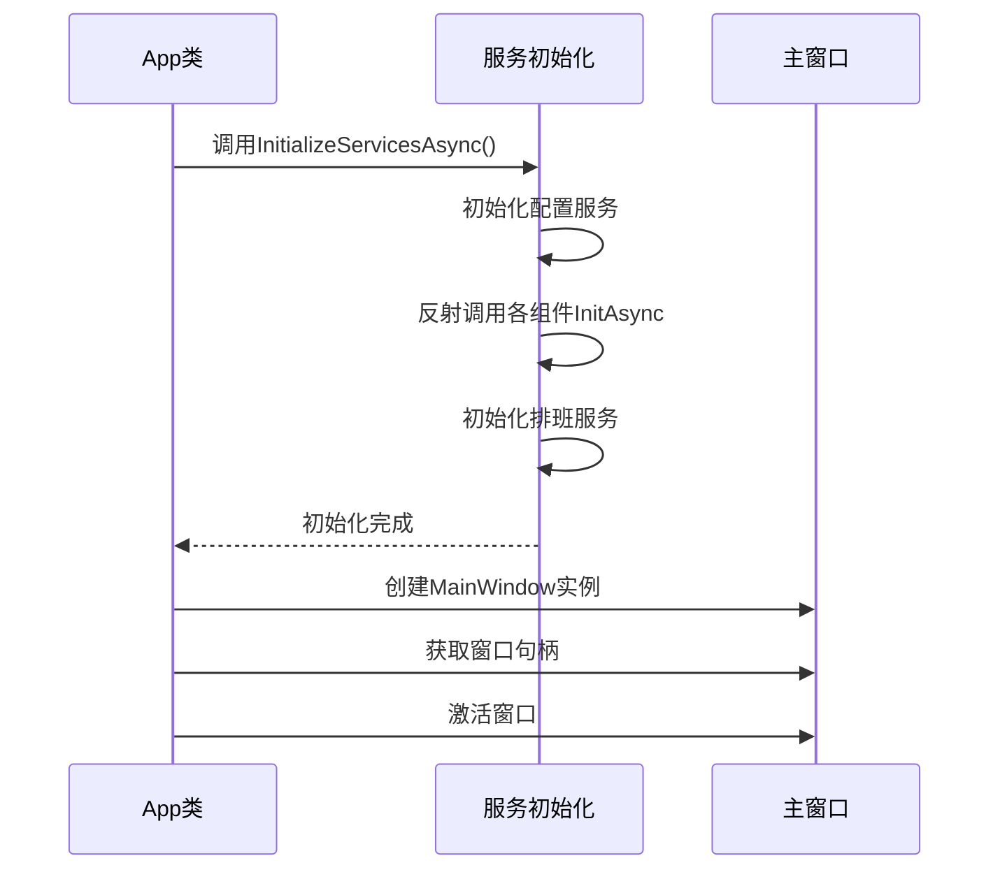
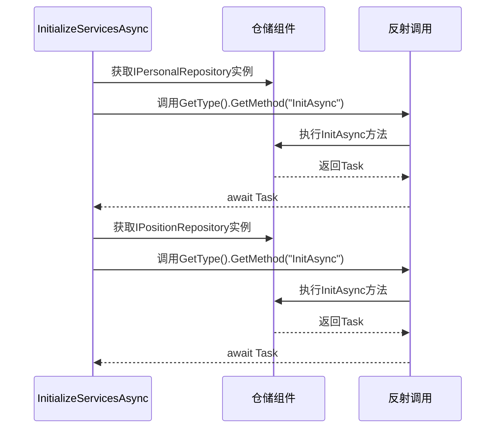
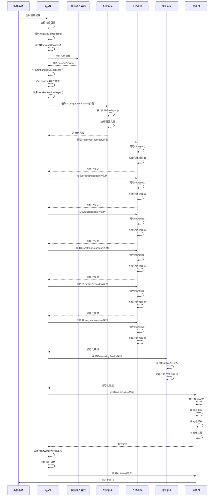

# 应用启动流程

<cite>
**本文档中引用的文件**  
- [App.xaml.cs](file://App.xaml.cs)
- [MainWindow.xaml.cs](file://MainWindow.xaml.cs)
- [ConfigurationService.cs](file://Services/ConfigurationService.cs)
- [PersonalRepository.cs](file://Data/PersonalRepository.cs)
- [PositionLocationRepository.cs](file://Data/PositionLocationRepository.cs)
- [SkillRepository.cs](file://Data/SkillRepository.cs)
- [ConstraintRepository.cs](file://Data/ConstraintRepository.cs)
- [SchedulingTemplateRepository.cs](file://Data/SchedulingTemplateRepository.cs)
- [HIstoryManagement.cs](file://History/HIstoryManagement.cs)
- [SchedulingService.cs](file://Services/SchedulingService.cs)
</cite>

## 目录
1. [简介](#简介)
2. [启动执行序列总览](#启动执行序列总览)
3. [App类构造函数分析](#app类构造函数分析)
4. [InitializeComponent与ConfigureServices](#initializecomponent与configureservices)
5. [UnhandledException事件订阅](#unhandledexception事件订阅)
6. [OnLaunched方法与初始化流程](#onlaunched方法与初始化流程)
7. [InitializeServicesAsync异步初始化机制](#initializeservicesasync异步初始化机制)
8. [服务优先级初始化](#服务优先级初始化)
9. [反射调用InitAsync机制](#反射调用initasync机制)
10. [主窗口创建与激活](#主窗口创建与激活)
11. [启动时序图](#启动时序图)
12. [异常处理策略](#异常处理策略)
13. [启动失败恢复机制](#启动失败恢复机制)

## 简介
本文档深入解析AutoScheduling3应用程序的完整启动流程，从App类的构造函数开始，详细描述应用程序的初始化过程。重点分析依赖注入服务的配置、关键组件的异步初始化机制、主窗口的创建与激活流程，以及在整个启动过程中实施的异常处理和恢复策略。通过时序图和代码结构分析，全面展示应用程序从启动到就绪状态的完整执行路径。

## 启动执行序列总览
应用程序的启动流程遵循严格的执行顺序，确保所有依赖项和服务在主窗口创建前正确初始化。整个流程始于App类的构造函数，依次执行组件初始化、服务配置和异常处理订阅，最终在OnLaunched方法中完成核心服务的异步初始化和主窗口的激活。该流程设计确保了应用程序的稳定性和可靠性，同时提供了灵活的扩展机制。

## App类构造函数分析
App类的构造函数作为应用程序执行的入口点，承担着初始化应用程序基础架构的关键职责。它按照预定义的顺序执行三个核心操作：组件初始化、服务配置和异常处理订阅，为后续的启动流程奠定基础。

**Section sources**
- [App.xaml.cs](file://App.xaml.cs#L47-L52)

## InitializeComponent与ConfigureServices
构造函数首先调用InitializeComponent方法，这是XAML框架的标准方法，负责加载和解析XAML定义的UI元素和资源。随后，调用ConfigureServices方法，该方法使用Microsoft.Extensions.DependencyInjection库配置依赖注入容器，注册应用程序所需的所有服务。

**Section sources**
- [App.xaml.cs](file://App.xaml.cs#L65-L76)

## UnhandledException事件订阅
在服务配置完成后，构造函数订阅UnhandledException事件，建立全局异常处理机制。该事件处理器捕获应用程序中未被处理的异常，记录错误信息，并可选择性地阻止应用程序崩溃，确保用户体验的连续性。

**Section sources**
- [App.xaml.cs](file://App.xaml.cs#L54-L63)

## OnLaunched方法与初始化流程
OnLaunched方法在应用程序启动时被调用，是启动流程的核心。它首先尝试异步初始化所有关键服务，然后创建主窗口实例，获取窗口句柄，并激活窗口，完成应用程序的启动过程。

**Diagram sources**
- [App.xaml.cs](file://App.xaml.cs#L129-L144)

**Section sources**
- [App.xaml.cs](file://App.xaml.cs#L129-L144)

## InitializeServicesAsync异步初始化机制
InitializeServicesAsync方法实现了应用程序核心服务的异步初始化流程。该方法采用try-catch结构确保异常不会中断启动流程，通过依赖注入容器获取服务实例，并按特定顺序执行初始化操作，确保服务间的依赖关系得到正确处理。

**Section sources**
- [App.xaml.cs](file://App.xaml.cs#L81-L123)

## 服务优先级初始化
初始化流程首先优先初始化配置服务（IConfigurationService），因为其他服务可能依赖于配置数据。这种优先级初始化策略确保了配置数据在其他服务初始化时已经可用，避免了潜在的依赖问题。

**Section sources**
- [App.xaml.cs](file://App.xaml.cs#L85-L88)
- [ConfigurationService.cs](file://Services/ConfigurationService.cs#L15-L25)

## 反射调用InitAsync机制
对于需要异步初始化的组件，应用程序采用反射机制动态调用其InitAsync方法。该机制通过GetMethod获取目标方法，然后使用Invoke执行方法调用，实现了对不同组件初始化方法的统一处理，提高了代码的灵活性和可扩展性。

**Diagram sources**
- [App.xaml.cs](file://App.xaml.cs#L90-L115)
- [PersonalRepository.cs](file://Data/PersonalRepository.cs#L25-L45)
- [PositionLocationRepository.cs](file://Data/PositionLocationRepository.cs#L25-L45)
- [SkillRepository.cs](file://Data/SkillRepository.cs#L25-L45)
- [ConstraintRepository.cs](file://Data/ConstraintRepository.cs#L25-L45)
- [SchedulingTemplateRepository.cs](file://Data/SchedulingTemplateRepository.cs#L25-L45)
- [HIstoryManagement.cs](file://History/HIstoryManagement.cs#L25-L45)

**Section sources**
- [App.xaml.cs](file://App.xaml.cs#L90-L115)

## 主窗口创建与激活
在所有服务初始化完成后，应用程序创建MainWindow实例，将其赋值给App类的静态属性，获取窗口句柄，并调用Activate方法激活窗口。这一系列操作完成了应用程序从后台初始化到前台展示的转换。

**Section sources**
- [App.xaml.cs](file://App.xaml.cs#L138-L143)
- [MainWindow.xaml.cs](file://MainWindow.xaml.cs#L25-L45)

## 启动时序图
以下时序图详细描述了应用程序从启动到主窗口激活的完整执行流程，包括各个关键步骤的执行顺序和依赖关系。

**Diagram sources**
- [App.xaml.cs](file://App.xaml.cs#L47-L148)
- [MainWindow.xaml.cs](file://MainWindow.xaml.cs#L25-L140)

## 异常处理策略
应用程序在启动过程中实施了多层次的异常处理策略。在InitializeServicesAsync方法中使用try-catch块捕获服务初始化异常，记录错误信息但不中断启动流程。同时，通过UnhandledException事件处理器捕获未处理的异常，防止应用程序意外崩溃，确保了启动过程的健壮性。

**Section sources**
- [App.xaml.cs](file://App.xaml.cs#L54-L63)
- [App.xaml.cs](file://App.xaml.cs#L104-L112)

## 启动失败恢复机制
当服务初始化失败时，应用程序采用优雅的恢复机制。它记录详细的错误信息用于诊断，但继续执行后续的启动步骤，确保应用程序能够达到可用状态。这种机制允许用户在部分功能不可用的情况下仍然能够使用应用程序的其他功能，提高了系统的可用性和用户体验。

**Section sources**
- [App.xaml.cs](file://App.xaml.cs#L104-L112)
- [App.xaml.cs](file://App.xaml.cs#L132-L136)