# 数据库初始化

<cite>
**本文档引用的文件**  
- [DatabaseService.cs](file://Data/DatabaseService.cs)
- [DatabaseConfiguration.cs](file://Data/DatabaseConfiguration.cs)
- [IPersonalRepository.cs](file://Data/Interfaces/IPersonalRepository.cs)
- [IPositionRepository.cs](file://Data/Interfaces/IPositionRepository.cs)
- [ISkillRepository.cs](file://Data/Interfaces/ISkillRepository.cs)
- [ISchedulingRepository.cs](file://Data/Interfaces/ISchedulingRepository.cs)
- [Personal.cs](file://Models/Personal.cs)
- [PositionLocation.cs](file://Models/PositionLocation.cs)
- [Skill.cs](file://Models/Skill.cs)
- [Schedule.cs](file://Models/Schedule.cs)
- [SchedulingTemplate.cs](file://Models/SchedulingTemplate.cs)
- [FixedPositionRule.cs](file://Models/Constraints/FixedPositionRule.cs)
</cite>

## 目录
1. [引言](#引言)
2. [数据库初始化流程](#数据库初始化流程)
3. [表结构设计](#表结构设计)
4. [索引策略](#索引策略)
5. [版本控制与迁移机制](#版本控制与迁移机制)
6. [数据库连接与信息查询](#数据库连接与信息查询)
7. [故障排查指南](#故障排查指南)
8. [结论](#结论)

## 引言

数据库初始化是自动排班系统启动过程中的关键环节，负责创建数据库文件、定义数据表结构、建立索引以及管理版本控制。`DatabaseService` 类作为核心组件，通过 `InitializeAsync` 方法协调整个初始化流程，确保系统在首次运行或升级时能够正确配置数据存储环境。本文档详细阐述该流程的实现机制，涵盖表结构设计、索引优化、版本迁移以及实用的连接测试与故障排查方法。

## 数据库初始化流程

`DatabaseService` 类的 `InitializeAsync` 方法是数据库初始化的入口点，其执行流程如下：

1.  **目录准备**：检查并创建数据库文件所在的目录，确保文件系统路径可用。
2.  **连接建立**：使用 `SqliteConnection` 打开与数据库的连接。
3.  **版本表创建**：调用 `CreateVersionTableAsync` 创建 `DatabaseVersion` 表，用于跟踪数据库的版本。
4.  **版本检查**：通过 `GetDatabaseVersionAsync` 查询当前数据库版本。
5.  **条件执行**：
    *   若为全新数据库（版本为0），则调用 `CreateAllTablesAsync` 创建所有数据表，并将版本号设置为 `CurrentVersion`。
    *   若现有版本低于当前版本，则调用 `MigrateDatabaseAsync` 执行迁移。
6.  **索引创建**：无论新创建还是迁移，最后都会调用 `CreateIndexesAsync` 为所有表建立索引以优化性能。

此流程确保了数据库在任何状态下（新安装或升级）都能达到预期的结构和版本。

**Section sources**
- [DatabaseService.cs](file://Data/DatabaseService.cs#L30-L88)

## 表结构设计

`CreateAllTablesAsync` 方法定义了系统中所有核心数据表的 Schema。这些表的设计与 `Models` 目录下的 C# 类紧密对应，通过 JSON 字符串存储复杂数据类型以适应 SQLite 的限制。

### 人员表 (Personals)

存储人员基本信息，是排班系统的核心实体。

**字段说明**：
- `Id`, `Name`: 基础标识。
- `Position`: 文本字段，存储职位名称。
- `SkillIds`: 存储技能ID列表的JSON数组。
- `IsAvailable`, `IsRetired`: 布尔标志（0/1）。
- `RecentShiftInterval`, `RecentHolidayShiftInterval`: 记录最近排班间隔。
- `RecentTimeSlotIntervals`: 存储12个时段班次间隔的JSON数组。

**Section sources**
- [DatabaseService.cs](file://Data/DatabaseService.cs#L98-L116)
- [Personal.cs](file://Models/Personal.cs#L1-L81)

### 哨位表 (Positions)

定义系统中的所有哨位或岗位。

**字段说明**：
- `Id`, `Name`, `Location`, `Description`: 哨位的基本信息。
- `Requirements`: 文本描述要求。
- `RequiredSkillIds`: 存储所需技能ID列表的JSON数组。
- `IsActive`: 启用状态标志。

**Section sources**
- [DatabaseService.cs](file://Data/DatabaseService.cs#L118-L135)
- [PositionLocation.cs](file://Models/PositionLocation.cs#L1-L71)

### 技能表 (Skills)

管理所有可用的技能。

**字段说明**：
- `Id`, `Name`, `Description`: 技能的基本信息。
- `IsActive`: 技能是否可用。

**Section sources**
- [DatabaseService.cs](file://Data/DatabaseService.cs#L137-L151)
- [Skill.cs](file://Models/Skill.cs#L1-L53)

### 排班表 (Schedules)

记录一次完整的排班计划。

**字段说明**：
- `Id`, `Header`: 排班计划的标识和名称。
- `PersonnelIds`, `PositionIds`: 参与本次排班的人员和哨位ID列表（JSON数组）。
- `StartDate`, `EndDate`: 排班的时间范围（ISO 8601格式）。
- `IsConfirmed`: 状态标志（0=缓冲区，1=已确认）。

**Section sources**
- [DatabaseService.cs](file://Data/DatabaseService.cs#L153-L168)
- [Schedule.cs](file://Models/Schedule.cs#L1-L69)

### 单次排班表 (SingleShifts)

存储排班计划中的具体班次，是 `Schedules` 的子表。

**字段说明**：
- `ScheduleId`, `PositionId`, `PersonnelId`: 外键，关联排班、哨位和人员。
- `StartTime`, `EndTime`: 班次的具体时间。
- `DayIndex`, `TimeSlotIndex`: 用于算法计算的索引。
- `IsNightShift`: 夜班标志。

**外键约束**：`ScheduleId` 设置了 `ON DELETE CASCADE`，确保删除排班计划时，其所有班次自动被删除。

**Section sources**
- [DatabaseService.cs](file://Data/DatabaseService.cs#L170-L187)

### 排班模板表 (SchedulingTemplates)

用于保存和复用排班配置。

**字段说明**：
- `Id`, `Name`, `Description`: 模板基本信息。
- `PersonnelIds`, `PositionIds`: 预设的人员和哨位。
- `DurationDays`: 排班持续天数。
- `StrategyConfig`: 存储排班策略配置的JSON字符串。
- `UsageCount`, `LastUsedAt`: 用于模板管理和推荐。

**Section sources**
- [DatabaseService.cs](file://Data/DatabaseService.cs#L189-L210)
- [SchedulingTemplate.cs](file://Models/SchedulingTemplate.cs#L1-L115)

### 约束与配置表

- **定岗规则表 (FixedPositionRules)**: 定义人员可上哨的特定哨位和时段，`PersonalId` 外键设置了 `ON DELETE CASCADE`。
- **休息日配置表 (HolidayConfigs)**: 管理节假日规则，存储周末、法定假日等日期列表（JSON数组）。
- **手动指定表 (ManualAssignments)**: 用于强制指定某人在特定日期和时段上特定哨位。

**Section sources**
- [DatabaseService.cs](file://Data/DatabaseService.cs#L212-L260)
- [FixedPositionRule.cs](file://Models/Constraints/FixedPositionRule.cs#L1-L49)

## 索引策略

`CreateIndexesAsync` 方法为所有表的关键查询字段创建了索引，以显著提升数据检索性能。

```mermaid
flowchart TD
A[索引创建] --> B[人员表]
A --> C[哨位表]
A --> D[技能表]
A --> E[排班表]
A --> F[单次排班表]
A --> G[排班模板表]
A --> H[约束表]
B --> B1["idx_personals_name (Name)"]
B --> B2["idx_personals_available (IsAvailable)"]
B --> B3["idx_personals_retired (IsRetired)"]
C --> C1["idx_positions_name (Name)"]
C --> C2["idx_positions_active (IsActive)"]
D --> D1["idx_skills_name (Name)"]
D --> D2["idx_skills_active (IsActive)"]
E --> E1["idx_schedules_confirmed (IsConfirmed)"]
E --> E2["idx_schedules_date_range (StartDate, EndDate)"]
E --> E3["idx_schedules_created (CreatedAt)"]
F --> F1["idx_shifts_schedule (ScheduleId)"]
F --> F2["idx_shifts_position (PositionId)"]
F --> F3["idx_shifts_personnel (PersonnelId)"]
F --> F4["idx_shifts_time (StartTime)"]
F --> F5["idx_shifts_day_slot (DayIndex, TimeSlotIndex)"]
G --> G1["idx_templates_active (IsActive)"]
G --> G2["idx_templates_usage (UsageCount)"]
G --> G3["idx_templates_name (Name)"]
H --> H1["idx_fixed_rules_personal (PersonalId)"]
H --> H2["idx_manual_assignments_date (Date)"]
```



**Diagram sources**
- [DatabaseService.cs](file://Data/DatabaseService.cs#L262-L315)

**Section sources**
- [DatabaseService.cs](file://Data/DatabaseService.cs#L262-L315)

## 版本控制与迁移机制

系统采用基于 `CurrentVersion` 常量的简单版本控制机制，支持未来的数据库结构演进。

### 核心组件

- **`CurrentVersion`**: 定义当前代码期望的数据库版本（当前为1）。
- **`DatabaseVersion` 表**: 存储当前数据库的实际版本号。
- **`GetDatabaseVersionAsync` / `SetDatabaseVersionAsync`**: 读取和更新版本号的方法。

### 迁移流程

当检测到 `currentVersion < CurrentVersion` 时，`MigrateDatabaseAsync` 方法会从 `fromVersion + 1` 开始，逐个版本调用 `MigrateToVersionAsync` 进行升级。

```mermaid
sequenceDiagram
participant DB as DatabaseService
participant Conn as SqliteConnection
participant VersionTable as DatabaseVersion
DB->>Conn : OpenAsync()
DB->>VersionTable : GetDatabaseVersionAsync()
alt 版本为0 (全新)
DB->>Conn : CreateAllTablesAsync()
DB->>VersionTable : SetDatabaseVersionAsync(CurrentVersion)
else 版本较低 (需迁移)
loop 每个待升级版本
DB->>DB : MigrateToVersionAsync(version)
DB->>VersionTable : SetDatabaseVersionAsync(version)
end
end
DB->>Conn : CreateIndexesAsync()
DB-->> : 初始化完成
```

**Diagram sources**
- [DatabaseService.cs](file://Data/DatabaseService.cs#L88-L96)
- [DatabaseService.cs](file://Data/DatabaseService.cs#L317-L345)

**Section sources**
- [DatabaseService.cs](file://Data/DatabaseService.cs#L88-L345)

## 数据库连接与信息查询

`DatabaseService` 提供了两个实用方法来验证和检查数据库状态。

### 连接测试

`TestConnectionAsync` 方法尝试打开数据库连接并执行一个简单的 `SELECT 1` 查询。如果成功则返回 `true`，否则捕获异常并返回 `false`，可用于启动时的健康检查。

**Section sources**
- [DatabaseService.cs](file://Data/DatabaseService.cs#L347-L362)

### 信息查询

`GetDatabaseInfoAsync` 方法返回一个 `DatabaseInfo` 对象，包含：
- `Version`: 从 `DatabaseVersion` 表读取的版本号。
- `FilePath`: 数据库文件的完整路径。
- `FileSize`: 文件大小（字节）。
- `LastModified`: 文件最后修改时间。

这为系统监控和用户诊断提供了关键信息。

**Section sources**
- [DatabaseService.cs](file://Data/DatabaseService.cs#L364-L380)

## 故障排查指南

当系统无法正常启动或数据访问出现问题时，可按以下步骤排查：

1.  **检查数据库路径**：确认 `DatabaseConfiguration.GetDefaultDatabasePath()` 返回的路径有效且应用有读写权限。
2.  **验证文件存在性**：检查指定路径下是否存在 `.db` 文件。若不存在，`InitializeAsync` 应能自动创建。
3.  **测试连接**：调用 `TestConnectionAsync`。若失败，检查文件是否被其他进程锁定或路径是否正确。
4.  **检查版本兼容性**：如果旧版本数据库无法启动，检查 `MigrateDatabaseAsync` 方法中是否有针对旧版本的迁移逻辑。当前版本1为初始版本，无需迁移。
5.  **查看文件大小**：使用 `GetDatabaseInfoAsync` 获取文件大小。异常小的文件（如0字节）可能表示创建失败。
6.  **检查索引**：如果查询性能低下，确认 `CreateIndexesAsync` 是否已成功执行。可通过数据库浏览器工具检查索引是否存在。

## 结论

`DatabaseService` 类通过 `InitializeAsync` 方法实现了一个健壮、可扩展的数据库初始化流程。它不仅负责创建人员、哨位、技能、排班等核心数据表及其索引，还通过版本控制机制为未来的数据库结构变更提供了支持。`DatabaseConfiguration` 类则统一管理数据库路径和连接字符串。结合连接测试和信息查询功能，该设计确保了系统数据层的稳定性和可维护性，为上层业务逻辑提供了坚实的基础。