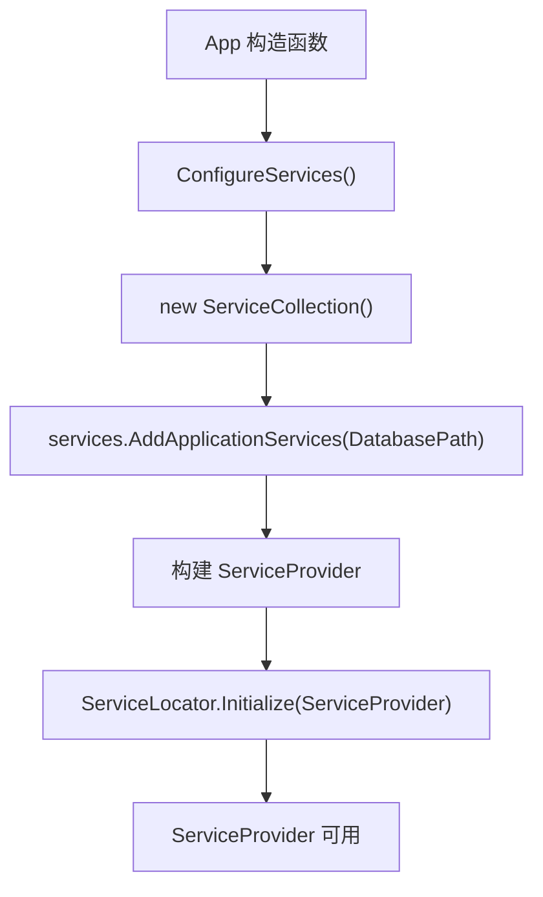
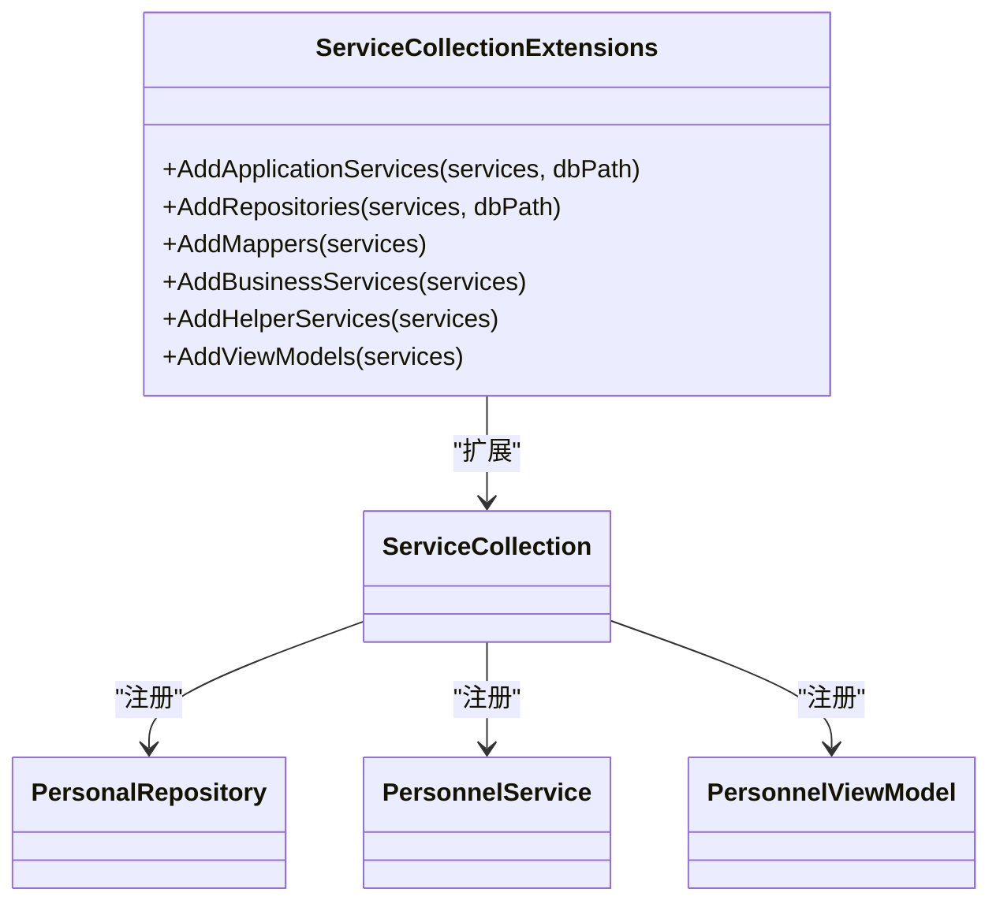
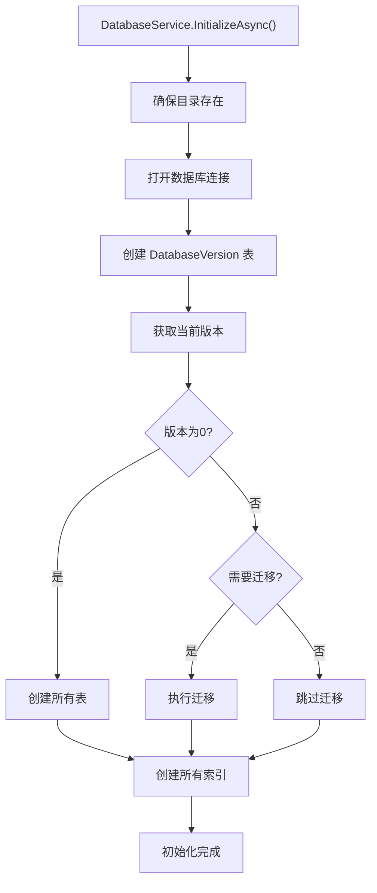
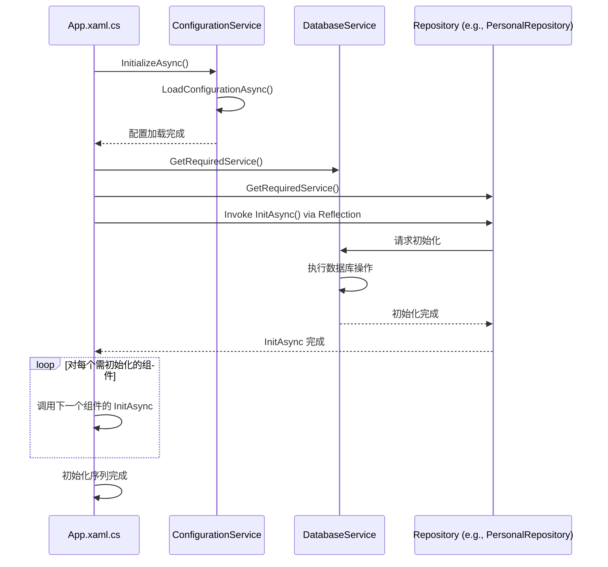

# 配置与初始化

<cite>
**本文档中引用的文件**  
- [App.xaml.cs](file://App.xaml.cs)
- [ServiceCollectionExtensions.cs](file://Extensions/ServiceCollectionExtensions.cs)
- [DatabaseService.cs](file://Data/DatabaseService.cs)
- [ConfigurationService.cs](file://Services/ConfigurationService.cs)
- [DatabaseConfiguration.cs](file://Data/DatabaseConfiguration.cs)
</cite>

## 目录
1. [简介](#简介)
2. [启动流程概览](#启动流程概览)
3. [依赖注入容器配置](#依赖注入容器配置)
4. [服务注册机制](#服务注册机制)
5. [数据库初始化](#数据库初始化)
6. [组件异步初始化序列](#组件异步初始化序列)
7. [配置管理最佳实践](#配置管理最佳实践)
8. [故障排除指南](#故障排除指南)

## 简介
本文件详细说明了自动排班系统（AutoScheduling3）的配置与初始化流程。从 `App.xaml.cs` 的启动过程开始，全面解析依赖注入容器的构建、服务的批量注册、数据库的初始化以及各核心组件的异步初始化顺序。重点阐述 `ServiceCollectionExtensions` 如何通过扩展方法简化服务注册，以及 `DatabaseService` 如何确保数据存储的可靠准备。同时提供配置管理的最佳实践和常见问题的解决方案。

## 启动流程概览
应用程序的启动始于 `App.xaml.cs` 中的 `App` 类构造函数。该类继承自 `Application`，是整个应用的入口点。启动流程遵循以下关键步骤：
1.  **初始化组件**：调用基类的 `InitializeComponent()` 方法。
2.  **配置服务**：执行 `ConfigureServices()` 方法，建立依赖注入容器并注册所有服务。
3.  **异常处理**：订阅 `UnhandledException` 事件，捕获并记录未处理的异常，防止应用崩溃。
4.  **启动应用**：在 `OnLaunched` 方法中，首先异步调用 `InitializeServicesAsync()` 完成所有服务的初始化，然后创建并激活主窗口 (`MainWindow`)。

此流程确保了在用户界面显示之前，所有后台服务和数据存储均已准备就绪。

**Section sources**
- [App.xaml.cs](file://App.xaml.cs#L47-L52)

## 依赖注入容器配置
依赖注入（DI）是本应用的核心架构模式，它通过 `Microsoft.Extensions.DependencyInjection` 库实现。在 `App.xaml.cs` 的 `ConfigureServices` 方法中，创建了一个 `ServiceCollection` 实例。该集合是所有服务注册的中心。

配置的核心在于调用 `ServiceCollectionExtensions` 提供的扩展方法 `AddApplicationServices`，并传入数据库路径。此方法链式调用多个内部扩展方法，完成所有服务的注册。最后，通过 `BuildServiceProvider()` 构建出一个 `IServiceProvider` 实例，并将其赋值给 `App` 类的 `ServiceProvider` 属性，供整个应用使用。

此外，`ServiceLocator` 模式也被初始化，它封装了 `IServiceProvider`，为那些无法直接通过构造函数注入服务的场景（如某些 XAML 控件）提供了一种全局访问服务的途径。

**Diagram sources**
- [App.xaml.cs](file://App.xaml.cs#L62-L74)

## 服务注册机制
`ServiceCollectionExtensions.cs` 文件定义了 `IServiceCollection` 的一系列扩展方法，实现了服务的模块化和批量注册。这种设计极大地提高了代码的可读性和可维护性。

`AddApplicationServices` 是总入口方法，它依次调用以下方法：
-   **`AddRepositories`**: 注册所有数据访问层（仓储）服务。这些服务（如 `PersonalRepository`, `PositionRepository`）均以**单例**（Singleton）模式注册，并在构造时接收数据库路径，用于建立与 SQLite 数据库的连接。
-   **`AddMappers`**: 注册 DTO（数据传输对象）与领域模型之间的映射器（如 `PersonnelMapper`），同样以单例模式注册。
-   **`AddBusinessServices`**: 注册核心业务逻辑服务（如 `PersonnelService`, `SchedulingService`），这些服务也以单例模式注册，并依赖于已注册的仓储和映射器。
-   **`AddHelperServices`**: 注册辅助服务，如导航服务 (`NavigationService`) 和对话框服务 (`DialogService`)。
-   **`AddViewModels`**: 注册 MVVM 模式中的视图模型（ViewModel）。与上述服务不同，ViewModels 通常以**瞬时**（Transient）模式注册，确保每次请求都能获得一个全新的实例。

这种分层注册的模式清晰地分离了关注点，使得服务注册逻辑一目了然。

**Diagram sources**
- [Extensions/ServiceCollectionExtensions.cs](file://Extensions/ServiceCollectionExtensions.cs#L119-L127)
- [Extensions/ServiceCollectionExtensions.cs](file://Extensions/ServiceCollectionExtensions.cs#L92-L111)

## 数据库初始化
`DatabaseService` 是负责数据库初始化和管理的核心组件。它在应用启动的初始化阶段被调用，确保数据存储的可用性。

其 `InitializeAsync` 方法执行以下关键步骤：
1.  **目录准备**：检查并创建数据库文件所在的目录。
2.  **连接建立**：打开到 SQLite 数据库的连接。
3.  **版本管理**：创建一个名为 `DatabaseVersion` 的表来跟踪数据库模式的版本。通过查询此表，`DatabaseService` 能够判断是进行全新安装还是版本迁移。
4.  **表结构创建**：如果数据库是全新的（版本为0），则执行 `CreateAllTablesAsync`，一次性创建应用所需的所有表，包括人员、哨位、技能、排班、约束等。
5.  **索引创建**：执行 `CreateIndexesAsync`，为关键字段创建索引，以优化查询性能。
6.  **迁移支持**：如果检测到旧版本，会调用 `MigrateDatabaseAsync` 执行增量迁移（当前版本1无需迁移）。

`DatabaseService` 还提供了 `TestConnectionAsync` 和 `GetDatabaseInfoAsync` 等方法，用于诊断和监控数据库状态。

**Diagram sources**
- [Data/DatabaseService.cs](file://Data/DatabaseService.cs#L24-L37)
- [Data/DatabaseService.cs](file://Data/DatabaseService.cs#L104-L110)

## 组件异步初始化序列
在依赖注入容器构建完成后，应用进入异步初始化阶段，由 `App.xaml.cs` 中的 `InitializeServicesAsync` 方法驱动。这个序列确保了组件按正确的依赖顺序被初始化。

初始化序列如下：
1.  **配置服务优先**：首先获取 `IConfigurationService` 实例并调用其 `InitializeAsync` 方法。这是关键的第一步，因为配置可能影响后续所有组件的行为。
2.  **仓储与约束初始化**：通过反射机制，遍历一组核心组件（包括所有仓储和 `IHistoryManagement`），检查它们是否定义了 `InitAsync` 方法。如果存在，则调用该方法。这些 `InitAsync` 方法通常由 `DatabaseService` 协调，用于加载缓存数据或执行特定于该组件的初始化逻辑。
3.  **排班服务初始化**：最后，单独检查 `ISchedulingService` 是否定义了 `InitializeAsync` 方法并调用它，用于初始化排班引擎所需的资源。

这种基于反射的初始化方式，避免了在 `App` 类中硬编码对每个组件的直接调用，提高了代码的灵活性和可扩展性。

**Diagram sources**
- [App.xaml.cs](file://App.xaml.cs#L82-L135)

## 配置管理最佳实践
`ConfigurationService` 实现了基于 JSON 文件的配置管理，遵循以下最佳实践：
-   **存储位置**：配置文件 `config.json` 存储在用户本地应用数据目录下（`%LOCALAPPDATA%\AutoScheduling3\`），符合 Windows 应用的规范。
-   **数据格式**：使用 `Dictionary<string, object>` 存储配置项，通过 `System.Text.Json` 进行序列化和反序列化，支持多种数据类型。
-   **线程安全**：使用 `lock` 语句保护对 `_configuration` 字典的读写操作，确保在多线程环境下的安全性。
-   **自动持久化**：每次调用 `SetValueAsync`、`RemoveAsync` 或 `ClearAsync` 时，都会自动触发 `SaveConfigurationAsync`，将更改立即写入磁盘，防止数据丢失。
-   **异常处理**：在加载和保存配置时都包含异常处理，如果配置文件损坏或无法访问，应用会使用空配置继续运行，保证了应用的健壮性。

**Section sources**
- [Services/ConfigurationService.cs](file://Services/ConfigurationService.cs#L12-L158)

## 故障排除指南
当应用启动失败或行为异常时，可参考以下指南进行排查：

### 1. 服务初始化失败
-   **症状**：应用启动后立即关闭，或主窗口无法显示。
-   **排查**：
    1.  检查 `App.xaml.cs` 中 `InitializeServicesAsync` 方法的 `catch` 块输出的错误信息。
    2.  确认 `ConfigurationService` 是否能成功加载 `config.json` 文件。检查文件路径和权限。
    3.  检查 `DatabaseService` 的日志，确认数据库文件路径是否有效，以及表结构创建是否成功。

### 2. 数据库连接问题
-   **症状**：数据加载失败，或执行数据操作时报错。
-   **排查**：
    1.  使用 `DatabaseService.TestConnectionAsync()` 方法验证连接。
    2.  检查数据库文件路径是否正确，文件是否被其他进程锁定。
    3.  查看 `DatabaseService` 的日志，确认数据库版本是否匹配，是否需要迁移。

### 3. 配置未生效
-   **症状**：应用行为与预期不符，例如主题未改变。
-   **排查**：
    1.  检查 `config.json` 文件内容是否正确。
    2.  确认 `ConfigurationService.SetValueAsync` 调用后，`SaveConfigurationAsync` 是否成功执行（检查是否有异常日志）。
    3.  确保读取配置的服务在配置更新后能正确获取新值。

**Section sources**
- [App.xaml.cs](file://App.xaml.cs#L137-L148)
- [Services/ConfigurationService.cs](file://Services/ConfigurationService.cs#L47-L66)
- [Data/DatabaseService.cs](file://Data/DatabaseService.cs#L287-L304)