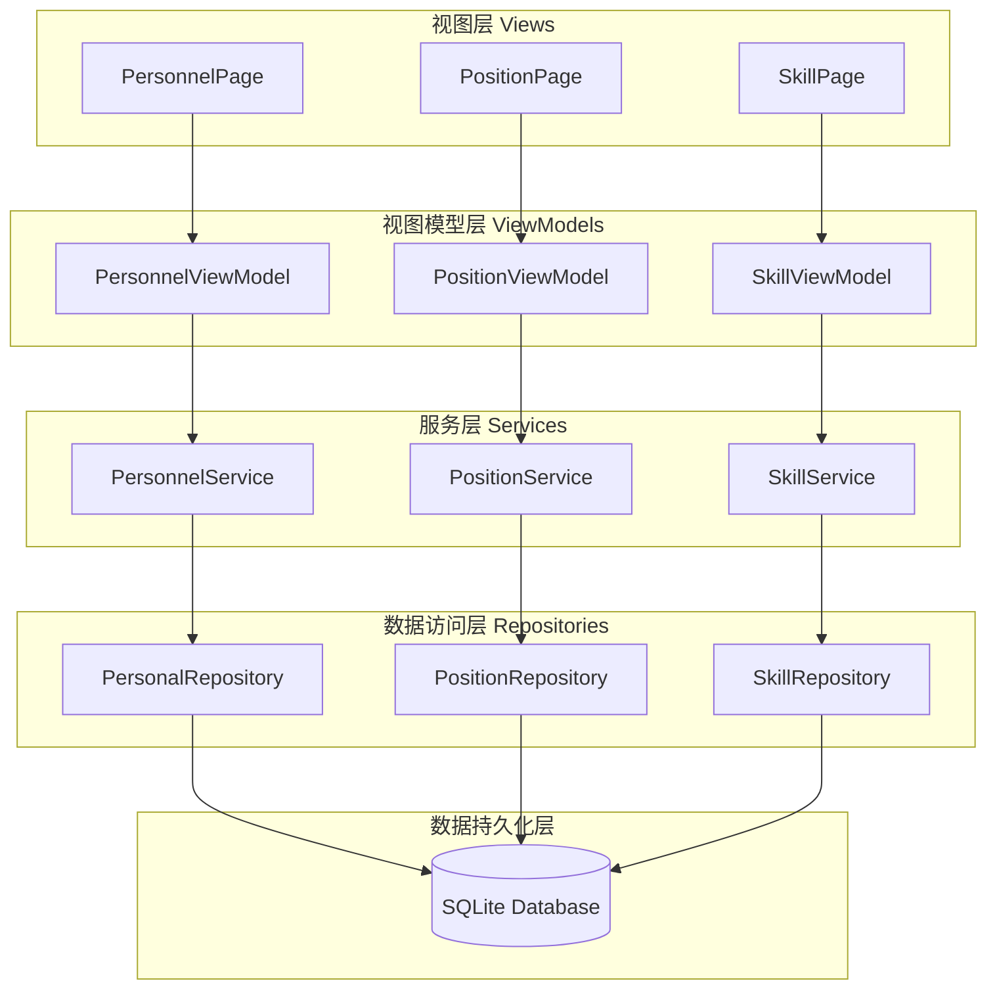
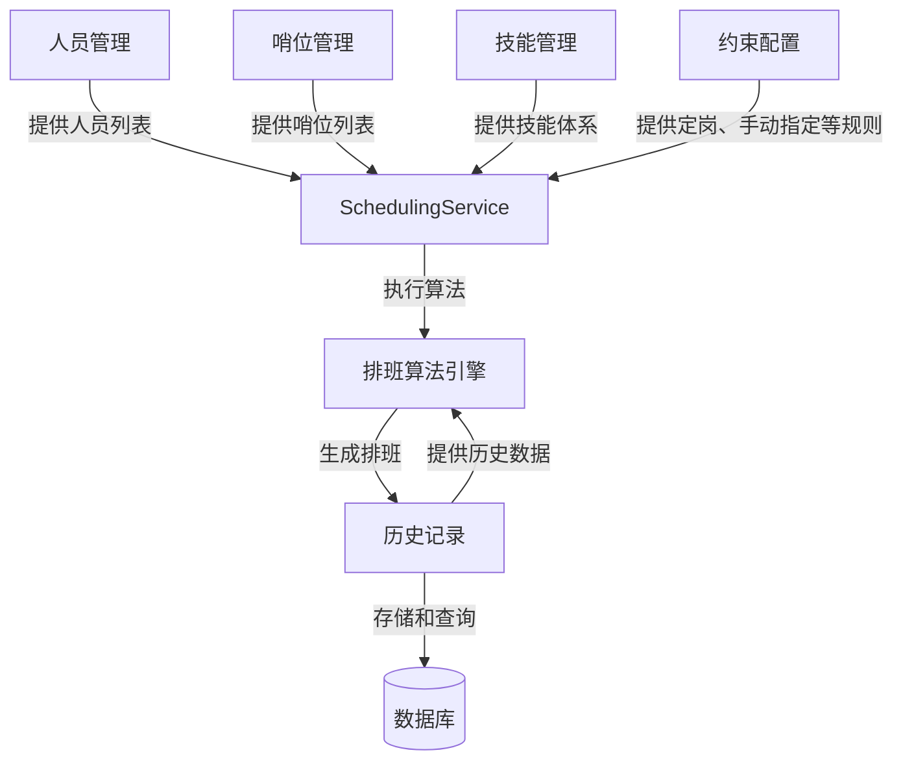

# 项目概述

<cite>
**本文档引用的文件**  
- [README.md](file://README.md)
- [PROJECT_COMPLETION_REPORT.md](file://PROJECT_COMPLETION_REPORT.md)
- [IMPLEMENTATION_SUMMARY.md](file://IMPLEMENTATION_SUMMARY.md)
- [ARCHITECTURE_IMPLEMENTATION_SUMMARY.md](file://ARCHITECTURE_IMPLEMENTATION_SUMMARY.md)
- [App.xaml.cs](file://App.xaml.cs)
- [MainWindow.xaml.cs](file://MainWindow.xaml.cs)
- [SchedulingService.cs](file://Services/SchedulingService.cs)
- [GreedyScheduler.cs](file://SchedulingEngine/GreedyScheduler.cs)
- [SchedulingRepository.cs](file://Data/SchedulingRepository.cs)
</cite>

## 目录
1. [引言](#引言)
2. [核心功能与设计目标](#核心功能与设计目标)
3. [系统架构理念](#系统架构理念)
4. [主要功能模块及其交互流程](#主要功能模块及其交互流程)
5. [技术愿景与开发里程碑](#技术愿景与开发里程碑)
6. [业务价值与使用范围](#业务价值与使用范围)
7. [结论](#结论)

## 引言

AutoScheduling3 是一款专为哨位人员排班设计的智能桌面应用程序，旨在通过自动化算法解决复杂的人力资源调度问题。该系统基于 WinUI 3 和 .NET 8.0 构建，采用现代化的 MVVM 架构模式，实现了前后端在单项目内的逻辑解耦。本项目不仅满足了特定军事或安保场景下的高效排班需求，还为开发者提供了一个可扩展、易维护的技术框架。通过结合约束满足与贪心算法，系统能够在保证所有硬性规则的前提下，优化软性目标，从而生成公平且高效的排班方案。

**Section sources**
- [README.md](file://README.md#L1-L284)
- [PROJECT_COMPLETION_REPORT.md](file://PROJECT_COMPLETION_REPORT.md#L1-L474)

## 核心功能与设计目标

AutoScheduling3 的核心功能围绕数据管理、排班算法和历史记录三大支柱展开，其设计目标是实现一个既强大又灵活的智能排班解决方案。

### 数据管理
系统提供了全面的数据管理功能，确保排班决策基于准确和最新的信息。
- **人员管理**：维护人员的基本信息（如姓名、职位）、可用性状态（是否在职、是否可用）以及技能列表。
- **哨位管理**：定义哨位的位置、职责描述和技能要求，确保人员与岗位的匹配。
- **技能管理**：建立一个可扩展的技能体系，用于精确匹配人员能力与岗位需求。
- **约束配置**：支持多种高级约束，包括定岗规则（特定人员只能在指定哨位或时段上岗）和手动指定（预先安排特定班次）。

### 排班算法
排班算法是系统的核心，它结合了硬约束和软约束优化，确保生成的排班表既合规又高效。
- **硬约束**：系统强制执行八项关键规则，包括“夜哨唯一”（同一人不能连续上多个夜哨）、“时段不连续”（相邻时段不能连续上哨）、“人员可用性”、“定岗限制”、“技能匹配”、“单人上哨”、“一人一哨”和“手动指定”。这些规则确保了排班的安全性和合规性。
- **软约束优化**：在满足所有硬约束的基础上，系统通过评分机制优化排班质量，主要考虑“充分休息”（优先分配休息时间长的人员）、“时段平衡”（均衡各时段的分配）和“休息日平衡”（公平分配休息日班次）。

### 历史管理
系统采用缓冲区机制，允许用户预览生成的排班表，确认无误后再正式实施，保障了数据的安全性。同时，系统会记录所有历史排班数据，支持跨周期的约束处理，确保长期排班的连续性和公平性。

**Section sources**
- [README.md](file://README.md#L10-L120)
- [IMPLEMENTATION_SUMMARY.md](file://IMPLEMENTATION_SUMMARY.md#L1-L338)

## 系统架构理念

AutoScheduling3 采用清晰的分层架构，实现了高内聚、低耦合的设计原则，为系统的可维护性和可扩展性奠定了坚实基础。

**Diagram sources**
- [App.xaml.cs](file://App.xaml.cs#L1-L151)
- [MainWindow.xaml.cs](file://MainWindow.xaml.cs#L1-L141)

该架构遵循 MVVM 模式，各层职责明确：
- **视图层 (Views)**：使用 XAML 构建用户界面，负责展示数据和接收用户输入。
- **视图模型层 (ViewModels)**：作为视图与业务逻辑的桥梁，处理用户命令、管理数据状态，并通过数据绑定与视图交互。
- **服务层 (Services)**：封装核心业务逻辑，如排班算法的调用、数据验证和业务规则检查。
- **数据访问层 (Repositories)**：抽象数据库操作，提供统一的 CRUD 接口，屏蔽底层数据存储细节。
- **数据持久化层**：使用 SQLite 作为轻量级嵌入式数据库，存储所有应用数据。

系统通过依赖注入（Dependency Injection）管理各层组件的生命周期，确保了松散耦合和易于测试。

**Section sources**
- [PROJECT_COMPLETION_REPORT.md](file://PROJECT_COMPLETION_REPORT.md#L1-L474)
- [ARCHITECTURE_IMPLEMENTATION_SUMMARY.md](file://ARCHITECTURE_IMPLEMENTATION_SUMMARY.md#L1-L377)

## 主要功能模块及其交互流程

系统的主要功能模块围绕人员管理、哨位管理、技能管理、排班算法和历史记录展开，它们通过 `SchedulingService` 这一统一的服务入口进行交互。

### 模块关系

**Diagram sources**
- [SchedulingService.cs](file://Services/SchedulingService.cs#L1-L751)
- [GreedyScheduler.cs](file://SchedulingEngine/GreedyScheduler.cs#L1-L490)

### 交互流程
1. **数据准备**：用户通过前端界面配置参与排班的人员、哨位、休息日规则、定岗规则和手动指定项。
2. **请求发起**：用户发起排班请求，`SchedulingService` 接收 `SchedulingRequestDto`。
3. **数据加载**：`SchedulingService` 并行调用 `PersonalRepository`、`PositionRepository` 等数据访问层，加载所需数据。
4. **上下文构建**：将加载的数据构建成 `SchedulingContext`，传递给排班引擎。
5. **算法执行**：`GreedyScheduler` 基于 `SchedulingContext` 和可行性张量（Feasibility Tensor），应用所有硬约束，并使用 MRV（最少剩余值）启发式策略和软约束评分器进行贪心分配。
6. **结果存储**：生成的排班表首先作为“草稿”保存到缓冲区，供用户预览。
7. **确认与归档**：用户确认后，草稿被标记为“已确认”，并归档到历史记录中，完成整个流程。

**Section sources**
- [README.md](file://README.md#L10-L120)
- [SchedulingService.cs](file://Services/SchedulingService.cs#L1-L751)

## 技术愿景与开发里程碑

### 技术愿景
AutoScheduling3 的技术愿景是构建一个既稳定又具备强大扩展能力的智能排班平台。其核心是基于约束满足的排班引擎，未来可轻松集成更复杂的算法，如遗传算法进行全局优化。系统预留了扩展接口，支持多目标优化、权重配置和更复杂的业务规则。

### 开发里程碑与完成状态
根据 `PROJECT_COMPLETION_REPORT.md` 的记录，项目已**100%完成**所有核心功能开发，达到了可交付使用状态。

- **架构重构**：成功实现了单项目内 MVVM 架构，完成了6层解耦（视图、视图模型、服务、数据传输、数据访问、数据库）。
- **核心功能**：人员、哨位、技能的完整 CRUD 操作，以及基于贪心算法的自动排班功能均已实现。
- **算法实现**：完成了8项硬约束和3项软约束的编码与集成，MRV 启发式策略有效降低了无解风险。
- **测试验证**：编写了单元测试和集成测试，确保了核心功能的稳定性和可靠性。
- **文档完备**：提供了详细的 `README`、实施总结和完成报告，为后续维护和开发提供了坚实基础。

**Section sources**
- [PROJECT_COMPLETION_REPORT.md](file://PROJECT_COMPLETION_REPORT.md#L1-L474)
- [IMPLEMENTATION_SUMMARY.md](file://IMPLEMENTATION_SUMMARY.md#L1-L338)

## 业务价值与使用范围

### 业务价值
AutoScheduling3 为哨位排班场景带来了显著的业务价值：
- **提升效率**：将原本耗时数小时的手工排班过程缩短至几分钟，极大解放了管理人员的生产力。
- **保证公平**：通过算法自动计算和优化，确保了排班的公平性，避免了人为因素导致的偏袒或疏忽。
- **增强合规性**：硬约束的强制执行，确保了所有排班方案都符合安全规定和人员管理政策。
- **降低风险**：缓冲区确认机制和历史数据追溯功能，有效防止了错误排班的发布，保障了任务执行的连续性。

### 使用范围
该系统专为需要轮班值守的场景设计，典型应用包括：
- 军事哨位、边防检查站的人员排班。
- 企业安保部门、数据中心的值班安排。
- 医院、消防等应急服务的轮班调度。
- 任何需要对人员、岗位和时间进行复杂匹配的排班需求。

**Section sources**
- [README.md](file://README.md#L1-L284)
- [PROJECT_COMPLETION_REPORT.md](file://PROJECT_COMPLETION_REPORT.md#L1-L474)

## 结论

AutoScheduling3 项目已成功完成，构建了一个功能完整、架构清晰、技术先进的智能排班系统。系统基于 WinUI 3 和 .NET 8.0，采用 MVVM 模式和依赖注入，实现了高度的模块化和可维护性。其核心的排班算法能够有效处理复杂的硬约束，并通过软约束优化提升排班质量。项目不仅满足了当前哨位排班的业务需求，还为未来的功能扩展（如更高级的优化算法）预留了充足的空间。该系统现已具备投入实际使用的条件，能够为相关领域的排班工作带来显著的效率和公平性提升。

**Section sources**
- [PROJECT_COMPLETION_REPORT.md](file://PROJECT_COMPLETION_REPORT.md#L1-L474)
- [IMPLEMENTATION_SUMMARY.md](file://IMPLEMENTATION_SUMMARY.md#L1-L338)