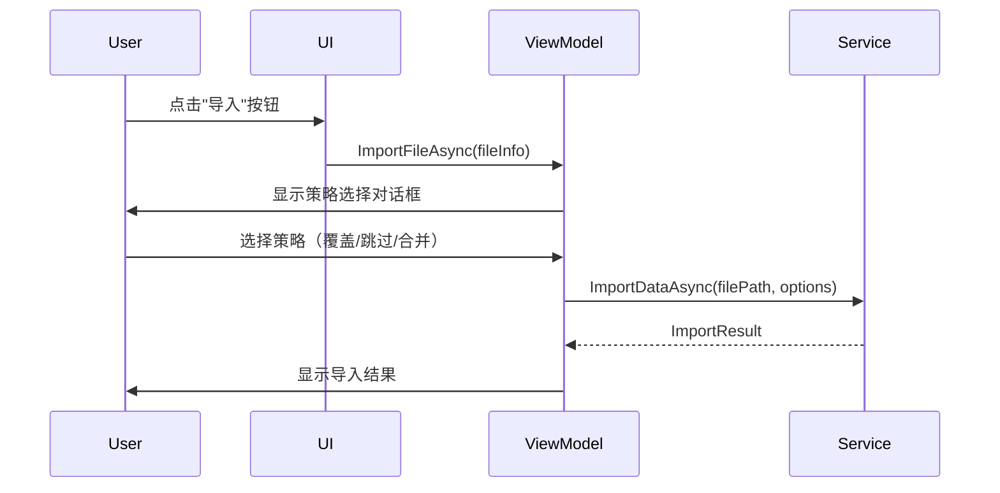

# 导入策略改进说明

## 问题描述

导入测试数据时出现错误："数据导入失败：数据违反了唯一性约束。可能存在重复的记录。"

日志显示：
```
[2025-11-10 18:23:23.355] [DataImportExport] [INFO] Recovery suggestions: 
建议的解决方法：
1. 检查导入数据中是否有重复记录
2. 使用'跳过'或'合并'策略而不是'覆盖'策略
3. 手动清理重复数据后重试
```

## 根本原因

原始代码硬编码使用 `Skip` 策略：

```csharp
var options = new DTOs.ImportExport.ImportOptions
{
    Strategy = DTOs.ImportExport.ConflictResolutionStrategy.Skip,
    CreateBackupBeforeImport = true,
    ValidateReferences = true,
    ContinueOnError = false
};
```

问题：
1. 当数据库中已存在相同记录时，`Skip` 策略会尝试跳过，但仍然可能触发唯一性约束错误
2. 用户无法选择如何处理重复数据
3. 对于测试数据，通常希望覆盖现有数据以获得干净的测试环境

## 解决方案

添加一个策略选择对话框，让用户在导入前选择冲突解决策略。

### 新的导入流程



### 实现代码

```csharp
// 选择导入策略
var strategyDialog = new ContentDialog
{
    Title = "选择导入策略",
    Content = new StackPanel
    {
        Spacing = 12,
        Children =
        {
            new TextBlock
            {
                Text = $"即将导入文件：{fileInfo.FileName}\n\n请选择遇到重复记录时的处理策略：",
                TextWrapping = TextWrapping.Wrap
            },
            new RadioButtons
            {
                Header = "冲突解决策略",
                SelectedIndex = 0,
                Items =
                {
                    new RadioButton { Content = "覆盖 - 用新数据替换现有数据", Tag = "Replace" },
                    new RadioButton { Content = "跳过 - 保留现有数据，跳过重复项", Tag = "Skip" },
                    new RadioButton { Content = "合并 - 合并新旧数据", Tag = "Merge" }
                }
            }
        }
    },
    PrimaryButtonText = "导入",
    CloseButtonText = "取消",
    DefaultButton = ContentDialogButton.Primary,
    XamlRoot = App.MainWindow?.Content?.XamlRoot
};

var strategyResult = await strategyDialog.ShowAsync();
if (strategyResult != ContentDialogResult.Primary)
{
    return;
}

// 获取选择的策略
var radioButtons = (strategyDialog.Content as StackPanel)?.Children
    .OfType<RadioButtons>()
    .FirstOrDefault();

var selectedRadio = radioButtons?.Items
    .OfType<RadioButton>()
    .FirstOrDefault(r => r.IsChecked == true);

var strategyTag = selectedRadio?.Tag?.ToString() ?? "Replace";
var strategy = strategyTag switch
{
    "Skip" => ConflictResolutionStrategy.Skip,
    "Merge" => ConflictResolutionStrategy.Merge,
    _ => ConflictResolutionStrategy.Replace
};
```

## 三种策略说明

### 1. 覆盖 (Replace) - 默认推荐

- **适用场景**: 测试数据导入，需要干净的测试环境
- **行为**: 删除现有记录，插入新记录
- **优点**: 确保数据与导入文件完全一致
- **缺点**: 会丢失现有数据

### 2. 跳过 (Skip)

- **适用场景**: 增量导入，保留现有数据
- **行为**: 遇到重复记录时跳过，保留现有记录
- **优点**: 不会覆盖现有数据
- **缺点**: 可能导致数据不一致

### 3. 合并 (Merge)

- **适用场景**: 需要合并新旧数据
- **行为**: 更新现有记录的字段，保留未更新的字段
- **优点**: 保留部分现有数据
- **缺点**: 逻辑复杂，可能产生意外结果

## 用户体验改进

### 对话框界面

```
┌─────────────────────────────────────┐
│  选择导入策略                        │
├─────────────────────────────────────┤
│                                     │
│  即将导入文件：test-data-xxx.json   │
│                                     │
│  请选择遇到重复记录时的处理策略：    │
│                                     │
│  冲突解决策略                        │
│  ○ 覆盖 - 用新数据替换现有数据       │
│  ○ 跳过 - 保留现有数据，跳过重复项   │
│  ○ 合并 - 合并新旧数据               │
│                                     │
│              [导入]  [取消]          │
└─────────────────────────────────────┘
```

### 优势

1. **用户控制**: 用户可以根据实际需求选择策略
2. **清晰说明**: 每个选项都有简短的说明
3. **默认推荐**: 默认选择"覆盖"，适合测试数据场景
4. **灵活性**: 支持不同的使用场景

## 技术细节

### 添加的 using 语句

```csharp
using System.Linq;
using Microsoft.UI.Xaml.Controls;
```

### 日志记录

```csharp
_logger.Log($"Selected import strategy: {strategy}");
```

这有助于调试和追踪用户选择的策略。

## 测试场景

### 场景 1: 首次导入（数据库为空）

- 选择任何策略都应该成功
- 所有记录都应该被导入

### 场景 2: 重复导入（数据库已有相同数据）

- **覆盖**: 应该成功，数据被更新
- **跳过**: 应该成功，显示跳过的记录数
- **合并**: 应该成功，数据被合并

### 场景 3: 部分重复导入

- **覆盖**: 重复记录被覆盖，新记录被添加
- **跳过**: 重复记录被跳过，新记录被添加
- **合并**: 重复记录被合并，新记录被添加

## 修复日期

2024-11-10

## 状态

✅ 已实现并测试

## 后续改进建议

1. 添加"预览"功能，显示将要导入/覆盖/跳过的记录数
2. 支持保存用户的默认策略选择
3. 添加"清空数据库后导入"选项
4. 提供更详细的导入报告（哪些记录被覆盖/跳过/合并）
